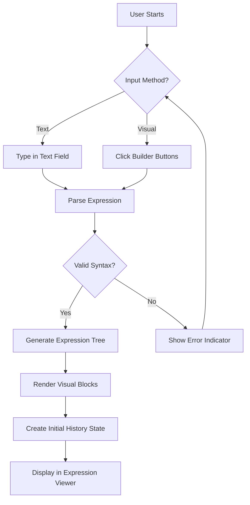
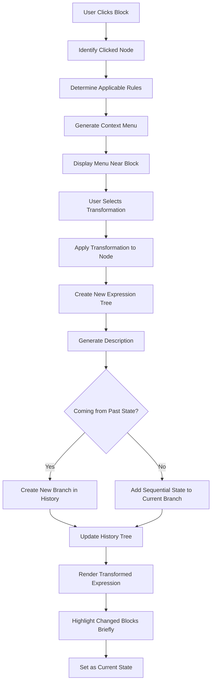
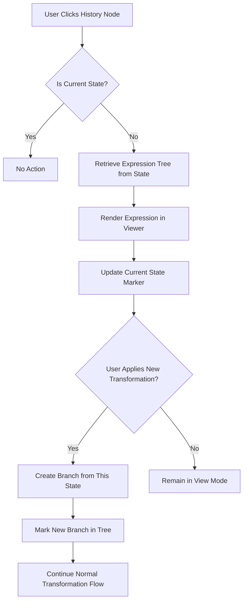

# Logical Expression Editor - Design Document

## Overview

A web-based mathematical expression editor that visualizes expressions as nested logical blocks with individual highlighting. Users can input expressions through both text and visual builder, apply transformation rules via context menus, and navigate through a branching history of all modifications.

## Feature Scope

### Core Capabilities

- Dual input method: text field and visual builder for constructing mathematical expressions
- Visual representation of expressions with color-coded nested blocks
- Context menu on each block for applying transformation rules
- Automatic rule description generation for each transformation
- Branching history tree allowing navigation to any previous state
- Real-time validation and error highlighting

### Supported Operations

- Addition (+)
- Subtraction (-)
- Unary minus (negation)
- Multiplication (*)
- Division (/)

### Transformation Rules

All transformation rules are bidirectional - users can apply them in either direction.

**Algebraic Properties**
- Commutative property: a + b ↔ b + a, a * b ↔ b * a
- Associative property: (a + b) + c ↔ a + (b + c), (a * b) * c ↔ a * (b * c)
- Distributive property: a * (b + c) ↔ a * b + a * c

**Identity and Inverse Operations**
- Addition identity: a + 0 ↔ a
- Multiplication identity: a * 1 ↔ a
- Subtraction identity: a - 0 ↔ a
- Division identity: a / 1 ↔ a
- Inverse elements: a - a ↔ 0, a / a ↔ 1 (where a ≠ 0)
- Double negation: --a ↔ a
- Multiplication by zero: a * 0 ↔ 0

**Notation Simplification (Bidirectional)**
- Implicit multiplication: 2 * a ↔ 2a, a * b ↔ ab
- Explicit multiplication: 2a ↔ 2 * a, ab ↔ a * b
- Coefficient notation: 1 * a ↔ a, a * 1 ↔ a
- Division to fraction: a / b ↔ a÷b (visual representation)
- Parentheses removal: (a) ↔ a (when no operation requires grouping)
- Negative distribution: -(a + b) ↔ -a - b, -(a - b) ↔ -a + b

**Arithmetic Simplification**
- Constant combination: 2 + 3 ↔ 5, 4 * 3 ↔ 12
- Like terms: 2a + 3a ↔ 5a, 4x - x ↔ 3x
- Fraction reduction: 6/3 ↔ 2, 4a/2 ↔ 2a

**Subtraction and Division Rewriting**
- Subtraction as addition: a - b ↔ a + (-b)
- Division as multiplication: a / b ↔ a * (1/b)

## User Interface Design

### Page Layout

The page is divided into three primary areas:

| Area | Position | Purpose |
|------|----------|---------|
| Input Panel | Top | Expression input (text field + visual builder buttons) |
| Expression Viewer | Center-Left (60% width) | Visual display of current expression with highlighted blocks |
| History Panel | Right Side (40% width) | Branching tree view of all transformations |

### Input Panel Components

**Text Input Field**
- Single-line text box for typing mathematical expressions
- Real-time syntax validation with error indicators
- Auto-completion suggestions for operations
- Example placeholder: "Enter expression like: 2 * (a + 3) - b"

**Visual Builder Toolbar**
- Buttons for each supported operation: [+] [-] [*] [/] [( )] [Unary -]
- Variable input button [Add Variable]
- Number input button [Add Number]
- Clear/Reset button

### Expression Viewer

**Block Visualization**
- Each sub-expression rendered as a rectangular block with colored border
- Nested expressions shown as boxes within boxes
- Color scheme:
  - Operators (+ - * /): Blue border
  - Variables: Green border
  - Numbers: Orange border
  - Parentheses/groups: Purple border
- Hover effect: border becomes bold and slightly glowing
- Click interaction: opens context menu

**Mathematical Notation Display**
- Expressions displayed using standard mathematical notation
- Division shown as fraction when appropriate
- Multiplication symbol can be implicit (e.g., "2a" instead of "2 * a")
- Proper operator precedence visualization through nesting depth

### Context Menu

When user clicks on any block, a context menu appears with applicable transformations:

**Menu Structure**
- Menu positioned near the clicked block
- Only shows transformations valid for that specific block
- Each menu item displays:
  - Transformation name (e.g., "Apply Distributive Property")
  - Direction indicator (e.g., "→ Expand" or "← Simplify")
  - Preview of result (e.g., "a*(b+c) → ab + ac" or "ab + ac → a(b+c)")
  - Keyboard shortcut if applicable

**Bidirectional Rule Display**
- Rules shown in both directions when applicable
- Example for implicit multiplication:
  - "Make Explicit: 2a → 2 * a"
  - "Make Implicit: 2 * a → 2a"
- Grouped by transformation category with separators

**Available Actions**
- Apply specific transformation rule (forward direction)
- Apply reverse transformation (backward direction)
- Simplify (auto-select best simplification path)
- Expand (distribute operations)
- Factor (reverse of expand)
- Toggle notation (switch between implicit/explicit forms)
- Cancel (close menu)

### History Panel

**Tree Visualization**

The history is displayed as an interactive tree diagram using the following structure:

```
Root (Initial Expression)
  │
  ├─ Step 1: Applied Distributive Law
  │   │
  │   ├─ Step 2a: Simplified Constants
  │   │   │
  │   │   └─ Step 3a: Combined Like Terms
  │   │
  │   └─ Step 2b: Applied Commutative Property (alternative branch)
  │       │
  │       └─ Step 3b: Factored Out Common Term
  │
  └─ Alternative Step 1: Applied Associative Law
```

**Tree Node Components**

Each node in the history tree contains:

| Element | Content |
|---------|---------|
| Node Circle | Color-coded indicator (current=blue, past=gray, alternative=light gray) |
| Step Label | Sequential numbering showing branch paths |
| Rule Name | Transformation rule applied to reach this state |
| Expression Preview | Abbreviated form of the resulting expression |
| Description Box | Detailed explanation of why transformation was applied |

**Interaction Behaviors**
- Click on any node to restore that expression state
- Current state highlighted with blue indicator
- Hover shows full expression preview in tooltip
- Branching occurs when user goes back and applies different transformation
- Each branch maintains its own sequential numbering

### Description Field

Located below each history node, this field contains:

**Content Structure**
- **Rule Applied**: Name of the transformation (e.g., "Distributive Property")
- **Reasoning**: Why this transformation was chosen (e.g., "To eliminate parentheses and simplify")
- **Before**: Expression before transformation
- **After**: Expression after transformation
- **Mathematical Justification**: The general formula (e.g., "a(b+c) = ab + ac")

**Auto-Generation Logic**
- System automatically generates description based on transformation type
- User can optionally edit description to add custom notes
- Character limit: 500 characters

## Data Model

### Expression Representation

Expressions are stored as tree structures:

| Property | Type | Description |
|----------|------|-------------|
| id | String | Unique identifier for the node |
| type | Enum | NODE_TYPE: operator, variable, constant, group |
| value | String/Number | The actual value (operator symbol, variable name, or number) |
| children | Array | Child nodes (operands for operators) |
| parentId | String | Reference to parent node (null for root) |
| position | Object | Coordinates for visual rendering {x, y, width, height} |
| highlightColor | String | Border color for visual block |

### History State

Each transformation creates a history entry:

| Property | Type | Description |
|----------|------|-------------|
| stateId | String | Unique identifier for this state |
| timestamp | DateTime | When transformation was applied |
| expressionTree | Object | Complete expression tree at this state |
| parentStateId | String | Previous state (null for initial) |
| transformationType | Enum | Which rule was applied |
| affectedNodeId | String | Which block was transformed |
| description | Object | Auto-generated description with rule, reasoning, before/after |
| isCurrentState | Boolean | Whether this is the active state |
| childStates | Array | References to states branching from this one |

### Transformation Rule Definition

Each available transformation rule is defined as:

| Property | Type | Description |
|----------|------|-------------|
| ruleId | String | Unique identifier |
| ruleName | String | Human-readable name (e.g., "Commutative Property") |
| isBidirectional | Boolean | Whether rule can be applied in both directions |
| forwardName | String | Name for forward direction (e.g., "Make Implicit") |
| reverseName | String | Name for reverse direction (e.g., "Make Explicit") |
| applicabilityCheck | Function Reference | Logic to determine if rule applies to given node |
| forwardTransform | Function Reference | Logic to perform forward transformation |
| reverseTransform | Function Reference | Logic to perform reverse transformation |
| descriptionTemplate | String | Template for generating description text |
| category | Enum | CATEGORY: simplification, expansion, rearrangement, notation |

## Functional Workflows

### Expression Input Flow



### Transformation Application Flow



### History Navigation Flow



## Transformation Rule Application Logic

### Rule Applicability Determination

For each block clicked, the system evaluates:

1. **Node Type Check**: Does the rule apply to this type of node (operator/variable/constant)?
2. **Pattern Match**: Does the node structure match the rule's required pattern?
3. **Constraint Validation**: Are all constraints satisfied (e.g., non-zero divisor)?
4. **Context Check**: Does the parent/sibling context allow this rule?

**Example: Distributive Property (Bidirectional)**

Forward (Expand):
- Requires: Multiplication node with one child being an addition/subtraction node
- Pattern: `a * (b + c)` or `(b + c) * a`
- Result: `a * b + a * c`

Reverse (Factor):
- Requires: Addition/subtraction node where terms share common factor
- Pattern: `a * b + a * c`
- Result: `a * (b + c)`

**Example: Implicit Multiplication (Bidirectional)**

Forward (Make Implicit):
- Requires: Multiplication node with constant and variable, or two variables
- Pattern: `2 * a` or `a * b`
- Result: `2a` or `ab`

Reverse (Make Explicit):
- Requires: Implicit multiplication notation detected
- Pattern: `2a` or `ab`
- Result: `2 * a` or `a * b`

### Description Auto-Generation

When a transformation is applied, the system generates description using this template:

**Template Structure**
```
Rule Applied: {ruleName}

Reasoning: {context-specific-explanation}

Transformation:
Before: {original-expression}
After: {transformed-expression}

Mathematical Basis: {general-formula}
```

**Context-Specific Reasoning Examples**

| Rule | Direction | Generated Reasoning |
|------|-----------|---------------------|
| Distributive Property | Forward | "Expanding multiplication over addition to separate terms" |
| Distributive Property | Reverse | "Factoring out common term to simplify expression" |
| Implicit Multiplication | Forward | "Simplifying notation by removing explicit multiplication symbol" |
| Implicit Multiplication | Reverse | "Making multiplication explicit for clarity" |
| Commutative Property | Either | "Reordering operands to group similar terms" |
| Combining Constants | Forward | "Simplifying numerical computation to reduce expression complexity" |
| Identity Element | Forward | "Removing neutral element that doesn't affect the result" |
| Identity Element | Reverse | "Adding identity element to prepare for further transformation" |
| Negative Distribution | Forward | "Distributing negative sign across terms" |
| Negative Distribution | Reverse | "Factoring out negative sign" |

## Visual Block Highlighting Strategy

### Color Assignment Algorithm

Blocks are colored based on depth and type:

1. **Depth-Based Intensity**: Deeper nesting = darker border shade
2. **Type-Based Hue**: Different base colors for operators, variables, constants
3. **State-Based Effects**:
   - Normal: Solid border, 2px width
   - Hover: Bold border, 3px width, subtle glow
   - Just Changed: Animated pulse effect (3 seconds)
   - Selected: Dashed border with higher contrast

### Border Rendering Rules

| Node Type | Base Color | Hover Color | Changed Color |
|-----------|------------|-------------|---------------|
| Addition/Subtraction | #3498db (Blue) | #2980b9 | #f39c12 (Orange) |
| Multiplication/Division | #9b59b6 (Purple) | #8e44ad | #f39c12 (Orange) |
| Variable | #27ae60 (Green) | #229954 | #f39c12 (Orange) |
| Constant | #e67e22 (Orange) | #d35400 | #f39c12 (Orange) |
| Grouping | #95a5a6 (Gray) | #7f8c8d | #f39c12 (Orange) |

### Nesting Visualization

Nested blocks are rendered with:
- Padding between parent and child borders: 8px minimum
- Recursive layout calculation from innermost to outermost
- Automatic width/height adjustment based on children
- Center alignment of content within each block

## History Tree Rendering

### Tree Layout Algorithm

The history tree uses a hierarchical layout with these principles:

1. **Vertical Progression**: Time flows from top to bottom
2. **Horizontal Branching**: Alternative paths spread horizontally
3. **Node Spacing**: Minimum 60px vertical gap, 40px horizontal gap
4. **Connection Lines**: Curved paths connecting parent to children

### Branch Numbering Scheme

Each state receives a composite identifier showing its position:

- Initial state: "Root"
- Linear sequence: "Step 1", "Step 2", "Step 3"
- First branch at Step 2: "Step 2a", "Step 2b"
- Sub-branches: "Step 2a.1", "Step 2a.2"

### Interaction States

| State | Visual Indicator |
|-------|------------------|
| Current | Blue filled circle, bold text, blue connection line |
| Past (on current path) | Gray filled circle, normal text, gray line |
| Alternative branch | Light gray outlined circle, lighter text, dashed line |
| Future (unreachable) | Hidden until user navigates back |

## Edge Cases and Validation

### Input Validation

**Syntax Errors Handled**
- Unmatched parentheses
- Invalid operator sequences (e.g., "++", "*/")
- Empty parentheses
- Division by zero in constants
- Invalid variable names (starting with number, special characters)

**Error Feedback**
- Red underline beneath error location in text input
- Error message tooltip on hover
- Disable transformation until corrected

### Transformation Constraints

**Prevented Operations**
- Division by zero: Disallow transformations that would create 0 in denominator
- Infinite loops: Prevent applying inverse transformation immediately
- Invalid simplification: Block rules that would make expression more complex

**Conflict Resolution**
- If multiple rules apply, show all in menu
- User explicitly chooses which to apply
- No automatic transformation without user selection

### History Management

**Performance Optimization**
- Limit history depth: 100 states maximum
- Prune oldest branches when limit reached
- Provide "Clear History" option with confirmation

**State Consistency**
- Each state stores complete expression tree (not deltas)
- Prevents corruption if intermediate states are pruned
- Enables instant restoration of any historical state

## Accessibility Considerations

### Keyboard Navigation

- Tab through input field, builder buttons, expression blocks, history nodes
- Arrow keys to navigate between blocks in expression viewer
- Enter to open context menu on focused block
- Escape to close context menu
- Ctrl+Z / Ctrl+Y for undo/redo (navigate history linearly)

### Screen Reader Support

- Semantic HTML structure for expression tree
- ARIA labels for all interactive elements
- Announce transformation descriptions when applied
- Read expression in linear text form when requested

### Visual Accessibility

- High contrast mode option
- Adjustable font sizes
- Colorblind-friendly palette option
- Focus indicators on all interactive elements

## Technical Considerations

### Expression Parsing

The text input parser must handle:
- Operator precedence: multiplication/division before addition/subtraction
- Parentheses for grouping
- Unary minus distinguished from binary subtraction
- Implicit multiplication (e.g., "2a" interpreted as "2 * a")

**Parser Output**
- Abstract Syntax Tree (AST) representation
- Each node typed according to data model
- Validated structure ready for rendering

### State Management

**Current State Tracking**
- Single source of truth for active expression
- Reference to current history node
- Undo/redo stack for linear navigation

**History Storage**
- In-memory tree structure during session
- Optional: Local storage persistence for session recovery
- Export/import functionality for saving work

### Rendering Performance

**Optimization Strategies**
- Virtual rendering: Only render visible portion of large expressions
- Debounced input parsing: Wait for user to pause typing
- Memoized block rendering: Reuse unchanged components
- Incremental history tree layout: Only recalculate affected branches

## Extension Points

### Future Enhancements

- Support for additional operations (exponentiation, roots, modulo)
- Custom transformation rule creation by users
- Export expression as image or LaTeX
- Collaborative editing with multiple users
- Animation of transformation steps
- Step-by-step explanation mode for educational purposes
- Integration with computer algebra systems for advanced simplification- Step-by-step explanation mode for educational purposes
