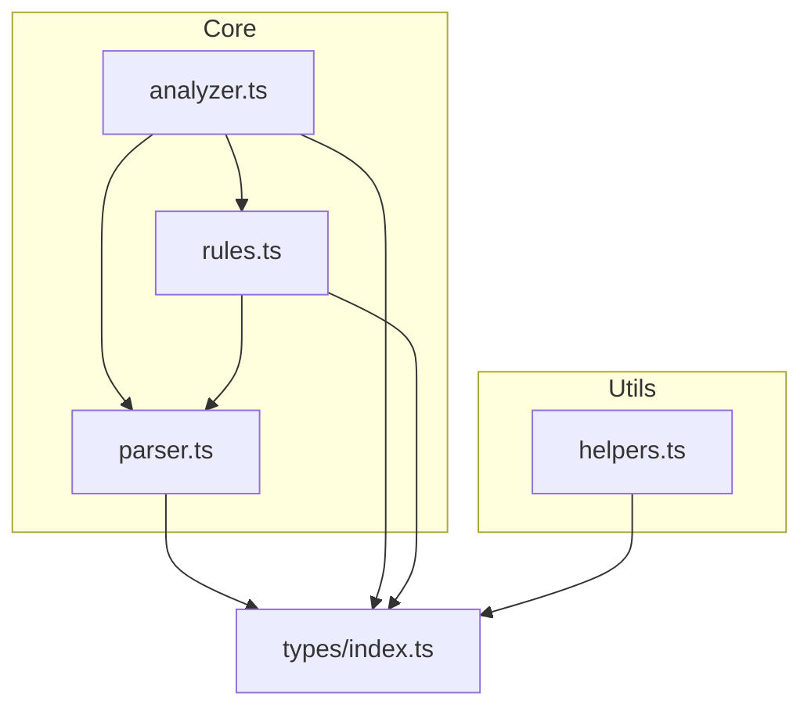
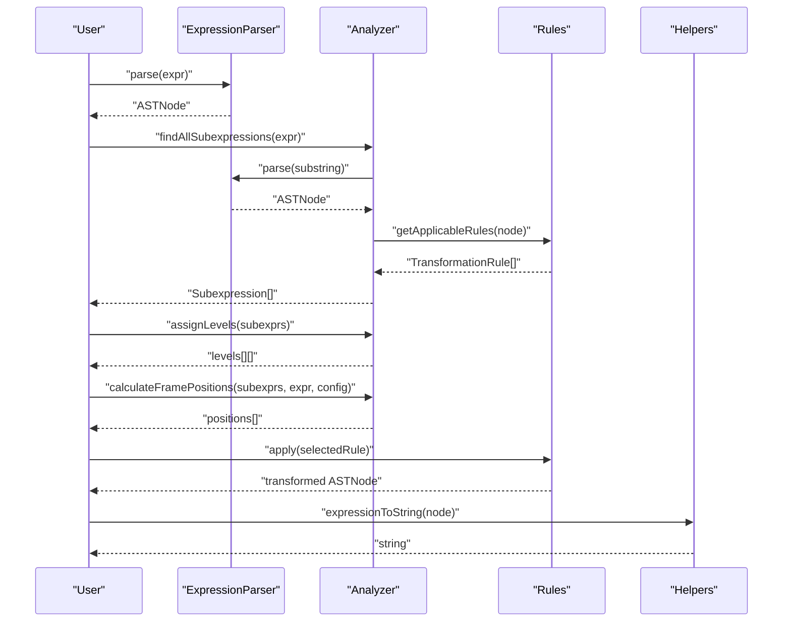
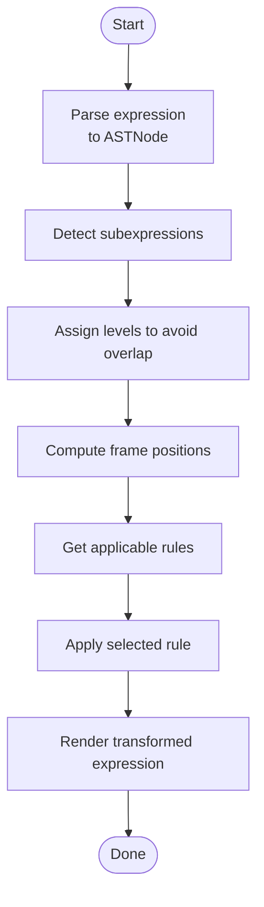
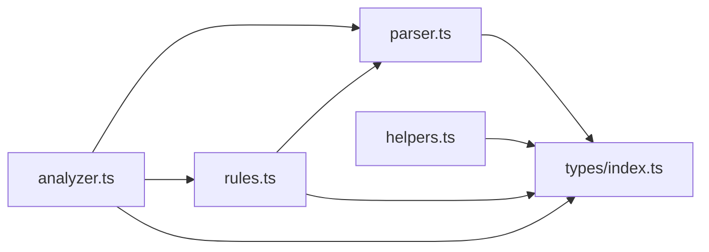

# API Reference

<cite>
**Referenced Files in This Document**
- [parser.ts](file://src/core/parser.ts)
- [analyzer.ts](file://src/core/analyzer.ts)
- [rules.ts](file://src/core/rules.ts)
- [helpers.ts](file://src/utils/helpers.ts)
- [index.ts](file://src/types/index.ts)
- [parser.test.ts](file://src/test/parser.test.ts)
- [analyzer.test.ts](file://src/test/analyzer.test.ts)
- [rules.test.ts](file://src/test/rules.test.ts)
- [helpers.test.ts](file://src/test/helpers.test.ts)
</cite>

## Table of Contents
1. [Introduction](#introduction)
2. [Project Structure](#project-structure)
3. [Core Components](#core-components)
4. [Architecture Overview](#architecture-overview)
5. [Detailed Component Analysis](#detailed-component-analysis)
6. [Dependency Analysis](#dependency-analysis)
7. [Performance Considerations](#performance-considerations)
8. [Troubleshooting Guide](#troubleshooting-guide)
9. [Conclusion](#conclusion)

## Introduction
This document provides a comprehensive API reference for the public interfaces in MathHelper’s core modules. It covers:
- Parser: expression parsing and AST construction
- Analyzer: subexpression detection, level assignment, and frame positioning
- Rules: rule application interface and rule definitions
- Helpers: AST manipulation utilities

For each module, we document exported functions, parameters, return types, and usage examples derived from the source code and tests. We also explain common usage patterns and pitfalls.

## Project Structure
The core modules are organized by responsibility:
- src/core/parser.ts: recursive descent parser that builds AST nodes
- src/core/analyzer.ts: finds valid subexpressions, assigns levels, computes positions
- src/core/rules.ts: defines transformation rules and applies them to AST nodes
- src/utils/helpers.ts: AST traversal and manipulation utilities
- src/types/index.ts: shared AST and rule types

**Diagram sources**
- [parser.ts](file://src/core/parser.ts#L1-L159)
- [analyzer.ts](file://src/core/analyzer.ts#L1-L182)
- [rules.ts](file://src/core/rules.ts#L1-L434)
- [helpers.ts](file://src/utils/helpers.ts#L1-L178)
- [index.ts](file://src/types/index.ts#L1-L98)

**Section sources**
- [parser.ts](file://src/core/parser.ts#L1-L159)
- [analyzer.ts](file://src/core/analyzer.ts#L1-L182)
- [rules.ts](file://src/core/rules.ts#L1-L434)
- [helpers.ts](file://src/utils/helpers.ts#L1-L178)
- [index.ts](file://src/types/index.ts#L1-L98)

## Core Components

### Parser API
Exports:
- generateId(): string
- resetIdCounter(): void
- ExpressionParser class with parse(): ASTNode

Key behaviors:
- Removes whitespace from input during construction
- Throws on empty input, unmatched parentheses, unexpected characters, and incomplete expressions
- Implements operator precedence and left-to-right associativity for same-precedence operators
- Supports constants, variables, unary minus, grouping, and binary operators (+, -, *, /)

Common usage patterns:
- Construct ExpressionParser with an expression string
- Call parse() to produce an ASTNode
- Use helpers to convert AST to string or manipulate nodes

Error conditions:
- Empty or whitespace-only input
- Unmatched parentheses
- Unexpected characters
- Incomplete expressions (e.g., trailing operators)

Examples (from tests):
- Parsing constants, variables, and binary operations
- Respecting operator precedence and associativity
- Handling parentheses and unary minus
- Error scenarios for invalid input

**Section sources**
- [parser.ts](file://src/core/parser.ts#L1-L159)
- [parser.test.ts](file://src/test/parser.test.ts#L1-L379)

### Analyzer API
Exports:
- findAllSubexpressions(exprString: string): Subexpression[]
- assignLevels(subexpressions: Subexpression[]): Subexpression[][]
- doRangesOverlap(start1, end1, start2, end2): boolean
- calculateFramePositions(subexpressions, exprString, config?): SubexpressionPosition[]
- measureTextWidth(text: string): number
- calculateTotalHeight(levels, config?): number

Key behaviors:
- Enumerates all substrings of the expression, trims, filters out whitespace-only or partial-digit substrings, validates with parser, and attaches applicable rules
- Assigns levels to avoid visual overlap by checking range intersections
- Computes left/top/width positions using text measurement and layout configuration
- Provides fallback text width in Node.js environments

Common usage patterns:
- findAllSubexpressions to discover all valid subexpressions
- assignLevels to compute non-overlapping levels
- calculateFramePositions to render frames with left/top/width
- calculateTotalHeight to size containers

Examples (from tests):
- Finding subexpressions in simple and complex expressions
- Overlap detection and level assignment
- Position computation respecting layout config
- Height calculation with custom config

**Section sources**
- [analyzer.ts](file://src/core/analyzer.ts#L1-L182)
- [analyzer.test.ts](file://src/test/analyzer.test.ts#L1-L370)

### Rules API
Exports:
- getApplicableRules(node: ASTNode): TransformationRule[]

Rule categories and representative rules:
- Computation (Priority 1): Evaluate constants
- Simplification (Priority 2): Remove ×1, simplify ×0, remove +0/-0, remove double negation, remove unnecessary parentheses
- Transformation (Priority 3): Distributive expansion
- Rearrangement (Priority 4): Commutative swap for + and *
- Wrapping (Priority 5): Add parentheses, add double negation, multiply/divide by 1, add/subtract 0

Rule definition structure:
- id: string
- name: string
- category: RuleCategory
- preview: string
- apply: (node: ASTNode) => ASTNode

Common usage patterns:
- Parse an expression to ASTNode
- getApplicableRules(node) to discover available transformations
- Apply a selected rule to transform the AST

Examples (from tests):
- Evaluation of constants
- Simplification rules for identities and zero
- Distributive expansion
- Commutative swaps
- Wrapping rules

**Section sources**
- [rules.ts](file://src/core/rules.ts#L1-L434)
- [rules.test.ts](file://src/test/rules.test.ts#L1-L437)

### Helpers API
Exports:
- expressionToString(node: ASTNode): string
- cloneNode(node: ASTNode): ASTNode
- findNodeById(root: ASTNode, id: string): ASTNode | null
- replaceNode(root: ASTNode, targetId: string, newNode: ASTNode): ASTNode
- getLeafNodes(node: ASTNode): ASTNode[]
- countNodes(node: ASTNode): number
- getDepth(node: ASTNode): number
- nodesEqual(node1: ASTNode, node2: ASTNode): boolean
- getAllNodeIds(node: ASTNode): string[]

Common usage patterns:
- Convert AST to human-readable string
- Deep clone AST for safe mutation
- Locate nodes by ID for targeted replacement
- Traverse and analyze AST structure

Examples (from tests):
- Converting various AST forms to strings
- Cloning complex trees
- Replacing nodes and preserving structure
- Finding nodes by ID and verifying presence
- Depth and node counting

**Section sources**
- [helpers.ts](file://src/utils/helpers.ts#L1-L178)
- [helpers.test.ts](file://src/test/helpers.test.ts#L1-L413)

## Architecture Overview
The system composes parser, analyzer, rules, and helpers to enable interactive expression editing:
- Parser constructs AST nodes
- Analyzer discovers subexpressions and computes layout
- Rules define transformations applicable to AST nodes
- Helpers support AST inspection and manipulation

**Diagram sources**
- [parser.ts](file://src/core/parser.ts#L1-L159)
- [analyzer.ts](file://src/core/analyzer.ts#L1-L182)
- [rules.ts](file://src/core/rules.ts#L1-L434)
- [helpers.ts](file://src/utils/helpers.ts#L1-L178)

## Detailed Component Analysis

### Parser: ExpressionParser
Public exports:
- generateId(): string
- resetIdCounter(): void
- ExpressionParser.parse(): ASTNode

Parsing grammar implemented:
- Expressions: additive
- Additive: multiplicative (+|- multiplicative)*
- Multiplicative: unary (*|/ unary)*
- Unary: - unary | primary
- Primary: (expression) | number | variable

Error conditions:
- Empty or whitespace-only input
- Unmatched parentheses
- Unexpected characters
- Incomplete expressions

Usage example (conceptual):
- Create ExpressionParser with an expression
- Call parse() to obtain ASTNode
- Use helpers to convert to string or inspect structure

**Section sources**
- [parser.ts](file://src/core/parser.ts#L1-L159)
- [parser.test.ts](file://src/test/parser.test.ts#L250-L313)

### Analyzer: Subexpression Detection and Layout
Functions:
- findAllSubexpressions(exprString): Subexpression[]
- assignLevels(subexpressions): Subexpression[][]
- doRangesOverlap(start1, end1, start2, end2): boolean
- calculateFramePositions(subexpressions, exprString, config?): SubexpressionPosition[]
- measureTextWidth(text): number
- calculateTotalHeight(levels, config?): number

Processing logic:
- Iterates all substrings, trims, filters, validates with parser, attaches rules
- Assigns levels to avoid overlaps using range intersection checks
- Computes positions using text measurement and layout config
- Provides fallback text width in Node.js

Usage example (conceptual):
- findAllSubexpressions("2 + 3") -> Subexpression[]
- assignLevels(subexprs) -> levels[][]
- calculateFramePositions(subexprs, "2 + 3") -> positions[]
- calculateTotalHeight(levels) -> number

**Section sources**
- [analyzer.ts](file://src/core/analyzer.ts#L1-L182)
- [analyzer.test.ts](file://src/test/analyzer.test.ts#L1-L370)

### Rules: Rule Application Interface
Function:
- getApplicableRules(node: ASTNode): TransformationRule[]

Rule definition structure:
- id: string
- name: string
- category: RuleCategory
- preview: string
- apply: (node: ASTNode) => ASTNode

Categories:
- 1. Computation
- 2. Simplification
- 3. Transformation
- 4. Rearrangement
- 5. Wrapping

Usage example (conceptual):
- Parse "2 + 3" -> ASTNode
- getApplicableRules(node) -> rules[]
- Select a rule and call apply(node) to transform

**Section sources**
- [rules.ts](file://src/core/rules.ts#L1-L434)
- [rules.test.ts](file://src/test/rules.test.ts#L1-L437)

### Helpers: AST Manipulation Utilities
Functions:
- expressionToString(node): string
- cloneNode(node): ASTNode
- findNodeById(root, id): ASTNode | null
- replaceNode(root, targetId, newNode): ASTNode
- getLeafNodes(node): ASTNode[]
- countNodes(node): number
- getDepth(node): number
- nodesEqual(node1, node2): boolean
- getAllNodeIds(node): string[]

Usage example (conceptual):
- Convert AST to string for display
- Clone AST for safe mutation
- Replace a specific node by ID
- Compute depth and node counts for diagnostics

**Section sources**
- [helpers.ts](file://src/utils/helpers.ts#L1-L178)
- [helpers.test.ts](file://src/test/helpers.test.ts#L1-L413)

### Combined Workflow Example
End-to-end usage:
- Parse an expression to ASTNode
- Detect subexpressions and assign levels
- Compute frame positions and total height
- Retrieve applicable rules for a selected subexpression
- Apply a rule to transform the AST
- Render transformed expression using helpers

[No sources needed since this diagram shows conceptual workflow, not actual code structure]

## Dependency Analysis
Module-level dependencies:
- analyzer.ts depends on parser.ts and rules.ts
- rules.ts depends on parser.ts for ID generation
- helpers.ts depends on types/index.ts
- parser.ts depends on types/index.ts
- analyzer.ts depends on types/index.ts
- rules.ts depends on types/index.ts

**Diagram sources**
- [parser.ts](file://src/core/parser.ts#L1-L159)
- [analyzer.ts](file://src/core/analyzer.ts#L1-L182)
- [rules.ts](file://src/core/rules.ts#L1-L434)
- [helpers.ts](file://src/utils/helpers.ts#L1-L178)
- [index.ts](file://src/types/index.ts#L1-L98)

**Section sources**
- [parser.ts](file://src/core/parser.ts#L1-L159)
- [analyzer.ts](file://src/core/analyzer.ts#L1-L182)
- [rules.ts](file://src/core/rules.ts#L1-L434)
- [helpers.ts](file://src/utils/helpers.ts#L1-L178)
- [index.ts](file://src/types/index.ts#L1-L98)

## Performance Considerations
- findAllSubexpressions enumerates all substrings and validates each with parser; complexity grows with O(n^3) in worst case due to substring generation, trimming, and parsing. Consider limiting input length or caching results for repeated queries.
- assignLevels performs pairwise overlap checks; with m subexpressions, complexity is O(m^2).
- measureTextWidth uses DOM APIs in browsers; avoid frequent reflows by batching measurements.
- getApplicableRules traverses a small, finite set of rules; negligible overhead compared to parsing.

[No sources needed since this section provides general guidance]

## Troubleshooting Guide
Common issues and resolutions:
- Parser errors:
  - Empty or whitespace-only input: Ensure non-empty expression before parsing.
  - Unmatched parentheses: Verify balanced grouping.
  - Unexpected characters: Confirm allowed tokens (digits, letters, +, -, *, /, (, )).
  - Incomplete expressions: Avoid trailing operators.

- Analyzer pitfalls:
  - Overlapping subexpressions: assignLevels ensures non-overlapping levels; verify ranges and positions.
  - Text measurement differences: measureTextWidth may vary across environments; use defaults or consistent font metrics.

- Rule application:
  - No applicable rules: Some rules require specific node types or values (e.g., constants for evaluation).
  - Incorrect transformation: Ensure the selected rule matches the node type and operands.

**Section sources**
- [parser.test.ts](file://src/test/parser.test.ts#L250-L313)
- [analyzer.test.ts](file://src/test/analyzer.test.ts#L125-L149)
- [rules.test.ts](file://src/test/rules.test.ts#L1-L437)

## Conclusion
MathHelper exposes a clean, modular API for parsing, analyzing, transforming, and rendering mathematical expressions. The parser builds a strongly-typed AST, the analyzer discovers and lays out subexpressions, the rules engine provides algebraic transformations, and helpers support safe AST manipulation. Together, these APIs enable interactive, educational expression editing with clear error handling and predictable behavior.