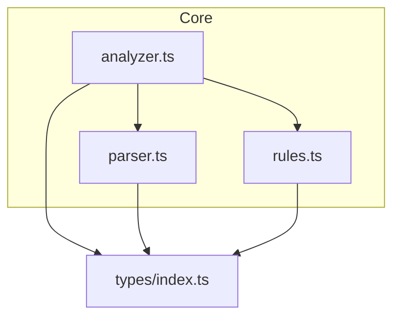
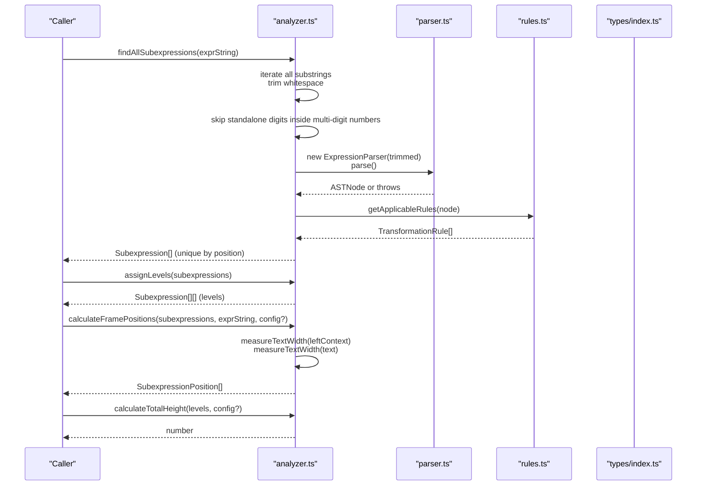
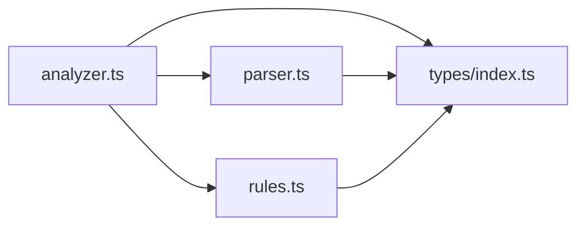

# Analyzer Module API

<cite>
**Referenced Files in This Document**
- [analyzer.ts](file://src/core/analyzer.ts)
- [types/index.ts](file://src/types/index.ts)
- [parser.ts](file://src/core/parser.ts)
- [rules.ts](file://src/core/rules.ts)
- [analyzer.test.ts](file://src/test/analyzer.test.ts)
- [TESTING.md](file://TESTING.md)
</cite>

## Table of Contents
1. [Introduction](#introduction)
2. [Project Structure](#project-structure)
3. [Core Components](#core-components)
4. [Architecture Overview](#architecture-overview)
5. [Detailed Component Analysis](#detailed-component-analysis)
6. [Dependency Analysis](#dependency-analysis)
7. [Performance Considerations](#performance-considerations)
8. [Troubleshooting Guide](#troubleshooting-guide)
9. [Conclusion](#conclusion)
10. [Appendices](#appendices)

## Introduction
This document provides API documentation for the analyzer module, focusing on subexpression detection and layout calculation. It covers:
- findAllSubexpressions(): Detects all valid subexpressions in an expression string, including handling of multi-digit numbers and parentheses.
- assignLevels(): Groups non-overlapping subexpressions into levels to avoid visual overlap.
- calculateFramePositions(): Computes visual layout positions based on configurable spacing.
- calculateTotalHeight(): Determines the total container height for all levels.
It also documents the Subexpression interface and its properties (node, range, level, position), and provides examples for UI rendering. Edge cases such as deeply nested expressions and long variable names are addressed based on the test suite.

## Project Structure
The analyzer module resides under src/core and collaborates with parser and rules modules. Types are centralized in src/types.

**Diagram sources**
- [analyzer.ts](file://src/core/analyzer.ts#L1-L182)
- [parser.ts](file://src/core/parser.ts#L1-L159)
- [rules.ts](file://src/core/rules.ts#L1-L200)
- [types/index.ts](file://src/types/index.ts#L1-L98)

**Section sources**
- [analyzer.ts](file://src/core/analyzer.ts#L1-L182)
- [parser.ts](file://src/core/parser.ts#L1-L159)
- [rules.ts](file://src/core/rules.ts#L1-L200)
- [types/index.ts](file://src/types/index.ts#L1-L98)

## Core Components
- findAllSubexpressions(exprString): Enumerates all substrings, trims whitespace, filters out invalid or redundant tokens (e.g., standalone digits that are part of multi-digit numbers), validates with ExpressionParser, attaches applicable transformation rules, and deduplicates by position.
- assignLevels(subexpressions): Partitions subexpressions into non-overlapping levels using a greedy overlap-checking strategy and sets the level property on each subexpression.
- calculateFramePositions(subexpressions, exprString, config?): Computes left, width, and top for each subexpression using text measurement and layout configuration.
- calculateTotalHeight(levels, config?): Computes the total vertical height needed for rendering all levels plus base offset.
- doRangesOverlap(start1, end1, start2, end2): Utility to determine if two ranges overlap.
- measureTextWidth(text): Measures text width using a monospace font metric, with a fallback for non-browser environments.

**Section sources**
- [analyzer.ts](file://src/core/analyzer.ts#L13-L182)
- [types/index.ts](file://src/types/index.ts#L63-L98)

## Architecture Overview
The analyzer orchestrates parsing and rule application to produce subexpression metadata, then computes layout positions and total height for UI rendering.

**Diagram sources**
- [analyzer.ts](file://src/core/analyzer.ts#L13-L182)
- [parser.ts](file://src/core/parser.ts#L18-L159)
- [rules.ts](file://src/core/rules.ts#L12-L200)
- [types/index.ts](file://src/types/index.ts#L63-L98)

## Detailed Component Analysis

### findAllSubexpressions(exprString)
Purpose:
- Detect all valid subexpressions in an expression string.
- Handle multi-digit numbers by skipping individual digits that are part of larger numbers.
- Recognize parentheses and nested structures.
- Attach AST nodes and applicable transformation rules to each subexpression.
- Deduplicate by exact start/end positions.

Key behaviors:
- Iterates over all contiguous substrings and trims whitespace.
- Skips substrings that still contain leading/trailing whitespace.
- Skips standalone single-digit substrings if they are adjacent to other digits (part of a multi-digit number).
- Uses ExpressionParser to validate and parse each candidate substring into an AST node.
- Retrieves applicable transformation rules via getApplicableRules(node).
- Filters out candidates with no applicable rules.
- Removes duplicates by exact positional keys.

Edge cases handled by tests:
- Multi-digit numbers: single digits are skipped when part of a larger number.
- Parentheses and nesting: grouped expressions are recognized.
- Complex expressions with multiple operators.
- Whitespace variations.
- Variables and constants coexisting.
- Very long expressions and deeply nested parentheses.

Example usage outline:
- Call findAllSubexpressions("2 + 3 * 4") to obtain a list of subexpressions with attached rules and AST nodes.
- Use assignLevels() to group subexpressions into non-overlapping levels.
- Use calculateFramePositions() to compute left, width, top for each subexpression.
- Use calculateTotalHeight() to determine the total container height.

**Section sources**
- [analyzer.ts](file://src/core/analyzer.ts#L13-L79)
- [parser.ts](file://src/core/parser.ts#L18-L159)
- [rules.ts](file://src/core/rules.ts#L12-L200)
- [analyzer.test.ts](file://src/test/analyzer.test.ts#L15-L123)
- [TESTING.md](file://TESTING.md#L341-L363)

### assignLevels(subexpressions)
Purpose:
- Partition subexpressions into levels to prevent visual overlap in UI frames.
- Each level contains non-overlapping subexpressions.
- Sets the level property on each subexpression.

Algorithm:
- For each subexpression, scan existing levels to find the first level with no overlapping ranges.
- If none found, create a new level.
- Place the subexpression into the chosen level and set its level property.

Overlap detection:
- doRangesOverlap(start1, end1, start2, end2) returns true if ranges intersect (including touching).

Edge cases handled by tests:
- Non-overlapping subexpressions remain at level 0.
- Overlapping subexpressions are distributed across multiple levels.
- Single subexpression.
- Many nested subexpressions requiring multiple levels.

Example usage outline:
- After obtaining subexpressions from findAllSubexpressions(), call assignLevels(subexpressions).
- Iterate levels to render frames per level with distinct top offsets.

**Section sources**
- [analyzer.ts](file://src/core/analyzer.ts#L84-L117)
- [analyzer.ts](file://src/core/analyzer.ts#L122-L124)
- [analyzer.test.ts](file://src/test/analyzer.test.ts#L151-L214)

### calculateFramePositions(subexpressions, exprString, config?)
Purpose:
- Compute visual layout metadata for each subexpression: left, width, top.
- left: distance from the start of the expression to the subexpression’s start.
- width: measured width of the subexpression text using a monospace font.
- top: BASE_OFFSET + level index × LEVEL_HEIGHT.

Configuration:
- LayoutConfig with defaults LEVEL_HEIGHT: 18, BASE_OFFSET: 5.
- Customizable via the third argument.

Text measurement:
- measureTextWidth(text) creates a hidden span with monospace font and measures its width.
- In non-browser environments, falls back to a simple character count multiplier.

Edge cases handled by tests:
- Different left positions for different subexpressions.
- Widths reflect text length differences.
- Respect for custom layout configuration.
- Different tops for different levels.

Example usage outline:
- After assignLevels(), call calculateFramePositions(subexpressions, exprString, config).
- Render frames using left, width, top values.

**Section sources**
- [analyzer.ts](file://src/core/analyzer.ts#L129-L170)
- [analyzer.ts](file://src/core/analyzer.ts#L151-L170)
- [analyzer.test.ts](file://src/test/analyzer.test.ts#L216-L291)

### calculateTotalHeight(levels, config?)
Purpose:
- Determine the total vertical height required to render all levels.
- Formula: BASE_OFFSET + (number of levels) × LEVEL_HEIGHT + small bottom padding.

Configuration:
- LayoutConfig with defaults LEVEL_HEIGHT: 18, BASE_OFFSET: 5.
- Customizable via the second argument.

Edge cases handled by tests:
- Single level vs. multiple levels.
- Respects custom configuration.
- Handles empty levels gracefully.

Example usage outline:
- After assignLevels(), call calculateTotalHeight(levels, config).
- Use the returned height to size the container element.

**Section sources**
- [analyzer.ts](file://src/core/analyzer.ts#L172-L182)
- [analyzer.test.ts](file://src/test/analyzer.test.ts#L293-L332)

### doRangesOverlap(start1, end1, start2, end2)
Purpose:
- Utility to detect if two ranges overlap.
- Returns true if ranges intersect; false otherwise.

Logic:
- Two ranges overlap if neither end is less than or equal to the other’s start.

**Section sources**
- [analyzer.ts](file://src/core/analyzer.ts#L122-L124)
- [analyzer.test.ts](file://src/test/analyzer.test.ts#L125-L149)

### measureTextWidth(text)
Purpose:
- Measure text width using a monospace font for consistent layout.
- Fallback for non-browser environments.

Behavior:
- Browser: creates a hidden span with monospace font, measures width, removes span.
- Non-browser: returns a simple character count multiplier.

**Section sources**
- [analyzer.ts](file://src/core/analyzer.ts#L151-L170)

### Subexpression Interface and Properties
The Subexpression interface defines the metadata produced by the analyzer.

Properties:
- text: The matched subexpression string.
- start: Start index in the original expression string.
- end: End index in the original expression string.
- node: ASTNode parsed from the subexpression.
- length: end - start.
- rules: List of applicable TransformationRule instances.
- level?: Numeric level assigned by assignLevels().

Related types:
- SubexpressionPosition extends Subexpression with left, width, top.
- LayoutConfig defines LEVEL_HEIGHT and BASE_OFFSET.

**Section sources**
- [types/index.ts](file://src/types/index.ts#L63-L98)

## Dependency Analysis
The analyzer module depends on:
- parser.ts for validating and parsing substrings into AST nodes.
- rules.ts for retrieving applicable transformation rules for each AST node.
- types/index.ts for shared type definitions (ASTNode, Subexpression, SubexpressionPosition, LayoutConfig).

**Diagram sources**
- [analyzer.ts](file://src/core/analyzer.ts#L1-L182)
- [parser.ts](file://src/core/parser.ts#L1-L159)
- [rules.ts](file://src/core/rules.ts#L1-L200)
- [types/index.ts](file://src/types/index.ts#L1-L98)

**Section sources**
- [analyzer.ts](file://src/core/analyzer.ts#L1-L182)
- [parser.ts](file://src/core/parser.ts#L1-L159)
- [rules.ts](file://src/core/rules.ts#L1-L200)
- [types/index.ts](file://src/types/index.ts#L1-L98)

## Performance Considerations
- findAllSubexpressions has O(n^3) complexity in the worst case due to:
  - O(n^2) substring enumeration,
  - O(n) trimming and whitespace checks,
  - O(n) parsing per candidate (ExpressionParser.parse),
  - O(r) rule retrieval per valid node (r = number of applicable rules).
- assignLevels has O(k^2) complexity where k is the number of subexpressions, due to pairwise overlap checks.
- calculateFramePositions is O(k) for measuring text widths and computing positions.
- calculateTotalHeight is O(1) with respect to subexpressions.

Recommendations:
- Limit input length for interactive scenarios.
- Cache repeated measurements if re-rendering the same expression frequently.
- Consider early pruning of candidates (e.g., skip substrings that cannot form balanced parentheses or valid operator sequences) to reduce parsing attempts.

[No sources needed since this section provides general guidance]

## Troubleshooting Guide
Common issues and resolutions:
- Unexpected missing subexpressions:
  - Verify that the substring is trimmed and does not contain leading/trailing whitespace.
  - Ensure standalone digits inside multi-digit numbers are not included; the analyzer skips them intentionally.
- Overlapping frames:
  - Confirm assignLevels() was called and levels were computed; overlapping subexpressions will be placed on different levels.
- Incorrect positions:
  - Ensure calculateFramePositions() receives the original exprString and that measureTextWidth() runs in a DOM-enabled environment for accurate metrics.
- Empty or minimal results:
  - Some subexpressions may be filtered out if no applicable rules exist; confirm that rules are available for the target AST node types.

Edge cases validated by tests:
- Very long expressions, deeply nested parentheses, expressions with extra spaces, mixed operators, and variables/constants together.

**Section sources**
- [analyzer.test.ts](file://src/test/analyzer.test.ts#L15-L123)
- [analyzer.test.ts](file://src/test/analyzer.test.ts#L151-L214)
- [analyzer.test.ts](file://src/test/analyzer.test.ts#L216-L291)
- [analyzer.test.ts](file://src/test/analyzer.test.ts#L293-L332)
- [TESTING.md](file://TESTING.md#L341-L363)

## Conclusion
The analyzer module provides a robust pipeline for detecting valid subexpressions, assigning non-overlapping levels, and calculating precise layout metrics for UI rendering. Its design integrates tightly with the parser and rules modules to ensure correctness and completeness. The APIs are straightforward to use and well-tested for edge cases, including deeply nested expressions and long variable names.

[No sources needed since this section summarizes without analyzing specific files]

## Appendices

### API Reference Summary
- findAllSubexpressions(exprString): Subexpression[]
- assignLevels(subexpressions): Subexpression[][]
- calculateFramePositions(subexpressions, exprString, config?): SubexpressionPosition[]
- calculateTotalHeight(levels, config?): number
- doRangesOverlap(start1, end1, start2, end2): boolean
- measureTextWidth(text): number

**Section sources**
- [analyzer.ts](file://src/core/analyzer.ts#L13-L182)

### Example Workflow for UI Rendering
- Step 1: Detect subexpressions
  - Call findAllSubexpressions("2 + 3 * 4").
- Step 2: Group into levels
  - Call assignLevels(subexpressions).
- Step 3: Compute positions
  - Call calculateFramePositions(subexpressions, "2 + 3 * 4", { LEVEL_HEIGHT: 20, BASE_OFFSET: 10 }).
- Step 4: Determine container height
  - Call calculateTotalHeight(levels, { LEVEL_HEIGHT: 20, BASE_OFFSET: 10 }).
- Step 5: Render frames
  - Use left, width, top values to position and size each frame.

**Section sources**
- [analyzer.ts](file://src/core/analyzer.ts#L84-L182)
- [analyzer.test.ts](file://src/test/analyzer.test.ts#L216-L291)