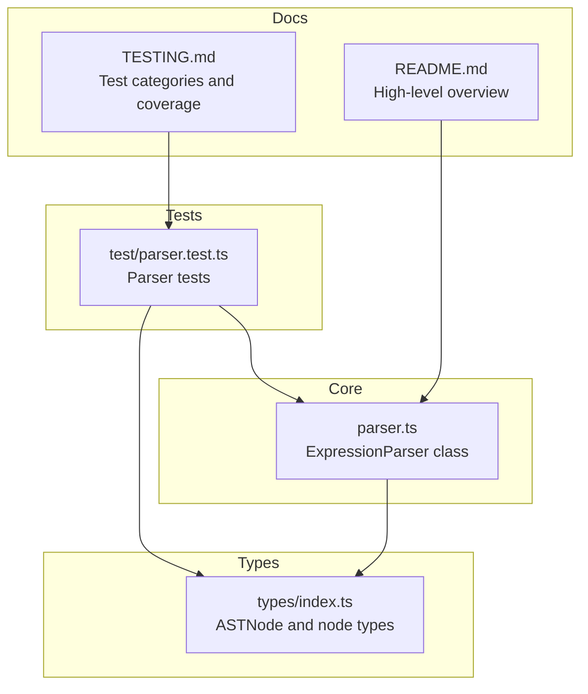
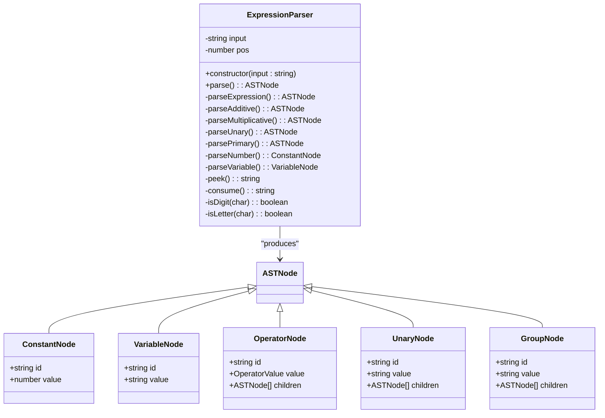
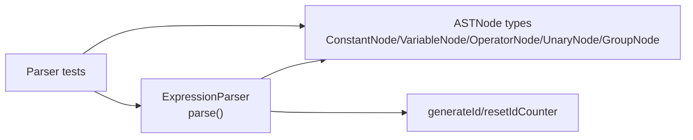
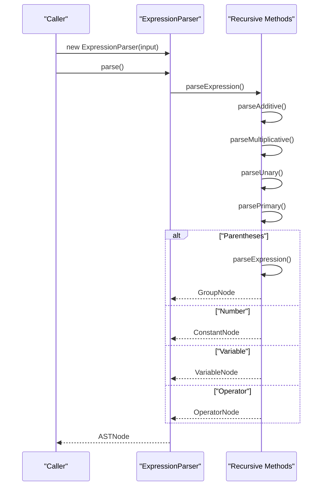
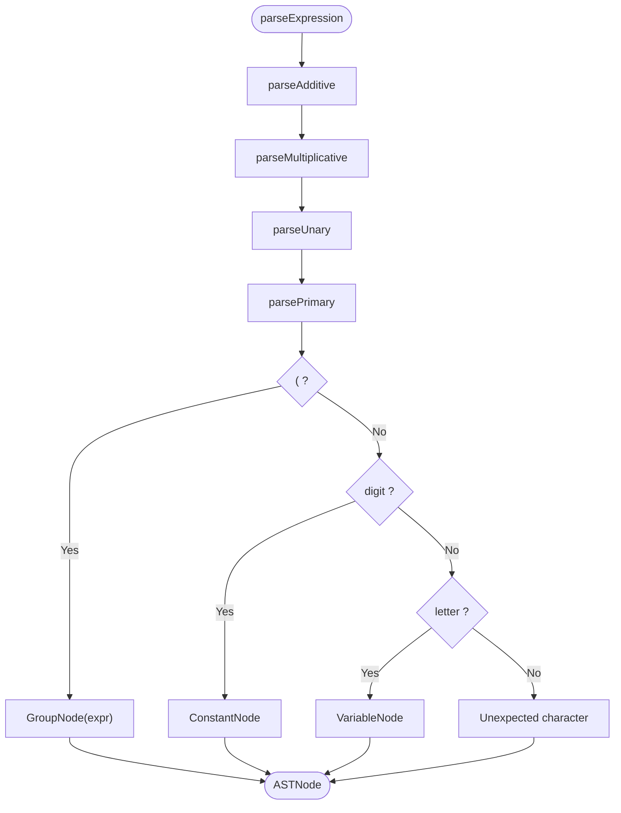

# Parser Module API

<cite>
**Referenced Files in This Document**
- [parser.ts](file://src/core/parser.ts)
- [index.ts](file://src/types/index.ts)
- [parser.test.ts](file://src/test/parser.test.ts)
- [TESTING.md](file://TESTING.md)
- [README.md](file://README.md)
</cite>

## Table of Contents
1. [Introduction](#introduction)
2. [Project Structure](#project-structure)
3. [Core Components](#core-components)
4. [Architecture Overview](#architecture-overview)
5. [Detailed Component Analysis](#detailed-component-analysis)
6. [Dependency Analysis](#dependency-analysis)
7. [Performance Considerations](#performance-considerations)
8. [Troubleshooting Guide](#troubleshooting-guide)
9. [Conclusion](#conclusion)
10. [Appendices](#appendices)

## Introduction
This document provides API documentation for the ExpressionParser class responsible for converting mathematical expressions into an Abstract Syntax Tree (AST). It covers the parse() method, recursive descent parsing methods, operator precedence handling, AST node types, error conditions, and integration with the type system. It also includes usage examples and guidance for common parsing errors derived from the test suite.

## Project Structure
The parser resides in the core module and defines AST node types in a shared types module. The test suite validates parsing behavior across constants, variables, operators, parentheses, unary operations, precedence, and error conditions.

**Diagram sources**
- [parser.ts](file://src/core/parser.ts#L1-L159)
- [index.ts](file://src/types/index.ts#L1-L43)
- [parser.test.ts](file://src/test/parser.test.ts#L1-L379)
- [TESTING.md](file://TESTING.md#L50-L105)
- [README.md](file://README.md#L42-L58)

**Section sources**
- [parser.ts](file://src/core/parser.ts#L1-L159)
- [index.ts](file://src/types/index.ts#L1-L43)
- [parser.test.ts](file://src/test/parser.test.ts#L1-L379)
- [TESTING.md](file://TESTING.md#L50-L105)
- [README.md](file://README.md#L42-L58)

## Core Components
- ExpressionParser: A recursive descent parser that converts a string expression into an ASTNode.
- ASTNode discriminated union: Defines the shape of all node types used in the AST.
- Utility functions: generateId() and resetIdCounter() produce unique identifiers for nodes.

Key responsibilities:
- Tokenization-like scanning with peek() and consume().
- Grammar-driven recursion: parseExpression() → parseAdditive() → parseMultiplicative() → parseUnary() → parsePrimary().
- Operator precedence: multiplicative binds tighter than additive; unary minus is right-associative in the grammar.
- Parentheses grouping with explicit error handling for unmatched parentheses.
- Error reporting for empty input, unexpected characters, and malformed expressions.

**Section sources**
- [parser.ts](file://src/core/parser.ts#L18-L159)
- [index.ts](file://src/types/index.ts#L1-L43)

## Architecture Overview
The parser builds an AST composed of five node types: constant, variable, operator, unary, and group. The ASTNode discriminated union enables exhaustive type checks and safe navigation of the tree.

**Diagram sources**
- [parser.ts](file://src/core/parser.ts#L18-L159)
- [index.ts](file://src/types/index.ts#L1-L43)

**Section sources**
- [parser.ts](file://src/core/parser.ts#L18-L159)
- [index.ts](file://src/types/index.ts#L1-L43)

## Detailed Component Analysis

### ExpressionParser.parse()
- Purpose: Convert the input string into an ASTNode.
- Signature: parse(): ASTNode
- Behavior:
  - Throws if input is empty or only whitespace.
  - Initiates parsing with parseExpression().
  - Ensures the entire input is consumed; otherwise throws an unexpected character error.
- Return type: ASTNode (discriminated union).
- Error conditions:
  - Empty input: throws with a message indicating empty expression.
  - Unexpected trailing characters: throws with position and character details.
- Integration: Uses internal recursive descent methods and AST node factories.

Usage example paths:
- Single constant: [parser.test.ts](file://src/test/parser.test.ts#L11-L17)
- Single variable: [parser.test.ts](file://src/test/parser.test.ts#L49-L55)
- Binary operation: [parser.test.ts](file://src/test/parser.test.ts#L72-L81)
- Parentheses grouping: [parser.test.ts](file://src/test/parser.test.ts#L172-L178)

**Section sources**
- [parser.ts](file://src/core/parser.ts#L27-L34)
- [parser.test.ts](file://src/test/parser.test.ts#L250-L292)

### Recursive Descent Parsing Methods

#### parseExpression()
- Role: Entry point for parsing; delegates to parseAdditive().
- Complexity: O(n) over input length n.
- Notes: Maintains precedence by delegating to higher-precedence methods.

**Section sources**
- [parser.ts](file://src/core/parser.ts#L36-L38)

#### parseAdditive()
- Role: Handles addition (+) and subtraction (-) with left-to-right associativity.
- Precedence: Lower than multiplicative; calls parseMultiplicative() for both sides.
- Behavior: Repeatedly consumes + or - operators and builds a left-leaning binary tree.

**Section sources**
- [parser.ts](file://src/core/parser.ts#L40-L56)

#### parseMultiplicative()
- Role: Handles multiplication (*) and division (/) with left-to-right associativity.
- Precedence: Higher than additive; calls parseUnary() for both sides.
- Behavior: Repeatedly consumes * or / operators and builds a left-leaning binary tree.

**Section sources**
- [parser.ts](file://src/core/parser.ts#L58-L74)

#### parseUnary()
- Role: Handles unary minus (-) prefix.
- Behavior: If a minus is found, creates a UnaryNode wrapping the result of parseUnary(); otherwise delegates to parsePrimary().
- Note: Unary minus binds tightly and is right-associative in grammar.

**Section sources**
- [parser.ts](file://src/core/parser.ts#L76-L89)

#### parsePrimary()
- Role: Base case for atoms:
  - Parentheses: Consumes '(', parses expression, expects ')', wraps result in GroupNode.
  - Numbers: Consumes digits and dots, produces ConstantNode.
  - Variables: Consumes letters, produces VariableNode.
  - Otherwise: Throws unexpected character error.
- Error conditions:
  - Missing closing parenthesis inside parentheses: throws a specific message.
  - Unexpected character at any position: throws with character details.

**Section sources**
- [parser.ts](file://src/core/parser.ts#L91-L117)

#### parseNumber()
- Role: Scans digits and decimal points to form a number literal.
- Output: ConstantNode with numeric value.

**Section sources**
- [parser.ts](file://src/core/parser.ts#L119-L129)

#### parseVariable()
- Role: Scans alphabetic characters to form a variable identifier.
- Output: VariableNode with string value.

**Section sources**
- [parser.ts](file://src/core/parser.ts#L131-L141)

### Implicit Multiplication
- Observation: The parser does not implement implicit multiplication (e.g., “2x” or “(a+b)c”). Explicit multiplication with the * operator is required.
- Evidence: Tests demonstrate explicit operators and parentheses grouping; no implicit multiplication tests are present.
- Recommendation: When building expressions, use explicit multiplication operators for clarity and correctness.

**Section sources**
- [parser.test.ts](file://src/test/parser.test.ts#L72-L108)
- [parser.test.ts](file://src/test/parser.test.ts#L172-L200)

### ASTNode Discriminated Union and Type System Integration
- ASTNode is a union of five node types: ConstantNode, VariableNode, OperatorNode, UnaryNode, GroupNode.
- Each node has a type field enabling runtime discrimination and compile-time narrowing.
- OperatorNode enforces two children for binary operators.
- UnaryNode enforces one child for unary operations.
- GroupNode enforces one child for grouped subexpressions.

Integration points:
- Parser constructs nodes and returns ASTNode.
- Downstream consumers (analyzer, rules, helpers) rely on ASTNode to traverse and transform expressions safely.

**Section sources**
- [index.ts](file://src/types/index.ts#L1-L43)

### Operator Precedence and Associativity
- Multiplicative operators bind tighter than additive operators.
- Same-precedence operators associate left-to-right.
- Unary minus is right-associative in the grammar (multiple minuses stack as nested UnaryNode).
- Parentheses override precedence and associativity.

Validation from tests:
- Precedence examples: [parser.test.ts](file://src/test/parser.test.ts#L125-L169)
- Left-to-right same precedence: [parser.test.ts](file://src/test/parser.test.ts#L150-L161)
- Parentheses override: [parser.test.ts](file://src/test/parser.test.ts#L180-L190)

**Section sources**
- [parser.ts](file://src/core/parser.ts#L40-L74)
- [parser.test.ts](file://src/test/parser.test.ts#L125-L169)

### Usage Examples (String-to-AST Conversion)
Below are example scenarios with references to test paths that demonstrate expected AST shapes:

- Constants
  - Single digit: [parser.test.ts](file://src/test/parser.test.ts#L11-L17)
  - Multi-digit: [parser.test.ts](file://src/test/parser.test.ts#L19-L24)
  - Decimal: [parser.test.ts](file://src/test/parser.test.ts#L26-L31)
  - Zero: [parser.test.ts](file://src/test/parser.test.ts#L33-L38)
  - Negative number with unary minus: [parser.test.ts](file://src/test/parser.test.ts#L40-L47)

- Variables
  - Single letter: [parser.test.ts](file://src/test/parser.test.ts#L49-L55)
  - Uppercase: [parser.test.ts](file://src/test/parser.test.ts#L57-L62)
  - Multi-character: [parser.test.ts](file://src/test/parser.test.ts#L64-L69)

- Binary Operations
  - Addition: [parser.test.ts](file://src/test/parser.test.ts#L72-L81)
  - Subtraction: [parser.test.ts](file://src/test/parser.test.ts#L83-L90)
  - Multiplication: [parser.test.ts](file://src/test/parser.test.ts#L92-L99)
  - Division: [parser.test.ts](file://src/test/parser.test.ts#L101-L108)
  - Without spaces: [parser.test.ts](file://src/test/parser.test.ts#L110-L115)
  - With extra spaces: [parser.test.ts](file://src/test/parser.test.ts#L117-L122)

- Operator Precedence
  - Multiplication over addition: [parser.test.ts](file://src/test/parser.test.ts#L126-L139)
  - Division over subtraction: [parser.test.ts](file://src/test/parser.test.ts#L141-L149)
  - Left-to-right same precedence: [parser.test.ts](file://src/test/parser.test.ts#L150-L161)
  - Complex precedence: [parser.test.ts](file://src/test/parser.test.ts#L163-L169)

- Parentheses
  - Simple grouping: [parser.test.ts](file://src/test/parser.test.ts#L173-L178)
  - Override precedence: [parser.test.ts](file://src/test/parser.test.ts#L180-L190)
  - Nested parentheses: [parser.test.ts](file://src/test/parser.test.ts#L192-L200)
  - Complex nested: [parser.test.ts](file://src/test/parser.test.ts#L202-L209)

- Unary Operations
  - Unary minus: [parser.test.ts](file://src/test/parser.test.ts#L212-L219)
  - Double negation: [parser.test.ts](file://src/test/parser.test.ts#L221-L229)
  - Unary in expression: [parser.test.ts](file://src/test/parser.test.ts#L231-L239)
  - Unary with parentheses: [parser.test.ts](file://src/test/parser.test.ts#L240-L247)

- Mixed Operations
  - Mixed variables and constants: [parser.test.ts](file://src/test/parser.test.ts#L354-L365)
  - All operators in one expression: [parser.test.ts](file://src/test/parser.test.ts#L361-L366)
  - Deeply nested groups: [parser.test.ts](file://src/test/parser.test.ts#L367-L371)
  - Alternating operators: [parser.test.ts](file://src/test/parser.test.ts#L373-L377)

**Section sources**
- [parser.test.ts](file://src/test/parser.test.ts#L11-L379)

### Error Conditions and Causes
Common errors thrown by the parser and their causes:

- Empty expression
  - Cause: Input is empty or only whitespace.
  - Symptom: Parse throws with an empty expression message.
  - Reference: [parser.test.ts](file://src/test/parser.test.ts#L250-L256)

- Whitespace-only expression
  - Cause: Input contains only spaces.
  - Symptom: Parse throws with an empty expression message.
  - Reference: [parser.test.ts](file://src/test/parser.test.ts#L258-L263)

- Unmatched opening parenthesis
  - Cause: Missing closing parenthesis.
  - Symptom: Parse throws a missing closing parenthesis message.
  - Reference: [parser.test.ts](file://src/test/parser.test.ts#L265-L269)

- Unmatched closing parenthesis
  - Cause: Extra closing parenthesis without matching opening.
  - Symptom: Parse throws an unexpected character error.
  - Reference: [parser.test.ts](file://src/test/parser.test.ts#L272-L277)

- Invalid character
  - Cause: Unsupported operator or symbol.
  - Symptom: Parse throws an unexpected character error.
  - Reference: [parser.test.ts](file://src/test/parser.test.ts#L279-L284)

- Incomplete expression
  - Cause: Trailing operator without operand.
  - Symptom: Parse throws an error.
  - Reference: [parser.test.ts](file://src/test/parser.test.ts#L286-L291)

- Operator at start (except unary)
  - Cause: Starting with an operator other than unary minus.
  - Symptom: Parse throws an error.
  - Reference: [parser.test.ts](file://src/test/parser.test.ts#L293-L299)

- Double operator
  - Cause: Two adjacent operators without operand.
  - Symptom: Parse throws an error.
  - Reference: [parser.test.ts](file://src/test/parser.test.ts#L300-L306)

- Empty parentheses
  - Cause: Parentheses with nothing inside.
  - Symptom: Parse throws an error.
  - Reference: [parser.test.ts](file://src/test/parser.test.ts#L307-L312)

- Additional edge cases validated by tests:
  - Very large numbers, very small decimals, long variable names, complex nested expressions, multiple unary operators, leading zeros.
  - References: [parser.test.ts](file://src/test/parser.test.ts#L315-L353)

**Section sources**
- [parser.ts](file://src/core/parser.ts#L27-L34)
- [parser.ts](file://src/core/parser.ts#L91-L117)
- [parser.test.ts](file://src/test/parser.test.ts#L250-L312)
- [parser.test.ts](file://src/test/parser.test.ts#L315-L353)

## Dependency Analysis
The parser depends on AST node type definitions and utility functions for unique node IDs. The tests depend on the parser and types to assert AST shapes and error conditions.

**Diagram sources**
- [parser.ts](file://src/core/parser.ts#L18-L159)
- [index.ts](file://src/types/index.ts#L1-L43)
- [parser.test.ts](file://src/test/parser.test.ts#L1-L379)

**Section sources**
- [parser.ts](file://src/core/parser.ts#L18-L159)
- [index.ts](file://src/types/index.ts#L1-L43)
- [parser.test.ts](file://src/test/parser.test.ts#L1-L379)

## Performance Considerations
- Time complexity: O(n) where n is the number of characters after whitespace removal.
- Space complexity: O(h) for recursion depth h (proportional to nesting depth).
- Optimizations:
  - Whitespace removal occurs once during construction.
  - Single-pass scanning with peek() and consume() avoids extra allocations.
  - Left-leaning trees reflect operator associativity and reduce re-parsing.

[No sources needed since this section provides general guidance]

## Troubleshooting Guide
- Symptom: Parse throws “Empty expression”
  - Likely cause: Empty or whitespace-only input.
  - Fix: Provide a non-empty expression.
  - Reference: [parser.test.ts](file://src/test/parser.test.ts#L250-L256)

- Symptom: Parse throws “Missing closing parenthesis”
  - Likely cause: Unmatched ‘(’.
  - Fix: Ensure every ‘(’ has a matching ‘)’.
  - Reference: [parser.test.ts](file://src/test/parser.test.ts#L265-L269)

- Symptom: Parse throws “Unexpected character”
  - Likely cause: Invalid symbol or misplaced operator.
  - Fix: Use supported operators (+, -, *, /) and valid identifiers.
  - Reference: [parser.test.ts](file://src/test/parser.test.ts#L272-L284)

- Symptom: Parse throws on trailing operator
  - Likely cause: Expression ends with an operator.
  - Fix: Add a valid operand after the operator.
  - Reference: [parser.test.ts](file://src/test/parser.test.ts#L286-L291)

- Symptom: Parse throws on double operator
  - Likely cause: Two consecutive operators.
  - Fix: Insert a valid operand or remove one operator.
  - Reference: [parser.test.ts](file://src/test/parser.test.ts#L300-L306)

- Symptom: Parse throws on empty parentheses
  - Likely cause: () with nothing inside.
  - Fix: Include a valid subexpression.
  - Reference: [parser.test.ts](file://src/test/parser.test.ts#L307-L312)

**Section sources**
- [parser.test.ts](file://src/test/parser.test.ts#L250-L312)

## Conclusion
The ExpressionParser provides a robust, type-safe recursive descent parser that converts expressions into a strongly-typed AST. It enforces operator precedence, handles parentheses, supports unary minus, and reports clear errors. The ASTNode discriminated union enables safe traversal and transformation downstream. The comprehensive test suite validates correctness across constants, variables, operators, parentheses, unary operations, precedence, and error conditions.

[No sources needed since this section summarizes without analyzing specific files]

## Appendices

### API Summary
- Class: ExpressionParser
  - Constructor: ExpressionParser(input: string)
  - Method: parse(): ASTNode
  - Internal methods: parseExpression(), parseAdditive(), parseMultiplicative(), parseUnary(), parsePrimary(), parseNumber(), parseVariable()

- ASTNode types:
  - ConstantNode: numeric value
  - VariableNode: string identifier
  - OperatorNode: operator value and two children
  - UnaryNode: unary minus and one child
  - GroupNode: grouped subexpression with one child

- Utility:
  - generateId(): string
  - resetIdCounter(): void

**Section sources**
- [parser.ts](file://src/core/parser.ts#L18-L159)
- [index.ts](file://src/types/index.ts#L1-L43)

### Grammar Flow (Sequence)

**Diagram sources**
- [parser.ts](file://src/core/parser.ts#L27-L117)

### Precedence Flow (Flowchart)

**Diagram sources**
- [parser.ts](file://src/core/parser.ts#L36-L117)