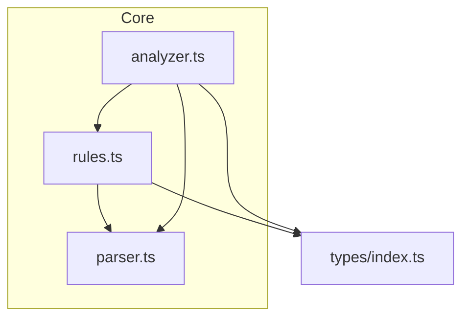
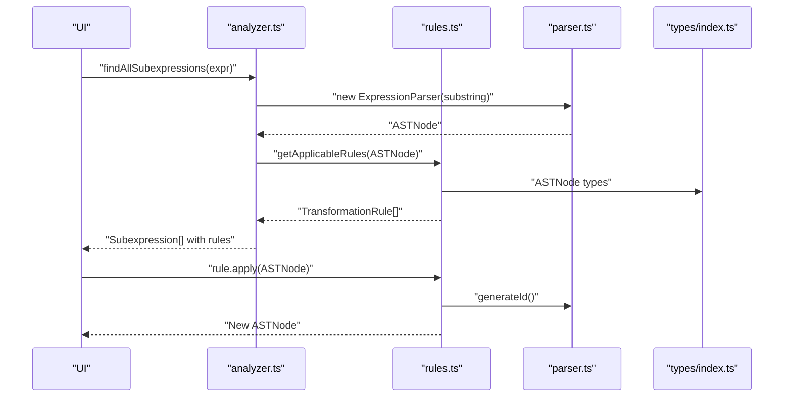
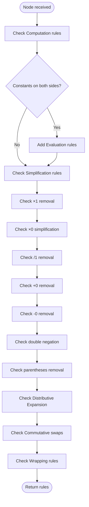
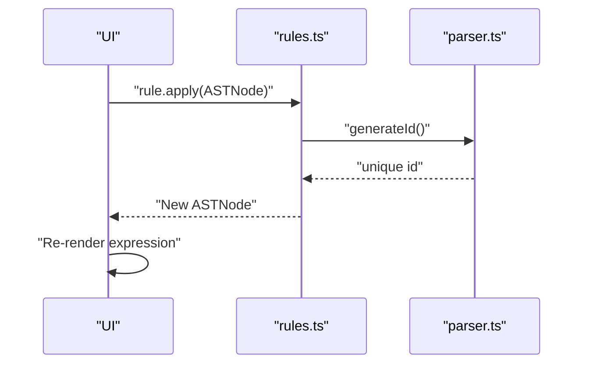
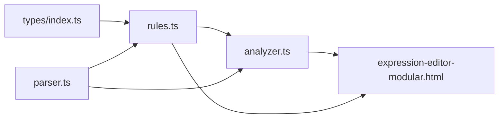

# Rules Module API

<cite>
**Referenced Files in This Document**
- [rules.ts](file://src/core/rules.ts)
- [types/index.ts](file://src/types/index.ts)
- [parser.ts](file://src/core/parser.ts)
- [analyzer.ts](file://src/core/analyzer.ts)
- [README.md](file://README.md)
- [rules.test.ts](file://src/test/rules.test.ts)
- [expression-editor-modular.html](file://expression-editor-modular.html)
</cite>

## Table of Contents
1. [Introduction](#introduction)
2. [Project Structure](#project-structure)
3. [Core Components](#core-components)
4. [Architecture Overview](#architecture-overview)
5. [Detailed Component Analysis](#detailed-component-analysis)
6. [Dependency Analysis](#dependency-analysis)
7. [Performance Considerations](#performance-considerations)
8. [Troubleshooting Guide](#troubleshooting-guide)
9. [Conclusion](#conclusion)

## Introduction
This document describes the Transformation Rule System API used by the expression editor. It focuses on the TransformationRule interface, rule categories and priorities, the rule application process, and examples of key transformations such as distributive expansion, commutative swap, implicit multiplication, and identity removal. It also explains how getApplicableRules() determines context-aware availability based on AST node structure and how bidirectional rules are represented in the UI.

## Project Structure
The transformation rule system is implemented in a dedicated module and integrates with the AST types, parser, and analyzer.

**Diagram sources**
- [rules.ts](file://src/core/rules.ts#L1-L20)
- [parser.ts](file://src/core/parser.ts#L1-L20)
- [analyzer.ts](file://src/core/analyzer.ts#L1-L20)
- [types/index.ts](file://src/types/index.ts#L45-L62)

**Section sources**
- [rules.ts](file://src/core/rules.ts#L1-L20)
- [analyzer.ts](file://src/core/analyzer.ts#L1-L20)

## Core Components
- TransformationRule interface: Defines the shape of a transformation rule with id, name, category, preview, and apply function.
- getApplicableRules(node): Returns the set of rules applicable to a given AST node, grouped by priority.
- Rule categories: Computation, Simplification, Transformation, Rearrangement, Wrapping.
- Rule application: The apply function transforms an AST node into another AST node.

Key API surface:
- TransformationRule: [types/index.ts](file://src/types/index.ts#L48-L62)
- getApplicableRules: [rules.ts](file://src/core/rules.ts#L12-L238)
- Rule application functions: [rules.ts](file://src/core/rules.ts#L240-L434)
- AST node types: [types/index.ts](file://src/types/index.ts#L5-L43)
- Parser ID generation: [parser.ts](file://src/core/parser.ts#L10-L12)

**Section sources**
- [types/index.ts](file://src/types/index.ts#L48-L62)
- [rules.ts](file://src/core/rules.ts#L12-L238)
- [parser.ts](file://src/core/parser.ts#L10-L12)

## Architecture Overview
The rule system sits between the analyzer and the UI. The analyzer discovers valid subexpressions and attaches rules to them. The UI renders available transformations grouped by category and executes the selected rule’s apply function.

**Diagram sources**
- [analyzer.ts](file://src/core/analyzer.ts#L13-L79)
- [rules.ts](file://src/core/rules.ts#L12-L238)
- [parser.ts](file://src/core/parser.ts#L10-L12)
- [types/index.ts](file://src/types/index.ts#L5-L43)

## Detailed Component Analysis

### TransformationRule Interface
- Purpose: Standardized definition of a transformation rule.
- Fields:
  - id: Unique identifier for the rule.
  - name: Human-readable label for the UI.
  - category: Categorization string indicating priority group.
  - preview: String describing the before/after transformation.
  - apply: Function that takes an ASTNode and returns a transformed ASTNode.

Categories and priorities:
- Computation (1)
- Simplification (2)
- Transformation (3)
- Rearrangement (4)
- Wrapping (5)

These categories are defined in the types module and used consistently by getApplicableRules().

**Section sources**
- [types/index.ts](file://src/types/index.ts#L48-L62)
- [README.md](file://README.md#L100-L124)

### getApplicableRules() Logic and Priority Groups
The function evaluates a node and returns applicable rules in priority order. It checks:
- Computation: Numeric-only operators (+, -, *, /) are evaluated immediately.
- Simplification: Identity removals (×1, +0, etc.), zero simplifications, double negation, and unnecessary parentheses.
- Transformation: Distributive expansion (forward).
- Rearrangement: Commutative swaps for + and *.
- Wrapping: Parentheses, double negation, ×1, /1, +0.

Context awareness:
- Rules depend on node.type and node.value, and on child node types/values (e.g., constant children).

**Diagram sources**
- [rules.ts](file://src/core/rules.ts#L12-L238)

**Section sources**
- [rules.ts](file://src/core/rules.ts#L12-L238)
- [README.md](file://README.md#L100-L124)

### Rule Application Process
- Signature: apply(node: ASTNode) => ASTNode
- Behavior:
  - Non-destructive: returns a new ASTNode (often with fresh IDs).
  - Uses generateId() to produce unique identifiers for new nodes.
- Examples of transformations:
  - Distributive expansion: a*(b±c) → a*b ± a*c and (a±b)*c → a*c ± b*c
  - Commutative swap: a+b → b+a and a*b → b*a
  - Identity removal: a*1 → a, 1*a → a, a/1 → a, a+0 → a, 0+a → a, a-0 → a
  - Double negation: --a → a
  - Parentheses removal: (a) → a
  - Wrapping: (a), --a, a*1, a/1, a+0

**Diagram sources**
- [rules.ts](file://src/core/rules.ts#L240-L434)
- [parser.ts](file://src/core/parser.ts#L10-L12)

**Section sources**
- [rules.ts](file://src/core/rules.ts#L240-L434)
- [parser.ts](file://src/core/parser.ts#L10-L12)

### Examples of Rule Definitions
Below are the key transformations implemented in the rules module. Each example is linked to the actual implementation.

- Distributive Expansion (Forward)
  - Pattern: a*(b+c) or a*(b-c) or (a+b)*c or (a-b)*c
  - Implementation: [rules.ts](file://src/core/rules.ts#L340-L374)
  - Preview: "a*(b+c) → a*b + a*c" and similar variants
  - Category: Transformation (3)

- Commutative Swap
  - Pattern: a+b → b+a and a*b → b*a
  - Implementation: [rules.ts](file://src/core/rules.ts#L331-L338)
  - Preview: "a+b → b+a" and "a*b → b*a"
  - Category: Rearrangement (4)

- Implicit Multiplication
  - Pattern: a*1 → a and 1*a → a
  - Implementation: [rules.ts](file://src/core/rules.ts#L286-L292)
  - Preview: "a*1 → a or 1*a → a"
  - Category: Simplification (2)

- Identity Removal
  - Pattern: a/1 → a, a+0 → a, 0+a → a, a-0 → a
  - Implementation: [rules.ts](file://src/core/rules.ts#L302-L318)
  - Preview: "a/1 → a" and "a+0 → a or 0+a → a" and "a-0 → a"
  - Category: Simplification (2)

- Double Negation
  - Pattern: --a → a
  - Implementation: [rules.ts](file://src/core/rules.ts#L320-L324)
  - Preview: "--a → a"
  - Category: Simplification (2)

- Unnecessary Parentheses
  - Pattern: (a) → a
  - Implementation: [rules.ts](file://src/core/rules.ts#L326-L329)
  - Preview: "(a) → a"
  - Category: Simplification (2)

- Wrapping Rules
  - Add parentheses: a → (a)
  - Add double negation: a → --a
  - Multiply by 1: a → a*1
  - Divide by 1: a → a/1
  - Add zero: a → a+0
  - Implementation: [rules.ts](file://src/core/rules.ts#L376-L433)
  - Category: Wrapping (5)

**Section sources**
- [rules.ts](file://src/core/rules.ts#L145-L238)
- [rules.ts](file://src/core/rules.ts#L240-L434)

### Bidirectional Rules and UI Representation
- Bidirectionality: Some rules can conceptually be applied in reverse. For example, distributive expansion can be reversed to factorization (planned). The current implementation exposes forward expansion rules.
- UI presentation: The UI groups rules by category and displays name and preview for each rule. Clicking a rule invokes rule.apply(node) and updates the expression and history.
- Evidence in UI:
  - Grouping by category: [expression-editor-modular.html](file://expression-editor-modular.html#L768-L806)
  - Rendering name and preview: [expression-editor-modular.html](file://expression-editor-modular.html#L788-L798)
  - Applying transformation: [expression-editor-modular.html](file://expression-editor-modular.html#L808-L825)

**Section sources**
- [expression-editor-modular.html](file://expression-editor-modular.html#L768-L825)

## Dependency Analysis
- rules.ts depends on:
  - types/index.ts for ASTNode and TransformationRule types
  - parser.ts for generateId() to create unique node IDs
- analyzer.ts depends on:
  - rules.ts to attach applicable rules to subexpressions
  - parser.ts to parse candidate substrings into AST nodes
- UI depends on:
  - analyzer.ts to discover subexpressions and rules
  - rules.ts to apply transformations

**Diagram sources**
- [rules.ts](file://src/core/rules.ts#L1-L20)
- [analyzer.ts](file://src/core/analyzer.ts#L1-L20)
- [parser.ts](file://src/core/parser.ts#L10-L12)
- [types/index.ts](file://src/types/index.ts#L45-L62)

**Section sources**
- [rules.ts](file://src/core/rules.ts#L1-L20)
- [analyzer.ts](file://src/core/analyzer.ts#L1-L20)

## Performance Considerations
- getApplicableRules() performs a linear scan of a small set of conditions per node. Complexity is O(1) relative to input size for a single node.
- findAllSubexpressions() explores all substrings and parses each candidate, resulting in O(n^3) time in the worst case (n = expression length), with pruning via parsing and rule availability checks.
- Recommendations:
  - Limit subexpression search depth or scope in the UI for long expressions.
  - Cache rule computation per node if repeated lookups occur frequently.
  - Avoid re-parsing identical substrings by memoizing parser results.

[No sources needed since this section provides general guidance]

## Troubleshooting Guide
- No transformations available:
  - Verify that the selected subexpression parses to a valid AST node.
  - Confirm that getApplicableRules(node) returns a non-empty array for the node.
  - Check that the node type/value matches expected patterns (e.g., operator with constant children).
- Unexpected rule not appearing:
  - Ensure the node structure matches the rule’s conditions (e.g., constant children for computation).
  - Confirm that the rule category is correct and that the rule is included in the priority checks.
- Rule application errors:
  - The UI catches exceptions during rule application and shows an error message. Inspect the error and verify the rule’s apply function handles the node type correctly.
- Tests to consult:
  - Computation rules: [rules.test.ts](file://src/test/rules.test.ts#L12-L78)
  - Simplification rules: [rules.test.ts](file://src/test/rules.test.ts#L80-L206)
  - Transformation rules: [rules.test.ts](file://src/test/rules.test.ts#L208-L237)
  - Rearrangement rules: [rules.test.ts](file://src/test/rules.test.ts#L239-L285)
  - Wrapping rules: [rules.test.ts](file://src/test/rules.test.ts#L287-L366)
  - Categories and previews: [rules.test.ts](file://src/test/rules.test.ts#L368-L400)
  - Edge cases: [rules.test.ts](file://src/test/rules.test.ts#L402-L437)

**Section sources**
- [rules.test.ts](file://src/test/rules.test.ts#L12-L437)
- [expression-editor-modular.html](file://expression-editor-modular.html#L808-L825)

## Conclusion
The transformation rule system provides a structured, priority-based mechanism for context-aware transformations on AST nodes. The TransformationRule interface and getApplicableRules() enable consistent categorization and application of rules. The UI integrates these rules to present actionable transformations grouped by category, and the apply function ensures safe, non-destructive AST rewriting with unique IDs. The system’s design supports future extensions such as bidirectional rules (e.g., factoring) and additional categories.