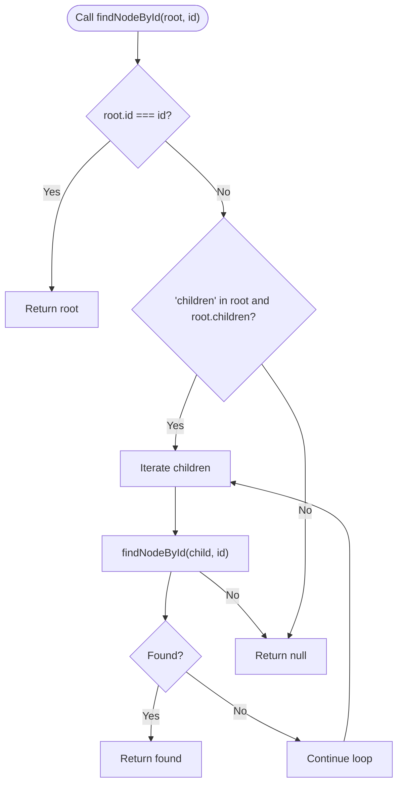

# Utils Module API

<cite>
**Referenced Files in This Document**
- [helpers.ts](file://src/utils/helpers.ts)
- [index.ts](file://src/types/index.ts)
- [parser.ts](file://src/core/parser.ts)
- [rules.ts](file://src/core/rules.ts)
- [helpers.test.ts](file://src/test/helpers.test.ts)
- [expression-editor-modular.html](file://expression-editor-modular.html)
</cite>

## Table of Contents
1. [Introduction](#introduction)
2. [Project Structure](#project-structure)
3. [Core Components](#core-components)
4. [Architecture Overview](#architecture-overview)
5. [Detailed Component Analysis](#detailed-component-analysis)
6. [Dependency Analysis](#dependency-analysis)
7. [Performance Considerations](#performance-considerations)
8. [Troubleshooting Guide](#troubleshooting-guide)
9. [Conclusion](#conclusion)

## Introduction
This document provides API documentation for the utility functions in the helpers module, focusing on AST manipulation utilities that enable immutable transformations and subexpression analysis. It covers:
- cloneNode() for deep cloning AST nodes
- findNodeById() for locating nodes by ID
- replaceNode() for targeted node replacement
- nodesEqual() for structural equality checks
- Supporting helpers such as getLeafNodes(), countNodes(), getDepth(), getAllNodeIds(), and expressionToString()

These utilities underpin core functionality such as safe AST modifications, targeted transformations, and subexpression analysis workflows.

## Project Structure
The helpers module resides under src/utils and exports AST manipulation utilities. It interacts with:
- AST type definitions in src/types
- Parser in src/core that generates unique IDs for nodes
- Rules module that defines transformation rules
- Front-end integration in expression-editor-modular.html for applying transformations

```mermaid
graph TB
subgraph "Utils"
H["helpers.ts"]
end
subgraph "Core"
P["parser.ts"]
R["rules.ts"]
end
subgraph "Types"
T["types/index.ts"]
end
subgraph "Tests"
HT["test/helpers.test.ts"]
end
subgraph "UI"
UI["expression-editor-modular.html"]
end
H --> T
H --> P
H --> R
UI --> H
UI --> P
UI --> R
HT --> H
HT --> P
HT --> T
```

**Diagram sources**
- [helpers.ts](file://src/utils/helpers.ts#L1-L178)
- [index.ts](file://src/types/index.ts#L1-L43)
- [parser.ts](file://src/core/parser.ts#L1-L159)
- [rules.ts](file://src/core/rules.ts#L1-L238)
- [helpers.test.ts](file://src/test/helpers.test.ts#L1-L413)
- [expression-editor-modular.html](file://expression-editor-modular.html#L606-L805)

**Section sources**
- [helpers.ts](file://src/utils/helpers.ts#L1-L178)
- [index.ts](file://src/types/index.ts#L1-L43)
- [parser.ts](file://src/core/parser.ts#L1-L159)
- [rules.ts](file://src/core/rules.ts#L1-L238)
- [helpers.test.ts](file://src/test/helpers.test.ts#L1-L413)
- [expression-editor-modular.html](file://expression-editor-modular.html#L606-L805)

## Core Components
This section documents the primary helper functions and their roles in AST manipulation and analysis.

- cloneNode(node)
  - Purpose: Deep clone an AST node while preserving node identity for the root.
  - Behavior: Recursively clones children arrays for unary, group, and operator nodes; shallow copies for constant and variable nodes.
  - Complexity: O(n) time, O(h) space where h is recursion depth.
  - Usage: Enables immutable transformations by allowing safe edits without mutating the original tree.

- findNodeById(root, id)
  - Purpose: Locate a node by its unique ID in the AST.
  - Behavior: Performs a recursive preorder traversal; returns the first match or null.
  - Complexity: O(n) time, O(h) space.
  - Usage: Facilitates targeted replacements and updates in the applyTransformation workflow.

- replaceNode(root, targetId, newNode)
  - Purpose: Replace a node identified by targetId with a new node while preserving structure.
  - Behavior: Recursively traverses the tree; reconstructs parent nodes with updated children.
  - Complexity: O(n) time, O(h) space.
  - Usage: Supports safe subtree replacement in transformations.

- nodesEqual(node1, node2)
  - Purpose: Structural equality check for AST nodes.
  - Behavior: Compares types and values; recursively compares children for compound nodes.
  - Complexity: O(n) time, O(h) space.
  - Usage: Validates equivalence after transformations or comparisons.

- Additional helpers
  - expressionToString(node): Converts an AST node to a string representation.
  - getLeafNodes(node): Collects all leaf nodes (constants and variables).
  - countNodes(node): Counts total nodes in the AST.
  - getDepth(node): Computes the maximum depth of the AST.
  - getAllNodeIds(node): Retrieves all node IDs in the AST.

**Section sources**
- [helpers.ts](file://src/utils/helpers.ts#L32-L178)
- [helpers.test.ts](file://src/test/helpers.test.ts#L81-L189)
- [helpers.test.ts](file://src/test/helpers.test.ts#L191-L249)
- [helpers.test.ts](file://src/test/helpers.test.ts#L251-L378)

## Architecture Overview
The helpers module integrates with the parser and rules modules to support immutable transformations and subexpression analysis. The UI triggers transformations, which call rule.apply() functions that often rely on helpers for safe AST manipulation.


**Diagram sources**
- [expression-editor-modular.html](file://expression-editor-modular.html#L606-L805)
- [parser.ts](file://src/core/parser.ts#L1-L159)
- [rules.ts](file://src/core/rules.ts#L1-L238)
- [helpers.ts](file://src/utils/helpers.ts#L1-L31)

## Detailed Component Analysis

### cloneNode(node)
- Purpose: Deep clone an AST node to support immutable transformations.
- Implementation highlights:
  - Handles constant and variable nodes with shallow copy semantics.
  - Recursively clones children for unary, group, and operator nodes.
  - Preserves node identity for the root node to maintain references.
- Complexity: O(n) time, O(h) space.
- Usage in tests: Confirms that cloning preserves IDs and produces structurally equivalent trees.


**Diagram sources**
- [helpers.ts](file://src/utils/helpers.ts#L32-L57)

**Section sources**
- [helpers.ts](file://src/utils/helpers.ts#L32-L57)
- [helpers.test.ts](file://src/test/helpers.test.ts#L81-L133)

### findNodeById(root, id)
- Purpose: Locate a node by its unique ID in the AST.
- Implementation highlights:
  - Preorder traversal with early exit upon match.
  - Recursively searches children when present.
- Complexity: O(n) time, O(h) space.
- Usage in tests: Validates finding root, child, and deeply nested nodes; returns null for missing IDs.



**Diagram sources**
- [helpers.ts](file://src/utils/helpers.ts#L62-L73)

**Section sources**
- [helpers.ts](file://src/utils/helpers.ts#L62-L73)
- [helpers.test.ts](file://src/test/helpers.test.ts#L191-L249)

### replaceNode(root, targetId, newNode)
- Purpose: Replace a node identified by targetId with a new node while preserving structure.
- Implementation highlights:
  - Recursively traverses the tree to locate targetId.
  - Reconstructs parent nodes with updated children for unary/group/operator.
  - Returns original root if targetId is not found.
- Complexity: O(n) time, O(h) space.
- Usage in tests: Demonstrates replacing root, child, and deeply nested nodes; ensures structure preservation.


**Diagram sources**
- [helpers.ts](file://src/utils/helpers.ts#L78-L99)

**Section sources**
- [helpers.ts](file://src/utils/helpers.ts#L78-L99)
- [helpers.test.ts](file://src/test/helpers.test.ts#L135-L189)

### nodesEqual(node1, node2)
- Purpose: Structural equality check for AST nodes.
- Implementation highlights:
  - Compares node types and values.
  - Recursively compares children for operator, unary, and group nodes.
- Complexity: O(n) time, O(h) space.
- Usage in tests: Validates equality for constants, variables, operators, unary, and group nodes.


**Diagram sources**
- [helpers.ts](file://src/utils/helpers.ts#L142-L162)

**Section sources**
- [helpers.ts](file://src/utils/helpers.ts#L142-L162)
- [helpers.test.ts](file://src/test/helpers.test.ts#L1-L80)

### Supporting Utilities
- expressionToString(node): Converts AST nodes to string representations for display and history.
- getLeafNodes(node): Gathers leaf nodes (constants and variables) for analysis.
- countNodes(node): Counts total nodes to assess tree size.
- getDepth(node): Computes maximum depth for layout and rendering.
- getAllNodeIds(node): Retrieves all IDs for validation and debugging.

**Section sources**
- [helpers.ts](file://src/utils/helpers.ts#L1-L31)
- [helpers.ts](file://src/utils/helpers.ts#L101-L178)
- [helpers.test.ts](file://src/test/helpers.test.ts#L251-L413)

## Dependency Analysis
The helpers module depends on AST type definitions and integrates with the parser and rules modules. The UI orchestrates transformations and relies on helpers for string conversion and history management.


**Diagram sources**
- [helpers.ts](file://src/utils/helpers.ts#L1-L178)
- [index.ts](file://src/types/index.ts#L1-L43)
- [parser.ts](file://src/core/parser.ts#L1-L159)
- [rules.ts](file://src/core/rules.ts#L1-L238)
- [expression-editor-modular.html](file://expression-editor-modular.html#L606-L805)

**Section sources**
- [helpers.ts](file://src/utils/helpers.ts#L1-L178)
- [index.ts](file://src/types/index.ts#L1-L43)
- [parser.ts](file://src/core/parser.ts#L1-L159)
- [rules.ts](file://src/core/rules.ts#L1-L238)
- [expression-editor-modular.html](file://expression-editor-modular.html#L606-L805)

## Performance Considerations
- All traversal-based helpers operate in linear time relative to the number of nodes.
- Space complexity is proportional to recursion depth (height of the tree).
- For large expressions, prefer iterative approaches if stack limits become a concern; however, current implementations use recursion which is acceptable for typical educational expressions.

## Troubleshooting Guide
- Missing IDs or incorrect matches:
  - Ensure IDs are generated by the parser before invoking helpers.
  - Verify that IDs remain stable across cloning and replacement operations.
- Replacement does not occur:
  - Confirm targetId matches exactly and exists in the tree.
  - Check that replaceNode is invoked with the correct root node.
- Equality checks fail unexpectedly:
  - Validate node types and values; ensure both nodes are fully constructed.
  - Confirm that children arrays are compared for compound nodes.

**Section sources**
- [parser.ts](file://src/core/parser.ts#L1-L159)
- [helpers.test.ts](file://src/test/helpers.test.ts#L135-L189)
- [helpers.test.ts](file://src/test/helpers.test.ts#L191-L249)

## Conclusion
The helpers module provides essential AST manipulation utilities that enable immutable transformations and robust subexpression analysis. Functions like cloneNode(), findNodeById(), and replaceNode() form the backbone of safe, targeted edits, while nodesEqual() and supporting utilities facilitate validation and visualization. Together, they integrate seamlessly with the parser, rules, and UI to deliver a reliable transformation workflow.