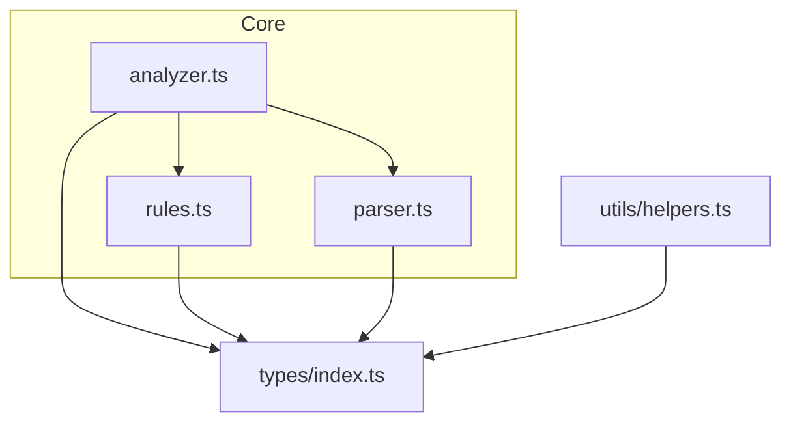
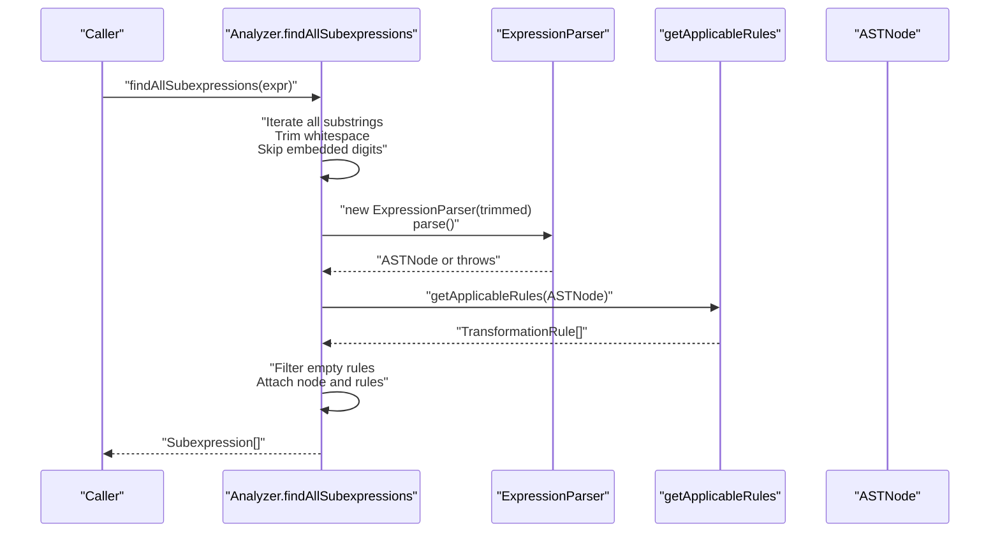
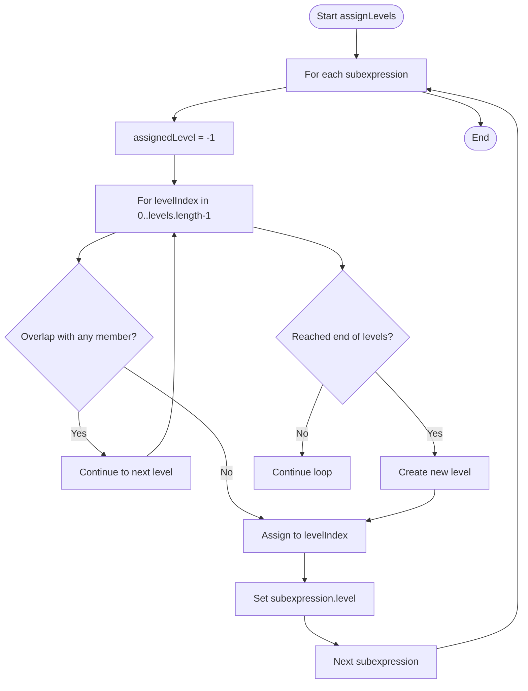
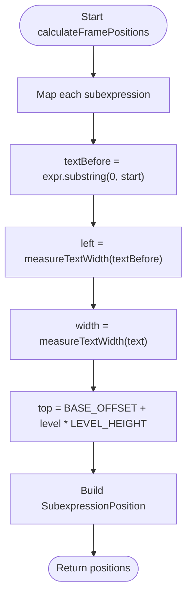
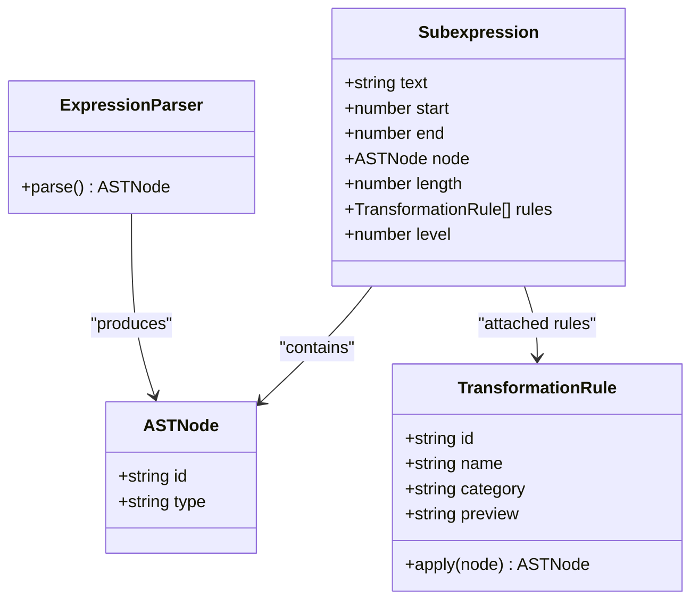
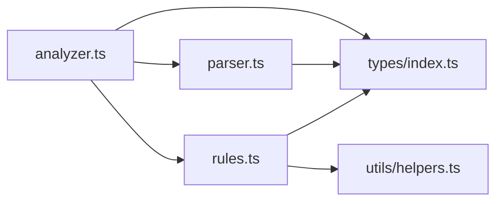

# Analyzer Module

<cite>
**Referenced Files in This Document**
- [analyzer.ts](file://src/core/analyzer.ts)
- [parser.ts](file://src/core/parser.ts)
- [rules.ts](file://src/core/rules.ts)
- [index.ts](file://src/types/index.ts)
- [analyzer.test.ts](file://src/test/analyzer.test.ts)
- [parser.test.ts](file://src/test/parser.test.ts)
- [rules.test.ts](file://src/test/rules.test.ts)
- [helpers.ts](file://src/utils/helpers.ts)
</cite>

## Table of Contents
1. [Introduction](#introduction)
2. [Project Structure](#project-structure)
3. [Core Components](#core-components)
4. [Architecture Overview](#architecture-overview)
5. [Detailed Component Analysis](#detailed-component-analysis)
6. [Dependency Analysis](#dependency-analysis)
7. [Performance Considerations](#performance-considerations)
8. [Troubleshooting Guide](#troubleshooting-guide)
9. [Conclusion](#conclusion)
10. [Appendices](#appendices)

## Introduction
This document explains the Analyzer module’s role in detecting valid subexpressions from a mathematical expression string, assigning non-overlapping visual “levels” to them, and computing their display positions for rendering interactive frames. It also describes how Analyzer integrates with Parser (which produces an AST) and Rules (which provides transformation contexts for each subexpression). The document includes examples from analyzer.test.ts and analyzer.ts to illustrate subexpression boundary determination, level assignment, and layout calculations. Guidance is provided for handling overlapping subexpressions, performance considerations for large expressions, and extending analysis logic for new subexpression types.

## Project Structure
The Analyzer module resides under src/core and collaborates with Parser and Rules. Types shared across modules are defined centrally. Tests validate Analyzer’s behavior and confirm integration with Parser and Rules.

**Diagram sources**
- [analyzer.ts](file://src/core/analyzer.ts#L1-L182)
- [parser.ts](file://src/core/parser.ts#L1-L159)
- [rules.ts](file://src/core/rules.ts#L1-L434)
- [index.ts](file://src/types/index.ts#L1-L98)
- [helpers.ts](file://src/utils/helpers.ts#L1-L178)

**Section sources**
- [analyzer.ts](file://src/core/analyzer.ts#L1-L182)
- [parser.ts](file://src/core/parser.ts#L1-L159)
- [rules.ts](file://src/core/rules.ts#L1-L434)
- [index.ts](file://src/types/index.ts#L1-L98)

## Core Components
- findAllSubexpressions(exprString): Enumerates candidate substrings, trims whitespace, skips digits embedded in larger numbers, validates each candidate via Parser, filters candidates with no applicable Rules, and attaches parsed AST and rules to each subexpression.
- assignLevels(subexpressions): Partitions subexpressions into non-overlapping “levels” using a greedy placement strategy that avoids overlaps within the same level.
- doRangesOverlap(start1, end1, start2, end2): Determines overlap using interval arithmetic.
- calculateFramePositions(subexpressions, exprString, config): Computes left, width, and top for each subexpression using text measurement and level-based vertical offset.
- measureTextWidth(text): Measures width using a monospace font metric; falls back to a simple estimate in non-browser environments.
- calculateTotalHeight(levels, config): Computes total vertical height needed for rendering all levels.

These functions collectively enable Analyzer to:
- Detect valid subexpression boundaries
- Determine non-overlapping levels
- Compute precise layout positions for visual frames

**Section sources**
- [analyzer.ts](file://src/core/analyzer.ts#L13-L182)
- [analyzer.test.ts](file://src/test/analyzer.test.ts#L1-L370)

## Architecture Overview
The Analyzer orchestrates three collaborating modules:
- Parser builds an AST from a candidate subexpression string.
- Rules inspects the AST to produce applicable transformation rules.
- Analyzer composes these outputs to drive UI layout.

**Diagram sources**
- [analyzer.ts](file://src/core/analyzer.ts#L13-L79)
- [parser.ts](file://src/core/parser.ts#L18-L34)
- [rules.ts](file://src/core/rules.ts#L12-L238)

## Detailed Component Analysis

### Subexpression Detection and Validation
- Candidate generation: The algorithm iterates all possible substrings of the input expression, trims whitespace, and skips substrings that are not trimmed (i.e., those that start or end with whitespace).
- Digit handling: Single digits immediately adjacent to other digits are skipped to avoid treating parts of multi-digit numbers as separate subexpressions.
- Parsing and validation: Each trimmed candidate is parsed into an AST using ExpressionParser. Parsing errors are caught and ignored, ensuring only syntactically valid subexpressions are considered.
- Rule filtering: Only subexpressions with at least one applicable transformation rule are retained. This ensures each detected subexpression is meaningful for interactive editing.

Examples from analyzer.test.ts demonstrate:
- Finding single constants and binary operations
- Correctly assigning start/end indices
- Skipping embedded digits within multi-digit numbers
- Handling parentheses and nested expressions
- Attaching rules to each subexpression

**Section sources**
- [analyzer.ts](file://src/core/analyzer.ts#L13-L79)
- [analyzer.test.ts](file://src/test/analyzer.test.ts#L15-L123)
- [parser.test.ts](file://src/test/parser.test.ts#L1-L379)
- [rules.test.ts](file://src/test/rules.test.ts#L1-L437)

### Level Assignment Algorithm
The level assignment ensures non-overlapping subexpression frames by placing each subexpression into the lowest-numbered level that does not overlap with existing members of that level. The algorithm:
- Iterates each subexpression
- Checks overlap against all existing members of each level
- Places the subexpression in the first level without overlap, or creates a new level if necessary
- Sets a level property on each subexpression for downstream layout

**Diagram sources**
- [analyzer.ts](file://src/core/analyzer.ts#L84-L117)

Key correctness guarantees validated by tests:
- Overlapping subexpressions are placed on different levels
- No overlaps occur within the same level
- Levels are assigned consistently across runs

**Section sources**
- [analyzer.ts](file://src/core/analyzer.ts#L84-L117)
- [analyzer.test.ts](file://src/test/analyzer.test.ts#L151-L214)

### Position Calculation for Visual Layout
Layout computation converts logical subexpression positions into pixel coordinates:
- Left: Sum of widths of text before the subexpression
- Width: Width of the subexpression text
- Top: BASE_OFFSET plus level index times LEVEL_HEIGHT

Text measurement uses a monospace font in browser environments; a fallback numeric estimate is used in non-browser contexts.

Tests verify:
- Positions are computed for each subexpression
- Different left positions for distinct tokens
- Widths reflect text length differences
- Custom layout configuration affects top offsets and heights

**Section sources**
- [analyzer.ts](file://src/core/analyzer.ts#L129-L170)
- [analyzer.test.ts](file://src/test/analyzer.test.ts#L216-L291)

### Relationship Between Analyzer, Parser, and Rules
- Parser: Converts a candidate substring into an AST. It enforces grammar rules and throws on invalid inputs, ensuring Analyzer only considers syntactically valid subexpressions.
- Rules: Inspects the AST to determine applicable transformation rules. These rules inform the user what actions can be taken on a given subexpression.
- Analyzer: Uses Parser to validate candidates and Rules to filter candidates, then computes levels and positions for UI rendering.

**Diagram sources**
- [parser.ts](file://src/core/parser.ts#L18-L34)
- [index.ts](file://src/types/index.ts#L1-L98)
- [rules.ts](file://src/core/rules.ts#L12-L238)
- [analyzer.ts](file://src/core/analyzer.ts#L13-L79)

## Dependency Analysis
- Analyzer depends on:
  - Parser for AST construction
  - Rules for transformation applicability
  - Types for shared data structures
- Parser depends on:
  - Types for AST node definitions
- Rules depends on:
  - Types for AST node definitions and rule signatures
  - Parser for generating new node IDs during transformations

**Diagram sources**
- [analyzer.ts](file://src/core/analyzer.ts#L1-L182)
- [parser.ts](file://src/core/parser.ts#L1-L159)
- [rules.ts](file://src/core/rules.ts#L1-L434)
- [index.ts](file://src/types/index.ts#L1-L98)
- [helpers.ts](file://src/utils/helpers.ts#L1-L178)

**Section sources**
- [analyzer.ts](file://src/core/analyzer.ts#L1-L182)
- [parser.ts](file://src/core/parser.ts#L1-L159)
- [rules.ts](file://src/core/rules.ts#L1-L434)
- [index.ts](file://src/types/index.ts#L1-L98)
- [helpers.ts](file://src/utils/helpers.ts#L1-L178)

## Performance Considerations
- Complexity of subexpression enumeration:
  - The naive O(n^2) substring generation combined with parsing and rule checks yields high computational cost for long expressions.
  - Practical mitigations:
    - Early pruning: Skip substrings that start/end with whitespace and embedded digits to reduce candidate count.
    - Short-circuit parsing: Stop parsing on first error to avoid expensive retries.
    - Caching: Cache repeated subexpression parsing and rule application results when analyzing the same expression repeatedly.
    - Parallelization: Split the expression into chunks and process them concurrently, then merge results while preserving overlap-free levels.
- Text measurement:
  - measureTextWidth can be expensive in browsers; cache measurements per unique text fragment and invalidate on font changes.
- Memory:
  - Subexpression arrays can grow large; consider streaming or paginating results for UI rendering.

[No sources needed since this section provides general guidance]

## Troubleshooting Guide
Common issues and resolutions:
- Overlapping subexpressions in the same level:
  - Cause: Greedy placement did not detect overlap due to imprecise bounds.
  - Resolution: Verify start/end indices and ensure doRangesOverlap is used consistently.
- Incorrect digit splitting:
  - Cause: Single digits adjacent to multi-digit numbers were treated as separate subexpressions.
  - Resolution: Ensure digit adjacency checks are enabled and that whitespace trimming occurs before parsing.
- Invalid subexpressions included:
  - Cause: Parser threw but was not handled, or rules returned empty.
  - Resolution: Confirm exceptions are caught and that getApplicableRules returns at least one rule for valid subexpressions.
- Layout misalignment:
  - Cause: Text measurement differs between environments or font metrics change.
  - Resolution: Use a consistent monospace font and cache measurements; adjust BASE_OFFSET and LEVEL_HEIGHT via config.

**Section sources**
- [analyzer.ts](file://src/core/analyzer.ts#L13-L182)
- [analyzer.test.ts](file://src/test/analyzer.test.ts#L125-L149)
- [parser.test.ts](file://src/test/parser.test.ts#L250-L313)
- [rules.test.ts](file://src/test/rules.test.ts#L1-L437)

## Conclusion
The Analyzer module provides a robust pipeline for identifying meaningful subexpressions, assigning non-overlapping levels, and computing precise layout positions. Its tight integration with Parser and Rules ensures that only syntactically valid and transformable subexpressions are presented to users, while the layout logic supports clear visual framing. By following the guidance here, developers can extend Analyzer to support new subexpression types and optimize performance for large expressions.

[No sources needed since this section summarizes without analyzing specific files]

## Appendices

### Public API Reference
- findAllSubexpressions(exprString): Returns Subexpression[] with attached AST and rules.
- assignLevels(subexpressions): Partitions subexpressions into non-overlapping levels and sets level property.
- doRangesOverlap(start1, end1, start2, end2): Boolean overlap check.
- calculateFramePositions(subexpressions, exprString, config?): Returns SubexpressionPosition[] with left, width, top.
- measureTextWidth(text): Number width estimate.
- calculateTotalHeight(levels, config?): Total height for rendering.

**Section sources**
- [analyzer.ts](file://src/core/analyzer.ts#L13-L182)
- [index.ts](file://src/types/index.ts#L63-L98)

### Extending Analyzer for New Subexpression Types
To add new subexpression detection or layout behaviors:
- Extend Rules.getApplicableRules to include new categories and transformation functions.
- Optionally refine Parser to recognize new AST node types if needed.
- Update Analyzer to incorporate new rule categories or special layout requirements.
- Add targeted tests mirroring the patterns in analyzer.test.ts to validate behavior.

**Section sources**
- [rules.ts](file://src/core/rules.ts#L12-L238)
- [analyzer.test.ts](file://src/test/analyzer.test.ts#L1-L370)
- [parser.ts](file://src/core/parser.ts#L18-L159)