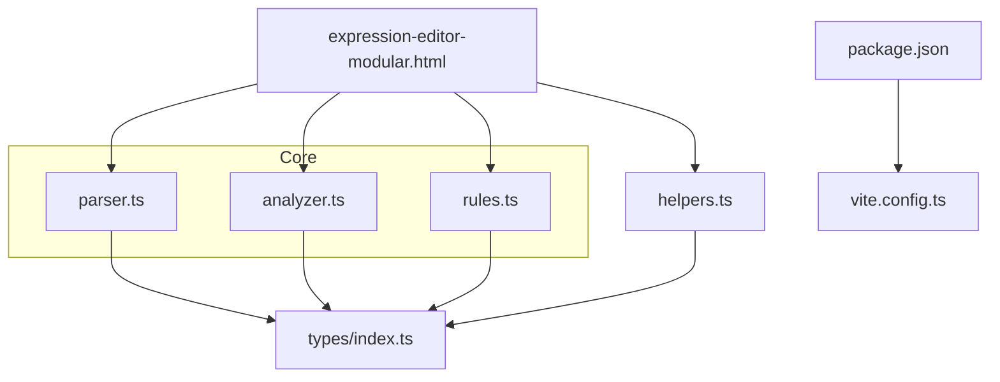
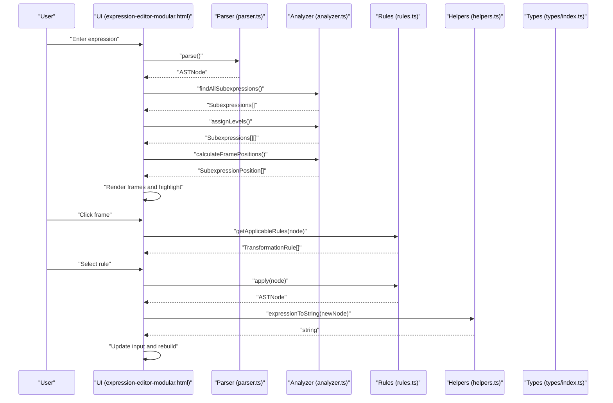
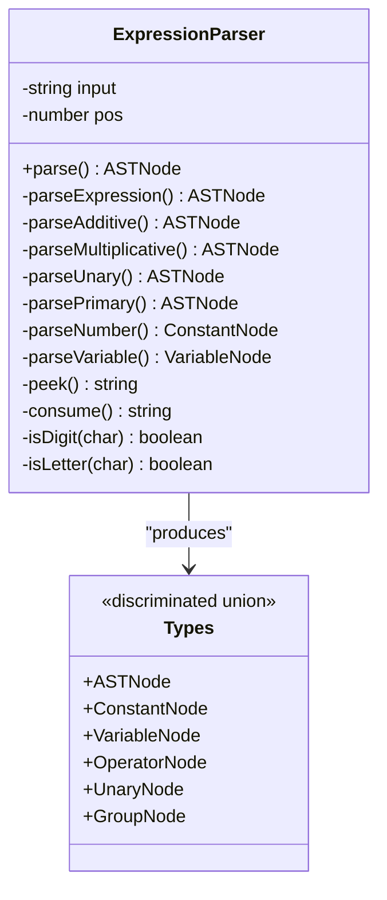
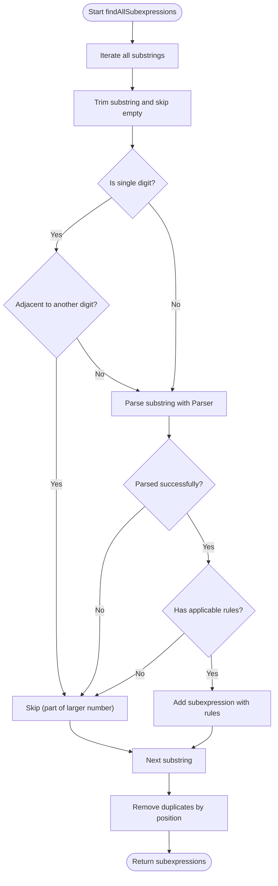
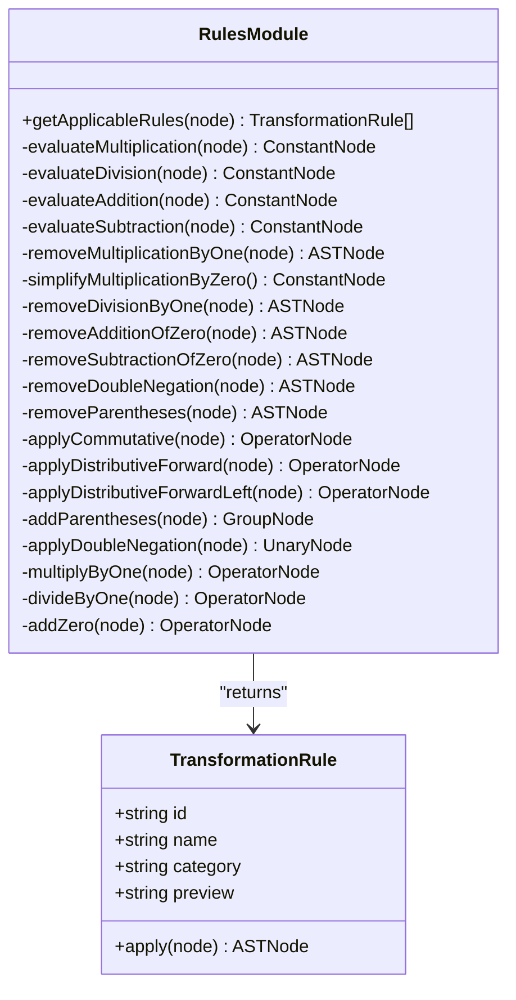
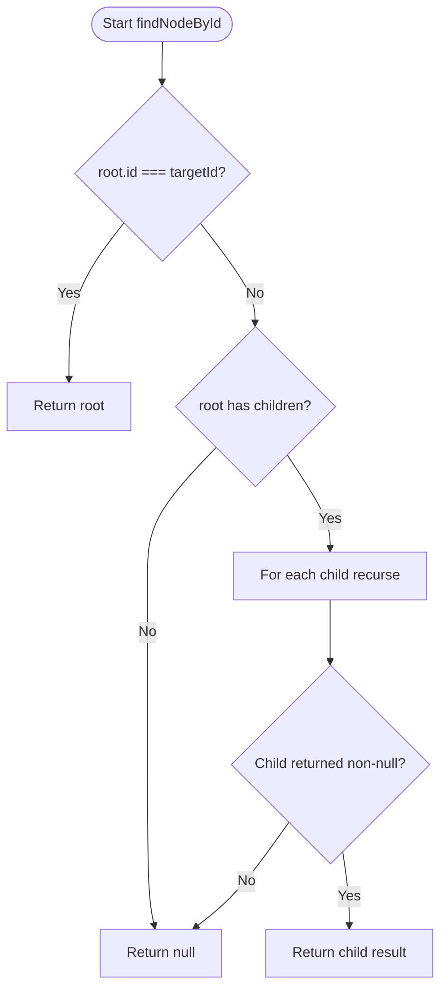
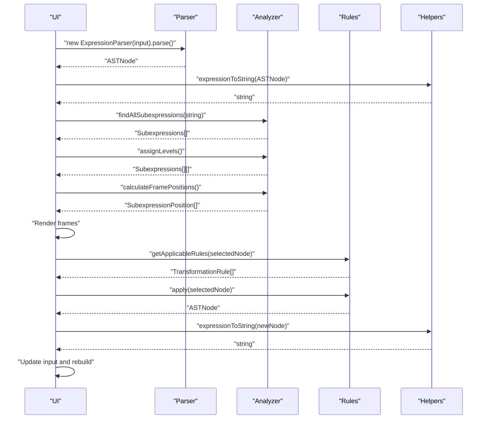
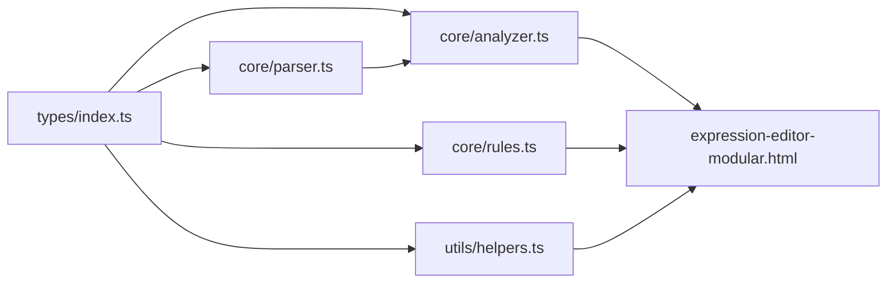
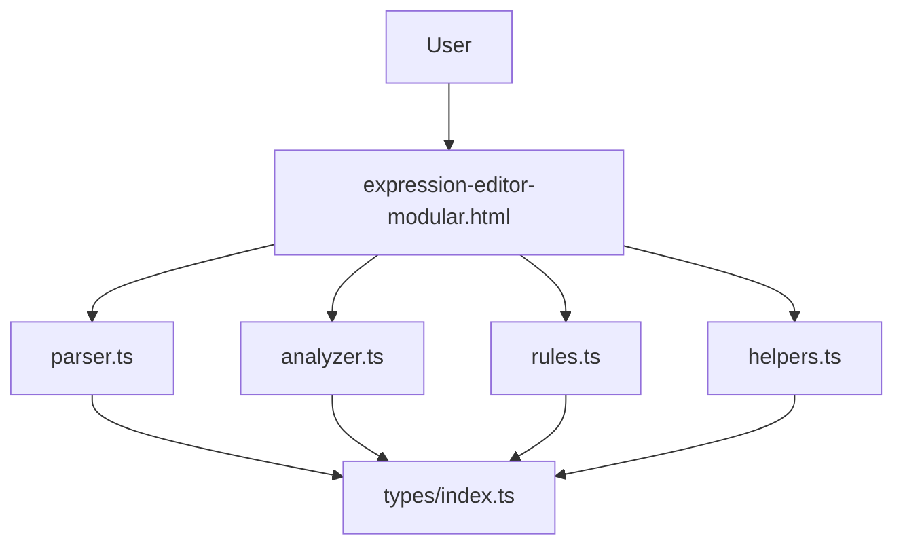

# Architecture Overview

<cite>
**Referenced Files in This Document**
- [parser.ts](file://src/core/parser.ts)
- [analyzer.ts](file://src/core/analyzer.ts)
- [rules.ts](file://src/core/rules.ts)
- [helpers.ts](file://src/utils/helpers.ts)
- [index.ts](file://src/types/index.ts)
- [expression-editor-modular.html](file://expression-editor-modular.html)
- [package.json](file://package.json)
- [vite.config.ts](file://vite.config.ts)
- [README.md](file://README.md)
- [parser.test.ts](file://src/test/parser.test.ts)
- [analyzer.test.ts](file://src/test/analyzer.test.ts)
- [rules.test.ts](file://src/test/rules.test.ts)
</cite>

## Table of Contents
1. [Introduction](#introduction)
2. [Project Structure](#project-structure)
3. [Core Components](#core-components)
4. [Architecture Overview](#architecture-overview)
5. [Detailed Component Analysis](#detailed-component-analysis)
6. [Dependency Analysis](#dependency-analysis)
7. [Performance Considerations](#performance-considerations)
8. [Troubleshooting Guide](#troubleshooting-guide)
9. [Conclusion](#conclusion)
10. [Appendices](#appendices)

## Introduction
This document describes the architecture of the MathHelper application, a modular frontend system that parses user-entered mathematical expressions into an Abstract Syntax Tree (AST), discovers valid subexpressions, computes frame positions for interactive highlighting, and applies transformation rules to the AST. The system emphasizes clear separation of concerns:
- Parsing: converts expressions into typed AST nodes
- Analysis: identifies subexpressions, assigns levels to avoid overlaps, and calculates frame geometry
- Transformation: defines and applies algebraic rules to the AST
- Utilities: provides AST manipulation helpers for cloning, traversal, and equality checks
- UI: renders the expression, frames, commands, and history using vanilla JavaScript and ES modules

Key architectural patterns observed:
- Abstract Syntax Tree (AST) with discriminated union types
- Strategy pattern for transformation rules
- Visitor-like traversal in AST utilities
- Discriminated unions for type-safe node handling

## Project Structure
The project is organized into a small, focused set of modules:
- Core modules: parser, analyzer, rules
- Utilities: helpers
- Types: shared AST and rule types
- UI: expression-editor-modular.html (single-page app)
- Tooling: Vite for dev server and build, TypeScript for type safety

**Diagram sources**
- [parser.ts](file://src/core/parser.ts#L1-L159)
- [analyzer.ts](file://src/core/analyzer.ts#L1-L182)
- [rules.ts](file://src/core/rules.ts#L1-L434)
- [helpers.ts](file://src/utils/helpers.ts#L1-L178)
- [index.ts](file://src/types/index.ts#L1-L98)
- [expression-editor-modular.html](file://expression-editor-modular.html#L490-L856)
- [package.json](file://package.json#L1-L33)
- [vite.config.ts](file://vite.config.ts#L1-L15)

**Section sources**
- [README.md](file://README.md#L42-L58)
- [package.json](file://package.json#L1-L33)
- [vite.config.ts](file://vite.config.ts#L1-L15)

## Core Components
- Parser: recursive descent parser that builds AST nodes from a string expression. It handles constants, variables, operators (+, -, *, /), unary minus, and grouping via parentheses. It enforces operator precedence and associativity.
- Analyzer: enumerates all valid subexpressions, filters out invalid substrings, attaches applicable rules, assigns levels to avoid visual overlap, and computes frame positions and total height.
- Rules: defines transformation rules categorized by priority and provides a function to select applicable rules for a given AST node. Each rule is a strategy with a name, category, preview, and an apply function.
- Helpers: provides AST utilities for string conversion, deep cloning, node lookup, node replacement, collecting leaves, counting nodes, measuring depth, structural equality, and collecting IDs.
- Types: defines AST node types, operator values, transformation rule shape, subexpression metadata, layout configuration, and history state.

**Section sources**
- [parser.ts](file://src/core/parser.ts#L1-L159)
- [analyzer.ts](file://src/core/analyzer.ts#L1-L182)
- [rules.ts](file://src/core/rules.ts#L1-L238)
- [helpers.ts](file://src/utils/helpers.ts#L1-L178)
- [index.ts](file://src/types/index.ts#L1-L98)

## Architecture Overview
The system follows a pipeline from user input to UI updates:
1. User enters an expression in the UI input field.
2. The UI builds an AST using the Parser.
3. The Analyzer finds all valid subexpressions, attaches rules, assigns levels, and computes frame geometry.
4. The UI renders frames and highlights text under the mouse.
5. When the user clicks a frame, the UI retrieves the selected node and displays available rules grouped by category.
6. Applying a rule invokes the Strategy’s apply function on the selected node, producing a new AST.
7. The UI converts the new AST to a string, updates the input, rebuilds the AST, and refreshes frames and history.

**Diagram sources**
- [expression-editor-modular.html](file://expression-editor-modular.html#L560-L761)
- [parser.ts](file://src/core/parser.ts#L27-L34)
- [analyzer.ts](file://src/core/analyzer.ts#L13-L79)
- [analyzer.ts](file://src/core/analyzer.ts#L84-L117)
- [analyzer.ts](file://src/core/analyzer.ts#L129-L149)
- [rules.ts](file://src/core/rules.ts#L12-L238)
- [helpers.ts](file://src/utils/helpers.ts#L11-L30)

## Detailed Component Analysis

### Parser: Expression to AST
- Responsibilities:
  - Tokenizes and parses expressions into AST nodes
  - Enforces grammar rules: precedence, associativity, unary minus, parentheses
  - Generates unique node IDs and resets counters between runs
- Implementation highlights:
  - Recursive descent methods for additive, multiplicative, unary, and primary constructs
  - Produces discriminated union nodes: constant, variable, operator, unary, group
  - Throws descriptive errors for malformed input

**Diagram sources**
- [parser.ts](file://src/core/parser.ts#L18-L159)
- [index.ts](file://src/types/index.ts#L1-L43)

**Section sources**
- [parser.ts](file://src/core/parser.ts#L1-L159)
- [index.ts](file://src/types/index.ts#L1-L43)
- [parser.test.ts](file://src/test/parser.test.ts#L1-L379)

### Analyzer: Subexpression Discovery and Layout
- Responsibilities:
  - Enumerate all valid subexpressions by scanning substrings
  - Filter out invalid or redundant substrings
  - Attach applicable rules to each subexpression
  - Assign levels to avoid visual overlap
  - Compute frame positions and total height
- Implementation highlights:
  - Uses a helper to compute text width for precise layout
  - Uses a simple overlap detection function to assign levels
  - Exposes a layout configuration for customization

**Diagram sources**
- [analyzer.ts](file://src/core/analyzer.ts#L13-L79)
- [rules.ts](file://src/core/rules.ts#L12-L238)

**Section sources**
- [analyzer.ts](file://src/core/analyzer.ts#L1-L182)
- [analyzer.test.ts](file://src/test/analyzer.test.ts#L1-L370)

### Rules: Transformation Strategies
- Responsibilities:
  - Define transformation rules with categories and previews
  - Provide a function to select applicable rules for a given AST node
  - Implement rule strategies for computation, simplification, transformation, rearrangement, and wrapping
- Implementation highlights:
  - Strategy pattern: each rule exposes an apply function that transforms the AST
  - Discriminated union ensures type-safe handling of node types
  - Rule IDs and categories enable UI grouping and history tracking

**Diagram sources**
- [rules.ts](file://src/core/rules.ts#L12-L238)
- [rules.ts](file://src/core/rules.ts#L240-L434)
- [index.ts](file://src/types/index.ts#L44-L62)

**Section sources**
- [rules.ts](file://src/core/rules.ts#L1-L434)
- [rules.test.ts](file://src/test/rules.test.ts#L1-L437)

### Helpers: AST Utilities
- Responsibilities:
  - Convert AST to string representation
  - Deep clone AST nodes
  - Find and replace nodes by ID
  - Collect leaves, count nodes, compute depth, compare structural equality, collect IDs
- Implementation highlights:
  - Recursive traversal for cloning, replacement, and equality checks
  - Uses discriminated union to branch on node types

**Diagram sources**
- [helpers.ts](file://src/utils/helpers.ts#L60-L99)
- [index.ts](file://src/types/index.ts#L1-L43)

**Section sources**
- [helpers.ts](file://src/utils/helpers.ts#L1-L178)

### UI Integration: Data Flow and Interactions
- Responsibilities:
  - Manage user input, build AST, render expression text and frames
  - Detect hover and click events to highlight and show commands
  - Apply transformations and update history
- Implementation highlights:
  - Uses ES modules to import core modules
  - Maintains a global history stack for undo/redo
  - Groups rules by category and shows descriptions

**Diagram sources**
- [expression-editor-modular.html](file://expression-editor-modular.html#L560-L761)
- [parser.ts](file://src/core/parser.ts#L27-L34)
- [analyzer.ts](file://src/core/analyzer.ts#L13-L79)
- [analyzer.ts](file://src/core/analyzer.ts#L84-L117)
- [analyzer.ts](file://src/core/analyzer.ts#L129-L149)
- [rules.ts](file://src/core/rules.ts#L12-L238)
- [helpers.ts](file://src/utils/helpers.ts#L11-L30)

**Section sources**
- [expression-editor-modular.html](file://expression-editor-modular.html#L490-L856)

## Dependency Analysis
- Parser depends on Types for AST node definitions.
- Analyzer depends on Parser for validating substrings and on Types for subexpression metadata.
- Rules depends on Parser for ID generation and on Types for AST node definitions.
- Helpers depends on Types for AST node definitions.
- UI imports all core modules and helpers to orchestrate the pipeline.

**Diagram sources**
- [index.ts](file://src/types/index.ts#L1-L98)
- [parser.ts](file://src/core/parser.ts#L1-L159)
- [analyzer.ts](file://src/core/analyzer.ts#L1-L182)
- [rules.ts](file://src/core/rules.ts#L1-L434)
- [helpers.ts](file://src/utils/helpers.ts#L1-L178)
- [expression-editor-modular.html](file://expression-editor-modular.html#L490-L501)

**Section sources**
- [index.ts](file://src/types/index.ts#L1-L98)
- [parser.ts](file://src/core/parser.ts#L1-L159)
- [analyzer.ts](file://src/core/analyzer.ts#L1-L182)
- [rules.ts](file://src/core/rules.ts#L1-L434)
- [helpers.ts](file://src/utils/helpers.ts#L1-L178)
- [expression-editor-modular.html](file://expression-editor-modular.html#L490-L501)

## Performance Considerations
- Subexpression enumeration in the Analyzer uses a quadratic scan over all substrings. For long expressions, this can become expensive. Consider optimizing by:
  - Early pruning invalid substrings based on operator/operand boundaries
  - Caching parsed subtrees to avoid repeated parsing
  - Limiting the maximum substring length considered
- Frame positioning relies on measuring text width. In environments without a DOM, fallbacks are used; however, repeated measurements still incur overhead. Consider:
  - Measuring once per unique text segment
  - Using approximate metrics for very long expressions
- AST transformations are lightweight but frequent during interactive editing. Ensure:
  - Minimal cloning when not necessary
  - Efficient replacement strategies for large trees

[No sources needed since this section provides general guidance]

## Troubleshooting Guide
- Parser errors:
  - Empty or whitespace-only input throws an error. Ensure the input is non-empty before parsing.
  - Mismatched parentheses or unexpected characters trigger errors. Validate input before building the AST.
- Analyzer issues:
  - Unexpectedly few or no subexpressions may indicate overly strict filtering. Verify trimming and digit adjacency logic.
  - Overlapping frames suggest incorrect level assignment. Confirm overlap detection and level assignment logic.
- Rule applicability:
  - Some rules may not apply to certain nodes (e.g., non-constant operands). Ensure the selected node matches the rule’s conditions.
- UI behavior:
  - If frames do not render, confirm that subexpressions were found and levels were assigned.
  - If clicking a frame does nothing, verify that rules were attached and the node is reachable.

**Section sources**
- [parser.ts](file://src/core/parser.ts#L27-L34)
- [analyzer.ts](file://src/core/analyzer.ts#L13-L79)
- [rules.ts](file://src/core/rules.ts#L12-L238)
- [expression-editor-modular.html](file://expression-editor-modular.html#L614-L676)

## Conclusion
MathHelper employs a clean, modular architecture centered on an AST pipeline. The Parser produces a strongly-typed AST, the Analyzer discovers and lays out subexpressions, and the Rules module applies transformation strategies. The UI integrates these modules to deliver an interactive, educational experience without external frameworks. The design leverages TypeScript’s discriminated unions and the Strategy pattern to keep logic explicit, testable, and extensible.

[No sources needed since this section summarizes without analyzing specific files]

## Appendices

### System Context Diagram

**Diagram sources**
- [expression-editor-modular.html](file://expression-editor-modular.html#L490-L856)
- [parser.ts](file://src/core/parser.ts#L1-L159)
- [analyzer.ts](file://src/core/analyzer.ts#L1-L182)
- [rules.ts](file://src/core/rules.ts#L1-L434)
- [helpers.ts](file://src/utils/helpers.ts#L1-L178)
- [index.ts](file://src/types/index.ts#L1-L98)

### Development and Build Setup
- Development server powered by Vite with hot module replacement and a configured port.
- Scripts for building, watching, testing, and previewing the application.
- Strict TypeScript configuration and optional coverage reporting.

**Section sources**
- [vite.config.ts](file://vite.config.ts#L1-L15)
- [package.json](file://package.json#L1-L33)
- [README.md](file://README.md#L144-L164)