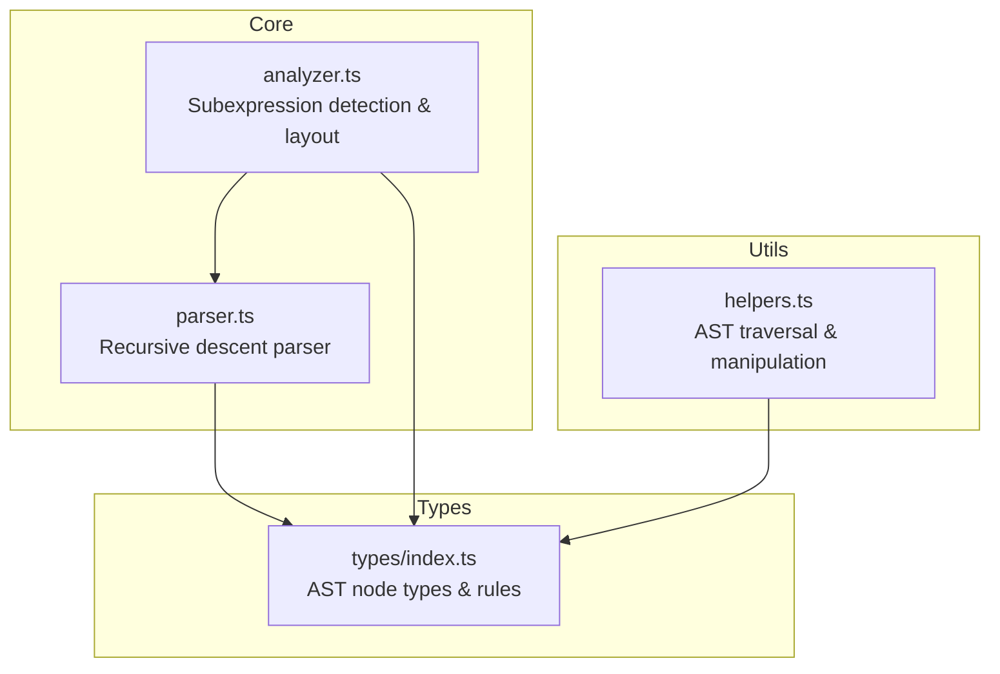
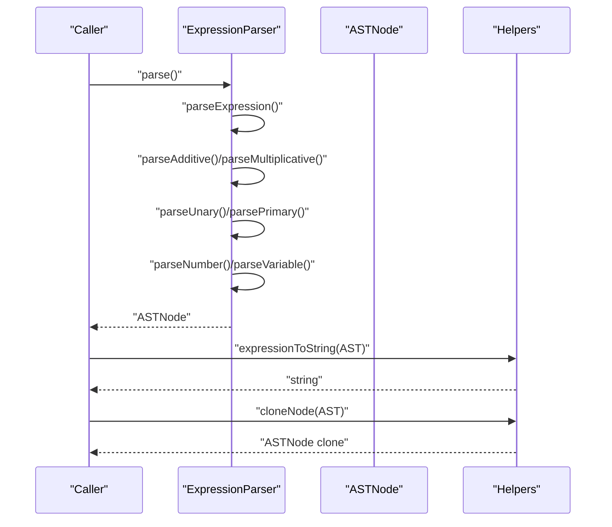
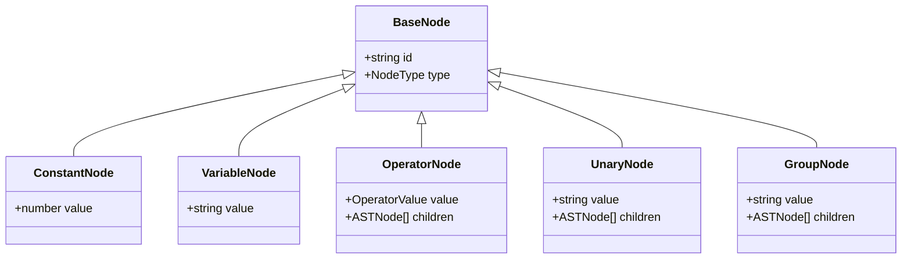
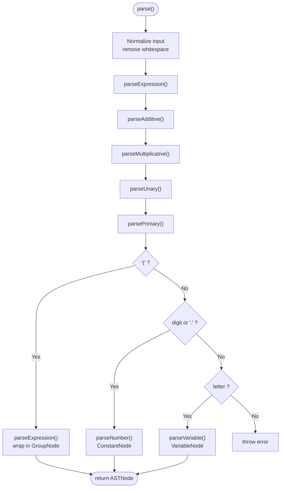
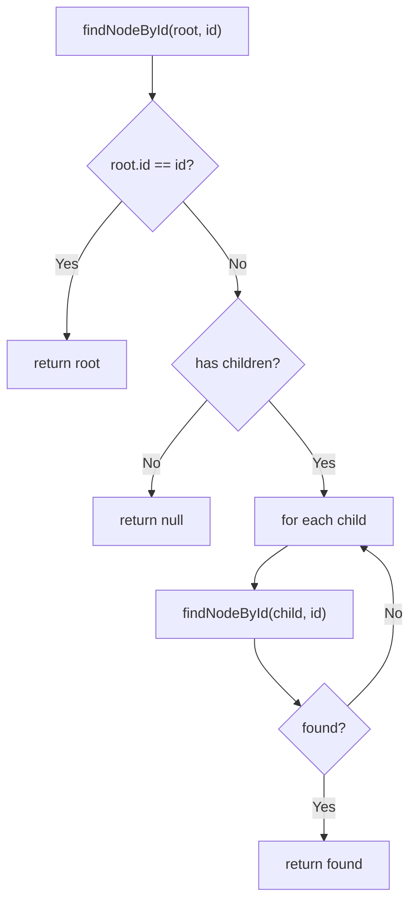
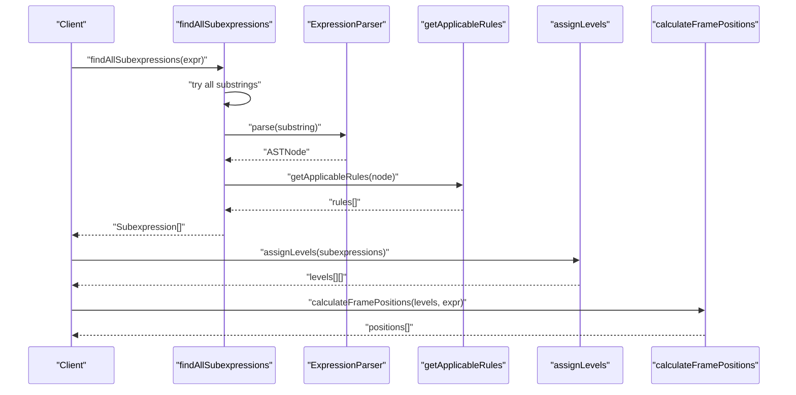
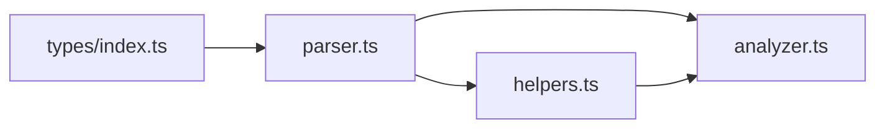

# AST Fundamentals

<cite>
**Referenced Files in This Document**
- [parser.ts](file://src/core/parser.ts)
- [types/index.ts](file://src/types/index.ts)
- [helpers.ts](file://src/utils/helpers.ts)
- [analyzer.ts](file://src/core/analyzer.ts)
- [parser.test.ts](file://src/test/parser.test.ts)
- [helpers.test.ts](file://src/test/helpers.test.ts)
- [analyzer.test.ts](file://src/test/analyzer.test.ts)
- [README.md](file://README.md)
</cite>

## Table of Contents
1. [Introduction](#introduction)
2. [Project Structure](#project-structure)
3. [Core Components](#core-components)
4. [Architecture Overview](#architecture-overview)
5. [Detailed Component Analysis](#detailed-component-analysis)
6. [Dependency Analysis](#dependency-analysis)
7. [Performance Considerations](#performance-considerations)
8. [Troubleshooting Guide](#troubleshooting-guide)
9. [Conclusion](#conclusion)

## Introduction
This section explains the Abstract Syntax Tree (AST) as the foundational data structure in MathHelper. The AST captures mathematical structure and operator precedence through hierarchical nesting. The ASTNode type is a discriminated union composed of five node kinds: ConstantNode, VariableNode, OperatorNode, UnaryNode, and GroupNode. Each node carries metadata such as id, type, and value, and OperatorNode and compound nodes include children arrays to form a tree. The parser module converts string expressions into ASTs using recursive descent parsing, respecting operator precedence and parentheses. Utility functions enable safe traversal, cloning, replacement, and inspection of ASTs.

## Project Structure
The AST and parsing logic live primarily in the core and types modules, with utilities for AST manipulation and analysis for subexpression detection.

**Diagram sources**
- [parser.ts](file://src/core/parser.ts#L1-L159)
- [types/index.ts](file://src/types/index.ts#L1-L43)
- [analyzer.ts](file://src/core/analyzer.ts#L1-L182)
- [helpers.ts](file://src/utils/helpers.ts#L1-L178)

**Section sources**
- [README.md](file://README.md#L42-L58)
- [parser.ts](file://src/core/parser.ts#L1-L159)
- [types/index.ts](file://src/types/index.ts#L1-L43)
- [analyzer.ts](file://src/core/analyzer.ts#L1-L182)
- [helpers.ts](file://src/utils/helpers.ts#L1-L178)

## Core Components
- ASTNode discriminated union: ConstantNode, VariableNode, OperatorNode, UnaryNode, GroupNode.
- BaseNode fields: id (unique identifier), type (discriminant).
- Node-specific fields:
  - ConstantNode: value number
  - VariableNode: value string
  - OperatorNode: value operator (+, -, *, /), children [left, right]
  - UnaryNode: value "-", children [operand]
  - GroupNode: value "group", children [subexpression]
- Parser: ExpressionParser with recursive descent methods parseExpression → parseAdditive → parseMultiplicative → parseUnary → parsePrimary → parseNumber/parseVariable, building AST nodes and preserving precedence.
- Utilities: expressionToString, cloneNode, findNodeById, replaceNode, getLeafNodes, countNodes, getDepth, getAllNodeIds.

**Section sources**
- [types/index.ts](file://src/types/index.ts#L1-L43)
- [parser.ts](file://src/core/parser.ts#L18-L159)
- [helpers.ts](file://src/utils/helpers.ts#L1-L178)

## Architecture Overview
The AST is produced by the parser and consumed by analyzers and utilities for visualization and transformation.

**Diagram sources**
- [parser.ts](file://src/core/parser.ts#L27-L159)
- [helpers.ts](file://src/utils/helpers.ts#L11-L57)

## Detailed Component Analysis

### ASTNode Types and Structure
ASTNode is a discriminated union with five variants. Each variant extends BaseNode with a type discriminant and node-specific fields. The union enables exhaustive pattern matching and safe type narrowing.

**Diagram sources**
- [types/index.ts](file://src/types/index.ts#L9-L43)

**Section sources**
- [types/index.ts](file://src/types/index.ts#L1-L43)

### Recursive Descent Parser and Precedence
The parser builds ASTs by descending into additive and multiplicative expressions, enforcing operator precedence and associativity. Unary minus and grouping are handled before primary tokens (numbers and variables).

**Diagram sources**
- [parser.ts](file://src/core/parser.ts#L27-L159)

**Section sources**
- [parser.ts](file://src/core/parser.ts#L27-L159)
- [parser.test.ts](file://src/test/parser.test.ts#L125-L170)

### AST Representations: Examples
Below are conceptual AST diagrams for representative expressions. These illustrate how hierarchical nesting encodes operator precedence and grouping.

- Expression: "2*(a+b)"
  - Root: OperatorNode "*" with children:
    - Left: ConstantNode "2"
    - Right: GroupNode containing OperatorNode "+" with children "a" and "b"

- Expression: "3a+5"
  - Root: OperatorNode "+" with children:
    - Left: OperatorNode "*" with children "3" and "a"
    - Right: ConstantNode "5"

These diagrams reflect the parser’s precedence rules and implicit multiplication handling.

**Section sources**
- [parser.test.ts](file://src/test/parser.test.ts#L355-L378)
- [README.md](file://README.md#L139-L142)

### Utility Functions for Safe AST Traversal and Manipulation
Utilities support robust AST operations:
- expressionToString: Converts AST back to a readable string, respecting precedence and grouping.
- cloneNode: Deep clones an AST, preserving structure and node identities.
- findNodeById: Searches the tree by node id.
- replaceNode: Replaces a node by id while preserving tree shape.
- getLeafNodes, countNodes, getDepth, getAllNodeIds: Inspect and analyze tree structure.

**Diagram sources**
- [helpers.ts](file://src/utils/helpers.ts#L62-L73)

**Section sources**
- [helpers.ts](file://src/utils/helpers.ts#L11-L178)
- [helpers.test.ts](file://src/test/helpers.test.ts#L191-L249)

### Subexpression Detection and Layout (Analyzer)
The analyzer builds on the parser to discover all valid subexpressions, attaches applicable transformation rules, assigns levels to avoid visual overlap, and computes frame positions.

**Diagram sources**
- [analyzer.ts](file://src/core/analyzer.ts#L13-L79)
- [analyzer.ts](file://src/core/analyzer.ts#L81-L117)
- [analyzer.ts](file://src/core/analyzer.ts#L119-L182)

**Section sources**
- [analyzer.ts](file://src/core/analyzer.ts#L1-L182)
- [analyzer.test.ts](file://src/test/analyzer.test.ts#L1-L124)

## Dependency Analysis
The AST types define the node contract; the parser constructs ASTs; utilities operate on ASTs; analyzer composes parser and utilities to drive UI features.

**Diagram sources**
- [types/index.ts](file://src/types/index.ts#L1-L43)
- [parser.ts](file://src/core/parser.ts#L1-L159)
- [helpers.ts](file://src/utils/helpers.ts#L1-L178)
- [analyzer.ts](file://src/core/analyzer.ts#L1-L182)

**Section sources**
- [types/index.ts](file://src/types/index.ts#L1-L43)
- [parser.ts](file://src/core/parser.ts#L1-L159)
- [helpers.ts](file://src/utils/helpers.ts#L1-L178)
- [analyzer.ts](file://src/core/analyzer.ts#L1-L182)

## Performance Considerations
- Parsing complexity: The recursive descent parser runs in linear time relative to input length, with constant-time token recognition per character.
- AST traversal: Utilities like countNodes and getDepth traverse the tree once, O(n) time.
- Subexpression detection: The analyzer enumerates substrings and parses each candidate, which can be quadratic in input length. Tests demonstrate coverage of complex expressions, but performance scales with expression length and number of valid subexpressions.

[No sources needed since this section provides general guidance]

## Troubleshooting Guide
Common issues and resolutions:
- Unexpected character errors: The parser throws on invalid characters or malformed parentheses. Ensure input contains only supported tokens and balanced parentheses.
- Empty or whitespace-only input: The parser rejects empty expressions. Provide a valid expression string.
- Operator misuse: Starting with an operator (other than unary minus) or placing operators incorrectly triggers errors. Verify operator placement and spacing.
- Multi-digit numbers and decimals: The parser recognizes sequences of digits and decimal points as single constants. Leading zeros are parsed as numbers; tests confirm correct behavior.
- Implicit multiplication: The parser treats adjacent identifiers/parentheses as multiplication in the grammar. Tests demonstrate mixed constants and variables in expressions.

Validation references:
- Parser error handling and precedence tests
- Helper function correctness for traversal and replacement
- Analyzer behavior for subexpressions and layout

**Section sources**
- [parser.test.ts](file://src/test/parser.test.ts#L250-L313)
- [parser.test.ts](file://src/test/parser.test.ts#L355-L379)
- [helpers.test.ts](file://src/test/helpers.test.ts#L135-L189)
- [analyzer.test.ts](file://src/test/analyzer.test.ts#L1-L124)

## Conclusion
The AST is central to MathHelper’s architecture. The discriminated union ASTNode cleanly models constants, variables, operators, unary minus, and grouping. The recursive descent parser enforces operator precedence and parentheses, while utilities provide safe, functional manipulation of ASTs. Together, these components power subexpression detection, visual layout, and interactive transformations.

[No sources needed since this section summarizes without analyzing specific files]