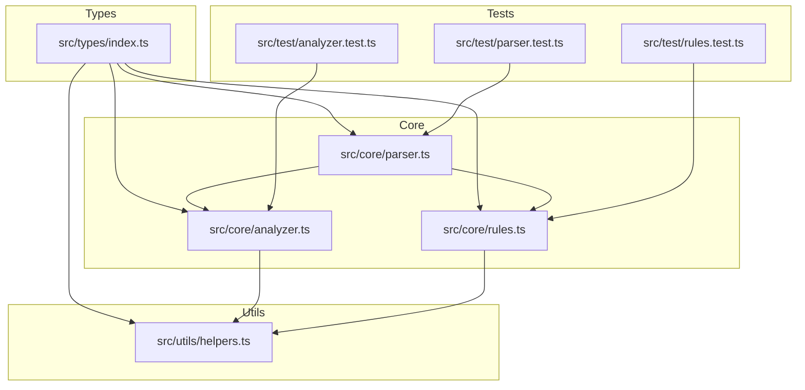
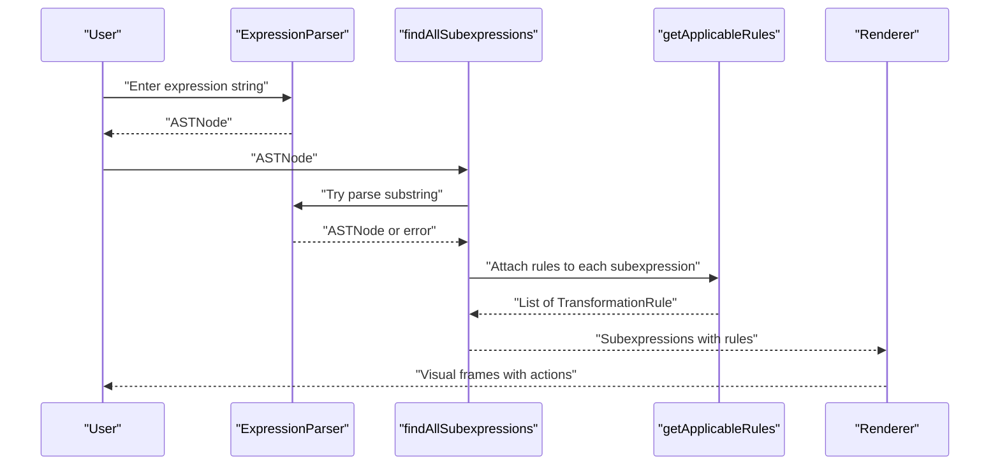
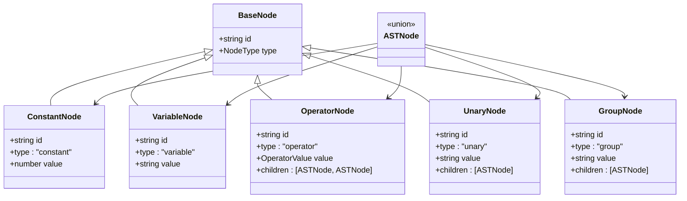
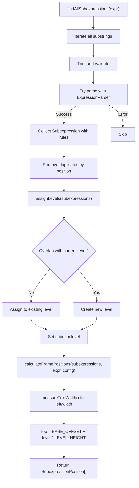
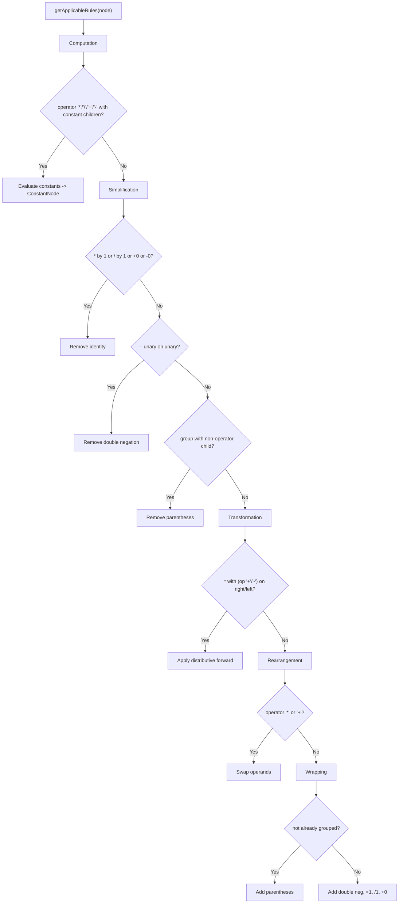
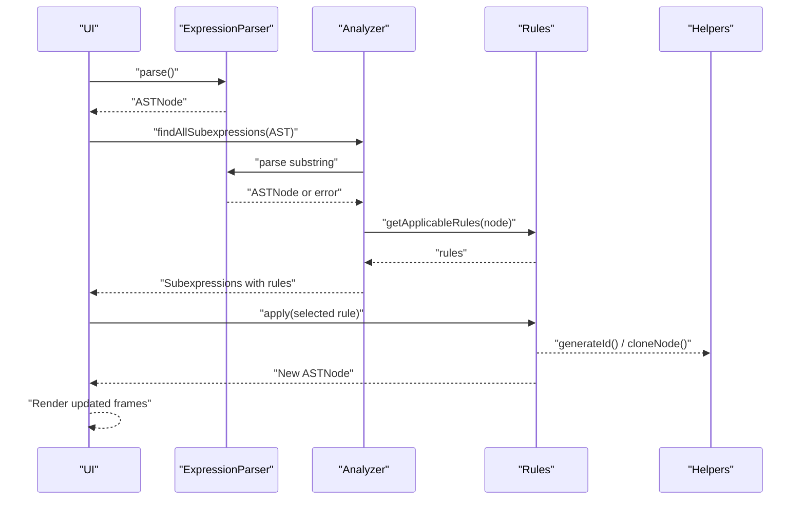
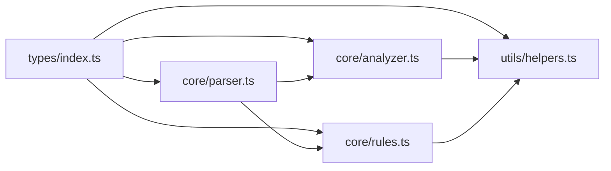

# Core Concepts

<cite>
**Referenced Files in This Document**
- [README.md](file://README.md)
- [src/types/index.ts](file://src/types/index.ts)
- [src/core/parser.ts](file://src/core/parser.ts)
- [src/core/analyzer.ts](file://src/core/analyzer.ts)
- [src/core/rules.ts](file://src/core/rules.ts)
- [src/utils/helpers.ts](file://src/utils/helpers.ts)
- [src/test/parser.test.ts](file://src/test/parser.test.ts)
- [src/test/analyzer.test.ts](file://src/test/analyzer.test.ts)
- [src/test/rules.test.ts](file://src/test/rules.test.ts)
</cite>

## Table of Contents
1. [Introduction](#introduction)
2. [Project Structure](#project-structure)
3. [Core Components](#core-components)
4. [Architecture Overview](#architecture-overview)
5. [Detailed Component Analysis](#detailed-component-analysis)
6. [Dependency Analysis](#dependency-analysis)
7. [Performance Considerations](#performance-considerations)
8. [Troubleshooting Guide](#troubleshooting-guide)
9. [Conclusion](#conclusion)

## Introduction
This section explains the foundational concepts behind the MathHelper application: Abstract Syntax Trees (AST) as the core representation of mathematical expressions, recursive descent parsing that builds ASTs from strings while enforcing operator precedence and parentheses, subexpression analysis for visual layout, and transformation rules that operate on AST nodes. These concepts are implemented using TypeScript discriminated unions for type safety and are validated by comprehensive tests.

Prerequisite knowledge:
- Algebra basics: order of operations, parentheses, identity elements, and basic properties (commutative, distributive).
- TypeScript fundamentals: discriminated unions, interfaces, generics, and module imports.

## Project Structure
The core logic is organized around three pillars:
- Types: Define AST node shapes and transformation rule contracts.
- Parser: Converts strings into ASTs using recursive descent.
- Analyzer: Discovers subexpressions, assigns levels, and computes frame positions.
- Rules: Define transformation categories and applicability conditions.
- Utilities: Provide AST traversal and formatting helpers.



**Diagram sources**
- [src/types/index.ts](file://src/types/index.ts#L1-L98)
- [src/core/parser.ts](file://src/core/parser.ts#L1-L159)
- [src/core/analyzer.ts](file://src/core/analyzer.ts#L1-L182)
- [src/core/rules.ts](file://src/core/rules.ts#L1-L434)
- [src/utils/helpers.ts](file://src/utils/helpers.ts#L1-L178)
- [src/test/parser.test.ts](file://src/test/parser.test.ts#L1-L379)
- [src/test/analyzer.test.ts](file://src/test/analyzer.test.ts#L1-L370)
- [src/test/rules.test.ts](file://src/test/rules.test.ts#L1-L437)

**Section sources**
- [README.md](file://README.md#L42-L58)

## Core Components
- AST Node Types: Discriminated union of constant, variable, operator, unary, and group nodes with a shared base shape and unique discriminators.
- Transformation Rules: Typed rule objects with category, preview, and an apply function that transforms AST nodes.
- Subexpression Model: Captures text spans, positions, levels, and applicable rules for visual framing.

Key type definitions and contracts are declared in the types module and consumed by parser, analyzer, and rules.

**Section sources**
- [src/types/index.ts](file://src/types/index.ts#L1-L98)

## Architecture Overview
The data flow from input to transformation:
1. Input string is parsed into an AST using recursive descent.
2. Subexpressions are discovered across all contiguous substrings, filtered to valid expressions, and paired with applicable transformation rules.
3. Levels are assigned to avoid visual overlap, and frame positions are computed for rendering.
4. Transformation rules are applied to produce new ASTs, tracked in history.



**Diagram sources**
- [src/core/parser.ts](file://src/core/parser.ts#L1-L159)
- [src/core/analyzer.ts](file://src/core/analyzer.ts#L1-L182)
- [src/core/rules.ts](file://src/core/rules.ts#L1-L238)

## Detailed Component Analysis

### Abstract Syntax Trees (AST) and Discriminated Unions
- AST nodes are modeled as a discriminated union with a shared base containing an identifier and type discriminator. Each variant adds its own payload (e.g., value for constants/variables/unary/group; value and children for operators).
- This design ensures exhaustive pattern matching and safe field access in TypeScript, preventing runtime errors when traversing or transforming expressions.



**Diagram sources**
- [src/types/index.ts](file://src/types/index.ts#L1-L43)

**Section sources**
- [src/types/index.ts](file://src/types/index.ts#L1-L43)

### Recursive Descent Parsing and Operator Precedence
- The parser uses a classic recursive descent approach with separate methods for additive, multiplicative, unary, and primary expressions.
- Operator precedence is enforced by calling multiplicative before additive, and unary before primary, ensuring that higher-precedence operations bind more tightly.
- Parentheses override precedence by forcing evaluation of subexpressions first.
- The parser trims whitespace from input and validates balanced parentheses and valid tokens.

```mermaid
flowchart TD
Start(["parse()"]) --> Trim["Normalize input<br/>remove whitespace"]
Trim --> Expr["parseExpression()"]
Expr --> Add["parseAdditive()"]
Add --> Mul["parseMultiplicative()"]
Mul --> Unary["parseUnary()"]
Unary --> Prim["parsePrimary()"]
Prim --> CheckParen{"(" ?"}
CheckParen --> |Yes| ConsumeLP["consume '('"] --> Recurse["parseExpression()"] --> CheckRP{")" ?}
CheckRP --> |Yes| ConsumeRP["consume ')'"] --> Group["create GroupNode"]
CheckRP --> |No| ErrorRP["throw Missing closing parenthesis"]
Prim --> Digit{"digit?"}
Digit --> |Yes| Num["parseNumber() -> ConstantNode"]
Digit --> |No| Letter{"letter?"}
Letter --> |Yes| Var["parseVariable() -> VariableNode"]
Letter --> |No| ErrorChar["throw Unexpected character"]
Group --> Done(["return GroupNode"])
Num --> Done
Var --> Done
```

**Diagram sources**
- [src/core/parser.ts](file://src/core/parser.ts#L1-L159)

**Section sources**
- [src/core/parser.ts](file://src/core/parser.ts#L1-L159)
- [src/test/parser.test.ts](file://src/test/parser.test.ts#L125-L170)
- [src/test/parser.test.ts](file://src/test/parser.test.ts#L172-L210)
- [src/test/parser.test.ts](file://src/test/parser.test.ts#L212-L248)

### Subexpression Analysis: Detection, Level Assignment, and Position Calculation
- Detection: The analyzer scans all contiguous substrings, trims whitespace, skips digits embedded in larger numbers, and attempts to parse each candidate. Only valid expressions are retained and paired with applicable rules.
- Level assignment: Overlapping ranges are detected and assigned to non-conflicting levels to prevent visual overlap in the UI.
- Position calculation: Text width is measured using a monospace font, and top offsets are computed based on levels and a configurable height step.



**Diagram sources**
- [src/core/analyzer.ts](file://src/core/analyzer.ts#L1-L182)
- [src/utils/helpers.ts](file://src/utils/helpers.ts#L1-L31)

**Section sources**
- [src/core/analyzer.ts](file://src/core/analyzer.ts#L1-L182)
- [src/test/analyzer.test.ts](file://src/test/analyzer.test.ts#L1-L124)
- [src/test/analyzer.test.ts](file://src/test/analyzer.test.ts#L151-L214)
- [src/test/analyzer.test.ts](file://src/test/analyzer.test.ts#L216-L291)
- [src/test/analyzer.test.ts](file://src/test/analyzer.test.ts#L293-L332)

### Transformation Rules: Categories, Conditions, and Effects
- Categories: Computation, Simplification, Transformation, Rearrangement, and Wrapping. Each rule has a category and a human-readable preview.
- Applicability: Rules are determined by inspecting node types and child values. For example:
  - Computation evaluates numeric operations when both children are constants.
  - Simplification removes identities (×1, +0, etc.), removes double negation, and strips unnecessary parentheses.
  - Transformation applies distributive expansion when appropriate.
  - Rearrangement swaps operands for commutative operations.
  - Wrapping adds parentheses, double negatives, or identity operations.
- Effects: Each rule’s apply function returns a new AST node or a transformed subtree, preserving identifiers and generating fresh ones as needed.



**Diagram sources**
- [src/core/rules.ts](file://src/core/rules.ts#L1-L238)

**Section sources**
- [src/core/rules.ts](file://src/core/rules.ts#L1-L238)
- [src/test/rules.test.ts](file://src/test/rules.test.ts#L1-L78)
- [src/test/rules.test.ts](file://src/test/rules.test.ts#L80-L206)
- [src/test/rules.test.ts](file://src/test/rules.test.ts#L208-L237)
- [src/test/rules.test.ts](file://src/test/rules.test.ts#L239-L285)
- [src/test/rules.test.ts](file://src/test/rules.test.ts#L287-L366)

### Data Flow From Input to Transformation
- Input string is parsed into an AST.
- Subexpressions are extracted and paired with applicable rules.
- Levels are assigned and positions computed for rendering.
- When a user selects a rule, the apply function produces a transformed AST, which replaces the original node and updates the UI.



**Diagram sources**
- [src/core/parser.ts](file://src/core/parser.ts#L1-L159)
- [src/core/analyzer.ts](file://src/core/analyzer.ts#L1-L182)
- [src/core/rules.ts](file://src/core/rules.ts#L1-L434)
- [src/utils/helpers.ts](file://src/utils/helpers.ts#L1-L178)

**Section sources**
- [src/core/parser.ts](file://src/core/parser.ts#L1-L159)
- [src/core/analyzer.ts](file://src/core/analyzer.ts#L1-L182)
- [src/core/rules.ts](file://src/core/rules.ts#L1-L434)
- [src/utils/helpers.ts](file://src/utils/helpers.ts#L1-L178)

## Dependency Analysis
- Types are imported by parser, analyzer, rules, and utilities, forming the backbone contract for AST nodes and rules.
- Parser depends on types and generates AST nodes; it also uses a helper to generate unique IDs.
- Analyzer depends on parser to validate subexpressions and on rules to attach applicability metadata.
- Rules depend on types and parser’s ID generator to construct new nodes safely.
- Utilities provide shared AST operations used across the system.



**Diagram sources**
- [src/types/index.ts](file://src/types/index.ts#L1-L98)
- [src/core/parser.ts](file://src/core/parser.ts#L1-L159)
- [src/core/analyzer.ts](file://src/core/analyzer.ts#L1-L182)
- [src/core/rules.ts](file://src/core/rules.ts#L1-L434)
- [src/utils/helpers.ts](file://src/utils/helpers.ts#L1-L178)

**Section sources**
- [src/types/index.ts](file://src/types/index.ts#L1-L98)
- [src/core/parser.ts](file://src/core/parser.ts#L1-L159)
- [src/core/analyzer.ts](file://src/core/analyzer.ts#L1-L182)
- [src/core/rules.ts](file://src/core/rules.ts#L1-L434)
- [src/utils/helpers.ts](file://src/utils/helpers.ts#L1-L178)

## Performance Considerations
- Subexpression detection enumerates all substrings, which is O(n^3) in the worst case due to substring generation, validation, and rule attachment. This is acceptable for typical educational expressions but should be considered for very long inputs.
- Level assignment and overlap checks are O(k^2) for k subexpressions, manageable for small to medium expressions.
- Parsing itself is linear in input length, with constant-time token recognition and recursion depth bounded by nesting.

[No sources needed since this section provides general guidance]

## Troubleshooting Guide
Common issues and where they arise:
- Unexpected character or missing closing parenthesis during parsing indicate malformed input or incorrect operator usage.
- Empty or whitespace-only input throws an error early in parsing.
- Overlapping subexpressions can cause visual clutter; ensure parentheses are used to disambiguate intended scopes.
- Applying rules to incompatible nodes (e.g., commutative on non-commutative operators) yields no applicable rules.

Validation references:
- Parser error handling and precedence tests confirm expected behavior.
- Analyzer tests verify overlap detection and layout calculations.
- Rules tests confirm applicability conditions and transformation outcomes.

**Section sources**
- [src/test/parser.test.ts](file://src/test/parser.test.ts#L250-L313)
- [src/test/analyzer.test.ts](file://src/test/analyzer.test.ts#L125-L149)
- [src/test/analyzer.test.ts](file://src/test/analyzer.test.ts#L182-L197)
- [src/test/rules.test.ts](file://src/test/rules.test.ts#L239-L285)

## Conclusion
MathHelper’s core relies on a robust AST built via recursive descent parsing, a type-safe discriminated union model, and a layered pipeline of subexpression discovery, layout, and transformation rules. Together, these components enable interactive, algebraically grounded editing with clear visual feedback and predictable behavior.

[No sources needed since this section summarizes without analyzing specific files]