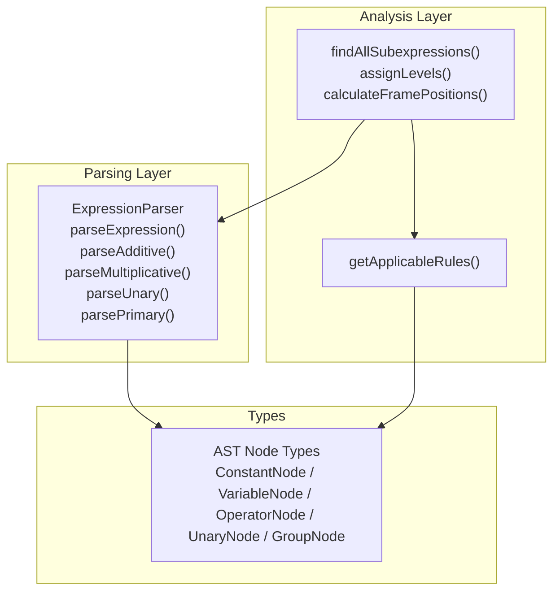
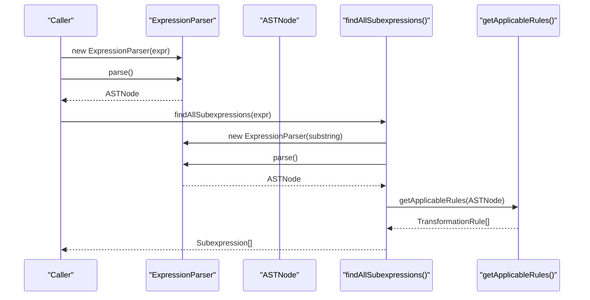
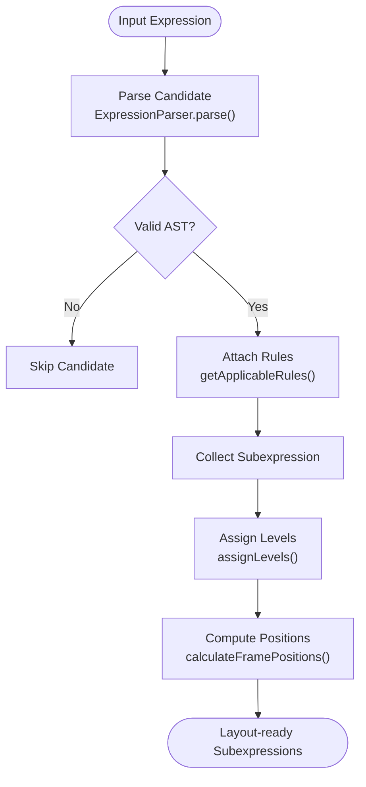
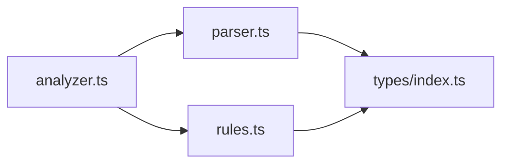

# Expression Parsing

<cite>
**Referenced Files in This Document**
- [parser.ts](file://src/core/parser.ts)
- [analyzer.ts](file://src/core/analyzer.ts)
- [rules.ts](file://src/core/rules.ts)
- [index.ts](file://src/types/index.ts)
- [parser.test.ts](file://src/test/parser.test.ts)
- [tokenizer.ts](file://src/utils/tokenizer.ts)
</cite>

## Table of Contents
1. [Introduction](#introduction)
2. [Project Structure](#project-structure)
3. [Core Components](#core-components)
4. [Architecture Overview](#architecture-overview)
5. [Detailed Component Analysis](#detailed-component-analysis)
6. [Dependency Analysis](#dependency-analysis)
7. [Performance Considerations](#performance-considerations)
8. [Troubleshooting Guide](#troubleshooting-guide)
9. [Conclusion](#conclusion)

## Introduction
This document explains the recursive descent parsing implementation used to convert mathematical expressions into an Abstract Syntax Tree (AST). It focuses on the ExpressionParser class and its methods parseExpression, parseAdditive, parseMultiplicative, and parsePrimary. It covers operator precedence, left-associativity, parentheses, unary minus, tokenization behavior, error handling, and the relationship between parsing and subsequent analysis phases. It also addresses common parsing challenges such as whitespace and multi-digit numbers, and outlines performance considerations for large expressions.

## Project Structure
The parsing pipeline centers around a small set of modules:
- parser.ts: Recursive descent parser that builds an AST from a string expression.
- analyzer.ts: Uses the parser to discover valid subexpressions and prepares them for layout and transformation.
- rules.ts: Provides transformation rules that operate on the AST produced by the parser.
- index.ts: Defines AST node types and shared interfaces.
- parser.test.ts: Comprehensive tests demonstrating precedence, parentheses, unary minus, and error conditions.
- tokenizer.ts: Separate tokenizer module (used elsewhere in the project) that illustrates how implicit multiplication would be handled conceptually.

**Diagram sources**
- [parser.ts](file://src/core/parser.ts#L18-L159)
- [analyzer.ts](file://src/core/analyzer.ts#L13-L79)
- [rules.ts](file://src/core/rules.ts#L12-L238)
- [index.ts](file://src/types/index.ts#L5-L43)

**Section sources**
- [parser.ts](file://src/core/parser.ts#L18-L159)
- [analyzer.ts](file://src/core/analyzer.ts#L13-L79)
- [rules.ts](file://src/core/rules.ts#L12-L238)
- [index.ts](file://src/types/index.ts#L5-L43)

## Core Components
- ExpressionParser: A recursive descent parser that consumes a string and produces an AST. It removes whitespace during construction and advances through the input using peek and consume helpers. It enforces grammar rules for additive, multiplicative, unary, grouping, numbers, and variables.
- AST Node Types: Strongly typed nodes for constants, variables, operators, unary minus, and grouping.
- Analyzer: Iterates over substrings of an expression, validates them with the parser, collects valid subexpressions, attaches applicable transformation rules, and computes layout metadata.
- Rules: A rule engine that evaluates applicability of transformations based on node types and values.

Key responsibilities:
- Parsing: Convert string to AST respecting operator precedence and associativity.
- Validation: Detect invalid expressions and report precise errors.
- Discovery: Provide a mechanism to find all valid subexpressions for educational visualization and step-by-step transformations.
- Transformation: Offer rules that can rewrite or simplify parts of the AST.

**Section sources**
- [parser.ts](file://src/core/parser.ts#L18-L159)
- [index.ts](file://src/types/index.ts#L5-L43)
- [analyzer.ts](file://src/core/analyzer.ts#L13-L79)
- [rules.ts](file://src/core/rules.ts#L12-L238)

## Architecture Overview
The parsing and analysis flow:

**Diagram sources**
- [parser.ts](file://src/core/parser.ts#L27-L34)
- [analyzer.ts](file://src/core/analyzer.ts#L13-L79)
- [rules.ts](file://src/core/rules.ts#L12-L238)

## Detailed Component Analysis

### ExpressionParser: Recursive Descent Implementation
The parser implements a classic LL(1)-style recursive descent with explicit precedence and associativity handling:
- parseExpression delegates to parseAdditive.
- parseAdditive parses multiplicative terms and chains additions/subtractions left-associatively.
- parseMultiplicative parses unary factors and chains multiplication/division left-associatively.
- parseUnary recognizes unary minus and recurses into parsePrimary.
- parsePrimary recognizes parentheses, numbers, and variables; otherwise throws on unexpected characters.

Tokenization behavior:
- Whitespace is removed during construction, so the parser operates on a compacted input stream.
- Numbers are recognized as sequences of digits and dots.
- Variables are recognized as sequences of letters.
- Parentheses trigger a recursive parseExpression inside the group.

Operator precedence and associativity:
- Multiplicative operators bind tighter than additive operators.
- Both precedence levels are left-associative; chains are folded leftward.

Unary minus:
- Unary minus is recognized when the next token is a minus sign and the context allows it (e.g., at the start or after an operator or open parenthesis).

Error handling:
- Throws on empty input.
- Throws on unmatched parentheses.
- Throws on unexpected characters.
- Throws on incomplete expressions (e.g., trailing operators).

Examples from tests:
- Precedence: '2 + 3 * 4' parses as an addition whose right-hand side is a multiplication.
- Left-associativity: '10 - 5 - 2' parses as '(10 - 5) - 2'.
- Parentheses override precedence: '(2 + 3) * 4' wraps the addition in a group.
- Unary minus: '-5' produces a unary node wrapping a constant.
- Error cases: empty input, unmatched parentheses, invalid characters, and incomplete expressions.

**Section sources**
- [parser.ts](file://src/core/parser.ts#L27-L159)
- [parser.test.ts](file://src/test/parser.test.ts#L125-L170)
- [parser.test.ts](file://src/test/parser.test.ts#L172-L210)
- [parser.test.ts](file://src/test/parser.test.ts#L212-L248)
- [parser.test.ts](file://src/test/parser.test.ts#L250-L313)

### AST Node Types
The AST is composed of strongly typed nodes:
- ConstantNode: numeric constants.
- VariableNode: symbolic identifiers.
- OperatorNode: binary operators with exactly two children.
- UnaryNode: unary minus with exactly one child.
- GroupNode: parentheses grouping with exactly one child.

These types are used throughout the analyzer and rules modules to drive transformations and layout.

**Section sources**
- [index.ts](file://src/types/index.ts#L5-L43)

### Analyzer: Subexpression Discovery and Layout
The analyzer:
- Enumerates all contiguous substrings of the input expression.
- Strips whitespace from each candidate to ensure exact positions.
- Skips substrings that are whitespace-only or partial digits of larger numbers.
- Validates candidates by constructing an ExpressionParser and calling parse().
- Collects only those that produce a valid AST and have at least one applicable rule.
- Assigns levels to avoid overlapping frames and computes frame positions.

This stage depends on the parser to validate candidates and on the rules module to attach transformation metadata.

**Section sources**
- [analyzer.ts](file://src/core/analyzer.ts#L13-L79)
- [analyzer.ts](file://src/core/analyzer.ts#L81-L117)
- [analyzer.ts](file://src/core/analyzer.ts#L119-L182)
- [rules.ts](file://src/core/rules.ts#L12-L238)

### Rules: Transformation Engine
The rules module enumerates applicable transformations based on node shape and values:
- Priority 1: Computation of constant arithmetic.
- Priority 2: Simplifications (e.g., removing multiplication by 1, removing division by 1, removing addition of 0).
- Priority 3: Transformations (e.g., distributive expansion).
- Priority 4: Rearrangements (e.g., commutative swaps).
- Priority 5: Wrappings (e.g., adding parentheses, multiplying by 1, adding zero).

These rules operate on the AST produced by the parser and are used by the analyzer to annotate subexpressions with actionable steps.

**Section sources**
- [rules.ts](file://src/core/rules.ts#L12-L238)

### Tokenization Behavior and Implicit Multiplication
The current parser does not implement implicit multiplication (e.g., recognizing 'ab' as 'a*b'). Instead:
- Variables are recognized as sequences of letters.
- Operators are explicit ('*' and '/' are supported).
- The separate tokenizer module demonstrates how implicit multiplication could be represented conceptually (e.g., inserting an operator token between adjacent variables or parenthesized expressions), but this is not active in the current parser.

Practical implications:
- Expressions like 'ab' are treated as a single variable name, not as multiplication.
- To support implicit multiplication, a tokenizer would need to insert multiplication operators between adjacent tokens that resolve to expressions that can be multiplied.

**Section sources**
- [parser.ts](file://src/core/parser.ts#L108-L141)
- [tokenizer.ts](file://src/utils/tokenizer.ts#L23-L101)

### Handling Whitespace and Multi-digit Numbers
- Whitespace removal: The parser removes all whitespace during construction, simplifying lookahead and reducing ambiguity.
- Multi-digit numbers: Numbers are recognized as sequences of digits and dots, enabling decimals and multi-digit integers.
- Variable names: Sequences of letters form variable names, including multi-character identifiers.

These behaviors are validated by tests covering digits, decimals, and variable names.

**Section sources**
- [parser.ts](file://src/core/parser.ts#L23-L25)
- [parser.ts](file://src/core/parser.ts#L108-L141)
- [parser.test.ts](file://src/test/parser.test.ts#L11-L39)
- [parser.test.ts](file://src/test/parser.test.ts#L110-L123)

### Relationship Between Parsing and Analysis
- Parsing produces a canonical AST for each valid subexpression.
- Analysis validates candidates, attaches rules, and computes layout metadata.
- Rules can be applied to the AST to transform or simplify subexpressions, enabling step-by-step pedagogical guidance.

**Diagram sources**
- [parser.ts](file://src/core/parser.ts#L27-L34)
- [analyzer.ts](file://src/core/analyzer.ts#L13-L79)
- [rules.ts](file://src/core/rules.ts#L12-L238)

## Dependency Analysis
- ExpressionParser depends on AST node types for constructing nodes.
- Analyzer depends on ExpressionParser to validate candidates and on getApplicableRules to annotate subexpressions.
- Rules depend on AST node types to match patterns and on the node id generator to produce fresh ids.

**Diagram sources**
- [parser.ts](file://src/core/parser.ts#L6-L12)
- [analyzer.ts](file://src/core/analyzer.ts#L13-L79)
- [rules.ts](file://src/core/rules.ts#L12-L238)
- [index.ts](file://src/types/index.ts#L5-L43)

**Section sources**
- [parser.ts](file://src/core/parser.ts#L6-L12)
- [analyzer.ts](file://src/core/analyzer.ts#L13-L79)
- [rules.ts](file://src/core/rules.ts#L12-L238)
- [index.ts](file://src/types/index.ts#L5-L43)

## Performance Considerations
- Time complexity: The parser runs in linear time relative to the length of the input string, with constant-time decisions at each step.
- Space complexity: Linear in the size of the AST, proportional to the number of operators and operands.
- Subexpression discovery: The analyzer checks all substrings, resulting in O(n^3) time in the worst case due to substring generation, validation, and rule computation. This is acceptable for typical educational expressions but should be considered for very large inputs.
- Optimizations:
  - Early pruning: Skip substrings that are whitespace-only or partial digits of larger numbers.
  - Caching: Cache results of getApplicableRules for identical subtrees.
  - Limit input size: Enforce practical limits for interactive scenarios.
  - Avoid redundant parsing: Reuse parsers or memoize parse results when iterating over overlapping substrings.

[No sources needed since this section provides general guidance]

## Troubleshooting Guide
Common issues and resolutions:
- Unexpected character errors: Ensure only supported tokens appear in the expression. The parser throws when encountering unsupported characters.
- Unmatched parentheses: Verify balanced parentheses. The parser throws on missing closing or opening parentheses.
- Empty or whitespace-only input: The parser rejects empty expressions.
- Incomplete expressions: Operators at the end of the expression are not allowed except for unary minus immediately after an operator or open parenthesis.
- Unary minus placement: Unary minus is only recognized in contexts where it is allowed (start of expression or after an operator or open parenthesis).

Validation references:
- Empty input and whitespace-only input.
- Unmatched parentheses and invalid characters.
- Incomplete expressions and operator misuse.

**Section sources**
- [parser.ts](file://src/core/parser.ts#L27-L34)
- [parser.ts](file://src/core/parser.ts#L92-L117)
- [parser.test.ts](file://src/test/parser.test.ts#L250-L313)

## Conclusion
The ExpressionParser implements a clean, linear-time recursive descent parser that respects operator precedence and associativity, supports parentheses and unary minus, and robustly validates inputs. Together with the analyzer and rules modules, it enables educational exploration of expressions by discovering valid subexpressions, attaching transformation rules, and computing layout metadata. While implicit multiplication is not currently supported in the parser, the tokenizer module demonstrates how it could be integrated conceptually. For large expressions, consider the analyzer’s O(n^3) behavior and apply the suggested optimizations.