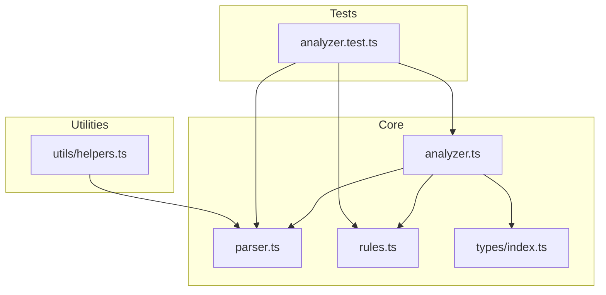
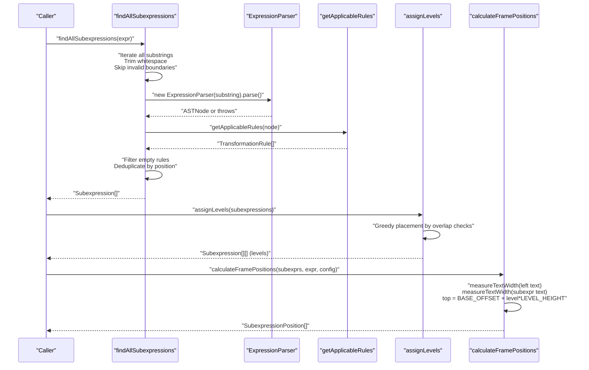
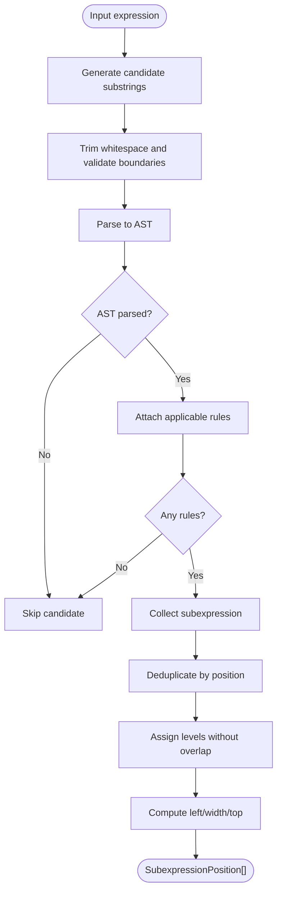
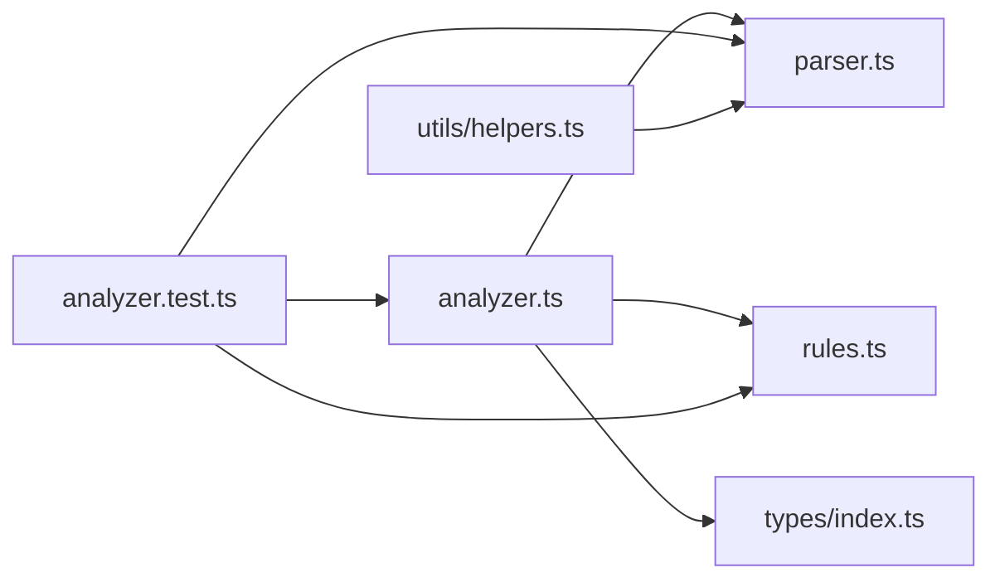
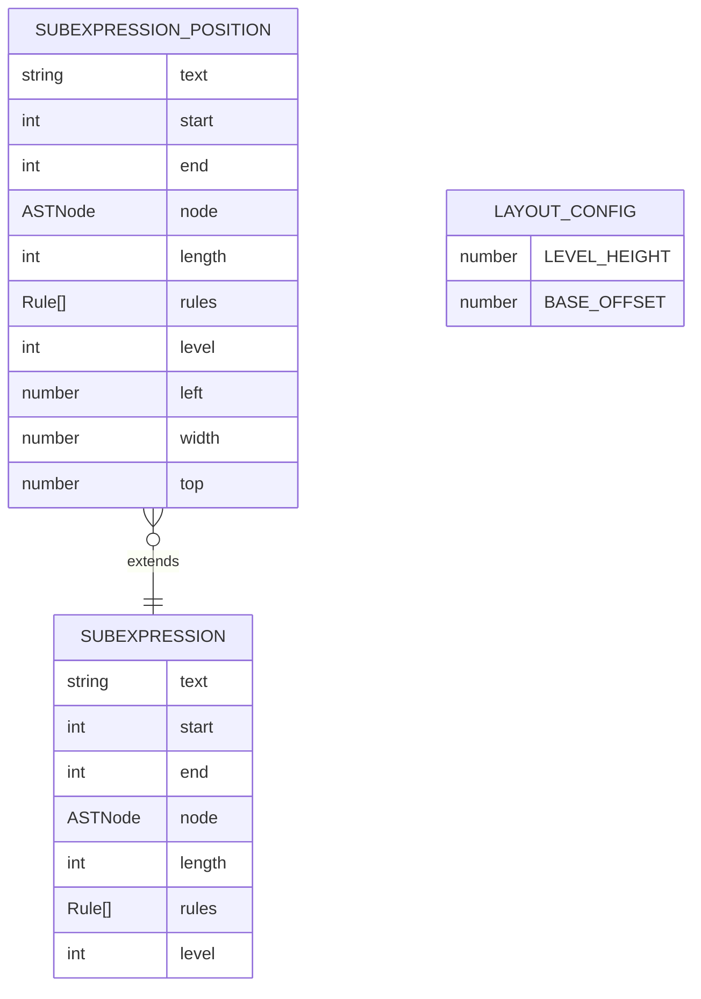

# Subexpression Analysis

<cite>
**Referenced Files in This Document**
- [analyzer.ts](file://src/core/analyzer.ts)
- [parser.ts](file://src/core/parser.ts)
- [rules.ts](file://src/core/rules.ts)
- [index.ts](file://src/types/index.ts)
- [analyzer.test.ts](file://src/test/analyzer.test.ts)
- [helpers.ts](file://src/utils/helpers.ts)
</cite>

## Table of Contents
1. [Introduction](#introduction)
2. [Project Structure](#project-structure)
3. [Core Components](#core-components)
4. [Architecture Overview](#architecture-overview)
5. [Detailed Component Analysis](#detailed-component-analysis)
6. [Dependency Analysis](#dependency-analysis)
7. [Performance Considerations](#performance-considerations)
8. [Troubleshooting Guide](#troubleshooting-guide)
9. [Conclusion](#conclusion)
10. [Appendices](#appendices)

## Introduction
This document explains the subexpression detection and analysis pipeline implemented in analyzer.ts. It covers how all valid subexpressions are discovered from an input expression string, how overlapping subexpressions are assigned non-overlapping levels, and how visual frame positions are calculated for rendering. It also details how the analysis integrates with the AST produced by the parser and the rule engine to power interactive learning experiences.

## Project Structure
The subexpression analysis lives in the core module alongside the parser and rule engine. The types define the shared data structures used across the analyzer, parser, and rules.

**Diagram sources**
- [analyzer.ts](file://src/core/analyzer.ts#L1-L182)
- [parser.ts](file://src/core/parser.ts#L1-L159)
- [rules.ts](file://src/core/rules.ts#L1-L238)
- [index.ts](file://src/types/index.ts#L1-L98)
- [analyzer.test.ts](file://src/test/analyzer.test.ts#L1-L370)
- [helpers.ts](file://src/utils/helpers.ts#L1-L178)

**Section sources**
- [analyzer.ts](file://src/core/analyzer.ts#L1-L182)
- [parser.ts](file://src/core/parser.ts#L1-L159)
- [rules.ts](file://src/core/rules.ts#L1-L238)
- [index.ts](file://src/types/index.ts#L1-L98)
- [analyzer.test.ts](file://src/test/analyzer.test.ts#L1-L370)
- [helpers.ts](file://src/utils/helpers.ts#L1-L178)

## Core Components
- findAllSubexpressions: Enumerates candidate substrings, trims whitespace, skips invalid boundaries, merges multi-digit numbers, validates with the parser, filters by applicable rules, and deduplicates by position.
- assignLevels: Partitions subexpressions into non-overlapping levels using a greedy placement strategy guided by doRangesOverlap.
- doRangesOverlap: Determines whether two half-open ranges overlap.
- calculateFramePositions: Computes left, width, and top coordinates for each subexpression using text measurement and layout configuration.
- measureTextWidth: Measures text width using a monospace font metric, with a fallback for non-browser environments.
- calculateTotalHeight: Computes the total vertical space needed for rendered frames given the number of levels and layout configuration.

These functions form a pipeline from raw expression text to positioned subexpressions ready for UI rendering and interaction.

**Section sources**
- [analyzer.ts](file://src/core/analyzer.ts#L13-L79)
- [analyzer.ts](file://src/core/analyzer.ts#L84-L117)
- [analyzer.ts](file://src/core/analyzer.ts#L122-L124)
- [analyzer.ts](file://src/core/analyzer.ts#L129-L149)
- [analyzer.ts](file://src/core/analyzer.ts#L154-L170)
- [analyzer.ts](file://src/core/analyzer.ts#L175-L181)

## Architecture Overview
The subexpression analysis pipeline transforms an expression string into a set of subexpressions with associated AST nodes and rules, assigns non-overlapping levels, and computes visual positions for rendering.

**Diagram sources**
- [analyzer.ts](file://src/core/analyzer.ts#L13-L79)
- [analyzer.ts](file://src/core/analyzer.ts#L84-L117)
- [analyzer.ts](file://src/core/analyzer.ts#L129-L149)
- [parser.ts](file://src/core/parser.ts#L18-L34)
- [rules.ts](file://src/core/rules.ts#L12-L238)

## Detailed Component Analysis

### findAllSubexpressions: Subexpression Discovery
findAllSubexpressions systematically generates candidate substrings and validates them:
- Iterates over all start/end pairs to produce substrings.
- Trims whitespace; skips candidates whose trimmed form does not match the original substring (ensuring exact positions).
- Skips individual digits that are part of larger numbers by checking neighboring characters.
- Attempts to parse each trimmed substring into an AST using ExpressionParser.
- Filters out subexpressions with no applicable rules via getApplicableRules.
- Deduplicates by start/end position to avoid repeated entries.

Key behaviors:
- Position fidelity: start/end indices refer to the original expression string.
- Meaningful filtering: only subexpressions with at least one applicable rule are retained.
- Robustness: invalid substrings are silently skipped.

Edge cases covered by tests:
- Multi-digit numbers are treated as a single subexpression.
- Parenthetical grouping is recognized.
- Mixed operators and variables/constants are supported.
- Very long expressions and deeply nested parentheses are handled.

**Section sources**
- [analyzer.ts](file://src/core/analyzer.ts#L13-L79)
- [parser.ts](file://src/core/parser.ts#L18-L34)
- [rules.ts](file://src/core/rules.ts#L12-L238)
- [analyzer.test.ts](file://src/test/analyzer.test.ts#L15-L123)

### assignLevels: Level Assignment Without Overlap
assignLevels partitions subexpressions into levels so that no two subexpressions in the same level overlap:
- Iterates through each subexpression and attempts to place it into the first level that has no overlapping ranges.
- Uses doRangesOverlap to compare half-open ranges [start, end).
- If no suitable level exists, creates a new level.
- Sets a numeric level property on each subexpression.

Overlap logic:
- Two ranges overlap if neither end ≤ other start nor vice versa.
- Adjacent ranges (touching at a boundary) do not overlap.

Validation:
- Tests confirm that overlapping subexpressions are placed on different levels and that no overlaps occur within the same level.

**Section sources**
- [analyzer.ts](file://src/core/analyzer.ts#L84-L117)
- [analyzer.ts](file://src/core/analyzer.ts#L122-L124)
- [analyzer.test.ts](file://src/test/analyzer.test.ts#L125-L149)
- [analyzer.test.ts](file://src/test/analyzer.test.ts#L151-L214)

### doRangesOverlap: Range Overlap Detection
doRangesOverlap implements a canonical non-overlap condition for half-open intervals:
- Returns true if ranges [start1, end1) and [start2, end2) overlap; otherwise false.
- Handles nested ranges, identical ranges, and adjacency correctly.

This function underpins the correctness of assignLevels.

**Section sources**
- [analyzer.ts](file://src/core/analyzer.ts#L122-L124)
- [analyzer.test.ts](file://src/test/analyzer.test.ts#L125-L149)

### calculateFramePositions: Visual Positioning
calculateFramePositions computes the visual layout for each subexpression:
- left: width of text before the subexpression’s start position.
- width: width of the subexpression’s text.
- top: BASE_OFFSET plus level multiplied by LEVEL_HEIGHT.

Text measurement:
- measureTextWidth uses a monospace font to compute widths.
- In non-browser environments, a simple fallback multiplies character count by a constant.

Layout configuration:
- LEVEL_HEIGHT controls vertical spacing between levels.
- BASE_OFFSET sets the initial vertical offset.

Validation:
- Tests verify that left/top/width are computed and that different levels yield different top values.

**Section sources**
- [analyzer.ts](file://src/core/analyzer.ts#L129-L149)
- [analyzer.ts](file://src/core/analyzer.ts#L154-L170)
- [analyzer.test.ts](file://src/test/analyzer.test.ts#L216-L291)

### Data Flow From AST to Positioned Subexpressions
The analyzer ties together parsing, rule application, and layout:
- findAllSubexpressions parses each candidate into an AST and attaches applicable rules.
- assignLevels ensures non-overlapping frames by level.
- calculateFramePositions converts positions into pixel offsets and heights.

**Diagram sources**
- [analyzer.ts](file://src/core/analyzer.ts#L13-L79)
- [analyzer.ts](file://src/core/analyzer.ts#L84-L117)
- [analyzer.ts](file://src/core/analyzer.ts#L129-L149)
- [parser.ts](file://src/core/parser.ts#L18-L34)
- [rules.ts](file://src/core/rules.ts#L12-L238)

### Example: Complex Expression Analysis
Consider the expression "2*(a+b)+c":
- findAllSubexpressions discovers subexpressions such as "2", "(a+b)", "2*(a+b)", "+c", and the full expression.
- assignLevels places overlapping subexpressions on separate levels (e.g., "2*(a+b)" vs "a+b").
- calculateFramePositions computes left/width/top for each subexpression, enabling layered frames.

This example demonstrates how nested and compound expressions are decomposed into non-overlapping levels for visual clarity.

**Section sources**
- [analyzer.test.ts](file://src/test/analyzer.test.ts#L108-L123)
- [analyzer.test.ts](file://src/test/analyzer.test.ts#L163-L169)
- [analyzer.test.ts](file://src/test/analyzer.test.ts#L281-L290)

### Edge Cases and Robustness
- Very long expressions: Tested to ensure scalability and meaningful subexpression discovery.
- Deeply nested parentheses: Handled by the parser and reflected in subexpression coverage.
- Whitespace handling: Trimming and boundary checks prevent misaligned frames.
- Mixed operators and variables/constants: Supported by the parser and rule engine.

**Section sources**
- [analyzer.test.ts](file://src/test/analyzer.test.ts#L333-L370)
- [parser.ts](file://src/core/parser.ts#L92-L106)
- [rules.ts](file://src/core/rules.ts#L135-L143)

### How Results Enable User Interaction
- SubexpressionPosition[] provides precise coordinates for overlay frames.
- Each subexpression carries its AST node and applicable rules, enabling interactive transformations.
- The UI can render layered frames with hover/click handlers bound to subexpression indices or positions.

[No sources needed since this section synthesizes behavior without quoting specific code]

## Dependency Analysis
The analyzer depends on the parser for AST construction and the rule engine for applicability. Types unify the shared interfaces across modules.

**Diagram sources**
- [analyzer.ts](file://src/core/analyzer.ts#L1-L182)
- [parser.ts](file://src/core/parser.ts#L1-L159)
- [rules.ts](file://src/core/rules.ts#L1-L238)
- [index.ts](file://src/types/index.ts#L1-L98)
- [analyzer.test.ts](file://src/test/analyzer.test.ts#L1-L370)
- [helpers.ts](file://src/utils/helpers.ts#L1-L178)

**Section sources**
- [analyzer.ts](file://src/core/analyzer.ts#L1-L182)
- [parser.ts](file://src/core/parser.ts#L1-L159)
- [rules.ts](file://src/core/rules.ts#L1-L238)
- [index.ts](file://src/types/index.ts#L1-L98)
- [analyzer.test.ts](file://src/test/analyzer.test.ts#L1-L370)
- [helpers.ts](file://src/utils/helpers.ts#L1-L178)

## Performance Considerations
- findAllSubexpressions runs in O(n^3) worst-case in string generation and parsing, where n is the expression length. This is acceptable for typical educational expressions but may be a bottleneck for very long inputs.
- assignLevels is O(k·L) where k is the number of subexpressions and L is the average number of subexpressions per level; in practice, levels are small due to overlap avoidance.
- measureTextWidth is O(1) per measurement in the browser and O(w) in Node.js, where w is the text length; it is invoked for each subexpression.

Optimization opportunities:
- Early pruning of candidates using lexical heuristics (e.g., skipping substrings that cannot form balanced parentheses).
- Memoizing measureTextWidth results for repeated substrings.
- Parallelizing candidate parsing for independent substrings (subject to thread safety).

[No sources needed since this section provides general guidance]

## Troubleshooting Guide
Common issues and resolutions:
- Unexpected missing subexpressions:
  - Verify that whitespace trimming is not excluding intended boundaries.
  - Ensure the substring is not a standalone operator or punctuation.
- Overlapping frames:
  - Confirm assignLevels was applied and levels were set.
  - Check doRangesOverlap logic for adjacent ranges not considered overlapping.
- Incorrect widths or misaligned frames:
  - Validate measureTextWidth behavior in the current environment.
  - Adjust layout configuration (LEVEL_HEIGHT, BASE_OFFSET) if needed.
- No applicable rules:
  - Confirm getApplicableRules returns non-empty results for the discovered AST nodes.

**Section sources**
- [analyzer.ts](file://src/core/analyzer.ts#L13-L79)
- [analyzer.ts](file://src/core/analyzer.ts#L84-L117)
- [analyzer.ts](file://src/core/analyzer.ts#L129-L149)
- [analyzer.ts](file://src/core/analyzer.ts#L154-L170)
- [rules.ts](file://src/core/rules.ts#L12-L238)

## Conclusion
The analyzer pipeline provides a robust foundation for discovering meaningful subexpressions, assigning non-overlapping levels, and computing precise visual positions. Together with the parser and rule engine, it enables rich, interactive learning experiences where students can explore transformations at multiple levels of granularity.

[No sources needed since this section summarizes without analyzing specific files]

## Appendices

### Data Model Overview

**Diagram sources**
- [index.ts](file://src/types/index.ts#L67-L86)
- [analyzer.ts](file://src/core/analyzer.ts#L129-L149)