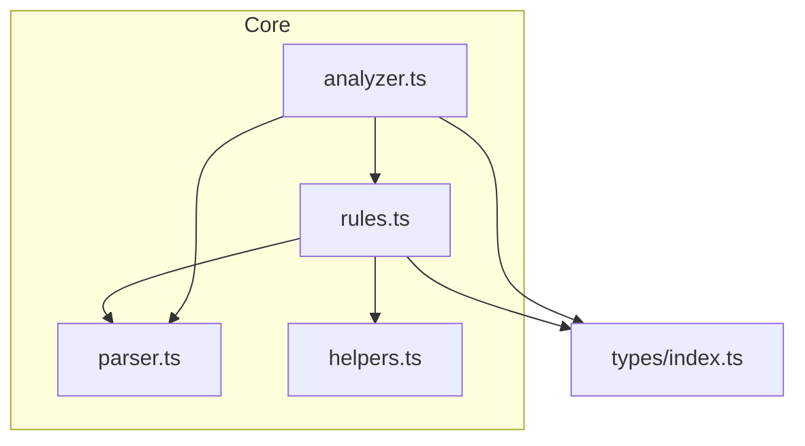
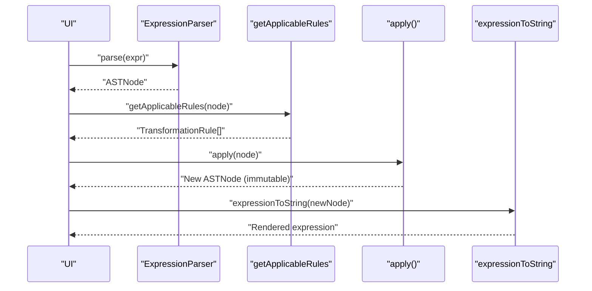
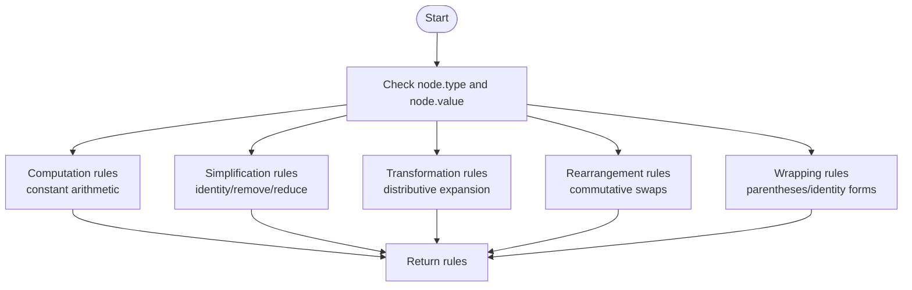
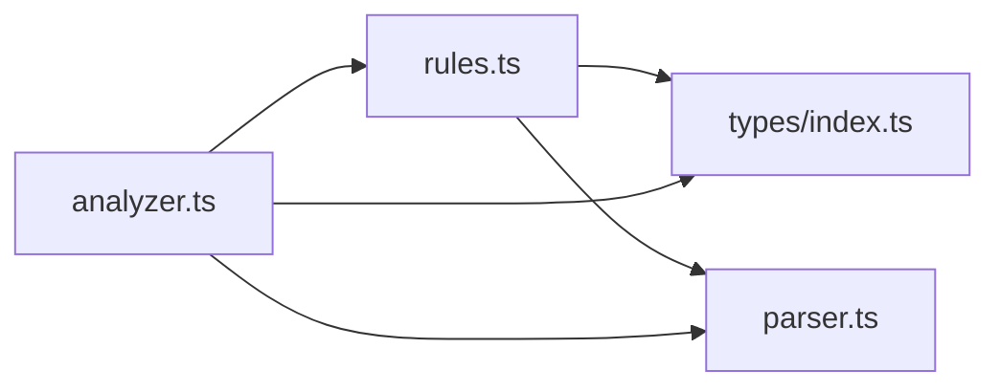

# Transformation Rules

<cite>
**Referenced Files in This Document**
- [rules.ts](file://src/core/rules.ts)
- [index.ts](file://src/types/index.ts)
- [parser.ts](file://src/core/parser.ts)
- [helpers.ts](file://src/utils/helpers.ts)
- [analyzer.ts](file://src/core/analyzer.ts)
- [rules.test.ts](file://src/test/rules.test.ts)
</cite>

## Table of Contents
1. [Introduction](#introduction)
2. [Project Structure](#project-structure)
3. [Core Components](#core-components)
4. [Architecture Overview](#architecture-overview)
5. [Detailed Component Analysis](#detailed-component-analysis)
6. [Dependency Analysis](#dependency-analysis)
7. [Performance Considerations](#performance-considerations)
8. [Troubleshooting Guide](#troubleshooting-guide)
9. [Conclusion](#conclusion)

## Introduction
This section documents the transformation rule system that powers interactive algebraic manipulations. It explains the TransformationRule interface, the five rule categories, how applicable rules are detected for a given AST node, and how rules are applied immutably to produce new ASTs. It also covers examples of rule implementations, bidirectional considerations, rule chaining, and common pitfalls.

## Project Structure
The transformation rule system lives in the core module and integrates with the AST types, parser, and utilities. The key files are:
- src/core/rules.ts: Defines getApplicableRules and all rule implementations
- src/types/index.ts: Declares AST node types and TransformationRule interface
- src/core/parser.ts: Generates AST nodes and assigns unique IDs
- src/utils/helpers.ts: Provides utilities for AST traversal and string conversion
- src/core/analyzer.ts: Uses getApplicableRules to discover subexpressions
- src/test/rules.test.ts: Validates rule behavior and applicability

**Diagram sources**
- [rules.ts](file://src/core/rules.ts#L1-L238)
- [parser.ts](file://src/core/parser.ts#L1-L159)
- [helpers.ts](file://src/utils/helpers.ts#L1-L178)
- [analyzer.ts](file://src/core/analyzer.ts#L1-L182)
- [index.ts](file://src/types/index.ts#L1-L98)

**Section sources**
- [rules.ts](file://src/core/rules.ts#L1-L238)
- [index.ts](file://src/types/index.ts#L1-L98)
- [parser.ts](file://src/core/parser.ts#L1-L159)
- [helpers.ts](file://src/utils/helpers.ts#L1-L178)
- [analyzer.ts](file://src/core/analyzer.ts#L1-L182)

## Core Components
- TransformationRule interface: Defines id, name, category, preview, and apply function. See [TransformationRule](file://src/types/index.ts#L48-L61).
- Rule categories: Computation, Simplification, Transformation, Rearrangement, and Wrapping. See [RuleCategory](file://src/types/index.ts#L48-L53).
- getApplicableRules(node): Returns all applicable rules for a given AST node. See [getApplicableRules](file://src/core/rules.ts#L12-L238).
- Rule application functions: Immutable constructors that return new AST nodes. See [rule application functions](file://src/core/rules.ts#L240-L434).

Key behaviors:
- getApplicableRules enumerates conditions based on node type, operator value, and children structure, then pushes rules with unique IDs and previews.
- Rule apply functions create new nodes with fresh IDs and preserve structure while transforming content.

**Section sources**
- [index.ts](file://src/types/index.ts#L48-L61)
- [index.ts](file://src/types/index.ts#L48-L53)
- [rules.ts](file://src/core/rules.ts#L12-L238)
- [rules.ts](file://src/core/rules.ts#L240-L434)

## Architecture Overview
The transformation rule system sits between the parser and the UI. The parser builds AST nodes with unique IDs. The analyzer discovers subexpressions and queries getApplicableRules for each. The UI renders available rules and applies them immutably.

**Diagram sources**
- [parser.ts](file://src/core/parser.ts#L1-L159)
- [rules.ts](file://src/core/rules.ts#L12-L238)
- [helpers.ts](file://src/utils/helpers.ts#L1-L30)
- [analyzer.ts](file://src/core/analyzer.ts#L13-L59)

## Detailed Component Analysis

### TransformationRule Interface
- id: Unique identifier for the rule.
- name: Human-readable label for display.
- category: One of the five categories: Computation, Simplification, Transformation, Rearrangement, Wrapping.
- preview: String describing the transformation.
- apply: Function that takes an AST node and returns a new AST node (immutable).

These fields are declared in [TransformationRule](file://src/types/index.ts#L55-L61).

**Section sources**
- [index.ts](file://src/types/index.ts#L48-L61)

### Rule Categories and Examples
- Computation (Priority 1)
  - Evaluates constant arithmetic immediately.
  - Examples: constant multiplication, division, addition, subtraction.
  - See [Computation rules](file://src/core/rules.ts#L17-L58).

- Simplification (Priority 2)
  - Removes or reduces redundant constructs.
  - Examples: remove multiplication by 1, simplify multiplication by 0, remove division by 1, remove addition/subtraction of 0, remove double negation, remove unnecessary parentheses.
  - See [Simplification rules](file://src/core/rules.ts#L62-L143).

- Transformation (Priority 3)
  - Applies algebraic transformations.
  - Example: distributive expansion a*(b±c) → a*b ± a*c (and left-hand variant).
  - See [Transformation rules](file://src/core/rules.ts#L147-L169).

- Rearrangement (Priority 4)
  - Swaps operands under commutative operators.
  - Example: a*b → b*a and a+b → b+a.
  - See [Rearrangement rules](file://src/core/rules.ts#L173-L191).

- Wrapping (Priority 5)
  - Adds or removes grouping constructs and identity-like forms.
  - Examples: add parentheses, add double negative, multiply/divide/add by 1.
  - See [Wrapping rules](file://src/core/rules.ts#L195-L228).

Validation of these behaviors appears in [rules.test.ts](file://src/test/rules.test.ts#L1-L437).

**Section sources**
- [rules.ts](file://src/core/rules.ts#L17-L58)
- [rules.ts](file://src/core/rules.ts#L62-L143)
- [rules.ts](file://src/core/rules.ts#L147-L169)
- [rules.ts](file://src/core/rules.ts#L173-L191)
- [rules.ts](file://src/core/rules.ts#L195-L228)
- [rules.test.ts](file://src/test/rules.test.ts#L1-L437)

### getApplicableRules Detection Logic
The function systematically checks node characteristics:
- Type and operator value
- Children types and values
- Unary nesting and grouping

It pushes rules in order of priority, ensuring Computation runs before Simplification, and so forth. The function returns a list of TransformationRule objects ready for UI presentation.

**Diagram sources**
- [rules.ts](file://src/core/rules.ts#L12-L238)

**Section sources**
- [rules.ts](file://src/core/rules.ts#L12-L238)

### Rule Application Process and Immutability
Each rule’s apply function creates a new AST node:
- New IDs are generated via [generateId](file://src/core/parser.ts#L10-L12).
- New nodes are constructed with fresh children and metadata.
- Constants are returned directly; structural transformations rebuild operator/unary/group nodes.

Examples of immutable construction:
- Constant evaluation returns a new [ConstantNode](file://src/core/rules.ts#L242-L251).
- Commutative swap returns a new [OperatorNode](file://src/core/rules.ts#L331-L338).
- Distributive expansion returns a new [OperatorNode](file://src/core/rules.ts#L340-L356) with two new operator children.
- Parentheses removal returns a new [GroupNode](file://src/core/rules.ts#L376-L383) or inner node.

Immutability is ensured by:
- Creating new objects with new IDs
- Not mutating the original node
- Returning new AST nodes

**Section sources**
- [parser.ts](file://src/core/parser.ts#L10-L12)
- [rules.ts](file://src/core/rules.ts#L242-L251)
- [rules.ts](file://src/core/rules.ts#L331-L338)
- [rules.ts](file://src/core/rules.ts#L340-L356)
- [rules.ts](file://src/core/rules.ts#L376-L383)

### Bidirectional Rules
The current implementation focuses on forward transformations:
- Distributive expansion is supported in both directions (left and right).
- Commutative swapping is supported for multiplication and addition.
- No explicit reverse rules are present in the code.

Implications:
- The system does not automatically invert transformations; it exposes forward-only rules.
- Educational value comes from showing both directions conceptually while applying forward transformations.

**Section sources**
- [rules.ts](file://src/core/rules.ts#L147-L169)
- [rules.ts](file://src/core/rules.ts#L173-L191)

### Rule Chaining and Educational Value
Chaining occurs when successive applications of rules reduce or restructure an expression:
- Example chain: compute constants, then simplify identities, then rearrange terms, then wrap with parentheses for emphasis.
- The analyzer discovers subexpressions and collects applicable rules at each step, enabling incremental guidance.

Validation of chained scenarios appears in tests:
- [rules.test.ts](file://src/test/rules.test.ts#L1-L437) demonstrates multiple rule applications across different expressions.

**Section sources**
- [analyzer.ts](file://src/core/analyzer.ts#L13-L59)
- [rules.test.ts](file://src/test/rules.test.ts#L1-L437)

## Dependency Analysis
- rules.ts depends on:
  - types/index.ts for ASTNode and TransformationRule
  - parser.ts for generateId
  - helpers.ts indirectly via tests for expressionToString
- analyzer.ts depends on rules.ts and parser.ts to discover and analyze subexpressions.

**Diagram sources**
- [rules.ts](file://src/core/rules.ts#L1-L238)
- [index.ts](file://src/types/index.ts#L1-L98)
- [parser.ts](file://src/core/parser.ts#L1-L159)
- [analyzer.ts](file://src/core/analyzer.ts#L1-L182)

**Section sources**
- [rules.ts](file://src/core/rules.ts#L1-L238)
- [index.ts](file://src/types/index.ts#L1-L98)
- [parser.ts](file://src/core/parser.ts#L1-L159)
- [analyzer.ts](file://src/core/analyzer.ts#L1-L182)

## Performance Considerations
- getApplicableRules performs O(1) checks per rule family; complexity is bounded by the fixed number of rule families.
- Rule application functions construct small subtrees and are O(1) in node creation cost.
- Using generateId ensures uniqueness without global state overhead.
- For large expressions, consider caching or memoizing repeated subexpression checks at higher layers.

[No sources needed since this section provides general guidance]

## Troubleshooting Guide
Common issues and resolutions:
- Why a rule does not appear on a specific node
  - The node type or operator value may not match the rule’s condition. Verify node.type and node.value in [getApplicableRules](file://src/core/rules.ts#L12-L238).
  - Children must satisfy the rule’s constraints (e.g., constant values). See targeted rule blocks such as [removeMultiplicationByOne](file://src/core/rules.ts#L286-L292).

- Why certain rules do not apply to variables
  - Some rules require constant children (e.g., computation). See [Computation rules](file://src/core/rules.ts#L17-L58).
  - Distributive expansion applies when one child is an operator with + or -. See [Transformation rules](file://src/core/rules.ts#L147-L169).

- Bidirectional expectations
  - Only forward transformations are implemented. See [Rearrangement rules](file://src/core/rules.ts#L173-L191) and [Transformation rules](file://src/core/rules.ts#L147-L169).

- Testing and verification
  - Use [rules.test.ts](file://src/test/rules.test.ts#L1-L437) to confirm expected behavior and edge cases.

**Section sources**
- [rules.ts](file://src/core/rules.ts#L12-L238)
- [rules.ts](file://src/core/rules.ts#L286-L292)
- [rules.ts](file://src/core/rules.ts#L17-L58)
- [rules.ts](file://src/core/rules.ts#L147-L169)
- [rules.ts](file://src/core/rules.ts#L173-L191)
- [rules.test.ts](file://src/test/rules.test.ts#L1-L437)

## Conclusion
The transformation rule system provides a structured, extensible way to expose algebraic manipulations. By separating detection (getApplicableRules) from application (apply functions), it enables clear UI feedback and safe, immutable AST mutations. The five categories align with typical learning progression, and tests validate correctness across common cases. Extending the system involves adding new conditions in getApplicableRules and implementing apply functions that construct new nodes with fresh IDs.