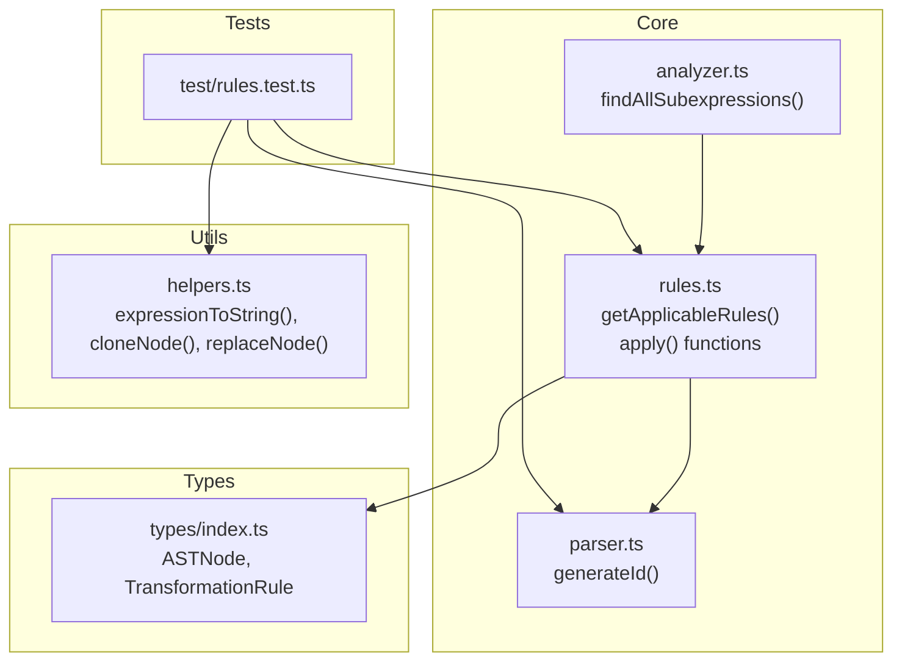
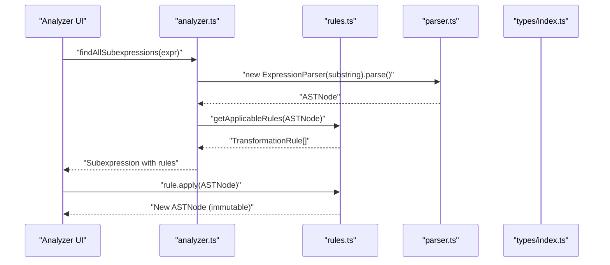
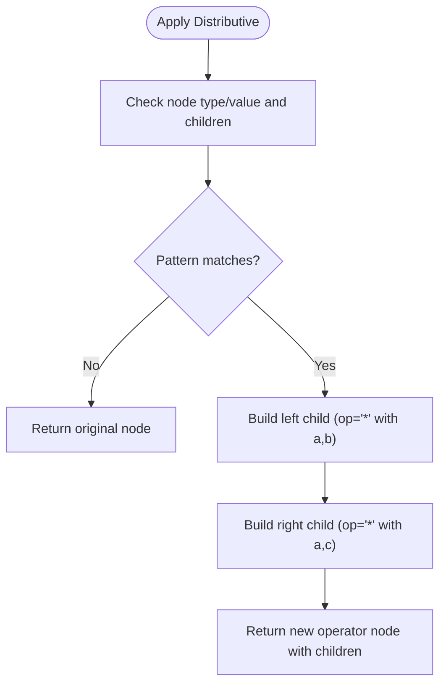
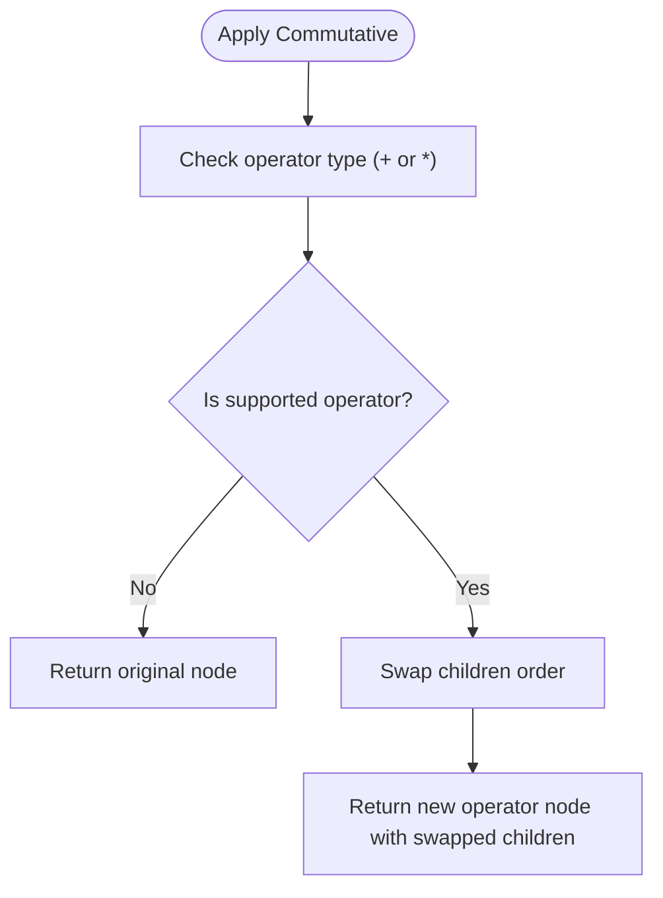
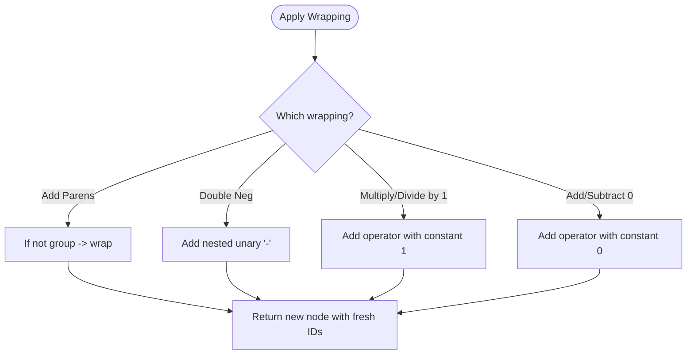
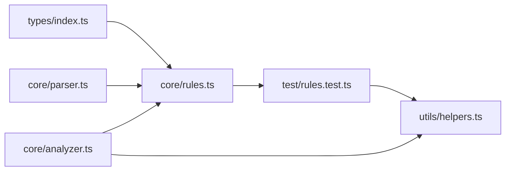

# Adding New Transformation Rules

<cite>
**Referenced Files in This Document**
- [src/core/rules.ts](file://src/core/rules.ts)
- [src/types/index.ts](file://src/types/index.ts)
- [src/core/parser.ts](file://src/core/parser.ts)
- [src/utils/helpers.ts](file://src/utils/helpers.ts)
- [src/core/analyzer.ts](file://src/core/analyzer.ts)
- [src/test/rules.test.ts](file://src/test/rules.test.ts)
- [README.md](file://README.md)
</cite>

## Table of Contents
1. [Introduction](#introduction)
2. [Project Structure](#project-structure)
3. [Core Components](#core-components)
4. [Architecture Overview](#architecture-overview)
5. [Detailed Component Analysis](#detailed-component-analysis)
6. [Dependency Analysis](#dependency-analysis)
7. [Performance Considerations](#performance-considerations)
8. [Troubleshooting Guide](#troubleshooting-guide)
9. [Conclusion](#conclusion)
10. [Appendices](#appendices)

## Introduction
This document explains how to add new transformation rules to the MathHelper application. It focuses on the TransformationRule interface, the getApplicableRules() function, and the apply() function contract. It also provides step-by-step guidance for implementing new rules, including applicability conditions, transformation logic, category grouping, immutability, type safety, edge cases, and preview strings. Concrete examples are drawn from the existing codebase to illustrate distributive expansion, commutative swaps, and wrapping operations.

## Project Structure
The transformation rule system lives primarily in the core module and is supported by shared types and utilities:
- Core rules: define applicability and transformation functions
- Types: define AST node shapes and rule metadata
- Parser: generates AST nodes with unique IDs
- Helpers: provide AST utilities (string conversion, cloning, replacement)
- Analyzer: discovers subexpressions and computes rule sets for UI
- Tests: validate rule behavior and categories

**Diagram sources**
- [src/core/rules.ts](file://src/core/rules.ts#L1-L238)
- [src/types/index.ts](file://src/types/index.ts#L1-L62)
- [src/core/parser.ts](file://src/core/parser.ts#L1-L20)
- [src/core/analyzer.ts](file://src/core/analyzer.ts#L1-L79)
- [src/utils/helpers.ts](file://src/utils/helpers.ts#L1-L30)
- [src/test/rules.test.ts](file://src/test/rules.test.ts#L1-L78)

**Section sources**
- [README.md](file://README.md#L42-L58)
- [src/core/rules.ts](file://src/core/rules.ts#L1-L238)
- [src/types/index.ts](file://src/types/index.ts#L1-L62)
- [src/core/analyzer.ts](file://src/core/analyzer.ts#L1-L79)

## Core Components
- TransformationRule interface: defines id, name, category, preview, and apply function signature.
- getApplicableRules(node): returns all rules applicable to a given ASTNode based on node type, value, and children.
- apply() functions: pure functions that return a new ASTNode, preserving immutability by generating fresh IDs and avoiding mutation of the original node.

Key implementation patterns:
- Applicability checks inspect node.type, node.value, and node.children to decide whether a rule applies.
- apply() functions construct new AST nodes with generateId() to ensure immutability.
- Category strings group rules by priority and purpose.

**Section sources**
- [src/types/index.ts](file://src/types/index.ts#L44-L62)
- [src/core/rules.ts](file://src/core/rules.ts#L12-L238)
- [src/core/parser.ts](file://src/core/parser.ts#L10-L12)

## Architecture Overview
The rule system integrates with the analyzer to present available transformations to the user. The analyzer parses candidate substrings and passes AST nodes to getApplicableRules(), which returns a list of TransformationRule objects. Each rule’s apply() function produces a transformed AST node.

**Diagram sources**
- [src/core/analyzer.ts](file://src/core/analyzer.ts#L13-L79)
- [src/core/rules.ts](file://src/core/rules.ts#L12-L238)
- [src/core/parser.ts](file://src/core/parser.ts#L18-L34)
- [src/types/index.ts](file://src/types/index.ts#L44-L62)

## Detailed Component Analysis

### TransformationRule Interface
The TransformationRule interface defines the contract for all rules:
- id: unique identifier for the rule
- name: display label for the UI
- category: one of the predefined categories
- preview: short textual preview of the transformation
- apply: pure function returning a new ASTNode

Immutability is enforced by generating new IDs and constructing new nodes rather than mutating existing ones.

**Section sources**
- [src/types/index.ts](file://src/types/index.ts#L44-L62)

### getApplicableRules() Function
This function enumerates all applicable rules for a given ASTNode. It groups rules by priority:
- Priority 1: Computation (evaluate constants)
- Priority 2: Simplification (identity/remove rules)
- Priority 3: Transformation (algebraic expansions)
- Priority 4: Rearrangement (commutative swaps)
- Priority 5: Wrapping (parentheses and identity operations)

Applicability checks are based on:
- node.type and node.value
- node.children types/values
- Specific structural patterns (e.g., nested operators, unary nodes)

Examples from the codebase:
- Computation: constant multiplication/division/addition/subtraction
- Simplification: remove ×1, simplify ×0, remove /1, remove +0/-0, double negation, remove unnecessary parentheses
- Transformation: distributive forward and left
- Rearrangement: commutative swap for + and *
- Wrapping: add parentheses, add double negation, multiply/divide by 1, add/subtract 0

**Section sources**
- [src/core/rules.ts](file://src/core/rules.ts#L12-L238)

### Applying Rules: Pure Functions and Immutability
Rules’ apply() functions are pure and immutable:
- They do not mutate the input node
- They generate new IDs using generateId()
- They return a new ASTNode with updated structure/value

Examples from the codebase:
- Constant evaluation returns a new constant node
- Removal rules return a child node unchanged
- Commutative swap returns a new operator node with swapped children
- Distributive expansion constructs new operator nodes with fresh IDs
- Wrapping operations construct new group/unary/operator nodes with fresh IDs

These patterns ensure AST integrity and enable safe history tracking and rendering updates.

**Section sources**
- [src/core/rules.ts](file://src/core/rules.ts#L242-L433)
- [src/core/parser.ts](file://src/core/parser.ts#L10-L12)

### Concrete Examples from the Codebase

#### Distributive Expansion
- Forward expansion: a*(b+c) → a*b + a*c
- Left expansion: (a+b)*c → a*c + b*c
- Implementation constructs new operator nodes with fresh IDs and builds children arrays accordingly.

**Diagram sources**
- [src/core/rules.ts](file://src/core/rules.ts#L340-L374)

**Section sources**
- [src/core/rules.ts](file://src/core/rules.ts#L147-L169)

#### Commutative Swaps
- Applies to + and * operators
- Swaps children order and returns a new operator node with a fresh ID

**Diagram sources**
- [src/core/rules.ts](file://src/core/rules.ts#L331-L338)

**Section sources**
- [src/core/rules.ts](file://src/core/rules.ts#L173-L191)

#### Wrapping Operations
- Add parentheses around non-grouped expressions
- Add double negation
- Multiply/divide by 1
- Add/subtract 0

**Diagram sources**
- [src/core/rules.ts](file://src/core/rules.ts#L376-L433)

**Section sources**
- [src/core/rules.ts](file://src/core/rules.ts#L195-L236)

### Step-by-Step: Adding a New Rule
Follow these steps to add a new transformation rule:

1. Define applicability conditions
   - Inspect node.type, node.value, and node.children to determine when the rule applies.
   - Place the rule in the appropriate priority section of getApplicableRules().

2. Implement the transformation logic
   - Write a pure apply() function that returns a new ASTNode.
   - Generate fresh IDs using generateId().
   - Construct new nodes with correct types and children.

3. Ensure proper category grouping
   - Use one of the predefined categories: Computation, Simplification, Transformation, Rearrangement, Wrapping.
   - Keep the category consistent with the rule’s purpose and priority.

4. Provide a clear preview
   - Use concise, readable preview strings that show before/after transformations.
   - Include placeholders for variables when applicable.

5. Test the rule
   - Add tests to verify applicability and transformation correctness.
   - Validate immutability and AST integrity.

6. Validate type safety
   - Use TypeScript types to ensure node shapes and children match expectations.
   - Narrow types safely with runtime checks when accessing children.

7. Handle edge cases
   - Guard against missing children or unexpected node types.
   - Consider special cases like constants, variables, unary, and grouping.

8. Preserve AST integrity
   - Never mutate the original node; always return a new node.
   - Ensure IDs remain unique and consistent with the rest of the tree.

**Section sources**
- [src/core/rules.ts](file://src/core/rules.ts#L12-L238)
- [src/core/parser.ts](file://src/core/parser.ts#L10-L12)
- [src/test/rules.test.ts](file://src/test/rules.test.ts#L1-L78)

## Dependency Analysis
The rule system depends on:
- AST types for node shape validation
- Parser for ID generation and AST construction
- Analyzer for discovering subexpressions and computing rule sets
- Helpers for AST utilities (string conversion, cloning, replacement)

**Diagram sources**
- [src/types/index.ts](file://src/types/index.ts#L1-L62)
- [src/core/rules.ts](file://src/core/rules.ts#L1-L238)
- [src/core/parser.ts](file://src/core/parser.ts#L1-L20)
- [src/core/analyzer.ts](file://src/core/analyzer.ts#L1-L79)
- [src/utils/helpers.ts](file://src/utils/helpers.ts#L1-L30)
- [src/test/rules.test.ts](file://src/test/rules.test.ts#L1-L78)

**Section sources**
- [src/core/rules.ts](file://src/core/rules.ts#L1-L238)
- [src/core/analyzer.ts](file://src/core/analyzer.ts#L1-L79)
- [src/utils/helpers.ts](file://src/utils/helpers.ts#L1-L30)

## Performance Considerations
- getApplicableRules() performs O(1) checks per rule branch; complexity is bounded by the number of rule branches.
- apply() functions construct new nodes with shallow copying and minimal recursion; complexity is proportional to the size of the transformed subtree.
- Using generateId() ensures unique IDs without global state overhead.
- Tests demonstrate that complex nested expressions still yield applicable rules efficiently.

Best practices:
- Keep applicability checks fast and early-exit when conditions fail.
- Avoid deep cloning of large subtrees; construct only the necessary new nodes.
- Reuse shared constants (e.g., constants 0 and 1) when returning constant nodes to reduce allocations.

**Section sources**
- [src/core/rules.ts](file://src/core/rules.ts#L12-L238)
- [src/utils/helpers.ts](file://src/utils/helpers.ts#L1-L30)
- [src/test/rules.test.ts](file://src/test/rules.test.ts#L402-L437)

## Troubleshooting Guide
Common issues and resolutions:
- Type errors when accessing children
  - Always check node.type and narrow types before accessing children.
  - Use explicit casts only after verifying the type.

- Mutating the original node
  - Ensure apply() returns a new node with generateId() and avoids modifying the input node.

- Duplicate or missing IDs
  - Use generateId() for every new node created by apply().
  - Verify uniqueness in tests.

- Incorrect preview strings
  - Keep previews concise and accurate; include placeholders for variables.

- Edge cases in node validation
  - Guard against missing children or unexpected node types.
  - Consider unary, grouping, and operator precedence carefully.

- AST integrity
  - Validate that the transformed AST remains well-formed.
  - Use helpers like expressionToString() to verify string representation.

**Section sources**
- [src/core/rules.ts](file://src/core/rules.ts#L242-L433)
- [src/utils/helpers.ts](file://src/utils/helpers.ts#L1-L30)
- [src/test/rules.test.ts](file://src/test/rules.test.ts#L368-L400)

## Conclusion
Adding new transformation rules in MathHelper follows a clear pattern: define applicability conditions, implement a pure apply() function that preserves immutability, group rules by category, and provide clear previews. The existing codebase demonstrates robust patterns for computation, simplification, transformation, rearrangement, and wrapping. By adhering to these guidelines and leveraging the provided types and utilities, you can extend the rule system safely and efficiently.

## Appendices

### Appendix A: Rule Categories Reference
- Computation: Evaluate arithmetic on constants
- Simplification: Remove identities and unnecessary structures
- Transformation: Algebraic expansions (e.g., distributive)
- Rearrangement: Commutative swaps
- Wrapping: Parentheses and identity operations

**Section sources**
- [src/types/index.ts](file://src/types/index.ts#L48-L53)
- [src/core/rules.ts](file://src/core/rules.ts#L12-L238)

### Appendix B: Example Paths in Tests
- Computation tests validate constant evaluation and non-applicability for non-constants.
- Simplification tests cover removal of ×1, ×0, /1, +0/-0, double negation, and parentheses.
- Transformation tests confirm distributive expansion applicability.
- Rearrangement tests verify commutative swaps and exclusions for subtraction/division.
- Wrapping tests cover parentheses, double negation, ×1, /1, and +0/-0 additions.

**Section sources**
- [src/test/rules.test.ts](file://src/test/rules.test.ts#L1-L437)