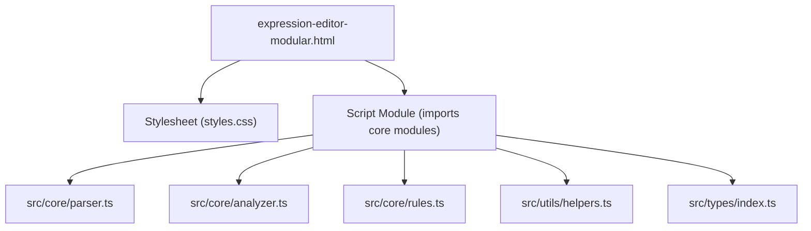
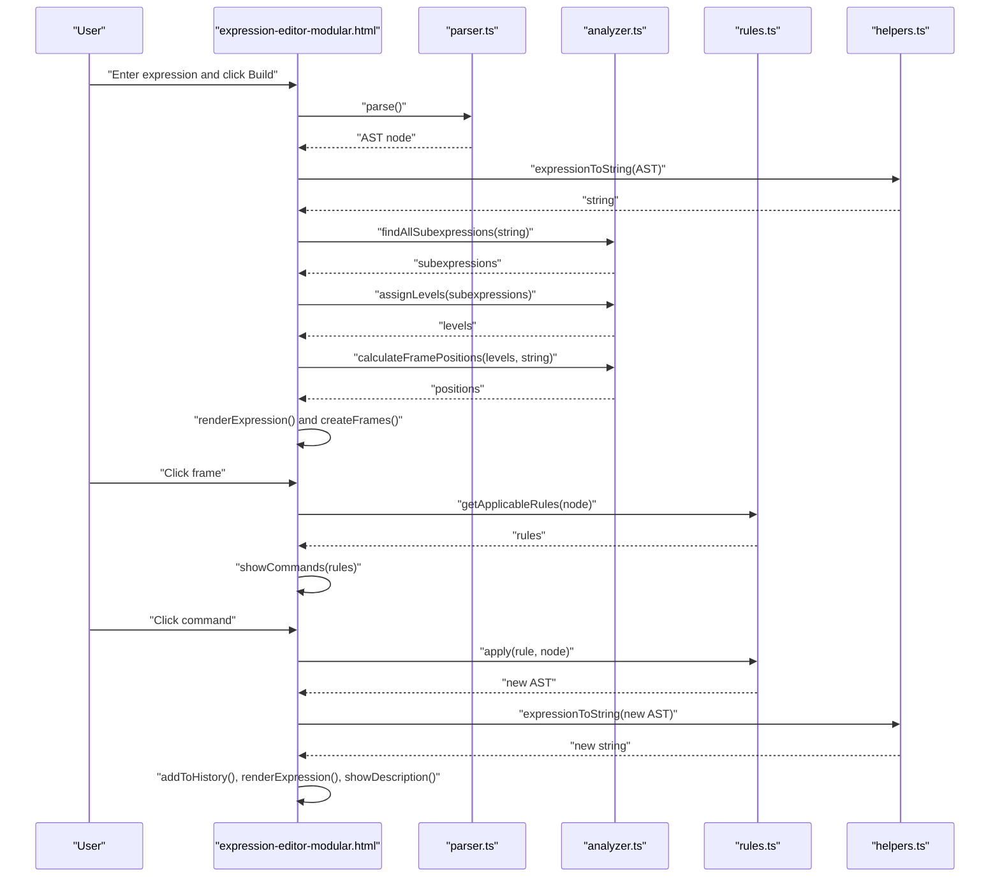
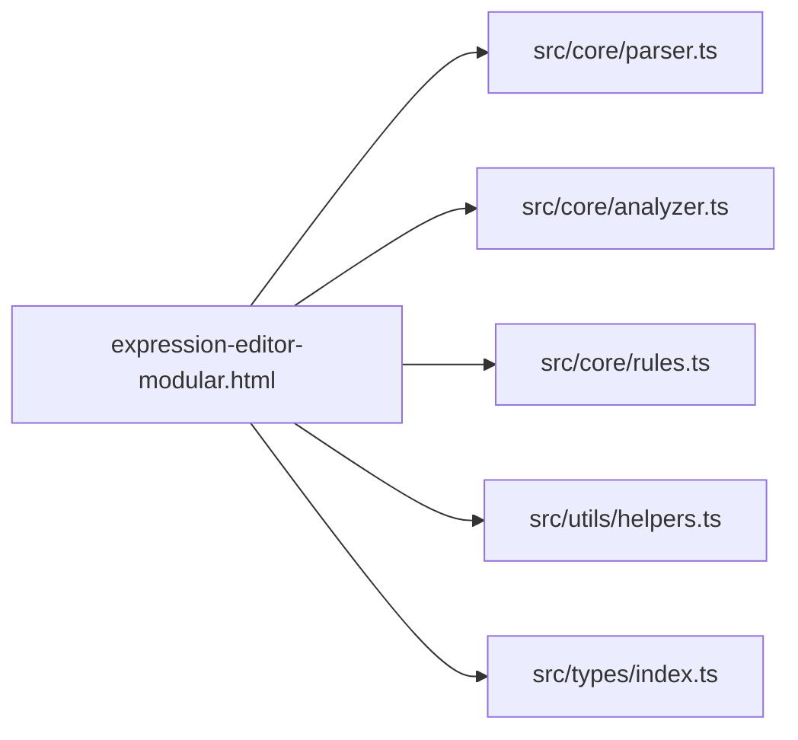

# Customizing the User Interface

<cite>
**Referenced Files in This Document**
- [expression-editor-modular.html](file://expression-editor-modular.html)
- [vite.config.ts](file://vite.config.ts)
- [src/core/analyzer.ts](file://src/core/analyzer.ts)
- [src/core/parser.ts](file://src/core/parser.ts)
- [src/core/rules.ts](file://src/core/rules.ts)
- [src/utils/helpers.ts](file://src/utils/helpers.ts)
- [src/types/index.ts](file://src/types/index.ts)
</cite>

## Table of Contents
1. [Introduction](#introduction)
2. [Project Structure](#project-structure)
3. [Core Components](#core-components)
4. [Architecture Overview](#architecture-overview)
5. [Detailed Component Analysis](#detailed-component-analysis)
6. [Dependency Analysis](#dependency-analysis)
7. [Performance Considerations](#performance-considerations)
8. [Troubleshooting Guide](#troubleshooting-guide)
9. [Conclusion](#conclusion)
10. [Appendices](#appendices)

## Introduction
This document explains how to customize the user interface in expression-editor-modular.html. It covers the three-panel layout (commands, expression, history/description), the CSS classes and JavaScript interactions that drive the UI, and how to modify visual appearance, enhance expression visualization, and extend functionality. It also addresses integration concerns such as responsiveness, accessibility, and maintaining the connection between UI elements and the underlying AST structure.

## Project Structure
The modular expression editor is implemented as a single HTML page with embedded styles and a script module. Styles are linked from a separate stylesheet and also include inline CSS for the root theme variables and layout. The JavaScript module imports core parsing, analysis, rules, and utility functions to build and visualize expressions.

**Diagram sources**
- [expression-editor-modular.html](file://expression-editor-modular.html#L1-L120)
- [vite.config.ts](file://vite.config.ts#L1-L14)

**Section sources**
- [expression-editor-modular.html](file://expression-editor-modular.html#L1-L120)
- [vite.config.ts](file://vite.config.ts#L1-L14)

## Core Components
The UI is organized into three panels:
- Left panel: Commands — lists transformation rules applicable to the selected subexpression.
- Center panel: Expression — displays the expression with interactive frames highlighting subexpressions and tooltips.
- Right panel: History and Description — shows transformation history and rule explanations.

Key CSS classes and containers:
- Panels: .left-panel, .center-panel, .right-panel
- Input section: .input-section with #expressionInput, #buildBtn, #clearBtn, #errorMessage
- Expression section: .expression-section with #expressionContainer
- Command list: #commandsPanel
- History list: #historyPanel
- Description panel: #descriptionPanel

JavaScript interactions:
- Event listeners attach to buttons and input fields to trigger parsing and rendering.
- Frames are dynamically created based on subexpression analysis and positioned absolutely over the expression text.
- Clicking a frame updates the commands panel and highlights the selection.
- Applying a transformation rebuilds the expression and updates history and description.

**Section sources**
- [expression-editor-modular.html](file://expression-editor-modular.html#L470-L535)
- [expression-editor-modular.html](file://expression-editor-modular.html#L577-L604)
- [expression-editor-modular.html](file://expression-editor-modular.html#L606-L740)
- [expression-editor-modular.html](file://expression-editor-modular.html#L742-L806)
- [expression-editor-modular.html](file://expression-editor-modular.html#L808-L917)

## Architecture Overview
The UI integrates with the core modules to render and manipulate expressions:
- Parser builds an AST from the input string.
- Analyzer finds subexpressions, assigns levels, and calculates frame positions.
- Rules module provides transformation rules applicable to AST nodes.
- Helpers convert AST nodes to string and support cloning and replacement.
- The UI updates DOM elements in response to user actions and expression changes.

**Diagram sources**
- [expression-editor-modular.html](file://expression-editor-modular.html#L588-L631)
- [expression-editor-modular.html](file://expression-editor-modular.html#L633-L740)
- [expression-editor-modular.html](file://expression-editor-modular.html#L742-L806)
- [expression-editor-modular.html](file://expression-editor-modular.html#L808-L917)
- [src/core/parser.ts](file://src/core/parser.ts#L18-L159)
- [src/core/analyzer.ts](file://src/core/analyzer.ts#L13-L182)
- [src/core/rules.ts](file://src/core/rules.ts#L12-L238)
- [src/utils/helpers.ts](file://src/utils/helpers.ts#L11-L30)

## Detailed Component Analysis

### Three-Panel Layout and Structure
- Left panel (.left-panel):
  - Contains a header and a scrollable list (#commandsPanel) for commands.
  - Uses .commands-list and .command-item styles for hover and selection feedback.
- Center panel (.center-panel):
  - Input section (.input-section) with #expressionInput, #buildBtn, #clearBtn, and #errorMessage.
  - Expression section (.expression-section) with #expressionContainer hosting the rendered expression.
- Right panel (.right-panel):
  - History section (.history-section) with #historyPanel.
  - Description section (.description-section) with #descriptionPanel.

CSS classes and containers are consistently named and scoped to each panel, enabling easy customization and theming.

**Section sources**
- [expression-editor-modular.html](file://expression-editor-modular.html#L478-L533)
- [expression-editor-modular.html](file://expression-editor-modular.html#L273-L393)
- [expression-editor-modular.html](file://expression-editor-modular.html#L318-L419)

### CSS Variables and Theming
The :root defines a cohesive color palette:
- Backgrounds: --bg, --bg-card
- Accent and soft accent: --accent, --accent-soft
- Borders and text: --border-subtle, --text-primary, --text-muted
- Status colors: --danger, --success

To change themes:
- Modify values in :root to switch primary colors, backgrounds, and accents.
- Override component-specific variables in the stylesheet for targeted changes.
- Add new CSS variables for additional brand colors or statuses.

Best practices:
- Keep contrast ratios high for text and interactive elements.
- Use --accent-soft for hover states and selections to maintain visual consistency.
- Ensure variables are defined before use in selectors.

**Section sources**
- [expression-editor-modular.html](file://expression-editor-modular.html#L10-L20)
- [expression-editor-modular.html](file://expression-editor-modular.html#L24-L50)
- [expression-editor-modular.html](file://expression-editor-modular.html#L114-L139)

### Expression Visualization and Frame Styling
Visualization consists of:
- Tokenized expression text with .token elements and .token-tooltip.
- Highlight overlay (.expression-highlight) for hovered frames.
- Positioned frames (.expression-range) layered over the text, grouped by levels (.level-0..level-7).

Frame creation and positioning:
- Subexpressions are discovered and sorted by start position and length.
- Levels are assigned to prevent overlapping frames.
- Positions are calculated using text measurement and layout configuration.

Animation and visual indicators:
- Hover effects increase opacity and lift frames slightly.
- Active selection applies a thicker border and solid opacity.
- Tooltips display token type names on hover.

Enhancement ideas:
- Add per-level animations (e.g., staggered fade-in).
- Introduce node-type-specific icons or badges near frames.
- Animate transitions when switching between history states.

**Section sources**
- [expression-editor-modular.html](file://expression-editor-modular.html#L633-L740)
- [expression-editor-modular.html](file://expression-editor-modular.html#L230-L272)
- [src/core/analyzer.ts](file://src/core/analyzer.ts#L129-L182)
- [src/core/analyzer.ts](file://src/core/analyzer.ts#L13-L79)

### JavaScript Interactions and DOM Updates
Event listeners:
- Build button triggers parsing and rendering.
- Clear button resets inputs and panels.
- Enter key in the input field triggers building.
- Frames listen for mouseenter/mouseleave to toggle highlight and click to show commands.

DOM updates:
- renderExpression creates the text container, tokens, highlight, and ranges.
- createFrames appends level-colored frames with dataset attributes for selection.
- showCommands populates the commands panel with grouped rules and attaches click handlers.
- applyTransformation rebuilds the expression, updates history, and shows descriptions.

History and navigation:
- addToHistory stores states with timestamps and indices.
- renderHistory shows clickable items and marks the current state.
- goToHistoryState restores a previous state and re-renders the UI.

Error handling:
- showError toggles the error message visibility and content.
- hideError clears the error state.

**Section sources**
- [expression-editor-modular.html](file://expression-editor-modular.html#L588-L604)
- [expression-editor-modular.html](file://expression-editor-modular.html#L606-L740)
- [expression-editor-modular.html](file://expression-editor-modular.html#L742-L806)
- [expression-editor-modular.html](file://expression-editor-modular.html#L808-L917)

### Extending the UI: Adding Controls and Panels
Examples from the codebase demonstrate how to extend the UI:
- Adding a settings panel:
  - Insert a new panel inside .app-layout with appropriate classes.
  - Add controls and attach event listeners similarly to existing buttons.
  - Use CSS variables to match the theme.
- Adding an expression library:
  - Create a new panel with a scrollable list.
  - Populate items programmatically and attach click handlers to load expressions into the input.

Integration tips:
- Keep new DOM elements within the existing layout grid.
- Reuse existing CSS classes and variables for consistency.
- Ensure event listeners are attached after DOM readiness or within the module initialization.

**Section sources**
- [expression-editor-modular.html](file://expression-editor-modular.html#L478-L533)
- [expression-editor-modular.html](file://expression-editor-modular.html#L588-L604)

### Accessibility and Responsiveness
Responsiveness:
- The layout uses a grid with fixed widths for left and right panels and a flexible center panel.
- Ensure breakpoints are added in styles.css to adapt to smaller screens (e.g., stack panels vertically on mobile).

Accessibility:
- Provide keyboard navigation for buttons and frames (e.g., tabindex and keydown handlers).
- Use ARIA roles and labels for dynamic content areas (e.g., #commandsPanel, #historyPanel).
- Maintain sufficient color contrast for text, borders, and highlights.
- Ensure focus indicators are visible for interactive elements.

**Section sources**
- [expression-editor-modular.html](file://expression-editor-modular.html#L273-L393)
- [expression-editor-modular.html](file://expression-editor-modular.html#L318-L419)

## Dependency Analysis
The UI module depends on core modules for parsing, analysis, rules, and helpers. These dependencies are imported via ES modules and executed in the browser through Vite.

**Diagram sources**
- [expression-editor-modular.html](file://expression-editor-modular.html#L535-L547)
- [src/core/parser.ts](file://src/core/parser.ts#L18-L159)
- [src/core/analyzer.ts](file://src/core/analyzer.ts#L13-L182)
- [src/core/rules.ts](file://src/core/rules.ts#L12-L238)
- [src/utils/helpers.ts](file://src/utils/helpers.ts#L11-L30)
- [src/types/index.ts](file://src/types/index.ts#L1-L98)

**Section sources**
- [expression-editor-modular.html](file://expression-editor-modular.html#L535-L547)
- [src/core/parser.ts](file://src/core/parser.ts#L18-L159)
- [src/core/analyzer.ts](file://src/core/analyzer.ts#L13-L182)
- [src/core/rules.ts](file://src/core/rules.ts#L12-L238)
- [src/utils/helpers.ts](file://src/utils/helpers.ts#L11-L30)
- [src/types/index.ts](file://src/types/index.ts#L1-L98)

## Performance Considerations
- Subexpression discovery iterates over all substrings and attempts parsing; complexity grows with input length.
- Text measurement for frame positions is performed during rendering; cache measurements if repeated frequently.
- Limit the number of rendered frames by filtering trivial subexpressions or applying thresholds.
- Debounce input events for live editing to reduce re-render frequency.

[No sources needed since this section provides general guidance]

## Troubleshooting Guide
Common issues and resolutions:
- Empty or invalid expressions:
  - The UI validates input and shows an error message. Ensure the expression is non-empty and syntactically correct.
- No subexpressions found:
  - Some expressions may not yield useful subexpressions. Verify the expression and consider simplifying.
- Frames not appearing:
  - Confirm that analyzer produced positions and that the ranges container is sized correctly.
- Commands panel empty:
  - Ensure rules are applicable to the selected node and that the panel is populated after clicking a frame.

Debugging tips:
- Inspect dataset attributes on frames to verify positions and text.
- Check the history panel for timestamps and rule names to trace transformations.
- Use browser developer tools to monitor event listener attachments and DOM updates.

**Section sources**
- [expression-editor-modular.html](file://expression-editor-modular.html#L606-L631)
- [expression-editor-modular.html](file://expression-editor-modular.html#L633-L740)
- [expression-editor-modular.html](file://expression-editor-modular.html#L808-L917)

## Conclusion
The modular expression editor provides a flexible foundation for customization. By adjusting CSS variables, enhancing frame styling, and extending the UI with new panels and controls, you can tailor the experience to different audiences while preserving the connection between UI elements and the AST. Following the guidance on responsiveness, accessibility, and performance ensures a robust and user-friendly interface.

[No sources needed since this section summarizes without analyzing specific files]

## Appendices

### A. How to Modify Visual Appearance
- Theme variables:
  - Edit :root variables to change primary colors, backgrounds, and accents.
  - Override component-specific variables in styles.css for targeted adjustments.
- Typography and spacing:
  - Adjust font sizes, line heights, and paddings in the relevant CSS blocks.
- Interactive states:
  - Modify hover and active states for buttons, frames, and command items.

**Section sources**
- [expression-editor-modular.html](file://expression-editor-modular.html#L10-L20)
- [expression-editor-modular.html](file://expression-editor-modular.html#L114-L139)
- [expression-editor-modular.html](file://expression-editor-modular.html#L230-L272)

### B. Enhancing Expression Visualization
- Frame styling:
  - Use .expression-range.level-* to assign distinct colors per nesting level.
  - Adjust border styles, shadows, and transitions for visual feedback.
- Animation effects:
  - Add CSS transitions for hover and selection states.
  - Consider staggered animations for newly created frames.
- Visual indicators:
  - Add icons or badges for different node types (constants, variables, operators).
  - Improve tooltips with richer metadata.

**Section sources**
- [expression-editor-modular.html](file://expression-editor-modular.html#L230-L272)
- [src/core/analyzer.ts](file://src/core/analyzer.ts#L129-L182)

### C. Extending UI Functionality
- New controls:
  - Add buttons or inputs and attach event listeners following the existing pattern.
  - Update DOM elements in response to user actions.
- New panels:
  - Insert panels within .app-layout and reuse existing classes for consistency.
  - Populate panels dynamically and handle interactions similarly to commands/history.

**Section sources**
- [expression-editor-modular.html](file://expression-editor-modular.html#L478-L533)
- [expression-editor-modular.html](file://expression-editor-modular.html#L588-L604)

### D. Maintaining AST Connections
- Preserve node identity:
  - Use AST node IDs to track selections and transformations.
  - Clone nodes when necessary to avoid mutating shared state.
- Update UI on AST changes:
  - Recalculate subexpressions and re-render frames after transformations.
  - Keep history synchronized with AST snapshots.

**Section sources**
- [src/core/parser.ts](file://src/core/parser.ts#L10-L16)
- [src/utils/helpers.ts](file://src/utils/helpers.ts#L35-L99)
- [src/types/index.ts](file://src/types/index.ts#L1-L43)