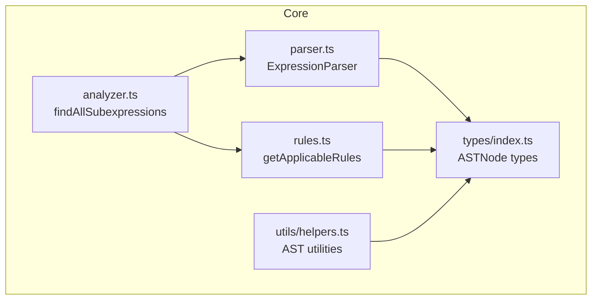
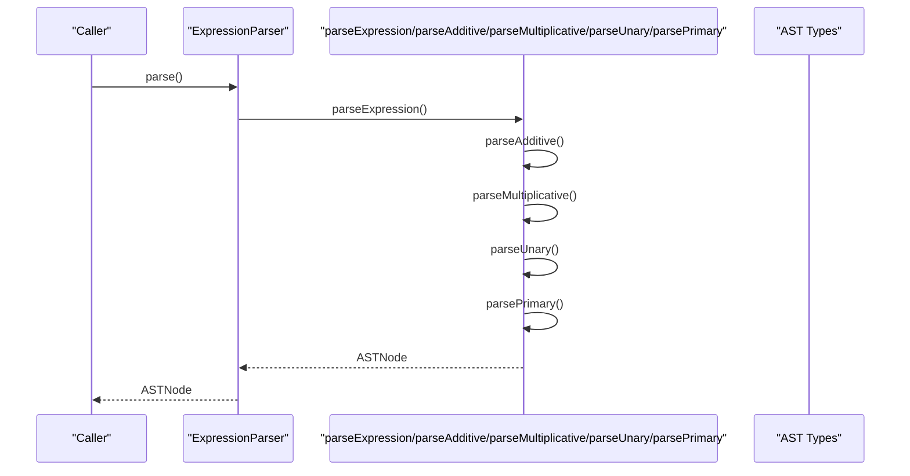
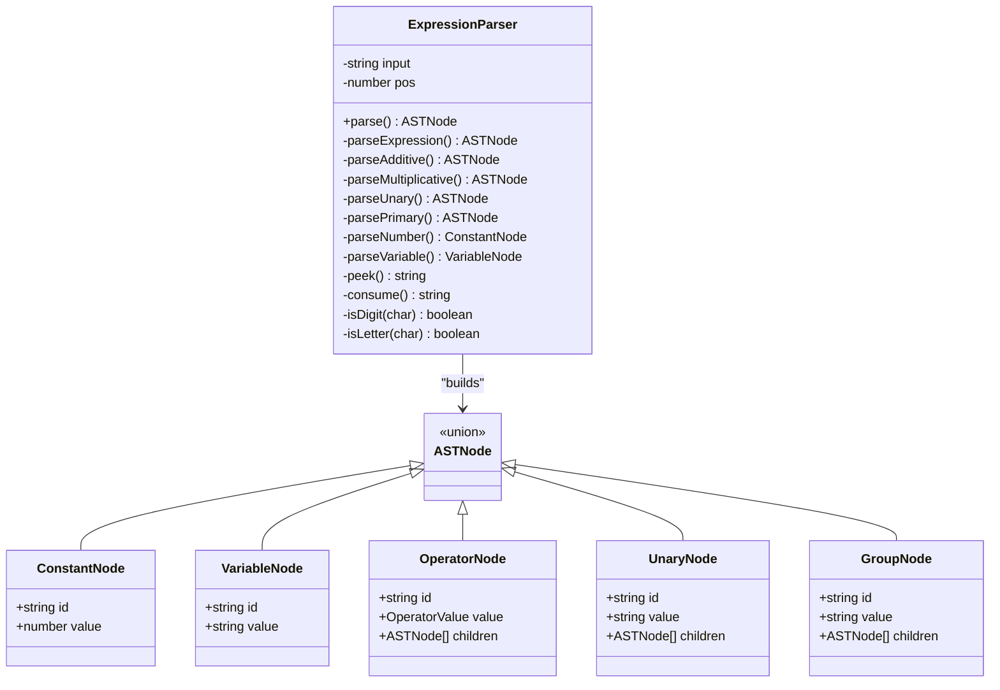
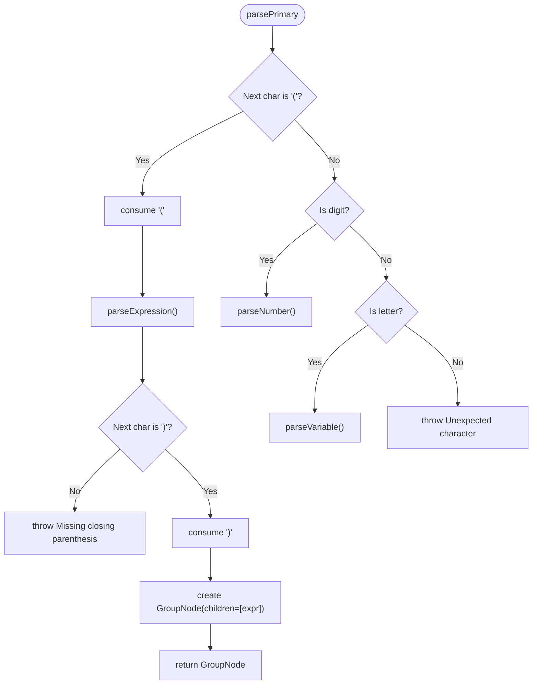
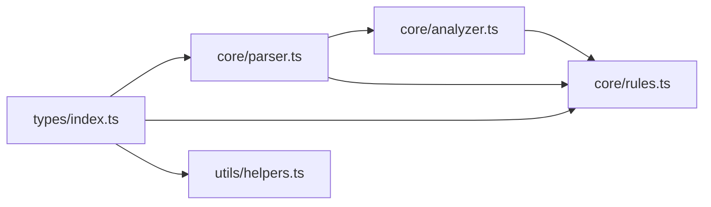

# Enhancing the Expression Parser

<cite>
**Referenced Files in This Document**
- [parser.ts](file://src/core/parser.ts)
- [analyzer.ts](file://src/core/analyzer.ts)
- [rules.ts](file://src/core/rules.ts)
- [index.ts](file://src/types/index.ts)
- [helpers.ts](file://src/utils/helpers.ts)
- [parser.test.ts](file://src/test/parser.test.ts)
- [analyzer.test.ts](file://src/test/analyzer.test.ts)
- [README.md](file://README.md)
</cite>

## Table of Contents
1. [Introduction](#introduction)
2. [Project Structure](#project-structure)
3. [Core Components](#core-components)
4. [Architecture Overview](#architecture-overview)
5. [Detailed Component Analysis](#detailed-component-analysis)
6. [Dependency Analysis](#dependency-analysis)
7. [Performance Considerations](#performance-considerations)
8. [Troubleshooting Guide](#troubleshooting-guide)
9. [Conclusion](#conclusion)
10. [Appendices](#appendices)

## Introduction
This document explains how to extend the recursive descent expression parser in parser.ts. It focuses on the ExpressionParser class and its methods for additive, multiplicative, unary, and primary expressions. You will learn how to add new operators or syntax constructs by modifying the appropriate parsing method, updating operator precedence and associativity, and ensuring compatibility with the analyzer and rules modules. Concrete examples are drawn from the existing codebase to illustrate how +, -, *, /, and parentheses are parsed and represented in the AST.

## Project Structure
The expression editor is organized around a small set of cohesive modules:
- Core parsing and AST construction live in parser.ts.
- Analyzer discovers valid subexpressions and computes layout.
- Rules define transformation categories and applicability.
- Types define AST node shapes and operator values.
- Utilities provide AST traversal and formatting helpers.
- Tests validate parsing behavior and precedence.

**Diagram sources**
- [parser.ts](file://src/core/parser.ts#L1-L159)
- [analyzer.ts](file://src/core/analyzer.ts#L1-L182)
- [rules.ts](file://src/core/rules.ts#L1-L434)
- [index.ts](file://src/types/index.ts#L1-L98)
- [helpers.ts](file://src/utils/helpers.ts#L1-L178)

**Section sources**
- [README.md](file://README.md#L42-L58)
- [parser.ts](file://src/core/parser.ts#L1-L159)
- [analyzer.ts](file://src/core/analyzer.ts#L1-L182)
- [rules.ts](file://src/core/rules.ts#L1-L434)
- [index.ts](file://src/types/index.ts#L1-L98)
- [helpers.ts](file://src/utils/helpers.ts#L1-L178)

## Core Components
- ExpressionParser: A recursive descent parser that builds an AST from a string expression. It exposes a public parse() method and internal parsing methods for additive, multiplicative, unary, and primary constructs.
- AST Node Types: Discriminated union types define constant, variable, operator, unary, and group nodes. Operator values are constrained to +, -, *, /.
- Analyzer: Uses ExpressionParser to find all valid subexpressions and compute layout levels and positions.
- Rules: Inspects AST nodes to produce transformation rules categorized by priority.

Key responsibilities:
- parser.ts: Token consumption, lookahead, precedence-driven recursion, and AST node creation.
- analyzer.ts: Iterates substrings, validates with ExpressionParser, collects rules, and computes layout.
- rules.ts: Matches AST node shapes to transformation rules and applies them.

**Section sources**
- [parser.ts](file://src/core/parser.ts#L1-L159)
- [index.ts](file://src/types/index.ts#L1-L98)
- [analyzer.ts](file://src/core/analyzer.ts#L1-L182)
- [rules.ts](file://src/core/rules.ts#L1-L238)

## Architecture Overview
The parser’s recursive descent enforces operator precedence by delegating to deeper parsing methods. The analyzer composes the parser to validate subexpressions, and the rules module consumes the resulting AST to propose transformations.

**Diagram sources**
- [parser.ts](file://src/core/parser.ts#L27-L117)
- [index.ts](file://src/types/index.ts#L1-L43)

## Detailed Component Analysis

### ExpressionParser Class and Methods
The parser uses a classic recursive descent approach:
- parseExpression delegates to parseAdditive.
- parseAdditive parses additive expressions with left-to-right associativity and respects multiplicative precedence by calling parseMultiplicative for each operand.
- parseMultiplicative parses multiplicative expressions with left-to-right associativity and respects unary precedence by calling parseUnary for each operand.
- parseUnary handles unary minus by recognizing it as a prefix operator and recursing into parseUnary for chaining.
- parsePrimary handles grouping with parentheses, numbers, and variables, and throws on invalid characters.

**Diagram sources**
- [parser.ts](file://src/core/parser.ts#L18-L159)
- [index.ts](file://src/types/index.ts#L1-L43)

**Section sources**
- [parser.ts](file://src/core/parser.ts#L27-L117)
- [index.ts](file://src/types/index.ts#L1-L43)

### Operator Precedence and Associativity
Current precedence hierarchy:
- Multiplicative (*, /) bind tighter than Additive (+, -).
- Unary (-) binds tighter than multiplicative.
- Parentheses override precedence.

Associativity:
- Additive and multiplicative are left-associative in the grammar (each iteration consumes the next operator and right-hand operand).

Examples from tests demonstrate:
- Multiplication over addition: 2 + 3 * 4 parses as 2 + (3 * 4).
- Division over subtraction: 10 - 8 / 2 parses as 10 - (8 / 2).
- Left-to-right evaluation for same precedence: 10 - 5 - 2 parses as (10 - 5) - 2.

These behaviors are implemented by the delegation order in parseExpression → parseAdditive → parseMultiplicative → parseUnary → parsePrimary.

**Section sources**
- [parser.test.ts](file://src/test/parser.test.ts#L125-L170)

### Adding a New Operator: Step-by-Step Guidance
To add a new operator (e.g., exponentiation ^) while preserving precedence and associativity:

1. Extend AST types
- Add the operator value to the OperatorValue union.
- Ensure the operator appears in the OperatorNode shape.

2. Update precedence hierarchy
- Choose a precedence level. For exponentiation, place it above multiplicative but below unary to match typical math conventions.
- Introduce a new parsing method (e.g., parseExponential) and insert it between parseMultiplicative and parseUnary.

3. Modify the relevant parsing method
- In parseMultiplicative, after consuming the left operand, loop for the new operator and recurse into parseUnary for the right operand.
- Ensure the new method follows the same pattern: consume operator, recurse right, construct OperatorNode, and chain left-to-right.

4. Maintain associativity
- For left-associative operators, keep the current loop pattern that folds left.
- For right-associative operators (like exponentiation), adjust the recursion to fold right by recursing into the operator method for the right-hand side.

5. Update AST node creation
- Construct OperatorNode with the new operator value and two children.

6. Integration with analyzer and rules
- The analyzer uses ExpressionParser to validate subexpressions; no changes needed there.
- The rules module inspects AST nodes by type and value; add new conditions for the operator in getApplicableRules.

7. Error handling and edge cases
- Ensure consume/peek logic remains consistent.
- Add tests for precedence, associativity, and parentheses interaction.

Concrete references in the codebase:
- Operator values and AST node shapes are defined in types/index.ts.
- Parser methods for additive and multiplicative are defined in parser.ts.
- Tests for precedence and associativity are in parser.test.ts.

**Section sources**
- [index.ts](file://src/types/index.ts#L1-L43)
- [parser.ts](file://src/core/parser.ts#L36-L117)
- [parser.test.ts](file://src/test/parser.test.ts#L125-L170)

### Example: Supporting Parentheses and Grouping
The parser recognizes parentheses in parsePrimary and wraps the enclosed expression in a GroupNode. This ensures parentheses override precedence and can be removed by simplification rules.

**Diagram sources**
- [parser.ts](file://src/core/parser.ts#L91-L117)

**Section sources**
- [parser.ts](file://src/core/parser.ts#L91-L117)

### Extending to Support Unary Operators Beyond Minus
The current unary handler recognizes only unary minus. To support additional unary operators (e.g., factorial or negation), extend parseUnary to recognize additional prefixes and create appropriate UnaryNode instances. Ensure precedence is above multiplicative and below parentheses.

Integration considerations:
- Analyzer and rules will treat UnaryNode uniformly; add rule applicability checks in rules.ts.
- Tests should cover chained unary operators and interaction with other constructs.

**Section sources**
- [parser.ts](file://src/core/parser.ts#L76-L89)
- [rules.ts](file://src/core/rules.ts#L125-L143)

### Maintaining Clean Separation Between Token Recognition and AST Construction
- Token recognition: peek/consume are used exclusively for scanning and moving position.
- AST construction: node creation happens in dedicated methods (parseNumber, parseVariable, parseUnary, parsePrimary) and in operator loops.

This separation makes it easier to add operators and syntax without mixing scanning and construction logic.

**Section sources**
- [parser.ts](file://src/core/parser.ts#L143-L159)

## Dependency Analysis
The modules depend on each other as follows:
- parser.ts depends on types/index.ts for AST node definitions.
- analyzer.ts depends on parser.ts to validate subexpressions and on rules.ts to collect applicable rules.
- rules.ts depends on types/index.ts and parser.ts for node IDs and AST shapes.
- helpers.ts depends on types/index.ts for AST traversal and formatting.

**Diagram sources**
- [index.ts](file://src/types/index.ts#L1-L98)
- [parser.ts](file://src/core/parser.ts#L1-L159)
- [analyzer.ts](file://src/core/analyzer.ts#L1-L182)
- [rules.ts](file://src/core/rules.ts#L1-L434)
- [helpers.ts](file://src/utils/helpers.ts#L1-L178)

**Section sources**
- [index.ts](file://src/types/index.ts#L1-L98)
- [parser.ts](file://src/core/parser.ts#L1-L159)
- [analyzer.ts](file://src/core/analyzer.ts#L1-L182)
- [rules.ts](file://src/core/rules.ts#L1-L434)
- [helpers.ts](file://src/utils/helpers.ts#L1-L178)

## Performance Considerations
- Complexity: The recursive descent parser runs in linear time relative to the input length, with constant-time recursion per operator level.
- Memory: AST construction creates O(n) nodes; deep nesting increases call stack depth.
- Optimizations:
  - Avoid redundant whitespace stripping by normalizing input once.
  - Consider iterative parsing for extremely deep expressions to reduce recursion overhead.
  - Cache repeated subexpressions during analysis if needed.

[No sources needed since this section provides general guidance]

## Troubleshooting Guide
Common issues and resolutions:
- Infinite loops in recursive parsing
  - Cause: Missing consume in operator loops or incorrect precedence delegation.
  - Resolution: Ensure each operator loop consumes the operator and recurses on the next lower-precedence method.

- Unexpected token errors
  - Cause: parsePrimary throws on invalid characters; unmatched parentheses trigger explicit errors.
  - Resolution: Validate input before parsing and ensure balanced parentheses.

- Incorrect precedence
  - Cause: Operator method ordering not reflecting precedence.
  - Resolution: Adjust method delegation so higher-precedence operators are recognized earlier.

- Missing closing parenthesis
  - Symptom: Error thrown when consuming ')'.
  - Resolution: Ensure parentheses are balanced and parsePrimary consumes the closing parenthesis.

- Double operator or operator at start
  - Symptom: Errors for sequences like “2 * * 3” or “+ 2”.
  - Resolution: Ensure parseUnary does not accept bare operators except unary minus.

- Empty or whitespace-only input
  - Symptom: Error indicating empty expression.
  - Resolution: Guard against empty input in parse().

**Section sources**
- [parser.ts](file://src/core/parser.ts#L27-L34)
- [parser.ts](file://src/core/parser.ts#L91-L117)
- [parser.test.ts](file://src/test/parser.test.ts#L250-L313)

## Conclusion
The ExpressionParser provides a clean, extensible foundation for building an expression editor. By following the documented steps—extending types, inserting a new parsing method at the correct precedence level, preserving associativity, and integrating with analyzer and rules—you can safely add new operators and syntax constructs. The existing tests and AST utilities offer strong guarantees for correctness and compatibility.

[No sources needed since this section summarizes without analyzing specific files]

## Appendices

### Appendix A: Operator Precedence Reference
- Highest precedence: Unary (-)
- Next: Multiplicative (*, /)
- Lowest precedence: Additive (+, -)
- Parentheses override precedence.

**Section sources**
- [parser.ts](file://src/core/parser.ts#L36-L117)
- [parser.test.ts](file://src/test/parser.test.ts#L125-L170)

### Appendix B: AST Node Shapes
- ConstantNode: numeric value.
- VariableNode: identifier string.
- OperatorNode: operator value and ordered children.
- UnaryNode: unary operator and single child.
- GroupNode: parenthesized expression.

**Section sources**
- [index.ts](file://src/types/index.ts#L1-L43)

### Appendix C: Analyzer and Rules Integration Notes
- Analyzer uses ExpressionParser to validate subexpressions and attaches rules via getApplicableRules.
- Rules inspect AST node types and values to determine applicability.

**Section sources**
- [analyzer.ts](file://src/core/analyzer.ts#L13-L79)
- [rules.ts](file://src/core/rules.ts#L12-L238)