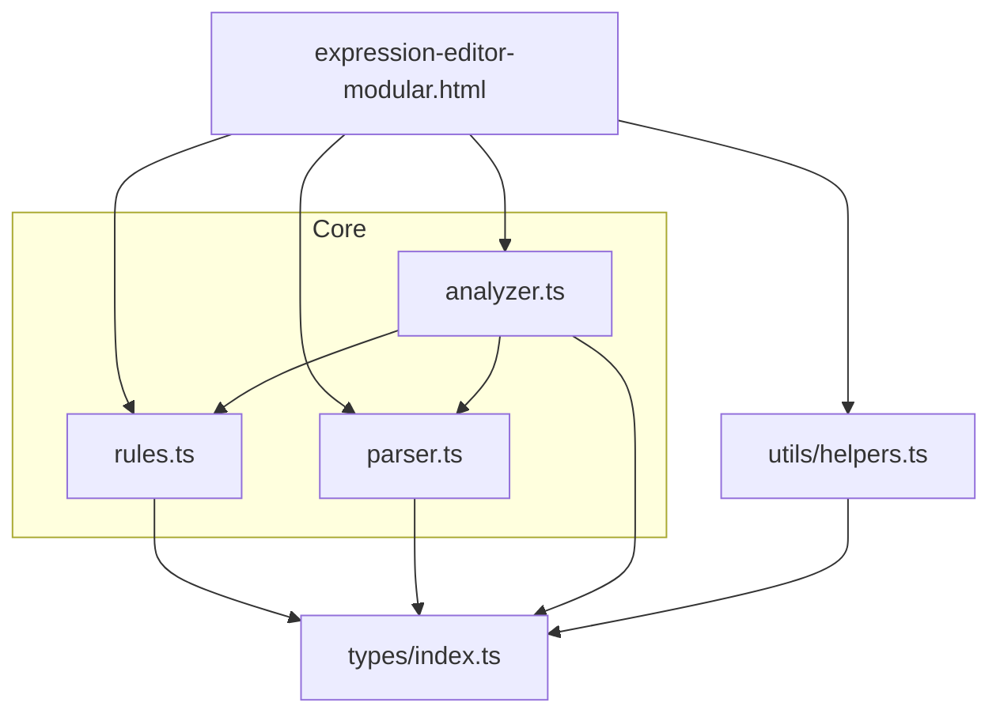
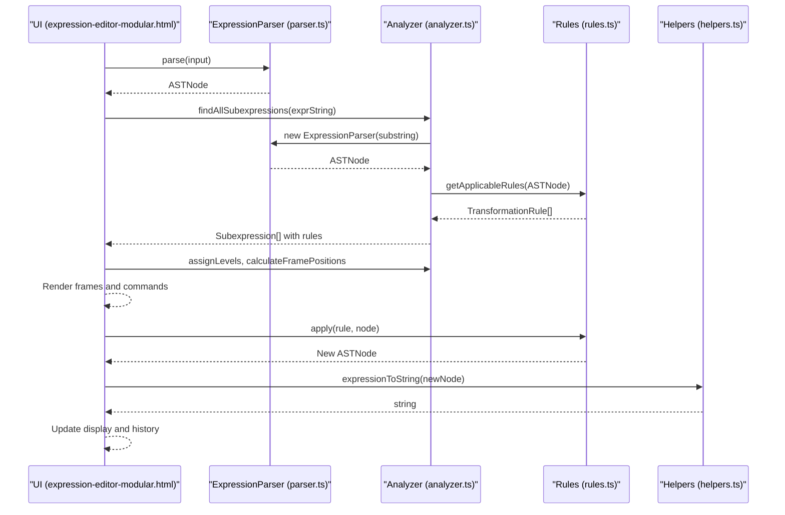
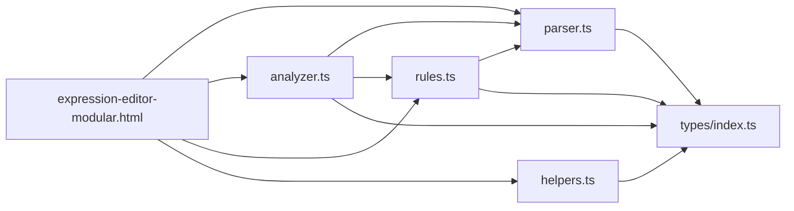

# Extending the Application

<cite>
**Referenced Files in This Document**
- [README.md](file://README.md)
- [package.json](file://package.json)
- [src/core/parser.ts](file://src/core/parser.ts)
- [src/core/analyzer.ts](file://src/core/analyzer.ts)
- [src/core/rules.ts](file://src/core/rules.ts)
- [src/types/index.ts](file://src/types/index.ts)
- [src/utils/helpers.ts](file://src/utils/helpers.ts)
- [expression-editor-modular.html](file://expression-editor-modular.html)
- [src/test/parser.test.ts](file://src/test/parser.test.ts)
- [src/test/rules.test.ts](file://src/test/rules.test.ts)
- [src/test/analyzer.test.ts](file://src/test/analyzer.test.ts)
</cite>

## Table of Contents
1. [Introduction](#introduction)
2. [Project Structure](#project-structure)
3. [Core Components](#core-components)
4. [Architecture Overview](#architecture-overview)
5. [Detailed Component Analysis](#detailed-component-analysis)
6. [Dependency Analysis](#dependency-analysis)
7. [Performance Considerations](#performance-considerations)
8. [Troubleshooting Guide](#troubleshooting-guide)
9. [Conclusion](#conclusion)
10. [Appendices](#appendices)

## Introduction
This document explains how to extend the MathHelper application. It focuses on three primary extension points:
- Adding new transformation rules in rules.ts
- Enhancing parser capabilities in parser.ts for new operators or syntax
- Customizing the UI in expression-editor-modular.html

It also covers integration considerations to maintain type safety and compatibility, along with troubleshooting and performance guidance.

## Project Structure
The application is organized into modular TypeScript packages with a clean separation of concerns:
- Core logic: parser, analyzer, rules
- Types: shared AST and rule types
- Utilities: AST helpers
- UI: modular HTML page with embedded script

**Diagram sources**
- [src/core/parser.ts](file://src/core/parser.ts#L1-L159)
- [src/core/analyzer.ts](file://src/core/analyzer.ts#L1-L182)
- [src/core/rules.ts](file://src/core/rules.ts#L1-L434)
- [src/types/index.ts](file://src/types/index.ts#L1-L98)
- [src/utils/helpers.ts](file://src/utils/helpers.ts#L1-L178)
- [expression-editor-modular.html](file://expression-editor-modular.html#L490-L856)

**Section sources**
- [README.md](file://README.md#L42-L58)
- [package.json](file://package.json#L1-L33)

## Core Components
- Parser: converts expressions into AST nodes with recursive descent parsing and operator precedence.
- Analyzer: enumerates valid subexpressions, assigns levels to avoid overlaps, and computes frame positions.
- Rules: defines transformation rules with categories and applies transformations to AST nodes.
- Types: defines AST node shapes and rule metadata.
- Helpers: utilities for AST conversion, cloning, traversal, and equality checks.
- UI: modular HTML page orchestrating parsing, analysis, rule application, and history.

Key integration points:
- The HTML imports parser, analyzer, rules, and helpers as ES modules.
- The analyzer uses getApplicableRules to filter meaningful subexpressions.
- The UI builds the AST, renders frames, and applies rule transformations.

**Section sources**
- [src/core/parser.ts](file://src/core/parser.ts#L1-L159)
- [src/core/analyzer.ts](file://src/core/analyzer.ts#L1-L182)
- [src/core/rules.ts](file://src/core/rules.ts#L1-L434)
- [src/types/index.ts](file://src/types/index.ts#L1-L98)
- [src/utils/helpers.ts](file://src/utils/helpers.ts#L1-L178)
- [expression-editor-modular.html](file://expression-editor-modular.html#L490-L856)

## Architecture Overview
The runtime flow connects the UI to the core modules:

**Diagram sources**
- [expression-editor-modular.html](file://expression-editor-modular.html#L560-L761)
- [src/core/analyzer.ts](file://src/core/analyzer.ts#L13-L79)
- [src/core/parser.ts](file://src/core/parser.ts#L27-L117)
- [src/core/rules.ts](file://src/core/rules.ts#L12-L238)
- [src/utils/helpers.ts](file://src/utils/helpers.ts#L11-L30)

## Detailed Component Analysis

### Extension Point 1: Adding New Transformation Rules (rules.ts)
Rules are categorized and conditionally offered based on AST shape. Each rule has:
- id: unique identifier
- name: human-readable label
- category: one of Computation, Simplification, Transformation, Rearrangement, Wrapping
- preview: textual description of the change
- apply: function transforming an AST node into another AST node

How to add a new rule:
1. Define a new getApplicableRules branch that matches your condition on node.type and node.value.
2. Push a TransformationRule object with a unique id, descriptive name, category, preview, and apply function.
3. Implement the apply function to return a new ASTNode (often using generateId for new node ids).
4. Ensure the apply function preserves type safety by returning the correct node type.

Integration considerations:
- Keep categories aligned with existing ones to preserve UI grouping.
- Use generateId to ensure unique ids for new nodes.
- Keep previews concise and accurate to aid user understanding.

Example references:
- Computation rules for constant arithmetic
- Simplification rules for identities and parentheses removal
- Transformation rules for distributive expansion
- Rearrangement rules for commutativity
- Wrapping rules for identity transformations

**Section sources**
- [src/core/rules.ts](file://src/core/rules.ts#L12-L238)
- [src/core/rules.ts](file://src/core/rules.ts#L240-L434)
- [src/types/index.ts](file://src/types/index.ts#L45-L62)
- [src/core/parser.ts](file://src/core/parser.ts#L10-L12)

### Extension Point 2: Enhancing Parser Capabilities (parser.ts)
The parser uses a classic recursive descent approach with operator precedence:
- parseExpression delegates to parseAdditive
- parseAdditive chains left-associatively over + and -
- parseMultiplicative chains left-associatively over * and /
- parseUnary handles unary minus
- parsePrimary handles parentheses, numbers, and variables

To add a new operator or syntax:
1. Extend OperatorValue in types/index.ts if needed.
2. Add a new parsing method (e.g., parsePower) and integrate it into the precedence chain.
3. Ensure precedence is correct and parentheses override precedence.
4. Update error handling and validation to reject malformed constructs.
5. Verify that the new syntax integrates with AST types.

Important parsing behaviors to preserve:
- Whitespace normalization
- Left-to-right association for same-precedence operators
- Parentheses override precedence
- Proper error messages for invalid inputs

**Section sources**
- [src/core/parser.ts](file://src/core/parser.ts#L18-L159)
- [src/types/index.ts](file://src/types/index.ts#L7-L12)
- [src/test/parser.test.ts](file://src/test/parser.test.ts#L125-L170)

### Extension Point 3: Customizing the UI (expression-editor-modular.html)
The UI is structured into three panels:
- Left: Commands panel showing available transformations grouped by category
- Center: Expression display with hover-highlight and clickable frames
- Right: History and rule description panels

Customization options:
- Modify inline styles and CSS variables to adjust theme and layout
- Adjust grid layout and spacing in the app-layout container
- Change command rendering (categories, preview text) to reflect new rules
- Update error messaging and placeholders
- Add new interactive elements (buttons, inputs) and wire event handlers

Integration considerations:
- Keep module imports consistent with the build pipeline
- Preserve DOM element ids referenced by the script
- Maintain accessibility and responsive behavior
- Ensure rule descriptions remain synchronized with rule ids

**Section sources**
- [expression-editor-modular.html](file://expression-editor-modular.html#L1-L120)
- [expression-editor-modular.html](file://expression-editor-modular.html#L433-L488)
- [expression-editor-modular.html](file://expression-editor-modular.html#L490-L856)

## Dependency Analysis
The modules depend on each other as follows:

**Diagram sources**
- [expression-editor-modular.html](file://expression-editor-modular.html#L490-L530)
- [src/core/analyzer.ts](file://src/core/analyzer.ts#L1-L12)
- [src/core/parser.ts](file://src/core/parser.ts#L1-L12)
- [src/core/rules.ts](file://src/core/rules.ts#L1-L12)
- [src/types/index.ts](file://src/types/index.ts#L1-L44)

**Section sources**
- [src/core/analyzer.ts](file://src/core/analyzer.ts#L1-L12)
- [src/core/parser.ts](file://src/core/parser.ts#L1-L12)
- [src/core/rules.ts](file://src/core/rules.ts#L1-L12)
- [src/types/index.ts](file://src/types/index.ts#L1-L44)

## Performance Considerations
- Analyzer complexity: The analyzer enumerates all substrings and attempts to parse each, resulting in O(n^3) potential checks for n characters. This is acceptable for typical educational expressions but can degrade with very long inputs. Consider limiting maximum expression length or caching repeated subexpression parses.
- Rendering frames: Creating many DOM elements for frames scales with the number of subexpressions. Prefer virtualization or throttling updates for extremely large expressions.
- Rule application: Each transformation rebuilds the AST and re-renders frames. Batch operations or incremental updates could reduce overhead.
- Parser robustness: The recursive descent parser is efficient and predictable. Adding new operators should preserve O(n) parsing time.

[No sources needed since this section provides general guidance]

## Troubleshooting Guide
Common issues and resolutions:
- Parser errors:
  - Empty or whitespace-only input throws an error. Ensure input validation before parsing.
  - Unmatched parentheses or unexpected characters cause parse failures. Provide clear error messages and highlight positions.
  - Double operators or invalid prefixes are rejected. Validate input format early.
- Analyzer produces no subexpressions:
  - If no rules apply to a subexpression, it is filtered out. Confirm that your rule id and category are correct and that the rule’s condition matches the AST shape.
- Frames not appearing:
  - Ensure findAllSubexpressions returns results and that assignLevels and calculateFramePositions are invoked. Check that the expression string is non-empty and properly sanitized.
- Rule application fails:
  - Verify that the rule’s apply function returns a valid ASTNode of the correct type. Use generateId for new nodes and ensure node ids are unique.
- UI not updating:
  - Confirm that the HTML script updates the DOM elements and rebuilds the expression after applying a rule. Check that addToHistory and renderHistory are invoked.

**Section sources**
- [src/test/parser.test.ts](file://src/test/parser.test.ts#L250-L313)
- [src/test/rules.test.ts](file://src/test/rules.test.ts#L368-L400)
- [src/core/analyzer.ts](file://src/core/analyzer.ts#L13-L79)
- [expression-editor-modular.html](file://expression-editor-modular.html#L560-L761)

## Conclusion
Extending MathHelper involves three main areas:
- Rules: Add new conditions and transformations in rules.ts with careful attention to categories and AST correctness.
- Parser: Extend precedence and grammar in parser.ts while preserving error handling and associativity.
- UI: Customize expression-editor-modular.html to reflect new rules and enhance user interaction.

Maintain type safety by leveraging the shared types, keep rules deterministic and reversible, and validate inputs rigorously. With these practices, new features integrate smoothly and remain compatible with existing modules.

[No sources needed since this section summarizes without analyzing specific files]

## Appendices

### Step-by-Step Guides

#### Adding a New Rule in rules.ts
1. Decide the rule category and condition (e.g., detect a specific operator pattern).
2. Add a new getApplicableRules branch that pushes a TransformationRule with:
   - Unique id
   - Human-friendly name
   - Category
   - Preview text
   - apply function returning a new ASTNode
3. Implement apply to construct the transformed AST using generateId for new nodes.
4. Test by parsing an expression and verifying the rule appears and transforms correctly.

References:
- [src/core/rules.ts](file://src/core/rules.ts#L12-L238)
- [src/core/rules.ts](file://src/core/rules.ts#L240-L434)
- [src/types/index.ts](file://src/types/index.ts#L45-L62)
- [src/core/parser.ts](file://src/core/parser.ts#L10-L12)

#### Enhancing the Parser in parser.ts
1. Extend OperatorValue in types/index.ts if adding a new operator.
2. Add a new parsing method (e.g., parsePower) and insert it into the precedence chain.
3. Ensure left-to-right association for same-precedence operators and parentheses override precedence.
4. Add tests covering precedence, associativity, and error cases.

References:
- [src/core/parser.ts](file://src/core/parser.ts#L18-L159)
- [src/types/index.ts](file://src/types/index.ts#L7-L12)
- [src/test/parser.test.ts](file://src/test/parser.test.ts#L125-L170)

#### Customizing the UI in expression-editor-modular.html
1. Modify inline styles or extract to styles.css to adjust layout and theme.
2. Update command rendering to include new rule categories and previews.
3. Wire new DOM elements and event handlers to support additional interactions.
4. Keep module imports intact and preserve element ids referenced by the script.

References:
- [expression-editor-modular.html](file://expression-editor-modular.html#L1-L120)
- [expression-editor-modular.html](file://expression-editor-modular.html#L433-L488)
- [expression-editor-modular.html](file://expression-editor-modular.html#L490-L856)

### Integration Checklist
- Type safety: Use ASTNode union types and type guards; ensure apply functions return correct node types.
- Compatibility: Keep rule ids unique; update rule descriptions; maintain consistent categories.
- Testing: Add unit tests for new rules and parser extensions; verify UI behavior under edge cases.
- Performance: Limit expression length for analyzer; debounce heavy UI updates; cache repeated computations where appropriate.

**Section sources**
- [src/types/index.ts](file://src/types/index.ts#L1-L98)
- [src/test/rules.test.ts](file://src/test/rules.test.ts#L368-L400)
- [src/test/parser.test.ts](file://src/test/parser.test.ts#L250-L313)
- [README.md](file://README.md#L144-L164)