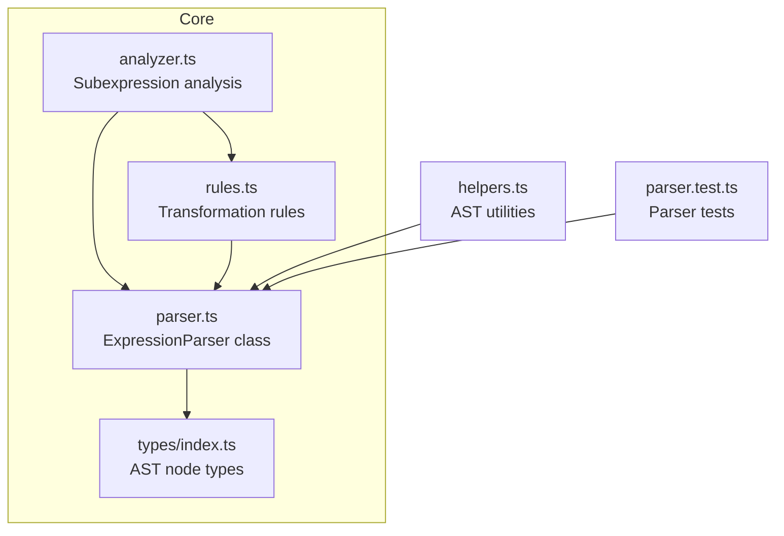
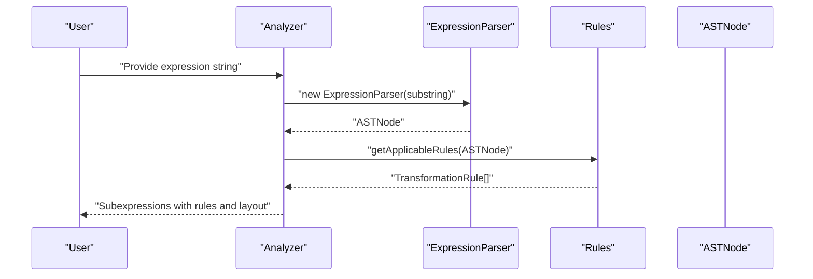
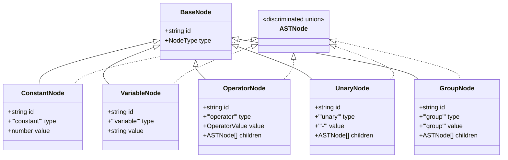
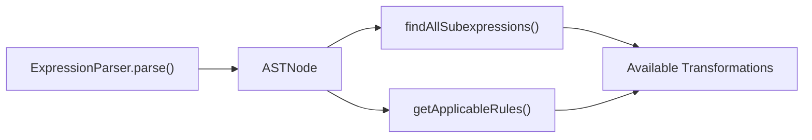
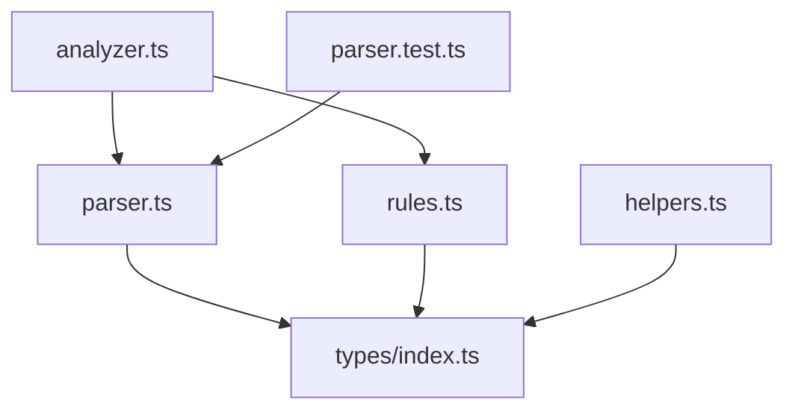

# Parser Module

<cite>
**Referenced Files in This Document**
- [parser.ts](file://src/core/parser.ts)
- [types/index.ts](file://src/types/index.ts)
- [analyzer.ts](file://src/core/analyzer.ts)
- [rules.ts](file://src/core/rules.ts)
- [helpers.ts](file://src/utils/helpers.ts)
- [parser.test.ts](file://src/test/parser.test.ts)
- [README.md](file://README.md)
</cite>

## Table of Contents
1. [Introduction](#introduction)
2. [Project Structure](#project-structure)
3. [Core Components](#core-components)
4. [Architecture Overview](#architecture-overview)
5. [Detailed Component Analysis](#detailed-component-analysis)
6. [Dependency Analysis](#dependency-analysis)
7. [Performance Considerations](#performance-considerations)
8. [Troubleshooting Guide](#troubleshooting-guide)
9. [Conclusion](#conclusion)

## Introduction
This document explains the Parser module responsible for converting mathematical expression strings into an Abstract Syntax Tree (AST). It covers the recursive descent parsing algorithm, operator precedence and associativity handling, parentheses support, AST node types, the public interface, error handling, and the relationship with Analyzer and Rules. It also includes examples of how expressions like "2*(x+3)" are parsed into AST structures and addresses common parsing issues and performance considerations.

## Project Structure
The Parser module resides under src/core and collaborates with type definitions, analyzer utilities, and transformation rules.

**Diagram sources**
- [parser.ts](file://src/core/parser.ts#L1-L159)
- [types/index.ts](file://src/types/index.ts#L1-L43)
- [analyzer.ts](file://src/core/analyzer.ts#L1-L182)
- [rules.ts](file://src/core/rules.ts#L1-L238)
- [helpers.ts](file://src/utils/helpers.ts#L1-L178)
- [parser.test.ts](file://src/test/parser.test.ts#L1-L379)

**Section sources**
- [README.md](file://README.md#L42-L58)
- [parser.ts](file://src/core/parser.ts#L1-L159)
- [types/index.ts](file://src/types/index.ts#L1-L43)

## Core Components
- ExpressionParser: Implements recursive descent parsing with explicit precedence and associativity handling.
- AST Node Types: Discriminated union of node shapes for type safety.
- Analyzer: Uses the parser to discover valid subexpressions and compute layout.
- Rules: Provides transformation rules that operate on AST nodes produced by the parser.
- Helpers: Utilities for string conversion, cloning, traversal, and replacement of AST nodes.

Key responsibilities:
- Parse arithmetic expressions with constants, variables, binary operators (+, -, *, /), unary minus, and parentheses.
- Enforce operator precedence and left-to-right associativity for same-precedence operators.
- Produce a strongly typed AST for downstream analysis and transformations.

**Section sources**
- [parser.ts](file://src/core/parser.ts#L1-L159)
- [types/index.ts](file://src/types/index.ts#L1-L43)
- [analyzer.ts](file://src/core/analyzer.ts#L1-L182)
- [rules.ts](file://src/core/rules.ts#L1-L238)
- [helpers.ts](file://src/utils/helpers.ts#L1-L178)

## Architecture Overview
The Parser integrates with Analyzer and Rules to enable interactive educational workflows. Analyzer builds on the Parser to find subexpressions and compute visual layout. Rules consumes the resulting AST to propose transformations.

**Diagram sources**
- [analyzer.ts](file://src/core/analyzer.ts#L13-L79)
- [parser.ts](file://src/core/parser.ts#L18-L34)
- [rules.ts](file://src/core/rules.ts#L12-L238)

## Detailed Component Analysis

### Recursive Descent Parser: ExpressionParser
The parser uses a classic recursive descent approach with separate methods for grammar levels:
- parseExpression → parseAdditive
- parseAdditive handles + and - with left-to-right associativity.
- parseMultiplicative handles * and / with left-to-right associativity.
- parseUnary handles unary minus and delegates to parsePrimary.
- parsePrimary handles parentheses, numbers, and variables.

Operator precedence:
- parseMultiplicative is invoked before parseAdditive, ensuring * and / bind tighter than + and -.
- parseUnary is invoked before parseMultiplicative, so unary minus binds tightly to its operand.

Associativity:
- Left-to-right is enforced by building left-leaning trees in parseAdditive and parseMultiplicative.

Parentheses:
- Enclosed subexpressions are parsed recursively and wrapped in a group node.

Error handling:
- Throws on empty input, unmatched parentheses, unexpected characters, and incomplete expressions.

Public interface:
- Constructor(input: string)
- parse(): ASTNode
- Internal helpers: parseAdditive, parseMultiplicative, parseUnary, parsePrimary, parseNumber, parseVariable, peek, consume, isDigit, isLetter.

Example: "2*(x+3)"
- parseUnary recognizes no unary minus at start.
- parsePrimary sees '2' and parses a constant node.
- parseMultiplicative continues with '*' and parses the group "(x+3)".
- parsePrimary inside the group sees '(' and recurses into parseExpression.
- parseExpression → parseAdditive parses "x+3" as an operator node with children [variable x, constant 3].
- The outer parseMultiplicative produces an operator node "*" with children [constant 2, group "(x+3)"].

Validation and tests:
- The test suite verifies precedence, associativity, parentheses, unary, and error conditions.

**Section sources**
- [parser.ts](file://src/core/parser.ts#L18-L159)
- [parser.test.ts](file://src/test/parser.test.ts#L125-L210)
- [parser.test.ts](file://src/test/parser.test.ts#L212-L248)
- [parser.test.ts](file://src/test/parser.test.ts#L250-L313)

### AST Node Types and Discriminated Union
The AST is modeled as a discriminated union with a base shape and specialized variants:
- BaseNode: id, type
- ConstantNode: type 'constant', value number
- VariableNode: type 'variable', value string
- OperatorNode: type 'operator', value '+', '-', '*', '/' with children [left, right]
- UnaryNode: type 'unary', value '-', children [operand]
- GroupNode: type 'group', value 'group', children [expression]

This design ensures exhaustive pattern matching and type safety across the system.

**Diagram sources**
- [types/index.ts](file://src/types/index.ts#L1-L43)

**Section sources**
- [types/index.ts](file://src/types/index.ts#L1-L43)

### Public Interface: ExpressionParser
- Constructor(input: string)
  - Strips whitespace from input and initializes position.
- parse(): ASTNode
  - Validates non-empty input.
  - Invokes parseExpression and ensures full consumption of input.
  - Throws descriptive errors for invalid syntax.

Parsing methods:
- parseExpression → parseAdditive
- parseAdditive: handles '+' and '-' with left-to-right associativity.
- parseMultiplicative: handles '*' and '/' with left-to-right associativity.
- parseUnary: recognizes unary minus and recurses.
- parsePrimary: handles '(', numbers, variables, and throws on invalid characters.

Utility helpers:
- peek(): returns current character or empty string.
- consume(): advances position and returns consumed character.
- isDigit(char): checks digit.
- isLetter(char): checks alphabetic.

Id generation:
- generateId(): unique node identifiers.
- resetIdCounter(): resets the global counter.

**Section sources**
- [parser.ts](file://src/core/parser.ts#L18-L159)

### Relationship Between Parser, Analyzer, and Rules
- Analyzer uses ExpressionParser to convert candidate substrings into AST nodes and filters out invalid expressions.
- Analyzer computes subexpression metadata and assigns levels to avoid visual overlap.
- Rules consumes AST nodes to produce transformation rules for interactive editing.
- Parser’s AST is the shared contract enabling Analyzer and Rules to operate on the same structured representation.

**Diagram sources**
- [analyzer.ts](file://src/core/analyzer.ts#L13-L79)
- [rules.ts](file://src/core/rules.ts#L12-L238)
- [parser.ts](file://src/core/parser.ts#L27-L34)

**Section sources**
- [analyzer.ts](file://src/core/analyzer.ts#L1-L182)
- [rules.ts](file://src/core/rules.ts#L1-L238)
- [parser.ts](file://src/core/parser.ts#L1-L159)

### Example: Parsing "2*(x+3)"
- parseUnary: no unary minus at start.
- parsePrimary: recognizes '2' as a constant.
- parseMultiplicative: sees '*' and recurses into parseUnary for the right-hand side.
- parsePrimary inside group: '(' triggers recursion into parseExpression.
- parseExpression → parseAdditive: parses "x+3" as an operator node with children [variable x, constant 3].
- Outer parseMultiplicative: creates an operator node "*" with children [constant 2, group "(x+3)"].

Validation:
- The test suite confirms precedence and grouping behavior for this expression.

**Section sources**
- [parser.test.ts](file://src/test/parser.test.ts#L172-L210)

### Error Handling Mechanisms
Common errors and messages:
- Empty expression: thrown when input is blank or only whitespace.
- Missing closing parenthesis: thrown when ')' is absent.
- Unexpected character: thrown for invalid tokens.
- Incomplete expression: thrown when an operator appears without a right-hand operand.
- Double operator: thrown for consecutive operators without a valid operand.
- Empty parentheses: thrown for "()".

These validations occur during parsing and ensure robustness against malformed input.

**Section sources**
- [parser.ts](file://src/core/parser.ts#L27-L34)
- [parser.ts](file://src/core/parser.ts#L93-L117)
- [parser.test.ts](file://src/test/parser.test.ts#L250-L313)

## Dependency Analysis
- Parser depends on AST node types for constructing AST nodes.
- Analyzer depends on Parser to validate and construct AST nodes for subexpressions.
- Rules depends on AST node types and Parser-generated AST nodes to compute applicable transformations.
- Helpers depend on AST node types for AST utilities.

**Diagram sources**
- [parser.ts](file://src/core/parser.ts#L1-L159)
- [types/index.ts](file://src/types/index.ts#L1-L43)
- [analyzer.ts](file://src/core/analyzer.ts#L1-L182)
- [rules.ts](file://src/core/rules.ts#L1-L238)
- [helpers.ts](file://src/utils/helpers.ts#L1-L178)
- [parser.test.ts](file://src/test/parser.test.ts#L1-L379)

**Section sources**
- [parser.ts](file://src/core/parser.ts#L1-L159)
- [analyzer.ts](file://src/core/analyzer.ts#L1-L182)
- [rules.ts](file://src/core/rules.ts#L1-L238)
- [types/index.ts](file://src/types/index.ts#L1-L43)
- [helpers.ts](file://src/utils/helpers.ts#L1-L178)
- [parser.test.ts](file://src/test/parser.test.ts#L1-L379)

## Performance Considerations
- Time complexity: Linear in the length of the input string, with constant-time operations per token.
- Space complexity: Proportional to the number of AST nodes, reflecting nesting and operator counts.
- Optimizations:
  - Whitespace removal occurs once in the constructor.
  - Single-pass parsing with no backtracking.
  - Minimal allocations by reusing node construction logic.
- Practical tips:
  - Prefer pre-normalized input to avoid repeated whitespace stripping.
  - For very large expressions, consider streaming or chunked parsing if needed.
  - Avoid excessive nested parentheses that inflate AST size.

[No sources needed since this section provides general guidance]

## Troubleshooting Guide
Common issues and resolutions:
- Unexpected character errors:
  - Ensure only supported tokens are present: digits, letters, '+', '-', '*', '/', '(', ')'.
- Missing closing parenthesis:
  - Verify balanced parentheses; each '(' must have a matching ')'.
- Unary minus placement:
  - Unary minus applies to the immediately following term; wrap complex expressions in parentheses if needed.
- Operator misuse:
  - Avoid leading operators except unary minus; avoid double operators like "**".
- Empty or whitespace-only input:
  - Provide a non-empty expression; the parser rejects empty input.

Diagnostic aids:
- Use the test suite patterns to validate expected AST structures for your expressions.
- Utilize helpers to convert AST back to string for inspection.

**Section sources**
- [parser.ts](file://src/core/parser.ts#L27-L34)
- [parser.ts](file://src/core/parser.ts#L93-L117)
- [parser.test.ts](file://src/test/parser.test.ts#L250-L313)
- [helpers.ts](file://src/utils/helpers.ts#L11-L30)

## Conclusion
The Parser module implements a clean, type-safe recursive descent parser that respects operator precedence and associativity, supports parentheses, and produces a robust AST. Its integration with Analyzer and Rules enables interactive, educational workflows. The AST node types form a discriminated union that simplifies safe handling across the system. The provided tests and helpers offer strong coverage and practical utilities for working with parsed expressions.