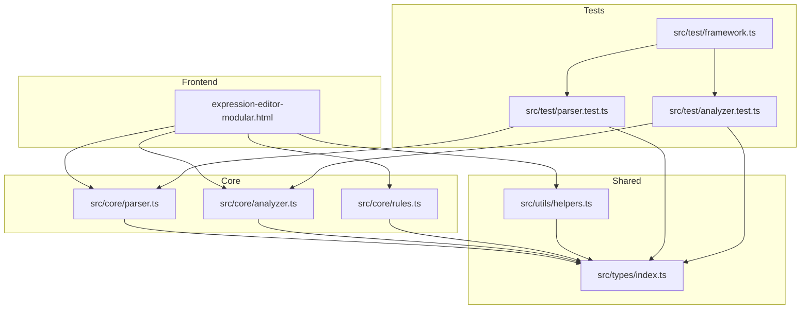
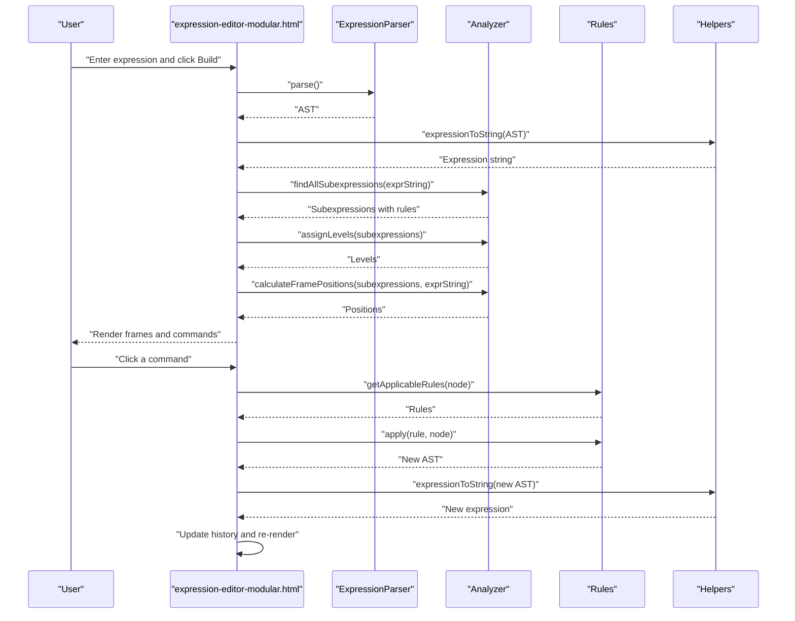
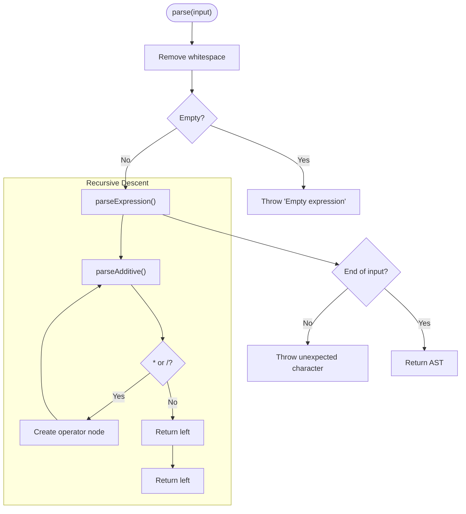
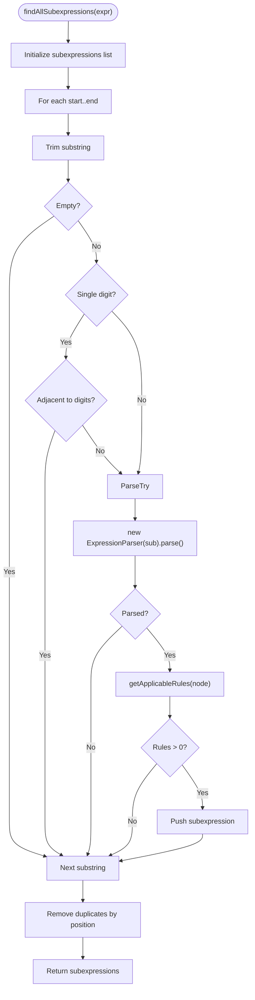
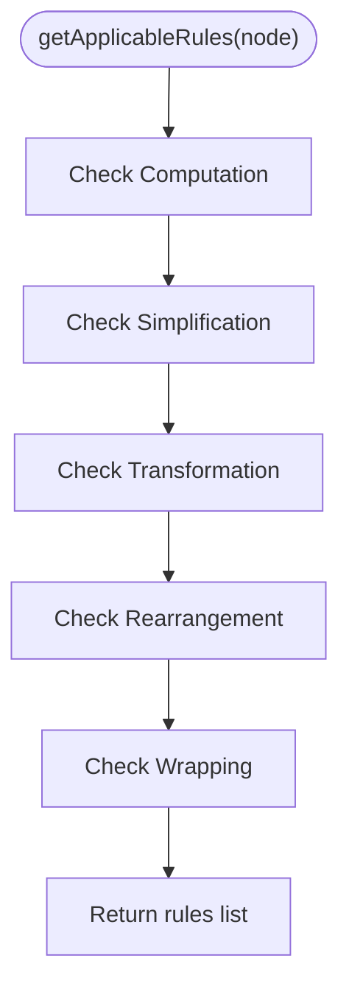
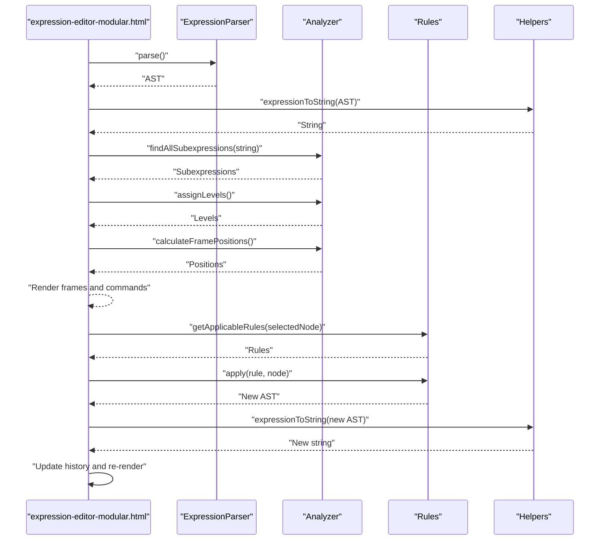
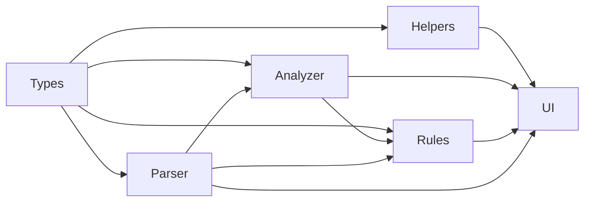

# Project Overview

<cite>
**Referenced Files in This Document**
- [README.md](file://README.md)
- [package.json](file://package.json)
- [src/core/parser.ts](file://src/core/parser.ts)
- [src/core/analyzer.ts](file://src/core/analyzer.ts)
- [src/core/rules.ts](file://src/core/rules.ts)
- [src/types/index.ts](file://src/types/index.ts)
- [src/utils/helpers.ts](file://src/utils/helpers.ts)
- [expression-editor-modular.html](file://expression-editor-modular.html)
- [src/test/parser.test.ts](file://src/test/parser.test.ts)
- [src/test/analyzer.test.ts](file://src/test/analyzer.test.ts)
- [src/test/framework.ts](file://src/test/framework.ts)
</cite>

## Table of Contents
1. [Introduction](#introduction)
2. [Project Structure](#project-structure)
3. [Core Components](#core-components)
4. [Architecture Overview](#architecture-overview)
5. [Detailed Component Analysis](#detailed-component-analysis)
6. [Dependency Analysis](#dependency-analysis)
7. [Performance Considerations](#performance-considerations)
8. [Troubleshooting Guide](#troubleshooting-guide)
9. [Conclusion](#conclusion)
10. [Appendices](#appendices)

## Introduction
MathHelper is an interactive educational tool that helps learners manipulate algebraic expressions using Abstract Syntax Trees (AST). It parses user-entered expressions into an internal AST, discovers all valid subexpressions, and offers transformation rules that can be applied to those subexpressions. The application renders visual frames around subexpressions and provides immediate feedback, enabling learners to explore computation, simplification, transformation (e.g., distribution), rearrangement (e.g., commutativity), and wrapping (e.g., adding identities).

Key goals:
- Teach algebraic transformations through guided, visual interaction
- Demonstrate recursive descent parsing and AST manipulation
- Provide a no-framework frontend built with TypeScript and Vite
- Enable history tracking for undo/redo-like navigation

**Section sources**
- [README.md](file://README.md#L1-L120)
- [README.md](file://README.md#L120-L199)

## Project Structure
The project is organized into a small, cohesive frontend application:
- Core logic: parser, analyzer, and transformation rules live under src/core
- Shared types: AST node types, rule categories, and UI-related structures under src/types
- Utilities: AST helpers (string conversion, cloning, traversal) under src/utils
- Frontend UI: a single-page HTML file that imports core modules and manages state and rendering
- Tests: Vitest-based tests for parser and analyzer, plus a lightweight test framework

**Diagram sources**
- [expression-editor-modular.html](file://expression-editor-modular.html#L490-L856)
- [src/core/parser.ts](file://src/core/parser.ts#L1-L159)
- [src/core/analyzer.ts](file://src/core/analyzer.ts#L1-L182)
- [src/core/rules.ts](file://src/core/rules.ts#L1-L434)
- [src/types/index.ts](file://src/types/index.ts#L1-L98)
- [src/utils/helpers.ts](file://src/utils/helpers.ts#L1-L178)
- [src/test/parser.test.ts](file://src/test/parser.test.ts#L1-L379)
- [src/test/analyzer.test.ts](file://src/test/analyzer.test.ts#L1-L370)
- [src/test/framework.ts](file://src/test/framework.ts#L1-L206)

**Section sources**
- [README.md](file://README.md#L42-L58)
- [package.json](file://package.json#L1-L33)

## Core Components
- ExpressionParser: Implements recursive descent parsing to produce an AST from a string expression. Supports constants, variables, binary operators (+, -, *, /), unary minus, and grouping via parentheses.
- Analyzer: Scans all substrings of an expression to find valid subexpressions, filters out invalid candidates, attaches applicable transformation rules, assigns multi-level layout to avoid visual overlap, and computes frame positions.
- Rules: Defines transformation rules categorized by priority (Computation, Simplification, Transformation, Rearrangement, Wrapping) and provides functions to apply each rule safely to an AST node.
- Helpers: Provides AST utilities such as converting nodes to strings, cloning nodes, finding nodes by ID, replacing nodes, and traversals for metadata (leaf nodes, counts, depth).
- Types: Declares AST node shapes (constant, variable, operator, unary, group), operator values, transformation rule shape, subexpression metadata, and history state.

Typical user journey:
- User enters an expression in the input field
- Parser builds an AST
- Analyzer finds subexpressions and assigns levels and positions
- UI renders frames and commands
- User selects a command to apply a transformation rule
- The system updates the AST, re-renders frames, and records history

**Section sources**
- [src/core/parser.ts](file://src/core/parser.ts#L1-L159)
- [src/core/analyzer.ts](file://src/core/analyzer.ts#L1-L182)
- [src/core/rules.ts](file://src/core/rules.ts#L1-L434)
- [src/utils/helpers.ts](file://src/utils/helpers.ts#L1-L178)
- [src/types/index.ts](file://src/types/index.ts#L1-L98)

## Architecture Overview
The application follows a clean separation of concerns:
- Parser produces a typed AST
- Analyzer consumes the AST and expression string to discover subexpressions and compute layout
- Rules module provides pure transformation functions that operate on AST nodes
- UI orchestrates user input, parsing, rendering, and history management

**Diagram sources**
- [expression-editor-modular.html](file://expression-editor-modular.html#L560-L856)
- [src/core/parser.ts](file://src/core/parser.ts#L27-L159)
- [src/core/analyzer.ts](file://src/core/analyzer.ts#L13-L182)
- [src/core/rules.ts](file://src/core/rules.ts#L12-L238)
- [src/utils/helpers.ts](file://src/utils/helpers.ts#L11-L30)

## Detailed Component Analysis

### Parser: Recursive Descent AST Construction
- Purpose: Convert a string expression into an AST using recursive descent parsing
- Grammar handled: constants, variables, binary operators (+, -, *, /), unary minus, parentheses
- Behavior:
  - Skips whitespace and enforces operator precedence
  - Left-to-right associativity for same-precedence operators
  - Properly handles parentheses and nested expressions
  - Throws descriptive errors for malformed input
- Complexity:
  - Time: O(n) for scanning and parsing
  - Space: O(h) for recursion stack, where h is AST depth

**Diagram sources**
- [src/core/parser.ts](file://src/core/parser.ts#L27-L159)

**Section sources**
- [src/core/parser.ts](file://src/core/parser.ts#L1-L159)
- [src/test/parser.test.ts](file://src/test/parser.test.ts#L1-L379)

### Analyzer: Subexpression Discovery and Layout
- Purpose: Find all valid subexpressions, assign levels to avoid overlaps, and compute frame positions
- Key steps:
  - Enumerate all substrings, trim, and skip whitespace-only edges
  - Skip individual digits that are part of larger numbers
  - Attempt to parse each candidate; only keep those that form valid ASTs
  - Attach applicable transformation rules to each subexpression
  - Assign levels by checking overlap among ranges
  - Compute positions using monospace text measurement
- Complexity:
  - Subexpression search: O(n^3) in worst case (enumerating substrings and parsing)
  - Level assignment: O(k^2) for k subexpressions
  - Position calculation: O(k)

**Diagram sources**
- [src/core/analyzer.ts](file://src/core/analyzer.ts#L13-L79)

**Section sources**
- [src/core/analyzer.ts](file://src/core/analyzer.ts#L1-L182)
- [src/test/analyzer.test.ts](file://src/test/analyzer.test.ts#L1-L370)

### Rules: Transformation Rules and Application
- Purpose: Define transformation rules and their application functions
- Categories (priority):
  - Computation: Evaluate numeric operations
  - Simplification: Remove identities (×1, +0), simplify ×0, remove double negation, remove unnecessary parentheses
  - Transformation: Distributive expansion
  - Rearrangement: Commutative swap for + and *
  - Wrapping: Add parentheses, double negation, multiply/divide by 1, add 0
- Implementation:
  - getApplicableRules(node) returns applicable rules for a given AST node
  - Each rule includes id, name, category, preview, and apply function
  - apply functions return either a new AST node or a constant node

**Diagram sources**
- [src/core/rules.ts](file://src/core/rules.ts#L12-L238)

**Section sources**
- [src/core/rules.ts](file://src/core/rules.ts#L1-L434)

### UI and Data Flow: From Input to Visual Feedback
- User input triggers parsing and AST construction
- Analyzer computes subexpressions, levels, and positions
- UI renders frames and commands; clicking a command applies a transformation rule
- The system updates the expression, rebuilds the AST, and records history
- Users can navigate history to review transformations

**Diagram sources**
- [expression-editor-modular.html](file://expression-editor-modular.html#L560-L856)
- [src/core/analyzer.ts](file://src/core/analyzer.ts#L13-L182)
- [src/core/rules.ts](file://src/core/rules.ts#L12-L238)
- [src/utils/helpers.ts](file://src/utils/helpers.ts#L11-L30)

**Section sources**
- [expression-editor-modular.html](file://expression-editor-modular.html#L490-L856)

## Dependency Analysis
- Parser depends on Types for AST node definitions
- Analyzer depends on Parser and Types; it also uses Rules to attach rules to subexpressions
- Rules depends on Types and Parser’s id generator to create new nodes
- Helpers depend on Types and provide AST utilities used by UI and Rules
- UI imports Parser, Analyzer, Rules, and Helpers to orchestrate the app

**Diagram sources**
- [src/types/index.ts](file://src/types/index.ts#L1-L98)
- [src/core/parser.ts](file://src/core/parser.ts#L1-L159)
- [src/core/analyzer.ts](file://src/core/analyzer.ts#L1-L182)
- [src/core/rules.ts](file://src/core/rules.ts#L1-L434)
- [src/utils/helpers.ts](file://src/utils/helpers.ts#L1-L178)
- [expression-editor-modular.html](file://expression-editor-modular.html#L490-L560)

**Section sources**
- [src/types/index.ts](file://src/types/index.ts#L1-L98)
- [src/core/parser.ts](file://src/core/parser.ts#L1-L159)
- [src/core/analyzer.ts](file://src/core/analyzer.ts#L1-L182)
- [src/core/rules.ts](file://src/core/rules.ts#L1-L434)
- [src/utils/helpers.ts](file://src/utils/helpers.ts#L1-L178)
- [expression-editor-modular.html](file://expression-editor-modular.html#L490-L560)

## Performance Considerations
- Subexpression enumeration is O(n^3) in the worst case; consider limiting input length or caching results for repeated expressions
- Text measurement relies on DOM APIs; in headless environments fallback values are used
- AST cloning and replacement are linear in node count; prefer targeted replacements when possible
- History grows with each transformation; consider trimming older entries for long sessions

[No sources needed since this section provides general guidance]

## Troubleshooting Guide
Common issues and resolutions:
- Empty or whitespace-only input: The parser throws an error indicating an empty expression. Ensure the input contains valid tokens.
- Unmatched parentheses: The parser throws a missing closing parenthesis error. Verify balanced grouping.
- Unexpected characters: The parser throws an unexpected character error. Check for unsupported symbols or operators.
- No subexpressions found: Analyzer skips invalid substrings and whitespace-only edges; ensure the expression is well-formed and contains at least one valid subexpression.
- No commands available: Some subexpressions may not have applicable rules; select another subexpression or adjust the expression to enable transformations.

**Section sources**
- [src/core/parser.ts](file://src/core/parser.ts#L27-L117)
- [src/core/analyzer.ts](file://src/core/analyzer.ts#L13-L79)
- [src/test/parser.test.ts](file://src/test/parser.test.ts#L250-L313)
- [src/test/analyzer.test.ts](file://src/test/analyzer.test.ts#L79-L107)

## Conclusion
MathHelper demonstrates a practical, educational pipeline for interactive algebraic expression manipulation:
- Expressions are parsed into a strongly-typed AST
- Subexpressions are discovered and laid out visually to guide learning
- Transformation rules are applied safely and consistently
- The UI provides immediate feedback and history navigation

This architecture is ideal for teaching recursion, ASTs, and transformation systems while remaining accessible and extensible.

[No sources needed since this section summarizes without analyzing specific files]

## Appendices

### Getting Started
- Install dependencies and start the development server
- Open the modular expression editor page
- Enter an expression and click Build to parse and render frames

**Section sources**
- [README.md](file://README.md#L14-L41)
- [package.json](file://package.json#L1-L33)

### Core Concepts
- AST: Abstract Syntax Tree representing the structure of an expression
- Subexpression: A contiguous portion of the expression that forms a valid AST
- Transformation rules: Predicated actions that rewrite a subexpression into an equivalent form
- Recursive descent parsing: A top-down parsing technique that mirrors grammar rules

**Section sources**
- [README.md](file://README.md#L186-L199)
- [src/types/index.ts](file://src/types/index.ts#L1-L43)
- [src/core/parser.ts](file://src/core/parser.ts#L1-L159)

### Architecture Notes
- Built with TypeScript and Vite, using vanilla JavaScript and ES modules
- No external UI frameworks; styling is embedded in the HTML file
- Tests use Vitest and a lightweight test framework

**Section sources**
- [README.md](file://README.md#L93-L100)
- [src/test/framework.ts](file://src/test/framework.ts#L1-L206)
- [package.json](file://package.json#L1-L33)