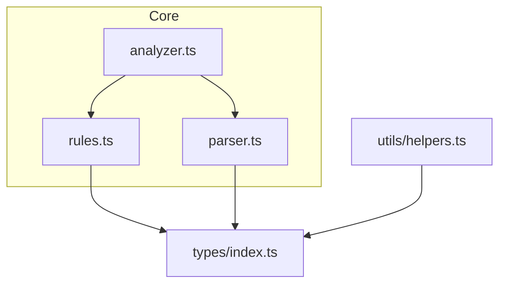
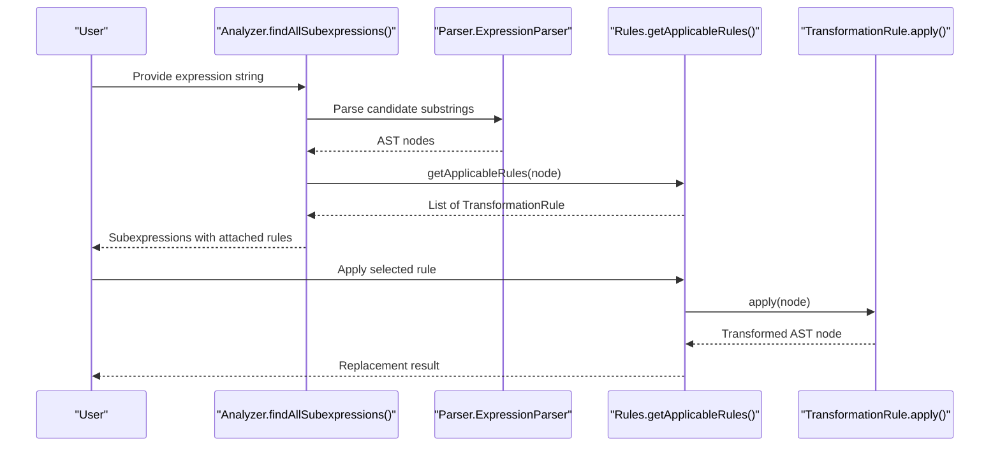
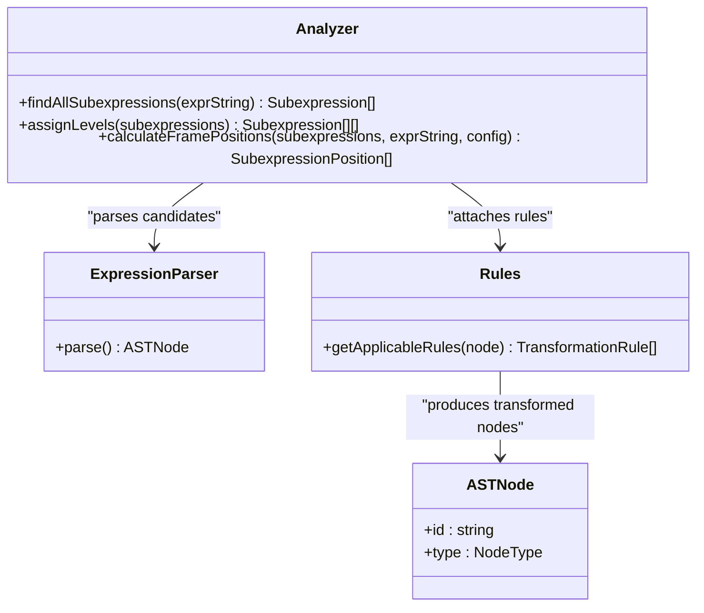
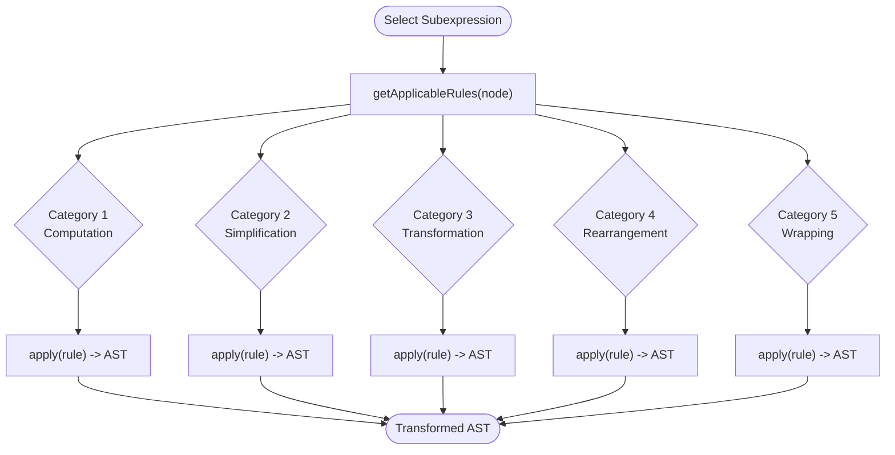
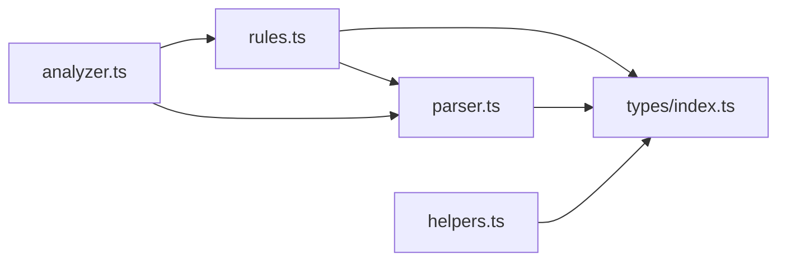

# Rules Module

<cite>
**Referenced Files in This Document**
- [rules.ts](file://src/core/rules.ts)
- [analyzer.ts](file://src/core/analyzer.ts)
- [parser.ts](file://src/core/parser.ts)
- [index.ts](file://src/types/index.ts)
- [helpers.ts](file://src/utils/helpers.ts)
- [rules.test.ts](file://src/test/rules.test.ts)
- [analyzer.test.ts](file://src/test/analyzer.test.ts)
- [parser.test.ts](file://src/test/parser.test.ts)
</cite>

## Table of Contents
1. [Introduction](#introduction)
2. [Project Structure](#project-structure)
3. [Core Components](#core-components)
4. [Architecture Overview](#architecture-overview)
5. [Detailed Component Analysis](#detailed-component-analysis)
6. [Dependency Analysis](#dependency-analysis)
7. [Performance Considerations](#performance-considerations)
8. [Troubleshooting Guide](#troubleshooting-guide)
9. [Conclusion](#conclusion)
10. [Appendices](#appendices)

## Introduction
This document explains the Rules module’s strategy pattern implementation for algebraic transformation rules. It covers how rules are defined with applicability conditions and transformation logic using the AST structure, the rule categories and priorities, and how rules are applied to selected subexpressions. It also describes the relationship between Rules, Analyzer (providing subexpression context), and Parser (generating new AST after transformation). Finally, it addresses common issues like rule conflicts and unintended transformations, and provides performance considerations and guidelines for adding new transformation rules.

## Project Structure
The Rules module resides in the core layer alongside Analyzer and Parser. The AST types are defined centrally, and helper utilities support AST traversal and replacement during transformations.

**Diagram sources**
- [rules.ts](file://src/core/rules.ts#L1-L20)
- [analyzer.ts](file://src/core/analyzer.ts#L1-L20)
- [parser.ts](file://src/core/parser.ts#L1-L20)
- [index.ts](file://src/types/index.ts#L1-L40)

**Section sources**
- [rules.ts](file://src/core/rules.ts#L1-L40)
- [analyzer.ts](file://src/core/analyzer.ts#L1-L20)
- [parser.ts](file://src/core/parser.ts#L1-L20)
- [index.ts](file://src/types/index.ts#L1-L40)

## Core Components
- Rules module: Defines applicability conditions and transformation logic for algebraic rules, organized by priority categories.
- Analyzer module: Enumerates valid subexpressions, attaches applicable rules, and computes frame layout levels to avoid visual overlap.
- Parser module: Produces AST nodes from expression strings and generates unique IDs for nodes.
- Types module: Declares AST node shapes and rule metadata.
- Helpers module: Provides AST conversion to string, cloning, node lookup, replacement, and structural utilities.

Key responsibilities:
- Rules: Match AST nodes to rule categories and produce transformed AST nodes.
- Analyzer: Builds candidate subexpressions, filters by validity and rule applicability, assigns non-overlapping levels, and computes frame positions.
- Parser: Parses expressions into AST nodes with deterministic operator precedence and grouping semantics.
- Helpers: Enable safe AST manipulation and rendering.

**Section sources**
- [rules.ts](file://src/core/rules.ts#L1-L238)
- [analyzer.ts](file://src/core/analyzer.ts#L13-L79)
- [parser.ts](file://src/core/parser.ts#L1-L159)
- [index.ts](file://src/types/index.ts#L1-L98)
- [helpers.ts](file://src/utils/helpers.ts#L1-L178)

## Architecture Overview
The Rules strategy pattern is applied by selecting applicable rules for a given AST node and invoking their transform functions. Analyzer supplies the context of which subexpressions are valid and which rules apply. Parser constructs the AST used by both Analyzer and Rules.

**Diagram sources**
- [analyzer.ts](file://src/core/analyzer.ts#L13-L79)
- [parser.ts](file://src/core/parser.ts#L27-L34)
- [rules.ts](file://src/core/rules.ts#L12-L238)

## Detailed Component Analysis

### Strategy Pattern Implementation in Rules
Rules are defined as TransformationRule entries with:
- id: Unique identifier
- name: Human-readable label
- category: Priority category string
- preview: String describing the transformation
- apply: Function that transforms an AST node into another AST node

Applicability conditions are implemented as explicit checks against node types and values. The function getApplicableRules(node) enumerates all applicable rules for a given node and returns them in priority order.

Rule categories and priorities:
- Category 1: Computation
- Category 2: Simplification
- Category 3: Transformation
- Category 4: Rearrangement
- Category 5: Wrapping

Each category corresponds to a distinct section in getApplicableRules(node).

Examples from rules.ts:
- Computation: Multiplication, division, addition, subtraction of constants.
- Simplification: Remove multiplication by 1, simplify multiplication by 0, remove division by 1, remove addition/subtraction of zero, remove double negation, remove unnecessary parentheses.
- Transformation: Forward distributive expansion for multiplication over addition/subtraction.
- Rearrangement: Commutative swapping for multiplication and addition.
- Wrapping: Add parentheses, add double negation, multiply/divide by one, add zero.

Transformation logic:
- Evaluation functions return a new constant node with a fresh ID.
- Structural transformations return new AST nodes with generated IDs and adjusted structure.
- Removal rules return a child node directly.

**Section sources**
- [rules.ts](file://src/core/rules.ts#L12-L238)
- [rules.ts](file://src/core/rules.ts#L240-L434)
- [index.ts](file://src/types/index.ts#L48-L62)

### AST Structure and Rule Conditions
Rules rely on AST shape and values:
- Operator nodes for binary operations and precedence-aware transformations.
- Constant nodes for numeric evaluation.
- Unary nodes for negation and double negation.
- Group nodes for parentheses removal.
- Variable nodes for symbolic expressions.

Conditions are checked by inspecting node.type and node.value, and by validating children types and values.

**Section sources**
- [rules.ts](file://src/core/rules.ts#L17-L238)
- [index.ts](file://src/types/index.ts#L1-L43)

### Analyzer Integration and Subexpression Context
Analyzer builds subexpressions by scanning all contiguous substrings of the input, trimming whitespace, skipping digits that are part of larger numbers, and parsing each candidate with the Parser. Only candidates that parse to a valid AST and have at least one applicable rule are retained. Analyzer then assigns non-overlapping levels and computes frame positions.

Key steps:
- findAllSubexpressions: Generates candidate substrings, trims, validates, parses, filters by rule applicability, deduplicates by position.
- assignLevels: Places subexpressions into levels to avoid visual overlap.
- calculateFramePositions: Computes left, width, and top coordinates for rendering frames.

**Section sources**
- [analyzer.ts](file://src/core/analyzer.ts#L13-L79)
- [analyzer.ts](file://src/core/analyzer.ts#L81-L117)
- [analyzer.ts](file://src/core/analyzer.ts#L119-L182)

### Parser Integration and AST Generation
Parser converts expression strings into AST nodes with:
- Operator precedence: Multiplication and division bind tighter than addition and subtraction.
- Left-to-right associativity for same-precedence operators.
- Parentheses override precedence.
- Unary minus supported.
- Unique node IDs generated per-parse.

These ASTs are consumed by both Analyzer (for subexpression detection) and Rules (for transformation applicability and application).

**Section sources**
- [parser.ts](file://src/core/parser.ts#L1-L159)

### Relationship Between Rules, Analyzer, and Parser
- Parser produces AST nodes used by Analyzer to detect valid subexpressions and by Rules to compute applicability.
- Analyzer attaches applicable rules to each subexpression and organizes them for rendering.
- Rules apply transformations to produce a new AST node, which can be re-parsed or rendered as needed.

**Diagram sources**
- [analyzer.ts](file://src/core/analyzer.ts#L13-L79)
- [parser.ts](file://src/core/parser.ts#L27-L34)
- [rules.ts](file://src/core/rules.ts#L12-L238)
- [index.ts](file://src/types/index.ts#L1-L43)

### Rule Categories, Priority System, and Application Flow
Priority categories:
- Computation: Immediate numeric evaluation for constants.
- Simplification: Algebraic identities and trivial simplifications.
- Transformation: Structural expansions (e.g., distributive).
- Rearrangement: Commutative swaps for applicable operators.
- Wrapping: Parentheses, double negation, identity multiplications/divisions/additions.

Application flow:
- Analyzer selects a subexpression node.
- Rules.getApplicableRules(node) returns ordered rules by category/priority.
- User chooses a rule; Rules.apply(node) returns a transformed AST node.
- The transformed AST can be re-rendered or further processed.

**Diagram sources**
- [rules.ts](file://src/core/rules.ts#L12-L238)

### Examples from rules.ts
- Computation: Multiplication, division, addition, subtraction of constants return a new constant node.
- Simplification: Remove multiplication by 1 (left/right), simplify multiplication by 0, remove division by 1, remove addition/subtraction of zero, remove double negation, remove unnecessary parentheses.
- Transformation: Distributive forward expansion for a*(b+c) and (a+b)*c.
- Rearrangement: Swap operands for multiplication and addition.
- Wrapping: Add parentheses, add double negation, multiply/divide by one, add zero.

Validation via tests demonstrates:
- Applicability conditions are correct (e.g., constants-only operations trigger evaluation).
- Non-applicable rules are not offered (e.g., commutative swaps do not apply to subtraction/division).
- Preview strings and categories are present and unique.

**Section sources**
- [rules.ts](file://src/core/rules.ts#L12-L238)
- [rules.test.ts](file://src/test/rules.test.ts#L1-L437)

## Dependency Analysis
Rules depends on:
- AST types for node shapes and values.
- Parser for generating unique IDs when constructing new nodes.

Analyzer depends on:
- Parser for parsing candidate substrings.
- Rules for attaching applicable rules to subexpressions.

Parser depends on:
- AST types for node construction.

Helpers depend on:
- AST types for traversal and replacement.

**Diagram sources**
- [rules.ts](file://src/core/rules.ts#L1-L20)
- [analyzer.ts](file://src/core/analyzer.ts#L1-L20)
- [parser.ts](file://src/core/parser.ts#L1-L20)
- [index.ts](file://src/types/index.ts#L1-L43)

**Section sources**
- [rules.ts](file://src/core/rules.ts#L1-L20)
- [analyzer.ts](file://src/core/analyzer.ts#L1-L20)
- [parser.ts](file://src/core/parser.ts#L1-L20)
- [index.ts](file://src/types/index.ts#L1-L43)

## Performance Considerations
- Subexpression enumeration: findAllSubexpressions scans all substrings and attempts to parse each candidate. Complexity is approximately O(n^3) in the worst case due to substring generation, parsing, and rule applicability checks. This is acceptable for typical educational expressions but should be bounded for very long inputs.
- Rule applicability checks: getApplicableRules(node) performs a linear scan of condition branches. Keeping conditions simple and early-returning improves performance.
- AST generation: Each transformation creates new nodes with fresh IDs. Avoid deep cloning unless necessary; prefer constructing minimal new nodes.
- Rendering: assignLevels and calculateFramePositions operate on the filtered subexpressions list, minimizing overhead compared to exhaustive enumeration.

Guidelines for adding new rules:
- Keep conditions fast and specific to avoid unnecessary checks.
- Prefer returning minimal new AST nodes rather than deep clones.
- Ensure previews and categories are descriptive and unique.
- Validate applicability against AST shape and values to prevent unintended transformations.

[No sources needed since this section provides general guidance]

## Troubleshooting Guide
Common issues and mitigations:
- Rule conflicts: Multiple rules may match the same node. Use the category/priority ordering to select the most appropriate rule. If ambiguity persists, refine conditions to be mutually exclusive.
- Unintended transformations: Ensure conditions strictly check node types and values. For example, do not apply commutative swaps to subtraction or division.
- Overlapping subexpressions: Analyzer assigns non-overlapping levels; verify that ranges are computed correctly and that no overlaps remain within the same level.
- Parsing errors: Analyzer skips invalid substrings; confirm that only valid expressions are considered for rule attachment.
- ID collisions: Parser generates unique IDs per parse; avoid reusing IDs across separate parse runs.

Validation references:
- Rule applicability and previews are verified in tests.
- Analyzer correctness for overlapping ranges and level assignment is validated.
- Parser correctness for operator precedence, parentheses, and error cases is validated.

**Section sources**
- [rules.test.ts](file://src/test/rules.test.ts#L1-L437)
- [analyzer.test.ts](file://src/test/analyzer.test.ts#L1-L370)
- [parser.test.ts](file://src/test/parser.test.ts#L1-L379)

## Conclusion
The Rules module implements a clear strategy pattern for algebraic transformations, with explicit applicability conditions and transformation logic operating on the AST. Analyzer provides the subexpression context and layout, while Parser constructs the AST used throughout. The five-category priority system ensures predictable transformation ordering. By following the guidelines and leveraging the existing tests, developers can safely extend the Rules module with new transformations.

[No sources needed since this section summarizes without analyzing specific files]

## Appendices

### Rule Categories and Examples
- Computation: Evaluate constant arithmetic.
- Simplification: Apply algebraic identities and trivial reductions.
- Transformation: Expand distributive forms.
- Rearrangement: Swap operands for commutative operators.
- Wrapping: Add parentheses, double negation, or identity operations.

**Section sources**
- [rules.ts](file://src/core/rules.ts#L12-L238)

### AST Node Types Reference
- ConstantNode: Numeric values.
- VariableNode: Symbolic identifiers.
- OperatorNode: Binary operations with left/right children.
- UnaryNode: Negation with a single child.
- GroupNode: Parenthetical grouping with a single child.

**Section sources**
- [index.ts](file://src/types/index.ts#L1-L43)