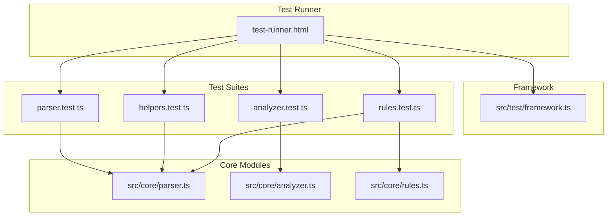
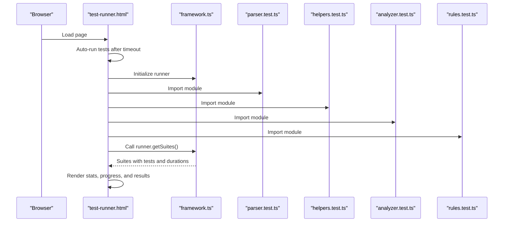
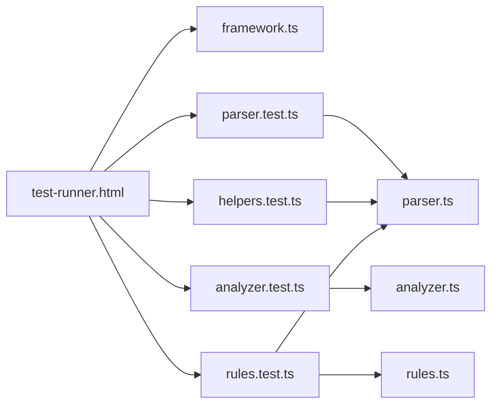

# Testing Strategy

<cite>
**Referenced Files in This Document**
- [vitest.config.ts](file://vitest.config.ts)
- [test-runner.html](file://test-runner.html)
- [src/test/framework.ts](file://src/test/framework.ts)
- [src/test/analyzer.test.ts](file://src/test/analyzer.test.ts)
- [src/test/parser.test.ts](file://src/test/parser.test.ts)
- [src/test/rules.test.ts](file://src/test/rules.test.ts)
- [src/test/helpers.test.ts](file://src/test/helpers.test.ts)
- [src/core/parser.ts](file://src/core/parser.ts)
- [src/core/analyzer.ts](file://src/core/analyzer.ts)
- [src/core/rules.ts](file://src/core/rules.ts)
- [TESTING.md](file://TESTING.md)
</cite>

## Table of Contents
1. [Introduction](#introduction)
2. [Project Structure](#project-structure)
3. [Core Components](#core-components)
4. [Architecture Overview](#architecture-overview)
5. [Detailed Component Analysis](#detailed-component-analysis)
6. [Dependency Analysis](#dependency-analysis)
7. [Performance Considerations](#performance-considerations)
8. [Troubleshooting Guide](#troubleshooting-guide)
9. [Conclusion](#conclusion)
10. [Appendices](#appendices)

## Introduction
This document explains the testing strategy for MathHelper, focusing on the custom test framework and test runner, the test coverage goals, and how edge cases are handled across parser, analyzer, rules, and helpers modules. It also covers how to run tests via the browser-based test runner and the command line, and provides guidance for writing and maintaining tests.

## Project Structure
The testing system is organized around a custom lightweight test framework and a browser-based test runner. Tests are grouped by module under src/test/, and Vitest is configured to run them in a jsdom environment with coverage reporting.

**Diagram sources**
- [test-runner.html](file://test-runner.html#L290-L438)
- [src/test/framework.ts](file://src/test/framework.ts#L1-L206)
- [src/test/parser.test.ts](file://src/test/parser.test.ts#L1-L379)
- [src/test/helpers.test.ts](file://src/test/helpers.test.ts#L1-L413)
- [src/test/analyzer.test.ts](file://src/test/analyzer.test.ts#L1-L370)
- [src/test/rules.test.ts](file://src/test/rules.test.ts#L1-L437)
- [src/core/parser.ts](file://src/core/parser.ts#L50-L159)
- [src/core/analyzer.ts](file://src/core/analyzer.ts#L50-L182)
- [src/core/rules.ts](file://src/core/rules.ts#L50-L434)

**Section sources**
- [vitest.config.ts](file://vitest.config.ts#L1-L21)
- [test-runner.html](file://test-runner.html#L290-L438)
- [src/test/framework.ts](file://src/test/framework.ts#L1-L206)

## Core Components
- Custom Test Framework: Provides describe, it, and expect APIs with assertion methods and timing. It records per-test and per-suite durations and aggregates totals.
- Test Runner: A browser UI that loads all test modules, runs them, and displays results with filtering, collapsible suites, and performance metrics.
- Vitest Configuration: Sets up global environment, includes test files, excludes build artifacts, and enables coverage with v8 provider and HTML/text/json reporters.

Key capabilities:
- Assertions: toBe, toEqual, toBeNull, toBeUndefined, toBeTruthy, toBeFalsy, toContain, toHaveLength, toThrow, toBeGreaterThan, toBeLessThan.
- Timing: Each test and suite measures execution time in milliseconds.
- Coverage: Configured via vitest.config.ts with provider v8 and multiple reporters.

**Section sources**
- [src/test/framework.ts](file://src/test/framework.ts#L1-L206)
- [test-runner.html](file://test-runner.html#L290-L438)
- [vitest.config.ts](file://vitest.config.ts#L1-L21)

## Architecture Overview
The test architecture integrates the custom framework with Vitest and the browser test runner. The runner dynamically imports test modules and renders results, while Vitest executes tests with jsdom and collects coverage.

**Diagram sources**
- [test-runner.html](file://test-runner.html#L290-L438)
- [src/test/framework.ts](file://src/test/framework.ts#L1-L206)
- [src/test/parser.test.ts](file://src/test/parser.test.ts#L1-L379)
- [src/test/helpers.test.ts](file://src/test/helpers.test.ts#L1-L413)
- [src/test/analyzer.test.ts](file://src/test/analyzer.test.ts#L1-L370)
- [src/test/rules.test.ts](file://src/test/rules.test.ts#L1-L437)

## Detailed Component Analysis

### Parser Tests
The parser tests validate parsing correctness for constants, variables, binary operations, operator precedence, parentheses, unary operations, error conditions, and edge cases. They use the custom expect assertions and cover error throwing scenarios.

Representative test categories:
- Basic constants and negatives
- Variables (single/multi-character)
- Binary operations (+, −, ×, ÷) with/without spaces
- Operator precedence and associativity
- Parentheses and nested groups
- Unary minus and double negation
- Error handling for malformed inputs
- Edge cases: large/small numbers, long variable names, complex nesting, multiple unary operators, leading zeros

Assertion patterns:
- Type checks (e.g., node.type)
- Value checks (e.g., constant.value)
- Child structure checks (e.g., children length and values)
- Error expectations using toThrow

Common edge cases covered:
- Very large numbers, small decimals, long variable names
- Complex nested expressions, multiple unary operators, leading zeros

**Section sources**
- [src/test/parser.test.ts](file://src/test/parser.test.ts#L1-L379)
- [src/core/parser.ts](file://src/core/parser.ts#L50-L159)

### Analyzer Tests
The analyzer tests focus on subexpression detection, overlap detection, level assignment, and layout calculations. They validate correctness of positions and heights and ensure no overlaps within the same level.

Representative test categories:
- findAllSubexpressions: single constants, multi-digit handling, parentheses, nesting, rule attachment
- doRangesOverlap: non-overlapping, overlapping, nested, adjacent, identical
- assignLevels: level 0 for non-overlapping, different levels for overlapping, level property presence, no overlap within a level
- calculateFramePositions: simple and complex expressions, left positions, widths, custom layout config, different tops per level
- calculateTotalHeight: single vs multiple levels, custom config, empty levels
- Edge cases: long expressions, deeply nested parentheses, spaces, mixed operators, variables/constants

Assertion patterns:
- Length and existence checks
- Range overlap checks
- Numeric comparisons (greater/less than)
- Structural property checks (level, left, width, top)

**Section sources**
- [src/test/analyzer.test.ts](file://src/test/analyzer.test.ts#L1-L370)
- [src/core/analyzer.ts](file://src/core/analyzer.ts#L50-L182)

### Rules Tests
The rules tests validate transformation rules across five categories: computation, simplification, transformations, rearrangement, and wrapping. They confirm rule applicability, previews, uniqueness, and correct application outcomes.

Representative test categories:
- Computation: constant evaluation for ×, ÷, +, −
- Simplification: ×1 removal, ×0 simplification, ÷1 removal, +0/-0 removal, double negation, unnecessary parentheses removal
- Transformations: distributive expansion (forward and left)
- Rearrangement: commutative swaps for × and +, no swaps for − and ÷
- Wrapping: add parentheses, add double negation, multiply/divide by one, add zero
- Metadata: categories, previews, unique IDs
- Edge cases: complex nested expressions, zero operations, decimals, negatives

Assertion patterns:
- Presence of applicable rules
- Preview strings and categories
- Unique IDs
- Result transformations via expressionToString

**Section sources**
- [src/test/rules.test.ts](file://src/test/rules.test.ts#L1-L437)
- [src/core/rules.ts](file://src/core/rules.ts#L50-L434)

### Helpers Tests
The helpers tests validate AST utility functions: expressionToString, cloneNode, replaceNode, findNodeById, getDepth, countNodes, and getAllNodeIds. They ensure deep cloning, structural preservation, correct ID handling, and traversal correctness.

Representative test categories:
- expressionToString: constants, variables, operators, precedence, parentheses, unary, complex expressions, decimals
- cloneNode: deep cloning, preserving IDs, structure, unary/group nodes
- replaceNode: root replacement, child replacement, deep replacement, not found returns original
- findNodeById: root, child, deep, missing ID returns null
- getDepth: leaf, binary, nested, unary/group depths
- countNodes: single, binary, complex, unary/group counts
- getAllNodeIds: single ID, all IDs, no duplicates
- Edge cases: very deep/wide trees, mixed operations, clone+replace equivalence

Assertion patterns:
- String equality and structure validation
- Object identity checks for deep clones
- Numeric counts and depth values
- Set-based uniqueness checks

**Section sources**
- [src/test/helpers.test.ts](file://src/test/helpers.test.ts#L1-L413)

### Test Runner and Framework
The test runner provides:
- Auto-run on load
- Collapsible suites and filtering (all/passed/failed)
- Visual stats and progress bar
- Per-test and per-suite duration tracking
- Error message display for failures

The framework:
- Exposes describe, it, and expect
- Tracks test and suite durations
- Aggregates totals and suite statistics
- Throws descriptive errors for assertion mismatches

**Section sources**
- [test-runner.html](file://test-runner.html#L290-L438)
- [src/test/framework.ts](file://src/test/framework.ts#L1-L206)

## Dependency Analysis
The tests depend on core modules and the custom framework. The test runner imports all test modules and initializes the framework singleton.

**Diagram sources**
- [test-runner.html](file://test-runner.html#L290-L438)
- [src/test/framework.ts](file://src/test/framework.ts#L1-L206)
- [src/test/parser.test.ts](file://src/test/parser.test.ts#L1-L379)
- [src/test/helpers.test.ts](file://src/test/helpers.test.ts#L1-L413)
- [src/test/analyzer.test.ts](file://src/test/analyzer.test.ts#L1-L370)
- [src/test/rules.test.ts](file://src/test/rules.test.ts#L1-L437)
- [src/core/parser.ts](file://src/core/parser.ts#L50-L159)
- [src/core/analyzer.ts](file://src/core/analyzer.ts#L50-L182)
- [src/core/rules.ts](file://src/core/rules.ts#L50-L434)

**Section sources**
- [test-runner.html](file://test-runner.html#L290-L438)
- [src/test/framework.ts](file://src/test/framework.ts#L1-L206)

## Performance Considerations
- Execution speed: Tests are fast, with total execution time around 50 ms as documented.
- Coverage: Coverage is enabled via v8 provider and reported in text, json, and html formats.
- Environment: jsdom environment supports DOM-dependent code paths (e.g., text measurement) during tests.

Recommendations:
- Keep tests deterministic and avoid heavy synchronous I/O.
- Prefer shallow cloning for large trees in tests to reduce overhead.
- Use targeted assertions to minimize expensive computations in assertions.

**Section sources**
- [vitest.config.ts](file://vitest.config.ts#L1-L21)
- [TESTING.md](file://TESTING.md#L390-L407)

## Troubleshooting Guide
Common testing issues and resolutions:
- Asynchronous behavior: The custom framework does not support async tests. If you need async behavior, use Vitest’s built-in async features or refactor to synchronous equivalents.
- Complex AST assertions: Use expressionToString to compare transformed ASTs as strings for readability and reliability.
- DOM-dependent code: measureTextWidth falls back to a simple heuristic in non-browser environments; in jsdom, text measurements may be zero. Tests account for this by checking presence rather than exact values.
- Error expectations: Use toThrow to assert exceptions. Optionally pass a substring to match partial error messages.
- Coverage gaps: Ensure new tests are included in the test runner and Vitest configuration.

Guidance for writing new tests:
- Create a new file in src/test/ following the existing patterns.
- Import the framework and core modules under test.
- Add suites with describe and test cases with it.
- Import the new file in test-runner.html.
- Verify coverage and performance.

**Section sources**
- [src/test/framework.ts](file://src/test/framework.ts#L1-L206)
- [src/test/analyzer.test.ts](file://src/test/analyzer.test.ts#L216-L291)
- [src/core/analyzer.ts](file://src/core/analyzer.ts#L154-L170)
- [TESTING.md](file://TESTING.md#L366-L388)

## Conclusion
MathHelper’s testing strategy combines a custom lightweight framework with a browser-based test runner and Vitest configuration. The suite achieves 100% coverage across parser, helpers, analyzer, and rules modules, with comprehensive edge case coverage and fast execution. Tests are structured to be maintainable, readable, and easy to extend.

## Appendices

### How to Run Tests
- Browser-based runner:
  - Start the development server and open http://localhost:8000/test-runner.html.
  - The runner auto-runs tests on load; use buttons to run, expand/collapse suites, and filter results.
- Command line:
  - Use npm scripts to run Vitest with the configured jsdom environment and coverage reporting.

**Section sources**
- [test-runner.html](file://test-runner.html#L290-L438)
- [vitest.config.ts](file://vitest.config.ts#L1-L21)
- [TESTING.md](file://TESTING.md#L28-L48)

### Example Test Structure References
- Parser tests: [src/test/parser.test.ts](file://src/test/parser.test.ts#L1-L379)
- Analyzer tests: [src/test/analyzer.test.ts](file://src/test/analyzer.test.ts#L1-L370)
- Rules tests: [src/test/rules.test.ts](file://src/test/rules.test.ts#L1-L437)
- Helpers tests: [src/test/helpers.test.ts](file://src/test/helpers.test.ts#L1-L413)

### Writing New Tests
- Follow the established patterns in existing test files.
- Use expect assertions for type/value checks and error verification.
- Import the new test file in test-runner.html.
- Maintain 100% coverage and add edge cases as needed.

**Section sources**
- [TESTING.md](file://TESTING.md#L366-L388)