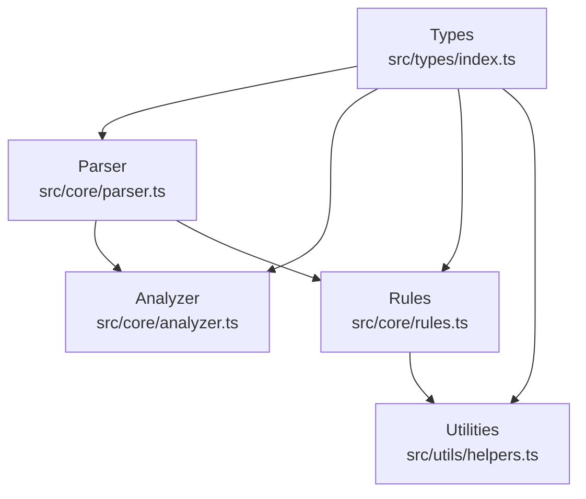
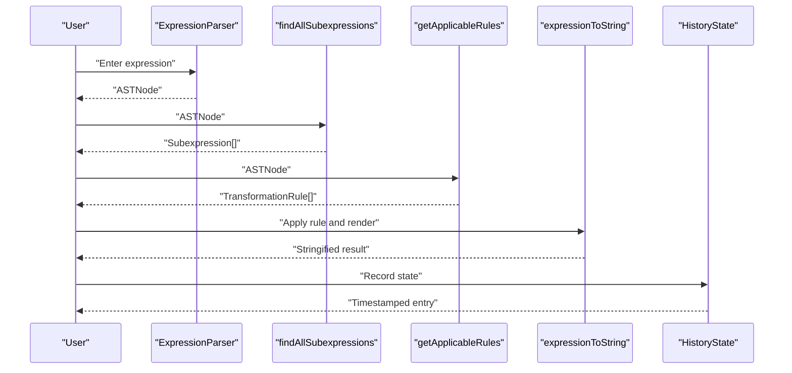
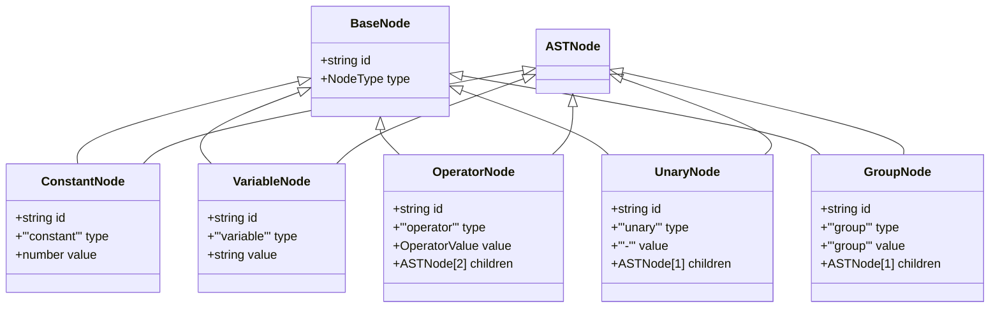
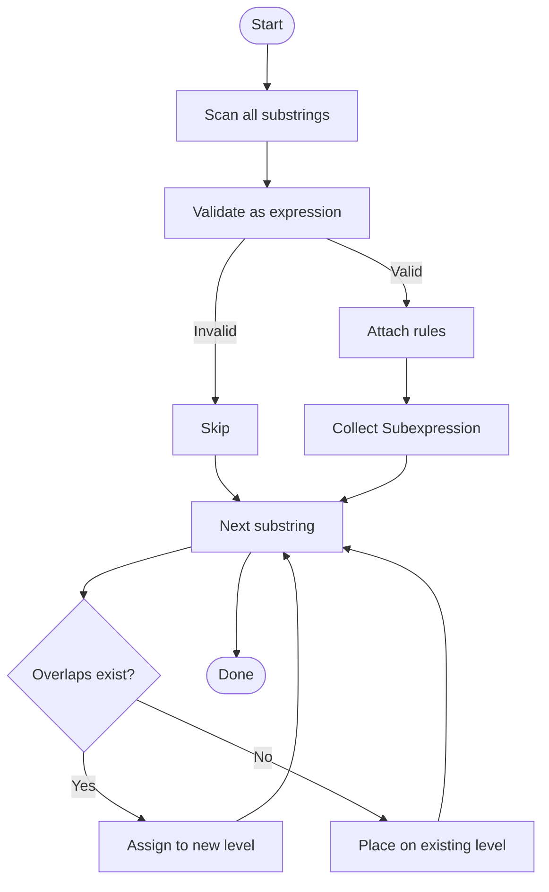
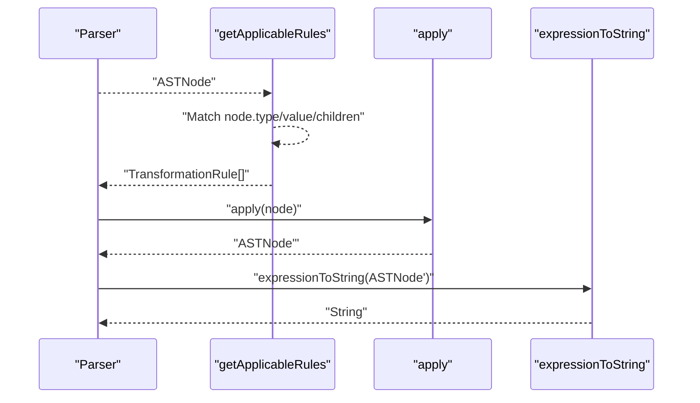
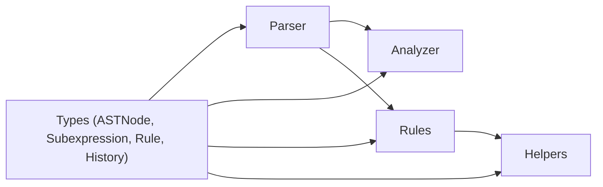

# Type System

<cite>
**Referenced Files in This Document**
- [src/types/index.ts](file://src/types/index.ts)
- [src/core/parser.ts](file://src/core/parser.ts)
- [src/core/analyzer.ts](file://src/core/analyzer.ts)
- [src/core/rules.ts](file://src/core/rules.ts)
- [src/utils/helpers.ts](file://src/utils/helpers.ts)
- [src/test/analyzer.test.ts](file://src/test/analyzer.test.ts)
- [src/test/rules.test.ts](file://src/test/rules.test.ts)
- [README.md](file://README.md)
</cite>

## Table of Contents
1. [Introduction](#introduction)
2. [Project Structure](#project-structure)
3. [Core Components](#core-components)
4. [Architecture Overview](#architecture-overview)
5. [Detailed Component Analysis](#detailed-component-analysis)
6. [Dependency Analysis](#dependency-analysis)
7. [Performance Considerations](#performance-considerations)
8. [Troubleshooting Guide](#troubleshooting-guide)
9. [Conclusion](#conclusion)
10. [Appendices](#appendices)

## Introduction
This document provides comprehensive data model documentation for the type system in MathHelper. It focuses on the ASTNode discriminated union and related types used across parsing, analysis, transformation, and history tracking. It explains how TypeScript’s type system enforces correctness during parsing, analysis, and transformation, and how the discriminated union pattern prevents invalid operations. Guidance is included for extending the type system with new node types or rule signatures.

## Project Structure
The type system is defined centrally and consumed by the parser, analyzer, rules engine, and utilities. The key files are:
- Type definitions: src/types/index.ts
- Parser: src/core/parser.ts
- Analyzer: src/core/analyzer.ts
- Rules engine: src/core/rules.ts
- Utilities: src/utils/helpers.ts
- Tests: src/test/analyzer.test.ts, src/test/rules.test.ts
- Project overview: README.md

**Diagram sources**
- [src/types/index.ts](file://src/types/index.ts#L1-L98)
- [src/core/parser.ts](file://src/core/parser.ts#L1-L159)
- [src/core/analyzer.ts](file://src/core/analyzer.ts#L1-L182)
- [src/core/rules.ts](file://src/core/rules.ts#L1-L434)
- [src/utils/helpers.ts](file://src/utils/helpers.ts#L1-L178)

**Section sources**
- [README.md](file://README.md#L42-L58)
- [src/types/index.ts](file://src/types/index.ts#L1-L98)

## Core Components
This section documents the primary types used throughout the system.

- ASTNode discriminated union
  - Variants:
    - ConstantNode: numeric constant
    - VariableNode: symbolic variable
    - OperatorNode: binary operator (+, -, *, /) with two children
    - UnaryNode: unary minus with one child
    - GroupNode: grouping parentheses with one child
  - Shared base: BaseNode with id and type
  - OperatorValue restricted to supported operators
  - NodeType discriminant union

- Subexpression types
  - Subexpression: text, start/end positions, parsed AST node, length, attached rules, optional level
  - SubexpressionPosition: Subexpression plus computed layout (left, width, top)
  - LayoutConfig: configuration for frame layout

- TransformationRule
  - Fields: id, name, category, preview, apply
  - apply signature: (node: ASTNode) => ASTNode

- HistoryState
  - Fields: expression, ruleName, node, timestamp

These types collectively enable:
- Strong typing for AST construction and traversal
- Safe rule application with type guards
- Deterministic subexpression analysis and layout
- Immutable-like transformations via cloning utilities

**Section sources**
- [src/types/index.ts](file://src/types/index.ts#L1-L98)
- [src/core/analyzer.ts](file://src/core/analyzer.ts#L1-L182)
- [src/core/rules.ts](file://src/core/rules.ts#L1-L238)
- [src/utils/helpers.ts](file://src/utils/helpers.ts#L1-L178)

## Architecture Overview
The type system underpins a layered pipeline:
- Parser constructs ASTNode instances with unique ids and correct shapes
- Analyzer discovers valid subexpressions, attaches rules, and computes layout
- Rules engine applies transformations returning new ASTNode instances
- Utilities provide safe traversal and cloning for immutable updates
- History tracks expression states with timestamps

**Diagram sources**
- [src/core/parser.ts](file://src/core/parser.ts#L1-L159)
- [src/core/analyzer.ts](file://src/core/analyzer.ts#L1-L182)
- [src/core/rules.ts](file://src/core/rules.ts#L1-L238)
- [src/utils/helpers.ts](file://src/utils/helpers.ts#L1-L31)
- [src/types/index.ts](file://src/types/index.ts#L88-L98)

## Detailed Component Analysis

### ASTNode Discriminated Union
ASTNode is a discriminated union of five node types. Each variant:
- Has a unique type discriminator
- Enforces shape constraints (e.g., children arrays for operator/unary/group)
- Uses BaseNode.id for identity and structural equality checks

Key characteristics:
- Strong typing for recursive descent parsing
- Compile-time guarantees for safe field access
- Pattern matching via switch/type guards

**Diagram sources**
- [src/types/index.ts](file://src/types/index.ts#L9-L43)

**Section sources**
- [src/types/index.ts](file://src/types/index.ts#L1-L43)
- [src/core/parser.ts](file://src/core/parser.ts#L119-L141)
- [src/utils/helpers.ts](file://src/utils/helpers.ts#L1-L31)

### Subexpression and Layout Types
Subexpression captures parsed subtrees with positional metadata and attached rules. SubexpressionPosition adds layout metrics for rendering. LayoutConfig controls vertical spacing and offsets.

Behavior highlights:
- findAllSubexpressions validates substrings and attaches rules
- assignLevels avoids visual overlap by partitioning ranges into non-overlapping groups
- calculateFramePositions computes left/top/width using monospace metrics
- calculateTotalHeight derives container height from levels

**Diagram sources**
- [src/core/analyzer.ts](file://src/core/analyzer.ts#L13-L79)
- [src/core/analyzer.ts](file://src/core/analyzer.ts#L84-L117)
- [src/core/analyzer.ts](file://src/core/analyzer.ts#L129-L149)
- [src/core/analyzer.ts](file://src/core/analyzer.ts#L172-L182)

**Section sources**
- [src/types/index.ts](file://src/types/index.ts#L66-L87)
- [src/core/analyzer.ts](file://src/core/analyzer.ts#L13-L117)
- [src/core/analyzer.ts](file://src/core/analyzer.ts#L129-L182)

### TransformationRule and Rule Application
TransformationRule defines a typed rule with:
- id: unique identifier
- name: display label
- category: priority bucket
- preview: textual description of change
- apply: pure function transforming ASTNode to ASTNode

Rules are discovered by getApplicableRules, which uses type guards to match node shapes and operand types.

**Diagram sources**
- [src/core/rules.ts](file://src/core/rules.ts#L12-L238)
- [src/core/rules.ts](file://src/core/rules.ts#L240-L434)
- [src/utils/helpers.ts](file://src/utils/helpers.ts#L1-L31)

**Section sources**
- [src/types/index.ts](file://src/types/index.ts#L48-L63)
- [src/core/rules.ts](file://src/core/rules.ts#L12-L238)
- [src/test/rules.test.ts](file://src/test/rules.test.ts#L1-L120)

### HistoryEntry and State Tracking
HistoryState captures the expression text, the applied rule name, the resulting AST, and a timestamp. This enables undo/redo and audit trails.

Usage patterns:
- Record state after each transformation
- Render history entries with previews and timestamps
- Restore previous states by replacing the current AST

**Section sources**
- [src/types/index.ts](file://src/types/index.ts#L92-L98)
- [src/test/rules.test.ts](file://src/test/rules.test.ts#L1-L40)

## Dependency Analysis
The type system exhibits strong cohesion around ASTNode and minimal coupling:
- parser.ts depends on ASTNode variants for construction
- analyzer.ts consumes Subexpression and LayoutConfig
- rules.ts depends on ASTNode and TransformationRule
- helpers.ts operates generically on ASTNode
- tests validate type-driven behavior

**Diagram sources**
- [src/types/index.ts](file://src/types/index.ts#L1-L98)
- [src/core/parser.ts](file://src/core/parser.ts#L1-L159)
- [src/core/analyzer.ts](file://src/core/analyzer.ts#L1-L182)
- [src/core/rules.ts](file://src/core/rules.ts#L1-L434)
- [src/utils/helpers.ts](file://src/utils/helpers.ts#L1-L178)

**Section sources**
- [src/types/index.ts](file://src/types/index.ts#L1-L98)
- [src/core/parser.ts](file://src/core/parser.ts#L1-L159)
- [src/core/analyzer.ts](file://src/core/analyzer.ts#L1-L182)
- [src/core/rules.ts](file://src/core/rules.ts#L1-L434)
- [src/utils/helpers.ts](file://src/utils/helpers.ts#L1-L178)

## Performance Considerations
- ASTNode is a small discriminated union enabling efficient runtime checks and compile-time safety.
- Subexpression scanning is O(n^3) in worst case due to substring generation and parsing; however, early pruning and rule filtering reduce practical cost.
- assignLevels uses interval overlap detection; with careful ordering and deduplication, it remains linear in the number of subexpressions.
- Rule application is O(depth) for tree transformations, leveraging immutable cloning utilities.

[No sources needed since this section provides general guidance]

## Troubleshooting Guide
Common type-related issues and remedies:
- Invalid ASTNode construction
  - Symptom: runtime errors when accessing unexpected fields
  - Fix: Ensure each variant is constructed with required fields and correct type discriminator
  - Reference: [src/core/parser.ts](file://src/core/parser.ts#L40-L110)

- Incorrect rule applicability
  - Symptom: missing rules or wrong transformations
  - Fix: Verify node.type/value/children constraints before applying rules
  - Reference: [src/core/rules.ts](file://src/core/rules.ts#L12-L238)

- Layout overlaps
  - Symptom: overlapping frames
  - Fix: Confirm assignLevels runs after findAllSubexpressions and before layout computation
  - Reference: [src/core/analyzer.ts](file://src/core/analyzer.ts#L84-L117)

- History drift
  - Symptom: inconsistent expression/rule association
  - Fix: Record HistoryState immediately after applying a rule
  - Reference: [src/types/index.ts](file://src/types/index.ts#L92-L98)

**Section sources**
- [src/core/parser.ts](file://src/core/parser.ts#L1-L159)
- [src/core/rules.ts](file://src/core/rules.ts#L12-L238)
- [src/core/analyzer.ts](file://src/core/analyzer.ts#L84-L117)
- [src/types/index.ts](file://src/types/index.ts#L92-L98)

## Conclusion
The MathHelper type system centers on a robust ASTNode discriminated union and complementary types for subexpression analysis, transformation rules, and history tracking. TypeScript’s type guards and strict checking ensure correctness across parsing, analysis, and transformation. The design cleanly separates concerns and enables extension with new node types and rule signatures while preserving type safety.

[No sources needed since this section summarizes without analyzing specific files]

## Appendices

### Type Safety and Discriminated Unions
- Pattern matching: Use switch statements or type guards to safely access variant-specific fields
- Exhaustiveness: Compiler warns if not all variants are handled in transformations
- Immutability: Prefer cloning utilities to avoid mutating shared AST nodes

**Section sources**
- [src/utils/helpers.ts](file://src/utils/helpers.ts#L32-L99)
- [README.md](file://README.md#L158-L164)

### Extending the Type System
Guidance for adding new node types or rule signatures:
- New node type
  - Define interface extending BaseNode with unique type discriminator
  - Add to ASTNode union
  - Update parser to construct the new node
  - Update rules to match the new shape
  - Update utilities (toString, clone, replace) to handle the new variant
  - Reference: [src/types/index.ts](file://src/types/index.ts#L9-L43), [src/core/parser.ts](file://src/core/parser.ts#L119-L141), [src/core/rules.ts](file://src/core/rules.ts#L240-L434), [src/utils/helpers.ts](file://src/utils/helpers.ts#L1-L31)

- New rule signature
  - Define TransformationRule.apply with appropriate input/output
  - Extend getApplicableRules to include new conditions
  - Add tests verifying applicability and output shape
  - Reference: [src/types/index.ts](file://src/types/index.ts#L48-L63), [src/core/rules.ts](file://src/core/rules.ts#L12-L238), [src/test/rules.test.ts](file://src/test/rules.test.ts#L1-L120)

### Example Workflows Demonstrating Type Safety
- Parsing correctness
  - Parser constructs ASTNode with correct type and children
  - Tests assert valid expressions and error on invalid input
  - References: [src/core/parser.ts](file://src/core/parser.ts#L27-L110), [src/test/analyzer.test.ts](file://src/test/analyzer.test.ts#L15-L33)

- Transformation correctness
  - Rules return ASTNode of expected type
  - Tests validate output expressions and numeric evaluations
  - References: [src/core/rules.ts](file://src/core/rules.ts#L240-L434), [src/test/rules.test.ts](file://src/test/rules.test.ts#L13-L68)

- Layout correctness
  - Subexpression positions respect levels and overlap-free constraints
  - References: [src/core/analyzer.ts](file://src/core/analyzer.ts#L84-L117), [src/test/analyzer.test.ts](file://src/test/analyzer.test.ts#L151-L214)