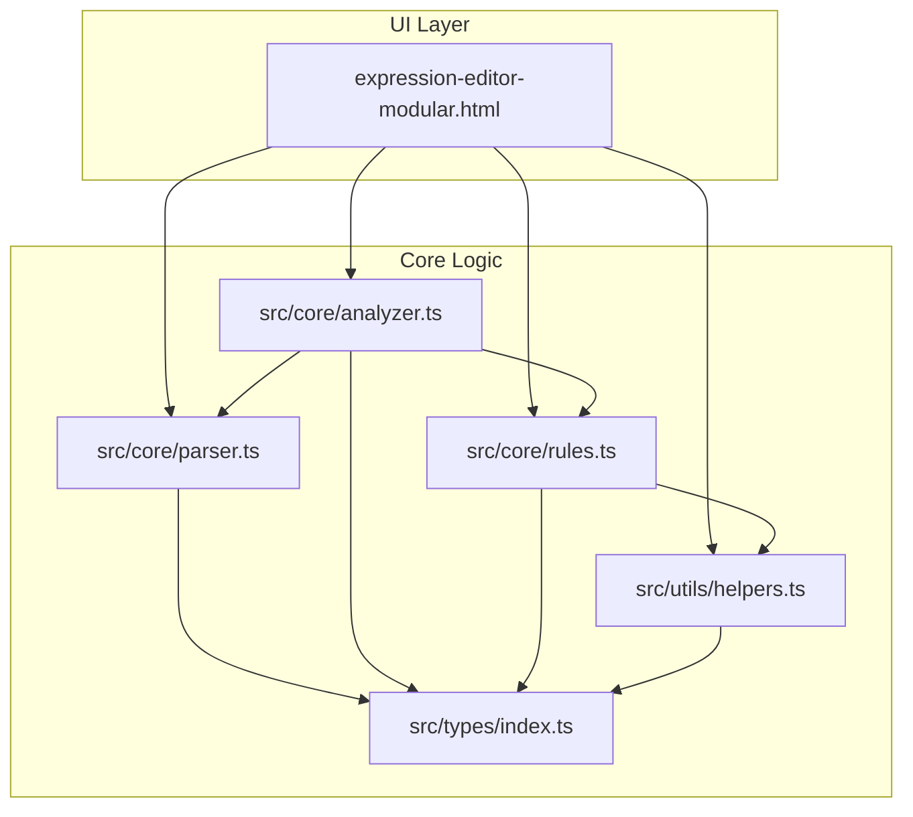
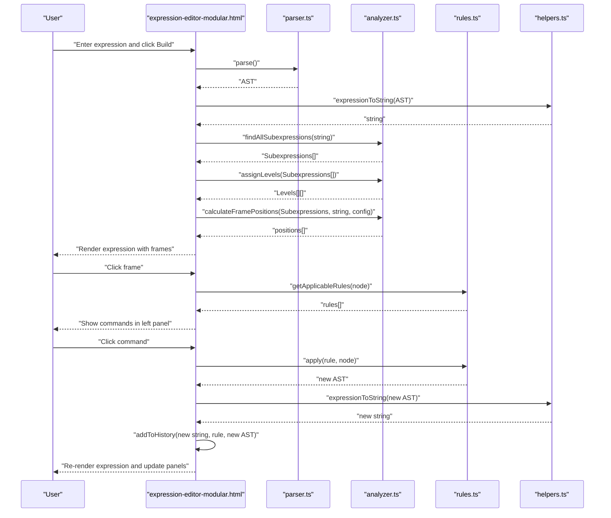
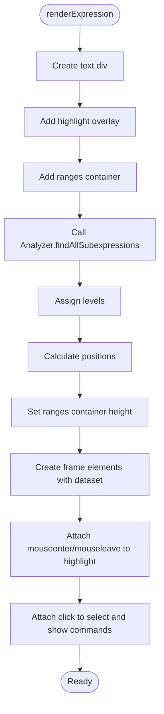
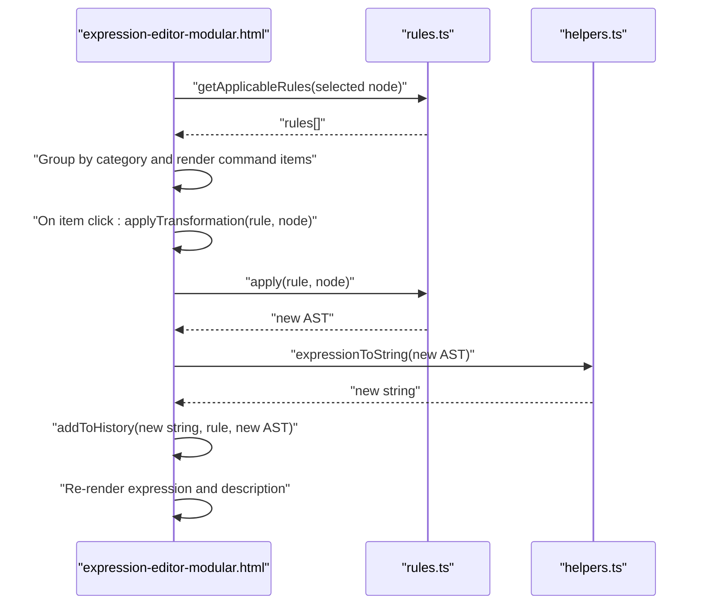
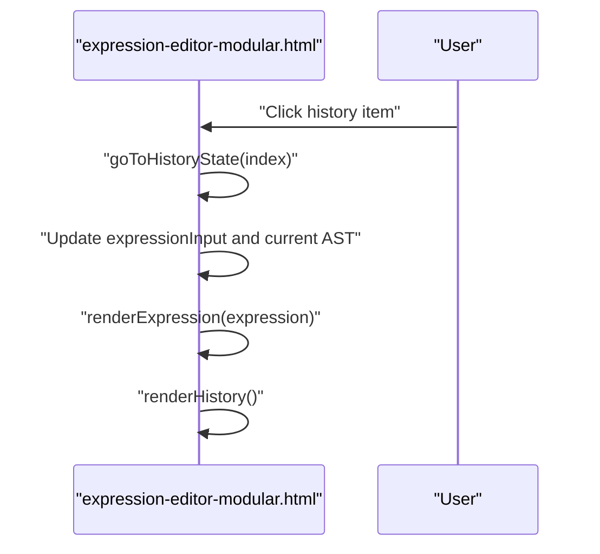
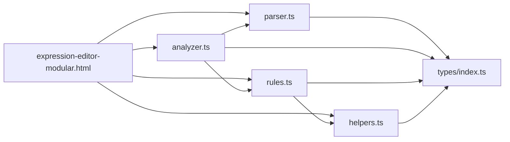

# User Interface

<cite>
**Referenced Files in This Document**
- [expression-editor-modular.html](file://expression-editor-modular.html)
- [analyzer.ts](file://src/core/analyzer.ts)
- [parser.ts](file://src/core/parser.ts)
- [rules.ts](file://src/core/rules.ts)
- [helpers.ts](file://src/utils/helpers.ts)
- [index.ts](file://src/types/index.ts)
- [README.md](file://README.md)
</cite>

## Table of Contents
1. [Introduction](#introduction)
2. [Project Structure](#project-structure)
3. [Core Components](#core-components)
4. [Architecture Overview](#architecture-overview)
5. [Detailed Component Analysis](#detailed-component-analysis)
6. [Dependency Analysis](#dependency-analysis)
7. [Performance Considerations](#performance-considerations)
8. [Troubleshooting Guide](#troubleshooting-guide)
9. [Accessibility and Responsive Design](#accessibility-and-responsive-design)
10. [Usage Examples](#usage-examples)
11. [Conclusion](#conclusion)

## Introduction
This document describes the User Interface of MathHelper’s Expression Editor. It focuses on the visual appearance of the expression editor with framed subexpressions, the rule selection interface, and the history navigation controls. It explains interaction patterns such as expression input, selecting subexpressions by clicking framed areas, applying rules, and traversing history. It also details how the UI uses position data from the Analyzer module to render subexpression frames, outlines the HTML layout and its connection to core logic, and provides usage examples, accessibility considerations, responsive design aspects, and solutions to common UI issues.

## Project Structure
The UI is implemented in a single HTML file that imports TypeScript modules via ES modules. The core logic resides in src/core/* and src/utils/*, while the UI orchestrates parsing, analysis, rule application, and history management.

**Diagram sources**
- [expression-editor-modular.html](file://expression-editor-modular.html#L490-L856)
- [parser.ts](file://src/core/parser.ts#L1-L159)
- [analyzer.ts](file://src/core/analyzer.ts#L1-L182)
- [rules.ts](file://src/core/rules.ts#L1-L434)
- [helpers.ts](file://src/utils/helpers.ts#L1-L178)
- [index.ts](file://src/types/index.ts#L1-L98)

**Section sources**
- [README.md](file://README.md#L42-L58)
- [expression-editor-modular.html](file://expression-editor-modular.html#L427-L488)

## Core Components
- Expression Editor Canvas: Renders the expression text and overlays framed subexpression regions. It supports hover highlighting and click-to-select interactions.
- Command Panel: Displays available transformations for the selected subexpression, grouped by categories.
- History Panel: Shows the transformation history with timestamps and allows traversal to previous states.
- Description Panel: Provides detailed explanations for the selected rule.
- Input Controls: Text input for entering expressions, Build and Clear buttons, and error messaging.

Key behaviors:
- On Build: The UI parses the expression into an AST, converts it back to a string, adds the initial state to history, renders the expression, and triggers frame creation.
- On Select Frame: The UI highlights the hovered region and populates the command panel with applicable rules.
- On Apply Rule: The UI applies the transformation to the AST, updates the expression, history, and description panels, and re-renders the expression.
- On History Navigation: The UI restores a specific state, re-rendering the expression and updating the active history item.

**Section sources**
- [expression-editor-modular.html](file://expression-editor-modular.html#L540-L856)
- [analyzer.ts](file://src/core/analyzer.ts#L1-L182)
- [rules.ts](file://src/core/rules.ts#L1-L238)
- [helpers.ts](file://src/utils/helpers.ts#L1-L30)

## Architecture Overview
The UI orchestrates a pipeline: input parsing → subexpression analysis → rule discovery → transformation application → UI update and history recording.

**Diagram sources**
- [expression-editor-modular.html](file://expression-editor-modular.html#L540-L856)
- [parser.ts](file://src/core/parser.ts#L18-L159)
- [analyzer.ts](file://src/core/analyzer.ts#L13-L182)
- [rules.ts](file://src/core/rules.ts#L12-L238)
- [helpers.ts](file://src/utils/helpers.ts#L11-L30)

## Detailed Component Analysis

### Expression Editor Canvas
- Rendering:
  - Creates a monospace text element to display the expression.
  - Adds a highlight overlay that mirrors the selected frame’s geometry.
  - Creates a container for frame ranges and sets its height based on calculated levels.
- Interaction:
  - Hovering a frame activates the highlight overlay.
  - Clicking a frame selects it, clears previous selections, and shows applicable rules in the command panel.
- Positioning:
  - Uses Analyzer-provided positions to set left, width, and top for each frame.
  - Levels are used to compute vertical offsets to prevent overlaps.

**Diagram sources**
- [expression-editor-modular.html](file://expression-editor-modular.html#L587-L742)
- [analyzer.ts](file://src/core/analyzer.ts#L13-L182)

**Section sources**
- [expression-editor-modular.html](file://expression-editor-modular.html#L587-L742)
- [analyzer.ts](file://src/core/analyzer.ts#L129-L182)

### Command Panel (Rule Selection)
- Behavior:
  - Displays the currently selected subexpression text.
  - Groups rules by category and shows a preview for each rule.
  - Applies a rule on click, updates history, and re-renders the expression.
- Rule Discovery:
  - Uses Analyzer-provided nodes and Rules.getApplicableRules to filter applicable transformations.

**Diagram sources**
- [expression-editor-modular.html](file://expression-editor-modular.html#L744-L761)
- [rules.ts](file://src/core/rules.ts#L12-L238)
- [helpers.ts](file://src/utils/helpers.ts#L11-L30)

**Section sources**
- [expression-editor-modular.html](file://expression-editor-modular.html#L744-L761)
- [rules.ts](file://src/core/rules.ts#L12-L238)

### History Navigation Controls
- Behavior:
  - Displays a chronological list of states with expression and rule name.
  - Highlights the active state.
  - Allows clicking any state to restore it, updating the input, current AST, and re-rendering the expression.

**Diagram sources**
- [expression-editor-modular.html](file://expression-editor-modular.html#L814-L826)

**Section sources**
- [expression-editor-modular.html](file://expression-editor-modular.html#L763-L813)
- [expression-editor-modular.html](file://expression-editor-modular.html#L814-L826)

### Layout Structure and Connections
- Grid Layout:
  - Three-column layout: Left panel (commands), Center panel (expression), Right panel (history + description).
- Panels:
  - Input section with text input and buttons.
  - Expression section containing the rendered expression with frames.
  - History and description sections for navigation and explanations.
- Data Flow:
  - The UI maintains global state for the current expression, AST, and history stack.
  - On each transformation, the UI truncates future history when not at the end, appends the new state, and updates the UI.

**Section sources**
- [expression-editor-modular.html](file://expression-editor-modular.html#L433-L488)
- [expression-editor-modular.html](file://expression-editor-modular.html#L540-L558)
- [expression-editor-modular.html](file://expression-editor-modular.html#L763-L778)

## Dependency Analysis
- UI depends on:
  - Parser.ts for converting input strings to ASTs.
  - Analyzer.ts for detecting subexpressions, assigning levels, calculating positions, and measuring text widths.
  - Rules.ts for determining applicable transformations for a given AST node.
  - Helpers.ts for converting ASTs back to strings and manipulating nodes.
  - Types.ts for AST node definitions and rule metadata.

**Diagram sources**
- [expression-editor-modular.html](file://expression-editor-modular.html#L490-L501)
- [parser.ts](file://src/core/parser.ts#L1-L159)
- [analyzer.ts](file://src/core/analyzer.ts#L1-L182)
- [rules.ts](file://src/core/rules.ts#L1-L238)
- [helpers.ts](file://src/utils/helpers.ts#L1-L178)
- [index.ts](file://src/types/index.ts#L1-L98)

**Section sources**
- [expression-editor-modular.html](file://expression-editor-modular.html#L490-L501)
- [parser.ts](file://src/core/parser.ts#L1-L159)
- [analyzer.ts](file://src/core/analyzer.ts#L1-L182)
- [rules.ts](file://src/core/rules.ts#L1-L238)
- [helpers.ts](file://src/utils/helpers.ts#L1-L178)
- [index.ts](file://src/types/index.ts#L1-L98)

## Performance Considerations
- Subexpression Detection:
  - The analyzer enumerates all substrings and attempts to parse them, which is O(n^3) in the worst case. This can be expensive for long expressions. Consider limiting input length or caching results.
- Frame Positioning:
  - Text measurement uses a temporary DOM span. Repeated measurements can be costly; batch updates and avoid frequent reflows.
- History Management:
  - History truncation and push operations are O(k) where k is the number of states. Keep history reasonable to avoid memory pressure.
- Rendering:
  - Re-rendering the entire expression on each transformation is straightforward but can be optimized by selectively updating only changed frames.

[No sources needed since this section provides general guidance]

## Troubleshooting Guide
Common UI issues and resolutions:
- Incorrect Frame Rendering:
  - Cause: Mismatch between expression string indices and parsed AST nodes.
  - Resolution: Ensure the Analyzer uses the same string indices as the rendered expression. Verify that measureTextWidth accounts for monospace font and whitespace handling.
- Selection Behavior:
  - Symptom: Clicking a frame does nothing.
  - Resolution: Confirm that frames are appended to the ranges container and event listeners are attached. Verify that the active class toggles and the command panel is populated.
- History Traversal:
  - Symptom: Clicking history items does not change the expression.
  - Resolution: Ensure goToHistoryState updates the input field, current AST, and calls renderExpression and renderHistory.
- Real-time Updates:
  - Symptom: Expression does not reflect transformations immediately.
  - Resolution: After applying a rule, rebuild the expression string, add to history, and re-render the expression and panels.

**Section sources**
- [expression-editor-modular.html](file://expression-editor-modular.html#L614-L742)
- [expression-editor-modular.html](file://expression-editor-modular.html#L744-L761)
- [expression-editor-modular.html](file://expression-editor-modular.html#L814-L826)
- [analyzer.ts](file://src/core/analyzer.ts#L129-L182)

## Accessibility and Responsive Design
- Accessibility:
  - Keyboard Navigation: Allow focusing the expression input and command items via Tab and Enter to trigger actions.
  - ARIA Labels: Add aria-labels to frames and command items for screen readers.
  - Focus Styles: Ensure visible focus indicators for interactive elements.
  - Contrast: Maintain sufficient contrast for frames and text against the dark theme.
- Responsive Design:
  - The layout uses a CSS grid with fixed gutters and a flexible central panel. On smaller screens, consider stacking panels vertically or adjusting column widths.
  - Ensure hover effects are replaced with tap targets on touch devices.
  - Test monospace font sizing across devices to prevent overflow.

[No sources needed since this section provides general guidance]

## Usage Examples
- Simplifying an Arithmetic Expression:
  - Enter “2 + 3 * 4” and click Build.
  - Click the frame for “3 * 4” and select Evaluate to get “2 + 12”.
  - Click the frame for “2 + 12” and select Evaluate to get “14”.
- Expanding Using the Distributive Property:
  - Enter “x * (y + z)” and click Build.
  - Click the frame for “x * (y + z)” and select Expand (Distributive) to get “x * y + x * z”.

These workflows demonstrate the core interaction model: input → parse → frame detection → rule selection → transformation → history update.

**Section sources**
- [README.md](file://README.md#L165-L178)
- [expression-editor-modular.html](file://expression-editor-modular.html#L540-L585)

## Conclusion
The MathHelper Expression Editor provides an intuitive, visual interface for exploring and transforming mathematical expressions. Its modular architecture cleanly separates parsing, analysis, rule application, and UI rendering. The UI leverages Analyzer-provided position data to render framed subexpressions, enabling precise selection and rule application. With clear interaction patterns, history navigation, and rule descriptions, users can learn and experiment with algebraic transformations effectively. Addressing performance and accessibility concerns will further enhance usability.

[No sources needed since this section summarizes without analyzing specific files]