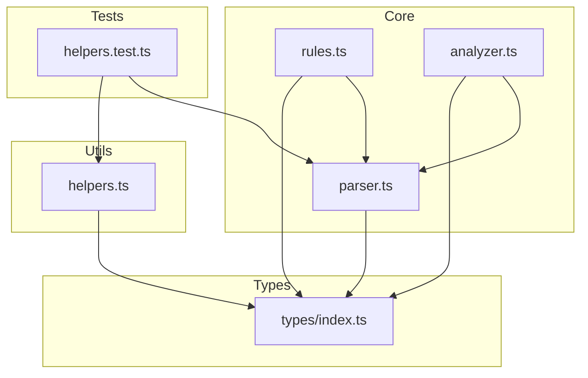
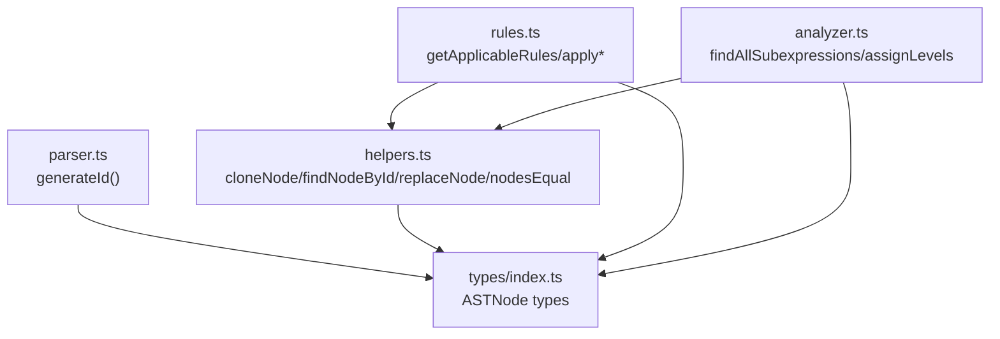
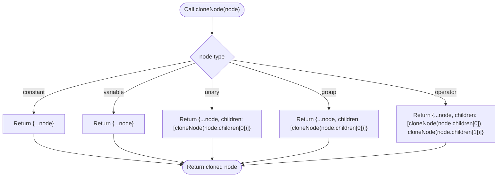
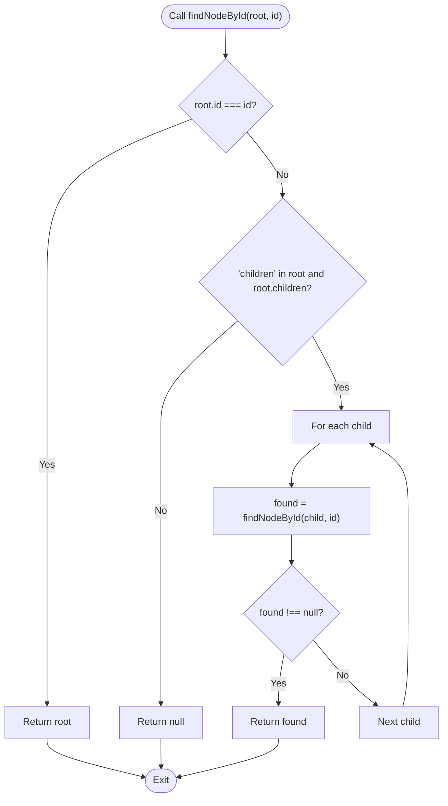
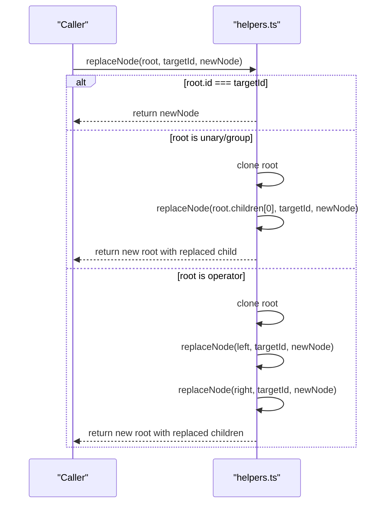
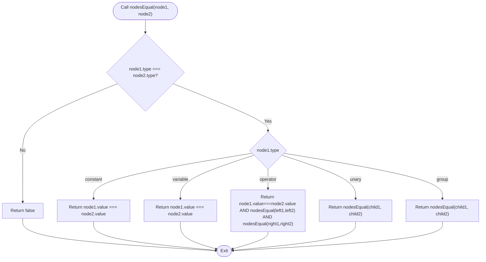
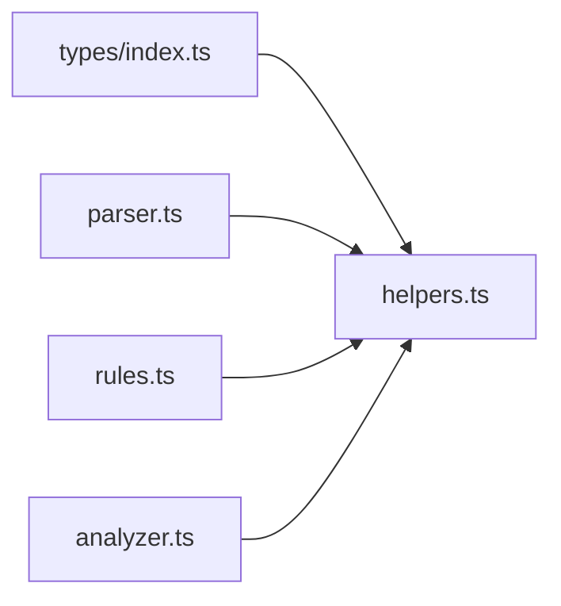

# Utils Module

<cite>
**Referenced Files in This Document**
- [helpers.ts](file://src/utils/helpers.ts)
- [types/index.ts](file://src/types/index.ts)
- [parser.ts](file://src/core/parser.ts)
- [rules.ts](file://src/core/rules.ts)
- [analyzer.ts](file://src/core/analyzer.ts)
- [helpers.test.ts](file://src/test/helpers.test.ts)
</cite>

## Table of Contents
1. [Introduction](#introduction)
2. [Project Structure](#project-structure)
3. [Core Components](#core-components)
4. [Architecture Overview](#architecture-overview)
5. [Detailed Component Analysis](#detailed-component-analysis)
6. [Dependency Analysis](#dependency-analysis)
7. [Performance Considerations](#performance-considerations)
8. [Troubleshooting Guide](#troubleshooting-guide)
9. [Conclusion](#conclusion)
10. [Appendices](#appendices)

## Introduction
This document describes the Utils module focused on AST manipulation utilities. It covers cloning, node finding, replacement, structural comparison, and ancillary traversal helpers. These utilities are foundational for safely transforming ASTs without mutating the original expression history, enabling modules like Analyzer and Rules to operate on copies of the AST while preserving the original structure for history and diagnostics.

## Project Structure
The Utils module resides under src/utils/helpers.ts and exports pure functions operating on AST nodes defined in src/types/index.ts. The Analyzer and Rules modules depend on these helpers to safely manipulate ASTs during subexpression analysis and transformation application.

**Diagram sources**
- [helpers.ts](file://src/utils/helpers.ts#L1-L178)
- [types/index.ts](file://src/types/index.ts#L1-L98)
- [parser.ts](file://src/core/parser.ts#L1-L159)
- [rules.ts](file://src/core/rules.ts#L1-L434)
- [analyzer.ts](file://src/core/analyzer.ts#L1-L182)
- [helpers.test.ts](file://src/test/helpers.test.ts#L1-L413)

**Section sources**
- [helpers.ts](file://src/utils/helpers.ts#L1-L178)
- [types/index.ts](file://src/types/index.ts#L1-L98)

## Core Components
This section outlines the primary utility functions and their roles in AST manipulation.

- expressionToString
  - Purpose: Produce a human-readable string representation of an AST node.
  - Parameters: node (ASTNode)
  - Returns: string
  - Usage patterns: Used for display and verification of AST structure.
  - Notes: Handles constants, variables, unary minus, grouping parentheses, and operators.

- cloneNode
  - Purpose: Deep clone an AST node to produce a new independent structure.
  - Parameters: node (ASTNode)
  - Returns: ASTNode (cloned)
  - Usage patterns: Essential for safe transformations that must not mutate the original AST.
  - Notes: Preserves node identity for leaf nodes; deep clones children for compound nodes.

- findNodeById
  - Purpose: Locate a node by its unique identifier within the AST.
  - Parameters: root (ASTNode), id (string)
  - Returns: ASTNode | null
  - Usage patterns: Used to target specific nodes for replacement or inspection.

- replaceNode
  - Purpose: Replace a target node identified by id with a new node, returning a new AST.
  - Parameters: root (ASTNode), targetId (string), newNode (ASTNode)
  - Returns: ASTNode (modified copy)
  - Usage patterns: Safe mutation of a subtree without altering the original.

- getLeafNodes
  - Purpose: Collect all leaf nodes (constants and variables).
  - Parameters: node (ASTNode)
  - Returns: ASTNode[]
  - Usage patterns: Useful for collecting free variables or constants for analysis.

- countNodes
  - Purpose: Count total nodes in the AST.
  - Parameters: node (ASTNode)
  - Returns: number
  - Usage patterns: Used for statistics and validation.

- getDepth
  - Purpose: Compute the maximum depth of the AST.
  - Parameters: node (ASTNode)
  - Returns: number
  - Usage patterns: Used for layout and complexity analysis.

- nodesEqual
  - Purpose: Structural equality check between two AST nodes.
  - Parameters: node1 (ASTNode), node2 (ASTNode)
  - Returns: boolean
  - Usage patterns: Detect meaningful changes after transformations.

- getAllNodeIds
  - Purpose: Enumerate all node IDs in the AST.
  - Parameters: node (ASTNode)
  - Returns: string[]
  - Usage patterns: Validation and debugging.

**Section sources**
- [helpers.ts](file://src/utils/helpers.ts#L1-L178)
- [types/index.ts](file://src/types/index.ts#L1-L98)

## Architecture Overview
The Utils module sits below the core modules and types. The Analyzer uses helpers to traverse and compare ASTs when computing subexpressions and layout. The Rules module applies transformations that rely on helpers to clone and replace nodes safely. The Parser generates AST nodes with unique identifiers, which helpers use for navigation and replacement.

**Diagram sources**
- [parser.ts](file://src/core/parser.ts#L1-L159)
- [helpers.ts](file://src/utils/helpers.ts#L1-L178)
- [rules.ts](file://src/core/rules.ts#L1-L434)
- [analyzer.ts](file://src/core/analyzer.ts#L1-L182)
- [types/index.ts](file://src/types/index.ts#L1-L98)

## Detailed Component Analysis

### expressionToString
- Purpose: Render an AST node to a string representation suitable for display and logging.
- Implementation highlights:
  - Recursively formats constants, variables, unary minus, grouping parentheses, and operators.
  - Handles operator precedence by respecting grouping.
- Complexity: O(n) where n is the number of nodes.
- Usage in tests: Verified across constants, variables, operators, parentheses, unary minus, and complex expressions.

**Section sources**
- [helpers.ts](file://src/utils/helpers.ts#L1-L30)
- [helpers.test.ts](file://src/test/helpers.test.ts#L19-L79)

### cloneNode
- Purpose: Deep clone an AST node to ensure mutations do not affect the original.
- Implementation highlights:
  - Leaf nodes are shallow-copied; compound nodes deep-clone children.
  - Preserves node identity for leaves; creates new objects for internal nodes.
- Complexity: O(n) time and space.
- Safety: Ensures original AST remains unchanged for history and diagnostics.

**Diagram sources**
- [helpers.ts](file://src/utils/helpers.ts#L32-L57)

**Section sources**
- [helpers.ts](file://src/utils/helpers.ts#L32-L57)
- [helpers.test.ts](file://src/test/helpers.test.ts#L81-L133)

### findNodeById
- Purpose: Locate a node by its unique id within the AST.
- Implementation highlights:
  - Performs recursive preorder traversal.
  - Returns immediately upon match.
- Complexity: O(n) worst-case; often early-exits on matches.
- Usage patterns: Targeted replacement and inspection.

**Diagram sources**
- [helpers.ts](file://src/utils/helpers.ts#L60-L73)

**Section sources**
- [helpers.ts](file://src/utils/helpers.ts#L60-L73)
- [helpers.test.ts](file://src/test/helpers.test.ts#L191-L249)

### replaceNode
- Purpose: Replace a node identified by id with a new node, returning a new AST.
- Implementation highlights:
  - If root matches target id, returns new node.
  - For unary/group nodes, replaces in the single child.
  - For operator nodes, replaces in both children.
  - Preserves structure and returns a new object graph.
- Complexity: O(n) worst-case; stops when target id is found.
- Safety: Does not mutate original nodes; returns a new AST.

**Diagram sources**
- [helpers.ts](file://src/utils/helpers.ts#L75-L99)

**Section sources**
- [helpers.ts](file://src/utils/helpers.ts#L75-L99)
- [helpers.test.ts](file://src/test/helpers.test.ts#L135-L189)

### getLeafNodes
- Purpose: Collect all leaf nodes (constants and variables).
- Implementation highlights:
  - Recursively traverses children and aggregates leaves.
- Complexity: O(n).

**Section sources**
- [helpers.ts](file://src/utils/helpers.ts#L101-L114)
- [helpers.test.ts](file://src/test/helpers.test.ts#L340-L378)

### countNodes
- Purpose: Count total nodes in the AST.
- Implementation highlights:
  - Sums 1 plus counts from each child.
- Complexity: O(n).

**Section sources**
- [helpers.ts](file://src/utils/helpers.ts#L116-L127)
- [helpers.test.ts](file://src/test/helpers.test.ts#L301-L338)

### getDepth
- Purpose: Compute the maximum depth of the AST.
- Implementation highlights:
  - Returns 1 for leaf nodes.
  - For compound nodes, computes 1 + max(depth(children)).
- Complexity: O(n).

**Section sources**
- [helpers.ts](file://src/utils/helpers.ts#L129-L139)
- [helpers.test.ts](file://src/test/helpers.test.ts#L251-L299)

### nodesEqual
- Purpose: Structural equality check between two AST nodes.
- Implementation highlights:
  - Compares types and values for leaves.
  - For operators/unary/group, compares operator values and recursively compares children.
- Complexity: O(n) where n is the number of nodes compared.
- Usage patterns: Detect meaningful changes after transformations.

**Diagram sources**
- [helpers.ts](file://src/utils/helpers.ts#L141-L162)

**Section sources**
- [helpers.ts](file://src/utils/helpers.ts#L141-L162)

### getAllNodeIds
- Purpose: Enumerate all node IDs in the AST.
- Implementation highlights:
  - Preorder traversal collecting ids.
- Complexity: O(n).

**Section sources**
- [helpers.ts](file://src/utils/helpers.ts#L164-L177)
- [helpers.test.ts](file://src/test/helpers.test.ts#L340-L378)

## Dependency Analysis
- Internal dependencies:
  - helpers.ts depends on AST types from types/index.ts.
  - Rules and Analyzer depend on helpers for safe AST manipulation.
  - Parser generates AST nodes with unique ids used by helpers for navigation.
- Coupling:
  - High cohesion within helpers.ts around AST operations.
  - Low coupling to Parser via shared id contract; no runtime mutation of parsed nodes.
- External dependencies:
  - No external libraries; pure TypeScript.

**Diagram sources**
- [types/index.ts](file://src/types/index.ts#L1-L98)
- [helpers.ts](file://src/utils/helpers.ts#L1-L178)
- [parser.ts](file://src/core/parser.ts#L1-L159)
- [rules.ts](file://src/core/rules.ts#L1-L434)
- [analyzer.ts](file://src/core/analyzer.ts#L1-L182)

**Section sources**
- [helpers.ts](file://src/utils/helpers.ts#L1-L178)
- [types/index.ts](file://src/types/index.ts#L1-L98)
- [parser.ts](file://src/core/parser.ts#L1-L159)
- [rules.ts](file://src/core/rules.ts#L1-L434)
- [analyzer.ts](file://src/core/analyzer.ts#L1-L182)

## Performance Considerations
- Time complexity:
  - Most helpers are linear in the number of nodes (O(n)).
  - findNodeById and replaceNode can short-circuit upon match.
- Space complexity:
  - cloneNode and replaceNode create new objects proportional to the number of nodes traversed.
- Recommendations:
  - Prefer cloning before applying transformations to avoid repeated cloning.
  - Use nodesEqual judiciously; it traverses both trees fully for comparisons.
  - For large expressions, cache intermediate results (e.g., depths, counts) when reused.

[No sources needed since this section provides general guidance]

## Troubleshooting Guide
Common issues and resolutions:

- Incomplete cloning
  - Symptom: Mutations affect the original AST.
  - Cause: Using shallow copies or reusing original nodes.
  - Resolution: Always clone with cloneNode before applying transformations; verify independence using nodesEqual or by checking that original and clone differ in memory.

- Incorrect node replacement
  - Symptom: Replacement does not occur or structure changes unexpectedly.
  - Cause: Wrong id or mismatched node type.
  - Resolution: Confirm target id via getAllNodeIds; ensure newNode type matches expected parent context; verify with findNodeById before replaceNode.

- Structural comparison pitfalls
  - Symptom: Two equivalent expressions appear unequal.
  - Cause: Different ids or metadata differences.
  - Resolution: Use nodesEqual for structural comparison; ensure both trees are generated consistently (same id generation scheme).

- Mutation of original expressions
  - Symptom: History or original state changes after transformations.
  - Cause: Direct mutation of original nodes.
  - Resolution: Clone the AST before any transformation; apply replaceNode or transformation functions that return new nodes.

**Section sources**
- [helpers.ts](file://src/utils/helpers.ts#L32-L177)
- [helpers.test.ts](file://src/test/helpers.test.ts#L81-L189)

## Conclusion
The Utils module provides essential, safe, and efficient AST manipulation primitives. By deep-cloning nodes, locating nodes by id, replacing subtrees, and comparing structures, it enables Analyzer and Rules to operate on independent copies of the AST. This design preserves original expression history and ensures predictable transformations.

[No sources needed since this section summarizes without analyzing specific files]

## Appendices

### Usage Patterns with Examples from helpers.test.ts
- Safe cloning and replacement:
  - Clone an AST, then replace a specific node id with a new constant; verify the resulting expression string equals the expected transformed form.
- Finding nodes:
  - Traverse the AST to collect all ids, then locate each node by id to confirm correctness.
- Structural comparison:
  - Compare pre- and post-transformation ASTs using nodesEqual to detect meaningful changes.

**Section sources**
- [helpers.test.ts](file://src/test/helpers.test.ts#L135-L189)
- [helpers.test.ts](file://src/test/helpers.test.ts#L191-L249)
- [helpers.test.ts](file://src/test/helpers.test.ts#L340-L378)

### Extending the Utility Functions
Guidance for adding new AST operations:
- Follow the existing patterns:
  - Keep functions pure and side-effect-free.
  - Use recursion to traverse and construct new nodes.
  - Preserve node identity for leaves; deep-clone children for compound nodes.
- Maintain id safety:
  - When creating new nodes, generate fresh ids using the same generator as Parser to keep ids consistent across the system.
- Add comprehensive tests:
  - Cover edge cases (deep nesting, unary, groups, operators).
  - Verify structural equality and id preservation.

**Section sources**
- [parser.ts](file://src/core/parser.ts#L1-L159)
- [helpers.ts](file://src/utils/helpers.ts#L32-L177)
- [helpers.test.ts](file://src/test/helpers.test.ts#L1-L413)