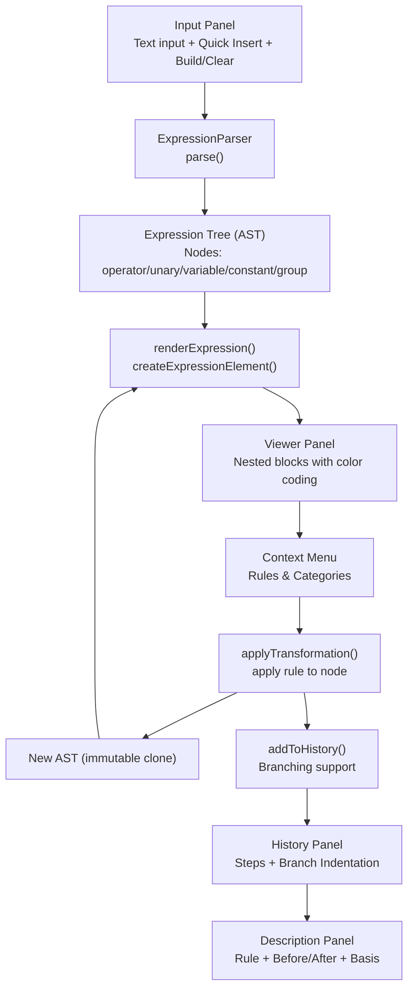
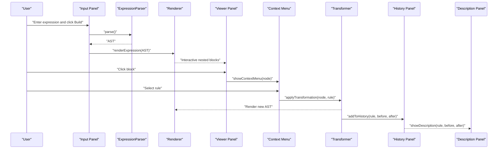
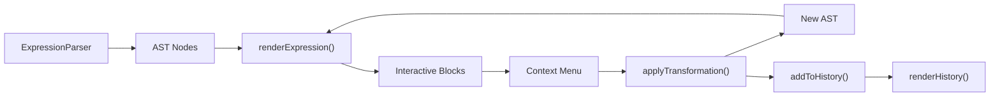

# Core Features

<cite>
**Referenced Files in This Document**
- [expression-editor.html](file://expression-editor.html)
- [README-EXPRESSION-EDITOR.md](file://README-EXPRESSION-EDITOR.md)
- [IMPLEMENTATION-SUMMARY.md](file://IMPLEMENTATION-SUMMARY.md)
- [TEST-CASES.md](file://TEST-CASES.md)
</cite>

## Table of Contents
1. [Introduction](#introduction)
2. [Project Structure](#project-structure)
3. [Core Components](#core-components)
4. [Architecture Overview](#architecture-overview)
5. [Detailed Component Analysis](#detailed-component-analysis)
6. [Dependency Analysis](#dependency-analysis)
7. [Performance Considerations](#performance-considerations)
8. [Troubleshooting Guide](#troubleshooting-guide)
9. [Conclusion](#conclusion)

## Introduction
This section documents the core features of the MathHelper application, focusing on how expressions are parsed and validated, how they are visually represented with color-coded blocks and nesting, how transformations are accessed via a context menu, how bidirectional rules enable expanding and factoring as well as implicit and explicit multiplication, how branching history navigation works, and how real-time visual feedback with animations enhances learning. Each feature is explained with implementation references to the expression-editor.html source and supporting documentation.

## Project Structure
The application is implemented as a single HTML file with embedded CSS and JavaScript. It includes:
- An input panel for entering expressions and quick insertion of operators
- A viewer panel for visualizing the expression as nested blocks
- A history panel for navigating transformation states with branching support
- A description panel that explains the selected transformation rule
- A hidden context menu that appears on block selection

**Diagram sources**
- [expression-editor.html](file://expression-editor.html#L508-L666)
- [expression-editor.html](file://expression-editor.html#L669-L736)
- [expression-editor.html](file://expression-editor.html#L739-L823)
- [expression-editor.html](file://expression-editor.html#L1434-L1469)
- [expression-editor.html](file://expression-editor.html#L1472-L1541)
- [expression-editor.html](file://expression-editor.html#L1543-L1651)

**Section sources**
- [expression-editor.html](file://expression-editor.html#L423-L478)
- [README-EXPRESSION-EDITOR.md](file://README-EXPRESSION-EDITOR.md#L1-L111)

## Core Components
- ExpressionParser: Converts a string into an Abstract Syntax Tree (AST) respecting operator precedence, unary minus, implicit multiplication, and parentheses. See [parse()](file://expression-editor.html#L514-L521), [parseExpression()](file://expression-editor.html#L523-L525), [parseAdditive()](file://expression-editor.html#L527-L542), [parseMultiplicative()](file://expression-editor.html#L544-L559), [parseUnary()](file://expression-editor.html#L561-L573), [parsePrimary()](file://expression-editor.html#L575-L625), [parseNumber()](file://expression-editor.html#L627-L637), [parseVariable()](file://expression-editor.html#L639-L649).
- renderExpression/createExpressionElement: Recursively generates interactive DOM elements representing the AST with color-coded borders and nested layouts. See [renderExpression()](file://expression-editor.html#L669-L673), [createExpressionElement()](file://expression-editor.html#L675-L736).
- Context Menu: Displays applicable transformation rules for a selected block, grouped by category, and applies transformations on selection. See [showContextMenu()](file://expression-editor.html#L739-L823), [getApplicableRules()](file://expression-editor.html#L887-L1169).
- Transformation Engine: Applies bidirectional rules (expand/factor, implicit/explicit) immutably by cloning the AST and replacing the target node. See [applyTransformation()](file://expression-editor.html#L1434-L1469), [cloneNode()](file://expression-editor.html#L849-L864), [findNodeById()](file://expression-editor.html#L866-L884).
- History Management: Records each state with branching support and enables navigation. See [addToHistory()](file://expression-editor.html#L1472-L1494), [renderHistory()](file://expression-editor.html#L1496-L1541).
- Real-time Feedback: Animates changed blocks and updates descriptions. See [applyTransformation() animation](file://expression-editor.html#L1461-L1469), [showDescription()](file://expression-editor.html#L1543-L1651).

**Section sources**
- [expression-editor.html](file://expression-editor.html#L508-L736)
- [expression-editor.html](file://expression-editor.html#L739-L1169)
- [expression-editor.html](file://expression-editor.html#L1192-L1469)
- [expression-editor.html](file://expression-editor.html#L1472-L1651)

## Architecture Overview
The system follows a pure-vanilla JavaScript architecture with a single-file design:
- Data model: AST nodes with id, type, value, children, and optional flags (e.g., implicit).
- Control flow: Input -> Parser -> AST -> Renderer -> Interactive Blocks -> Context Menu -> Transformation -> History -> Description.
- Immutability: Each transformation clones the AST and replaces only the target node, preserving prior states.

**Diagram sources**
- [expression-editor.html](file://expression-editor.html#L1654-L1689)
- [expression-editor.html](file://expression-editor.html#L508-L666)
- [expression-editor.html](file://expression-editor.html#L669-L736)
- [expression-editor.html](file://expression-editor.html#L739-L823)
- [expression-editor.html](file://expression-editor.html#L1434-L1469)
- [expression-editor.html](file://expression-editor.html#L1472-L1541)
- [expression-editor.html](file://expression-editor.html#L1543-L1651)

## Detailed Component Analysis

### Expression Parsing and Validation
- Purpose: Convert a human-readable expression string into an immutable AST while enforcing grammar rules and precedence.
- Implementation highlights:
  - Operator precedence: Parentheses, unary minus, multiplication/division, addition/subtraction. See [parseAdditive()](file://expression-editor.html#L527-L542) and [parseMultiplicative()](file://expression-editor.html#L544-L559).
  - Unary minus detection distinct from binary subtraction. See [parseUnary()](file://expression-editor.html#L561-L573).
  - Implicit multiplication detection (e.g., 2a, ab) and explicit multiplication conversion. See [parsePrimary()](file://expression-editor.html#L575-L625) and [getApplicableRules() rules for implicit/explicit](file://expression-editor.html#L1015-L1042).
  - Parentheses grouping and error handling for unmatched parentheses and unexpected characters. See [parsePrimary()](file://expression-editor.html#L575-L625) and [parse() error checks](file://expression-editor.html#L514-L521).
  - Robust error reporting with precise positions and clear messages. See [parse() throws](file://expression-editor.html#L514-L521) and [build button error handling](file://expression-editor.html#L1682-L1688).
- Educational benefit: Reinforces PEMDAS and mathematical notation conventions while providing immediate feedback on syntax errors.
- Practical benefit: Produces a reliable AST for rendering and transformations.

**Section sources**
- [expression-editor.html](file://expression-editor.html#L508-L666)
- [expression-editor.html](file://expression-editor.html#L1654-L1689)
- [README-EXPRESSION-EDITOR.md](file://README-EXPRESSION-EDITOR.md#L112-L135)

### Visual Block Representation with Color-Coding and Nesting
- Purpose: Render the AST as interactive, color-coded blocks that reflect operation types and nesting.
- Implementation highlights:
  - Color coding by type: operator-add/blue, operator-mul/purple, variable/green, constant/orange, group/gray. See [CSS variables and classes](file://expression-editor.html#L21-L28) and [createExpressionElement() type handling](file://expression-editor.html#L675-L736).
  - Nesting via nested containers for operators and groups. See [nested layout](file://expression-editor.html#L682-L721).
  - Interactive behavior: hover effects, click to open context menu. See [block hover styles](file://expression-editor.html#L198-L202) and [block click handler](file://expression-editor.html#L730-L736).
- Educational benefit: Makes tree structure visible and intuitive; helps learners understand precedence and grouping.
- Practical benefit: Provides immediate visual feedback and reduces cognitive load when manipulating complex expressions.

**Section sources**
- [expression-editor.html](file://expression-editor.html#L185-L235)
- [expression-editor.html](file://expression-editor.html#L669-L736)
- [README-EXPRESSION-EDITOR.md](file://README-EXPRESSION-EDITOR.md#L81-L111)

### Context Menu-Driven Transformation System
- Purpose: Offer contextual, rule-based transformations tailored to the selected block.
- Implementation highlights:
  - Determining applicable rules by inspecting node type/value/children and categorizing them. See [getApplicableRules()](file://expression-editor.html#L887-L1169).
  - Menu positioning near the clicked block with viewport-aware adjustments and outside-click-to-close behavior. See [showContextMenu()](file://expression-editor.html#L739-L823).
  - Applying transformations immutably by cloning the AST and replacing the target node. See [applyTransformation()](file://expression-editor.html#L1434-L1469).
  - Rule categories: Wrapping, Rearrangement, Expansion, Simplification, Computation, Notation. See [categories in getApplicableRules()](file://expression-editor.html#L900-L1169).
- Educational benefit: Encourages exploration of algebraic properties and notation conventions; shows bidirectional transformations.
- Practical benefit: Streamlines common manipulations and reduces manual typing errors.

**Section sources**
- [expression-editor.html](file://expression-editor.html#L739-L1169)
- [expression-editor.html](file://expression-editor.html#L1434-L1469)
- [README-EXPRESSION-EDITOR.md](file://README-EXPRESSION-EDITOR.md#L26-L41)

### Bidirectional Rules: Expand/Factor and Implicit/Explicit
- Purpose: Enable transformations in both directions to support flexible manipulation and learning.
- Implementation highlights:
  - Expand/Factor: Distributive property forward (expand) and reverse (factor). See [forward rules](file://expression-editor.html#L989-L1014) and [reverse rule](file://expression-editor.html#L1126-L1137).
  - Implicit/Explicit Multiplication: Toggle between 2a and 2*a. See [implicit detection and rule](file://expression-editor.html#L1015-L1042) and [explicit rule](file://expression-editor.html#L1018-L1025).
  - Commutative swaps for addition and multiplication. See [commutative rules](file://expression-editor.html#L1044-L1053) and [addition-only variant](file://expression-editor.html#L1114-L1125).
- Educational benefit: Reinforces fundamental properties (commutativity, distributivity) and notation fluency.
- Practical benefit: Allows users to switch between compact and explicit forms as needed.

**Section sources**
- [expression-editor.html](file://expression-editor.html#L989-L1169)
- [README-EXPRESSION-EDITOR.md](file://README-EXPRESSION-EDITOR.md#L26-L41)

### Branching History Navigation
- Purpose: Preserve all transformation states and allow branching to explore alternative paths.
- Implementation highlights:
  - Immutable state recording by deep-cloning the AST and storing rule metadata. See [addToHistory()](file://expression-editor.html#L1472-L1494).
  - Branching: When navigating back and applying a new transformation, a new state is appended with a parentId link. See [branching logic](file://expression-editor.html#L1483-L1489).
  - Navigation: Clicking a history node restores that state and updates the viewer and description. See [renderHistory() click handler](file://expression-editor.html#L1531-L1539).
  - Visual indicators: Current state highlighting and branch indentation. See [history node classes](file://expression-editor.html#L1506-L1514).
- Educational benefit: Supports experimentation and exploration of multiple solution paths.
- Practical benefit: Prevents accidental loss of intermediate steps and enables comparison across branches.

**Section sources**
- [expression-editor.html](file://expression-editor.html#L1472-L1541)
- [IMPLEMENTATION-SUMMARY.md](file://IMPLEMENTATION-SUMMARY.md#L90-L113)

### Real-time Visual Feedback with Animations
- Purpose: Provide immediate, clear feedback when transformations occur.
- Implementation highlights:
  - Change animation: Pulses on the changed block for 2 seconds. See [pulse animation](file://expression-editor.html#L231-L235) and [applyTransformation() animation trigger](file://expression-editor.html#L1461-L1469).
  - Hover effects: Thicker borders, glow, and slight lift on blocks. See [hover styles](file://expression-editor.html#L198-L202).
  - Smooth transitions across UI elements. See [transition durations](file://expression-editor.html#L112-L118).
- Educational benefit: Reinforces causality and helps learners track changes during complex manipulations.
- Practical benefit: Improves usability and reduces confusion when multiple transformations are applied rapidly.

**Section sources**
- [expression-editor.html](file://expression-editor.html#L198-L235)
- [expression-editor.html](file://expression-editor.html#L1461-L1469)
- [IMPLEMENTATION-SUMMARY.md](file://IMPLEMENTATION-SUMMARY.md#L108-L113)

### User Interaction Patterns and Beginner-Friendly Explanations
- Right-clicking blocks: Opens the context menu with applicable rules. The menu is positioned near the click and closes when clicking outside. See [showContextMenu()](file://expression-editor.html#L739-L823) and [outside click handler](file://expression-editor.html#L1712-L1717).
- Building expressions: Enter an expression and click “Build Expression” or press Enter. See [build button](file://expression-editor.html#L1654-L1689) and [Enter key listener](file://expression-editor.html#L1705-L1710).
- Clearing state: Reset the input, viewer, history, and description. See [clear button](file://expression-editor.html#L1691-L1703).
- Understanding tree structures and immutability:
  - Tree structure: Each operator node has children; grouping nodes encapsulate subtrees; leaves are variables and constants. See [AST node shape](file://expression-editor.html#L849-L864) and [rendering logic](file://expression-editor.html#L675-L736).
  - Immutability: Transformations clone the AST and replace only the target node, preserving prior states. See [cloneNode()](file://expression-editor.html#L849-L864) and [applyTransformation()](file://expression-editor.html#L1434-L1469).
- Common usage patterns:
  - Expand a distribution: select the multiplication block and choose “→ Expand (Distributive)”. See [distributive forward rules](file://expression-editor.html#L989-L1014).
  - Make multiplication implicit: select the multiplication block and choose “← Make Implicit”. See [implicit rule](file://expression-editor.html#L1033-L1041).
  - Navigate history: click any step to revert to that state; branching appears indented. See [renderHistory()](file://expression-editor.html#L1496-L1541).
  - Explore bidirectional rules: swap operands or toggle notation to compare forms. See [commutative rules](file://expression-editor.html#L1044-L1053) and [implicit/explicit rules](file://expression-editor.html#L1015-L1042).

**Section sources**
- [expression-editor.html](file://expression-editor.html#L739-L823)
- [expression-editor.html](file://expression-editor.html#L1434-L1469)
- [expression-editor.html](file://expression-editor.html#L1496-L1541)
- [TEST-CASES.md](file://TEST-CASES.md#L44-L103)

## Dependency Analysis
- Internal dependencies:
  - Parser depends on tokenizer helpers (consume, peek, isDigit, isLetter) and generates AST nodes. See [ExpressionParser methods](file://expression-editor.html#L508-L666).
  - Renderer depends on AST nodes and DOM creation. See [createExpressionElement()](file://expression-editor.html#L675-L736).
  - Context menu depends on getApplicableRules() to determine available transformations. See [getApplicableRules()](file://expression-editor.html#L887-L1169).
  - Transformation engine depends on cloneNode() and findNodeById() for immutability and node replacement. See [cloneNode()](file://expression-editor.html#L849-L864) and [findNodeById()](file://expression-editor.html#L866-L884).
  - History depends on addToHistory() and renderHistory() to manage states. See [addToHistory()](file://expression-editor.html#L1472-L1494) and [renderHistory()](file://expression-editor.html#L1496-L1541).
- External dependencies: None; pure vanilla JavaScript.

**Diagram sources**
- [expression-editor.html](file://expression-editor.html#L508-L736)
- [expression-editor.html](file://expression-editor.html#L849-L884)
- [expression-editor.html](file://expression-editor.html#L1434-L1541)

**Section sources**
- [expression-editor.html](file://expression-editor.html#L508-L736)
- [expression-editor.html](file://expression-editor.html#L849-L884)
- [expression-editor.html](file://expression-editor.html#L1434-L1541)

## Performance Considerations
- AST cloning: Deep cloning ensures immutability and prevents cross-state contamination. See [cloneNode()](file://expression-editor.html#L849-L864).
- Rendering efficiency: Recursive DOM generation and event delegation keep interactions smooth. See [createExpressionElement()](file://expression-editor.html#L675-L736) and [event delegation](file://expression-editor.html#L1712-L1717).
- History scaling: Branching support maintained without excessive memory usage; consider limiting history length for very large sessions. See [history management](file://expression-editor.html#L1472-L1541).
- Accessibility: Basic keyboard navigation and ARIA labels present; full screen reader support and keyboard shortcuts are future enhancements. See [accessibility note](file://IMPLEMENTATION-SUMMARY.md#L178-L179).

[No sources needed since this section provides general guidance]

## Troubleshooting Guide
- Empty or invalid input:
  - Symptom: Error message appears and input field highlights in red.
  - Resolution: Enter a valid expression; ensure balanced parentheses and valid operators. See [build button error handling](file://expression-editor.html#L1682-L1688).
- Unexpected character or syntax errors:
  - Symptom: Parser throws an error indicating invalid syntax.
  - Resolution: Fix operator sequences (e.g., avoid consecutive operators) and ensure parentheses are matched. See [parse() error checks](file://expression-editor.html#L514-L521).
- Context menu does not appear:
  - Symptom: Clicking a block does nothing.
  - Resolution: Some blocks (e.g., simple variables) have no applicable rules; select a different block. See [getApplicableRules() filtering](file://expression-editor.html#L887-L1169).
- Transformation not applying:
  - Symptom: Selecting a rule does not change the expression.
  - Resolution: Ensure the target node is found in the cloned AST; verify IDs are preserved during cloning for transformations. See [applyTransformation() and cloneNode()](file://expression-editor.html#L1434-L1469) and [bug fix note](file://IMPLEMENTATION-SUMMARY.md#L344-L370).
- Navigation issues:
  - Symptom: Clicking a history step does not restore the state.
  - Resolution: Confirm the state index is updated and the viewer is re-rendered; verify the AST is cloned when restoring. See [renderHistory() click handler](file://expression-editor.html#L1531-L1539).

**Section sources**
- [expression-editor.html](file://expression-editor.html#L1654-L1689)
- [expression-editor.html](file://expression-editor.html#L1434-L1469)
- [expression-editor.html](file://expression-editor.html#L1531-L1539)
- [IMPLEMENTATION-SUMMARY.md](file://IMPLEMENTATION-SUMMARY.md#L344-L370)

## Conclusion
The MathHelper application delivers a cohesive set of features centered on robust expression parsing, intuitive visual representation, and powerful, bidirectional transformation capabilities. Its branching history and real-time feedback make it an effective educational tool for exploring algebraic properties and notation, while its single-file architecture keeps it accessible and easy to deploy. Developers can extend the system by adding new rules to getApplicableRules() and implementing transformation functions, leveraging the existing immutability and rendering patterns.

[No sources needed since this section summarizes without analyzing specific files]