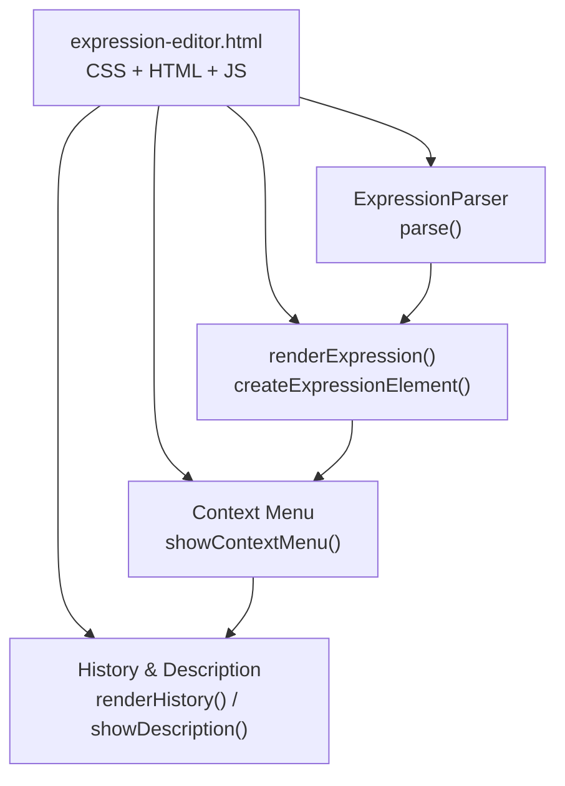
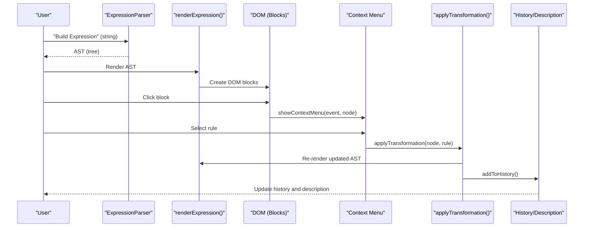
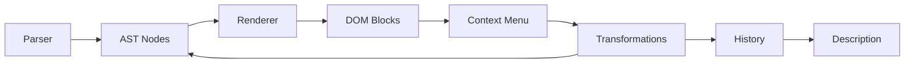

# Expression Visualization

<cite>
**Referenced Files in This Document**
- [expression-editor.html](file://expression-editor.html)
- [README-EXPRESSION-EDITOR.md](file://README-EXPRESSION-EDITOR.md)
- [IMPLEMENTATION-SUMMARY.md](file://IMPLEMENTATION-SUMMARY.md)
- [TEST-CASES.md](file://TEST-CASES.md)
- [BUG-FIX-LOG.md](file://BUG-FIX-LOG.md)
</cite>

## Table of Contents
1. [Introduction](#introduction)
2. [Project Structure](#project-structure)
3. [Core Components](#core-components)
4. [Architecture Overview](#architecture-overview)
5. [Detailed Component Analysis](#detailed-component-analysis)
6. [Dependency Analysis](#dependency-analysis)
7. [Performance Considerations](#performance-considerations)
8. [Troubleshooting Guide](#troubleshooting-guide)
9. [Conclusion](#conclusion)
10. [Appendices](#appendices)

## Introduction
This document explains the Expression Visualization feature of the MathHelper application. It focuses on how mathematical expressions are parsed into Abstract Syntax Trees (AST), rendered as interactive, color-coded blocks, and how users interact with the visualization through context menus. Practical examples illustrate how the expression “2*(a+3)” is transformed into a visual hierarchy, and how the underlying data structures map to DOM elements. Guidance is also provided for customization via CSS variables and troubleshooting common issues.

## Project Structure
The Expression Visualization feature is implemented in a single HTML file with embedded CSS and JavaScript. The key parts are:
- CSS variables and styles for theming and visual design
- An expression parser that converts strings into AST nodes
- Rendering functions that convert AST nodes into DOM elements
- A context menu system that offers transformation rules
- History and description panels for navigation and explanations

**Diagram sources**
- [expression-editor.html](file://expression-editor.html#L485-L1721)

**Section sources**
- [expression-editor.html](file://expression-editor.html#L485-L1721)

## Core Components
- ExpressionParser: A recursive descent parser that builds an AST from a string expression. It enforces operator precedence, handles unary minus, implicit multiplication, parentheses, and validates syntax.
- renderExpression and createExpressionElement: Functions that recursively build DOM elements from AST nodes, applying CSS classes and nested layouts.
- Context Menu: Dynamically generates menu items based on applicable transformation rules for the selected node.
- History and Description: Persist states and display rule explanations with before/after expressions.

Key implementation references:
- Parser and node types: [expression-editor.html](file://expression-editor.html#L507-L666)
- Rendering engine: [expression-editor.html](file://expression-editor.html#L669-L736)
- Context menu: [expression-editor.html](file://expression-editor.html#L739-L819)
- Rule detection and transformations: [expression-editor.html](file://expression-editor.html#L887-L1169)
- History and description: [expression-editor.html](file://expression-editor.html#L1471-L1651)

**Section sources**
- [expression-editor.html](file://expression-editor.html#L507-L1169)
- [expression-editor.html](file://expression-editor.html#L1471-L1651)

## Architecture Overview
The visualization pipeline transforms user input into an interactive, navigable AST:

**Diagram sources**
- [expression-editor.html](file://expression-editor.html#L507-L1169)
- [expression-editor.html](file://expression-editor.html#L1434-L1469)
- [expression-editor.html](file://expression-editor.html#L1471-L1651)

## Detailed Component Analysis

### AST Node Model and Data Structures
Each AST node is a plain object with:
- id: unique identifier
- type: operator | unary | variable | constant | group
- value: operator symbol or numeric value
- children: array of child nodes
- implicit: boolean flag for implicit multiplication

Examples and references:
- Node shape and fields: [README-EXPRESSION-EDITOR.md](file://README-EXPRESSION-EDITOR.md#L147-L169)
- Implementation of node creation in parser: [expression-editor.html](file://expression-editor.html#L507-L666)

Complexity:
- Parsing: O(n) over token count
- Rendering: O(n) over total nodes
- Finding a node by id: O(n) per search

**Section sources**
- [README-EXPRESSION-EDITOR.md](file://README-EXPRESSION-EDITOR.md#L147-L169)
- [expression-editor.html](file://expression-editor.html#L507-L666)

### Expression Parsing into AST
The parser enforces operator precedence and recognizes implicit multiplication. It distinguishes unary minus from binary subtraction and validates parentheses and operators.

Highlights:
- Precedence: parentheses → unary → multiplicative → additive
- Implicit multiplication detection for numeric prefixes and adjacent variables
- Error handling with precise messages

References:
- Parser class and methods: [expression-editor.html](file://expression-editor.html#L507-L666)
- Supported operations and examples: [README-EXPRESSION-EDITOR.md](file://README-EXPRESSION-EDITOR.md#L17-L41)

**Section sources**
- [expression-editor.html](file://expression-editor.html#L507-L666)
- [README-EXPRESSION-EDITOR.md](file://README-EXPRESSION-EDITOR.md#L17-L41)

### Rendering AST to Interactive Blocks
The renderer converts AST nodes into DOM elements with:
- CSS classes for color-coded borders by node type
- Nested layout for operators and groups
- Click handlers to open the context menu
- Special handling for implicit multiplication (middle dot)

References:
- renderExpression and createExpressionElement: [expression-editor.html](file://expression-editor.html#L669-L736)
- CSS color variables and hover effects: [expression-editor.html](file://expression-editor.html#L1-L40)

Example: “2*(a+3)” renders as:
- A multiplication block (purple border) with:
  - Left child: constant “2” (orange border)
  - Middle operator symbol (or middle dot for implicit)
  - Right child: group block (gray border) containing:
    - Addition block (blue border) with:
      - Left child: variable “a” (green border)
      - Right child: constant “3” (orange border)

**Section sources**
- [expression-editor.html](file://expression-editor.html#L669-L736)
- [expression-editor.html](file://expression-editor.html#L1-L40)
- [TEST-CASES.md](file://TEST-CASES.md#L37-L41)

### Visual Design and Theming
The visual design is driven by CSS variables and classes:
- Color coding by node type:
  - Blue borders for addition/subtraction operators
  - Purple borders for multiplication/division operators
  - Green borders for variables
  - Orange borders for constants
  - Gray borders for groups
  - Pulse animation for changed blocks
- Hover effects: thicker border, glow, and slight lift
- Responsive layout and dark theme

Customization:
- Modify :root CSS variables to change colors and accents
- Adjust spacing, radii, and shadows via CSS variables
- Override block classes for additional styling

References:
- CSS variables and block styles: [expression-editor.html](file://expression-editor.html#L1-L40)
- Hover and animation styles: [expression-editor.html](file://expression-editor.html#L185-L235)

**Section sources**
- [expression-editor.html](file://expression-editor.html#L1-L40)
- [expression-editor.html](file://expression-editor.html#L185-L235)

### User Interaction Model and Context Menu
Clicking any block opens a context menu with applicable transformation rules. The menu:
- Groups rules by category with separators
- Positions itself near the click location and avoids viewport overflow
- Closes when clicking outside

References:
- Context menu positioning and visibility: [expression-editor.html](file://expression-editor.html#L739-L819)
- Rule detection and categories: [expression-editor.html](file://expression-editor.html#L887-L1169)

**Section sources**
- [expression-editor.html](file://expression-editor.html#L739-L819)
- [expression-editor.html](file://expression-editor.html#L887-L1169)

### Underlying Data Structure Mapping to DOM
- Each AST node maps to a DOM element with dataset-node-id set to node.id
- Operators render nested children with operator symbols or middle dot
- Groups render parentheses around nested content
- Variables and constants render as text content
- Click events attach to blocks to trigger the context menu

References:
- DOM creation and attributes: [expression-editor.html](file://expression-editor.html#L669-L736)

**Section sources**
- [expression-editor.html](file://expression-editor.html#L669-L736)

### Practical Example: “2*(a+3)”
Steps:
1. Parse “2*(a+3)” into AST with:
   - Root: operator “*”
   - Left child: constant “2”
   - Right child: group containing:
     - Operator “+”
     - Left child: variable “a”
     - Right child: constant “3”
2. Render into nested blocks with:
   - Purple multiplication block
   - Gray group block around addition
   - Blue addition block
   - Green and orange colored children
3. Clicking the multiplication block reveals applicable rules (e.g., implicit/explicit, distributive expansion)

References:
- Example and visuals: [TEST-CASES.md](file://TEST-CASES.md#L37-L41)
- Rendering behavior: [expression-editor.html](file://expression-editor.html#L669-L736)

**Section sources**
- [TEST-CASES.md](file://TEST-CASES.md#L37-L41)
- [expression-editor.html](file://expression-editor.html#L669-L736)

### Transformation Rules and Bidirectionality
The system offers bidirectional rules:
- Expansion/Factoring (distributive property)
- Commutative swaps
- Implicit/Explicit multiplication
- Identity wrappers and simplifications
- Arithmetic evaluation for constants

References:
- Rule detection and functions: [expression-editor.html](file://expression-editor.html#L887-L1169)
- Transformation functions: [expression-editor.html](file://expression-editor.html#L1192-L1431)

**Section sources**
- [expression-editor.html](file://expression-editor.html#L887-L1169)
- [expression-editor.html](file://expression-editor.html#L1192-L1431)

### History and Description Panels
- History tracks each transformation with before/after expressions and timestamps
- Description panel shows rule name, reasoning, before/after, and mathematical basis
- Navigation toggles between states and updates description accordingly

References:
- History rendering and branching: [expression-editor.html](file://expression-editor.html#L1471-L1541)
- Description generation: [expression-editor.html](file://expression-editor.html#L1543-L1651)

**Section sources**
- [expression-editor.html](file://expression-editor.html#L1471-L1541)
- [expression-editor.html](file://expression-editor.html#L1543-L1651)

## Dependency Analysis
The visualization depends on:
- Parser to produce AST
- Renderer to create DOM blocks
- Context menu to offer rules
- Transformation functions to mutate the AST
- History and description to persist and explain changes

**Diagram sources**
- [expression-editor.html](file://expression-editor.html#L507-L1169)
- [expression-editor.html](file://expression-editor.html#L1471-L1651)

**Section sources**
- [expression-editor.html](file://expression-editor.html#L507-L1169)
- [expression-editor.html](file://expression-editor.html#L1471-L1651)

## Performance Considerations
- Rendering is O(n) over nodes; deep trees remain responsive.
- Deep cloning ensures immutable history states.
- Event delegation minimizes listener overhead.
- Consider debouncing input parsing for large expressions in future enhancements.

References:
- Performance notes: [IMPLEMENTATION-SUMMARY.md](file://IMPLEMENTATION-SUMMARY.md#L224-L230)

**Section sources**
- [IMPLEMENTATION-SUMMARY.md](file://IMPLEMENTATION-SUMMARY.md#L224-L230)

## Troubleshooting Guide
Common issues and resolutions:
- Invalid expressions cause parsing errors:
  - Symptoms: Error message appears and no visualization
  - Resolution: Fix syntax (e.g., unmatched parentheses, consecutive operators)
  - References: [expression-editor.html](file://expression-editor.html#L1654-L1689), [TEST-CASES.md](file://TEST-CASES.md#L128-L145)
- Context menu does not appear:
  - Symptom: Clicking a block yields no menu
  - Causes: No applicable rules or missing children
  - Resolution: Ensure node has children and is not a leaf where no rules apply
  - References: [expression-editor.html](file://expression-editor.html#L887-L1169)
- Transformations not applying:
  - Symptom: Menu closes but expression does not change
  - Cause: Node ID mismatch during cloning
  - Fix: Preserve IDs when cloning for transformation
  - References: [BUG-FIX-LOG.md](file://BUG-FIX-LOG.md#L1-L127)
- Only swap transformation available:
  - Symptom: Only commutative swap appears
  - Cause: Missing null checks and incomplete distributive support
  - Fix: Add null safety and left-hand distributive detection
  - References: [BUG-FIX-LOG.md](file://BUG-FIX-LOG.md#L128-L249)
- Improper rendering due to invalid expressions:
  - Symptom: Garbled or partial visualization
  - Resolution: Validate input and handle errors gracefully
  - References: [expression-editor.html](file://expression-editor.html#L1654-L1689)

**Section sources**
- [expression-editor.html](file://expression-editor.html#L1654-L1689)
- [TEST-CASES.md](file://TEST-CASES.md#L128-L145)
- [BUG-FIX-LOG.md](file://BUG-FIX-LOG.md#L1-L127)
- [BUG-FIX-LOG.md](file://BUG-FIX-LOG.md#L128-L249)

## Conclusion
The Expression Visualization feature provides a robust, interactive way to explore mathematical expressions. The AST-based architecture cleanly separates parsing, rendering, and interaction, enabling bidirectional transformations and rich visual feedback. With clear theming via CSS variables and comprehensive error handling, the system is both beginner-friendly and extensible for developers.

## Appendices

### Visual Design Reference
- Color coding by node type:
  - Blue: Addition/Subtraction
  - Purple: Multiplication/Division
  - Green: Variables
  - Orange: Constants
  - Gray: Groups
- Hover and animation:
  - Thicker border, glow, and lift on hover
  - Pulse animation for changed blocks

References:
- [expression-editor.html](file://expression-editor.html#L1-L40)
- [expression-editor.html](file://expression-editor.html#L185-L235)

**Section sources**
- [expression-editor.html](file://expression-editor.html#L1-L40)
- [expression-editor.html](file://expression-editor.html#L185-L235)

### Customization Options
- Modify :root CSS variables for colors and accents
- Adjust spacing, radii, and shadows via CSS variables
- Override block classes for additional styling

References:
- [expression-editor.html](file://expression-editor.html#L1-L40)

**Section sources**
- [expression-editor.html](file://expression-editor.html#L1-L40)