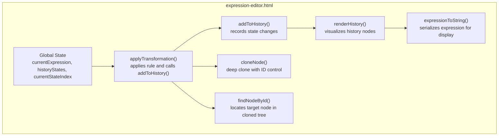
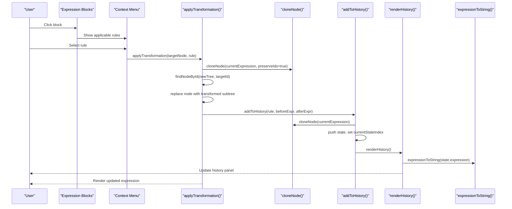
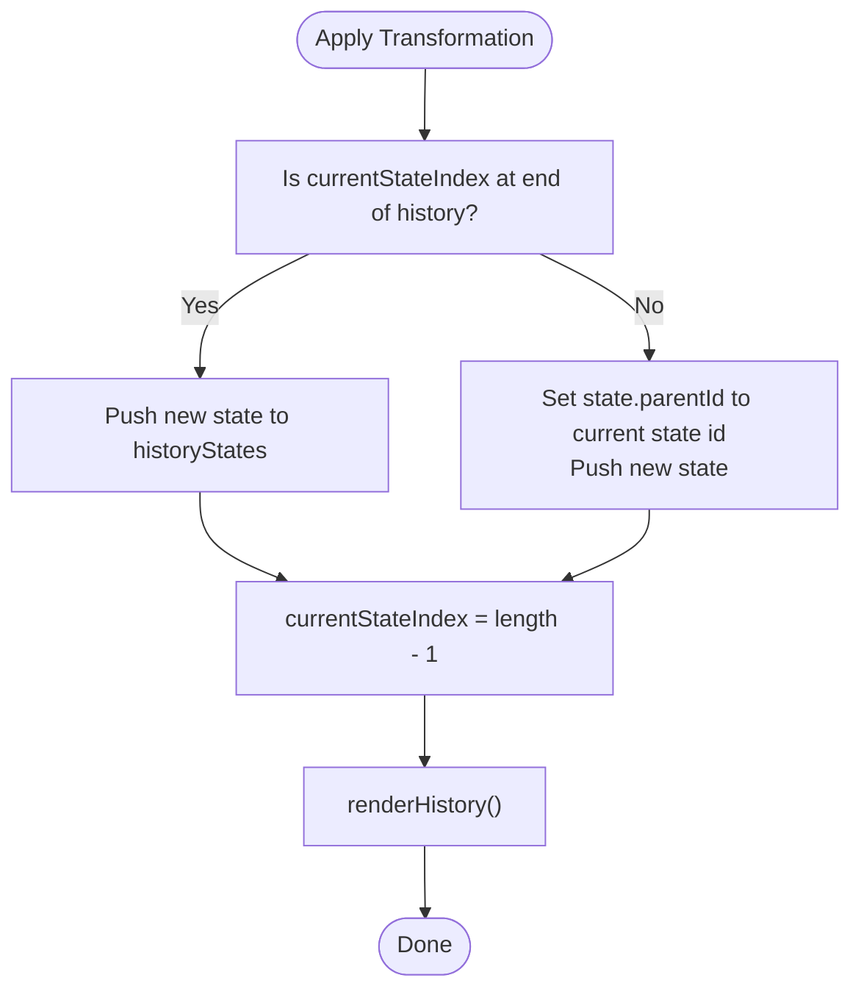
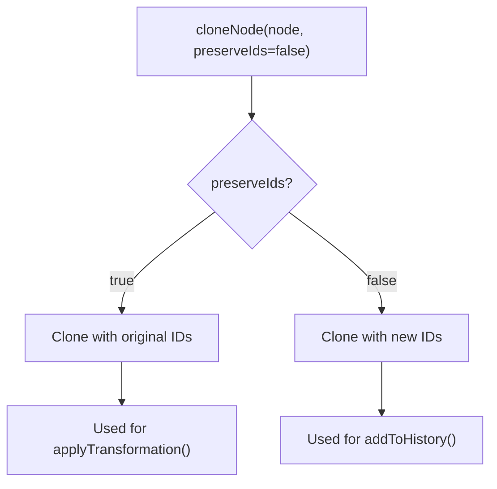
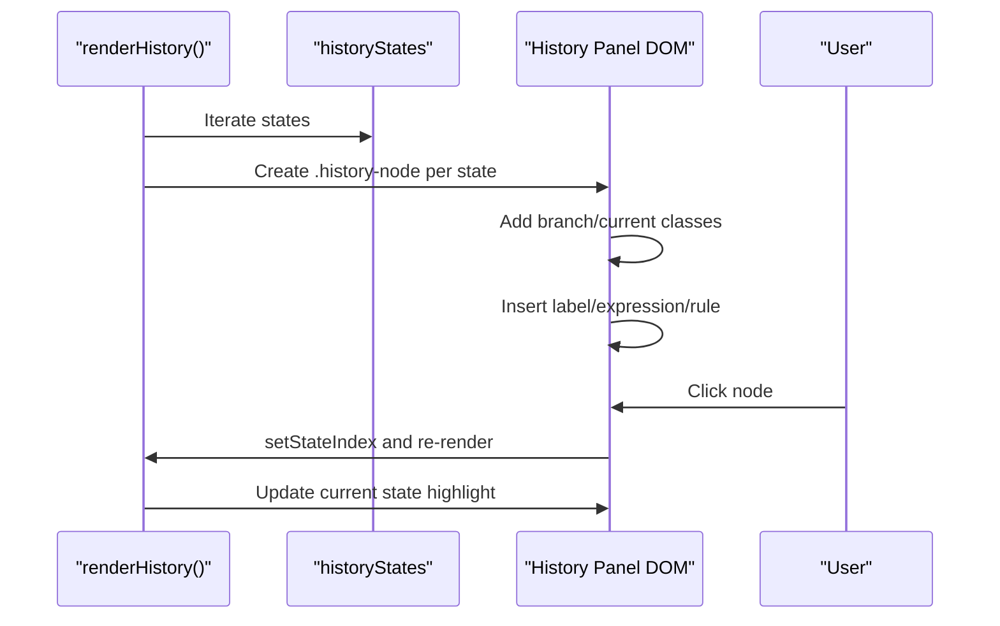
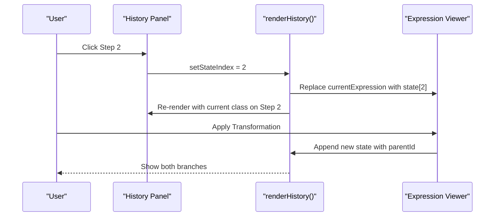
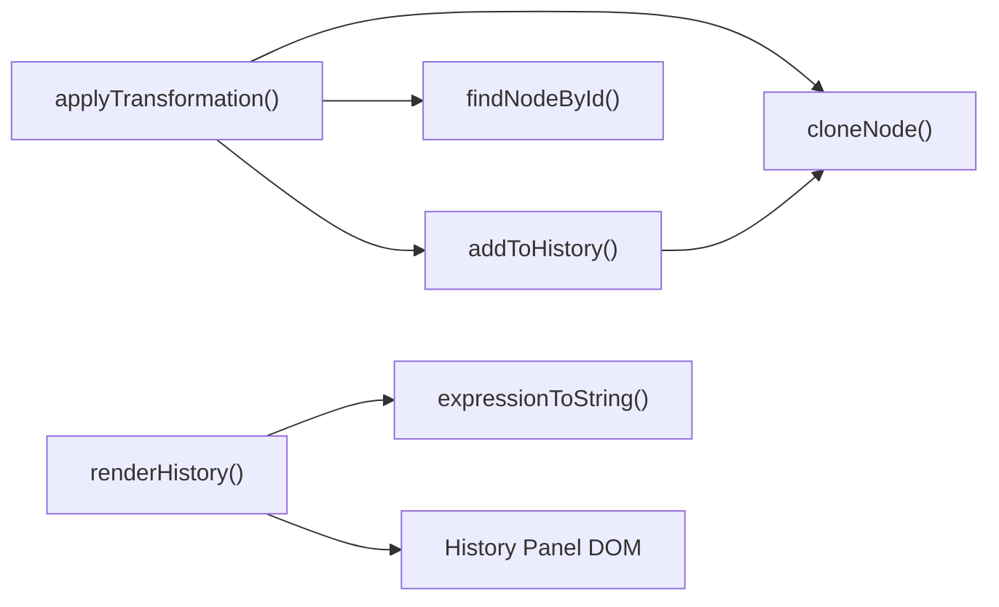

# History Navigation

<cite>
**Referenced Files in This Document**
- [expression-editor.html](file://expression-editor.html)
- [README-EXPRESSION-EDITOR.md](file://README-EXPRESSION-EDITOR.md)
- [IMPLEMENTATION-SUMMARY.md](file://IMPLEMENTATION-SUMMARY.md)
- [TEST-CASES.md](file://TEST-CASES.md)
- [BUG-FIX-LOG.md](file://BUG-FIX-LOG.md)
</cite>

## Table of Contents
1. [Introduction](#introduction)
2. [Project Structure](#project-structure)
3. [Core Components](#core-components)
4. [Architecture Overview](#architecture-overview)
5. [Detailed Component Analysis](#detailed-component-analysis)
6. [Dependency Analysis](#dependency-analysis)
7. [Performance Considerations](#performance-considerations)
8. [Troubleshooting Guide](#troubleshooting-guide)
9. [Conclusion](#conclusion)
10. [Appendices](#appendices)

## Introduction
This document explains the History Navigation feature of the MathHelper application. It focuses on how the system maintains a branching timeline of expression states using a history array and a current state index, enabling users to navigate transformations and explore alternative paths. It also details the implementation of history management functions that create deep clones of expression trees to ensure immutability, the visual representation in the history panel, and the user experience of reverting to prior states and branching from earlier points. Finally, it covers memory considerations, troubleshooting guidance, and customization options for history depth.

## Project Structure
The History Navigation feature is implemented entirely within a single HTML file. The relevant parts include:
- Global state variables for the current expression, history array, and current state index
- Deep cloning utilities for immutable state storage
- History recording and rendering functions
- UI elements for the history panel and visual feedback

**Diagram sources**
- [expression-editor.html](file://expression-editor.html#L485-L505)
- [expression-editor.html](file://expression-editor.html#L1499-L1522)
- [expression-editor.html](file://expression-editor.html#L1524-L1569)
- [expression-editor.html](file://expression-editor.html#L1461-L1497)
- [expression-editor.html](file://expression-editor.html#L848-L864)
- [expression-editor.html](file://expression-editor.html#L866-L884)
- [expression-editor.html](file://expression-editor.html#L825-L846)

**Section sources**
- [expression-editor.html](file://expression-editor.html#L485-L505)
- [expression-editor.html](file://expression-editor.html#L1499-L1522)
- [expression-editor.html](file://expression-editor.html#L1524-L1569)
- [expression-editor.html](file://expression-editor.html#L1461-L1497)
- [expression-editor.html](file://expression-editor.html#L848-L864)
- [expression-editor.html](file://expression-editor.html#L866-L884)
- [expression-editor.html](file://expression-editor.html#L825-L846)

## Core Components
- Global state
  - currentExpression: the current expression tree
  - historyStates: array of history entries
  - currentStateIndex: index of the currently selected state
- Deep cloning
  - cloneNode(node, preserveIds=false): creates a deep clone; when preserveIds=true, preserves node IDs for targeted transformations
- History management
  - addToHistory(rule, beforeExpr, afterExpr): records a new state with branching support
  - renderHistory(): renders the history panel with current state highlighting and branch indicators
- Transformation integration
  - applyTransformation(targetNode, rule): applies a transformation, replaces the node, updates currentExpression, and calls addToHistory()

Key behaviors:
- Immutability: each history state stores a deep clone of the expression tree
- Branching: when navigating back and applying a new transformation, a new state is appended with a parentId pointing to the previous state
- Visualization: nodes display step number, expression preview, and rule name; the current state is visually highlighted

**Section sources**
- [expression-editor.html](file://expression-editor.html#L485-L505)
- [expression-editor.html](file://expression-editor.html#L848-L864)
- [expression-editor.html](file://expression-editor.html#L1461-L1497)
- [expression-editor.html](file://expression-editor.html#L1499-L1522)
- [expression-editor.html](file://expression-editor.html#L1524-L1569)

## Architecture Overview
The history navigation architecture centers on maintaining a chronological, branching timeline of expression states. The system ensures immutability by storing deep clones of the expression tree at each step. Navigation is performed by setting the current state index and replacing the current expression with the corresponding stored state.

**Diagram sources**
- [expression-editor.html](file://expression-editor.html#L1461-L1497)
- [expression-editor.html](file://expression-editor.html#L848-L864)
- [expression-editor.html](file://expression-editor.html#L866-L884)
- [expression-editor.html](file://expression-editor.html#L1499-L1522)
- [expression-editor.html](file://expression-editor.html#L1524-L1569)
- [expression-editor.html](file://expression-editor.html#L825-L846)

## Detailed Component Analysis

### History State Model and Branching
- Data model
  - Each history entry includes:
    - id: unique state identifier
    - expression: deep-cloned expression tree
    - rule: human-readable rule name
    - ruleId: internal rule identifier
    - before/after: serialized expressions for display
    - timestamp: when the state was recorded
    - parentId: present when branching from a non-latest state
- Branching mechanism
  - When the current state index is not at the end of the history, newly recorded states include a parentId linking to the current state
  - This enables non-linear exploration: users can navigate back, apply a different transformation, and create a new branch

**Diagram sources**
- [expression-editor.html](file://expression-editor.html#L1499-L1522)
- [expression-editor.html](file://expression-editor.html#L1524-L1569)

**Section sources**
- [expression-editor.html](file://expression-editor.html#L1499-L1522)
- [expression-editor.html](file://expression-editor.html#L1524-L1569)

### Deep Cloning and Immutability
- cloneNode(node, preserveIds=false)
  - Recursively clones nodes
  - When preserveIds=true, preserves original IDs to enable targeted transformations
  - When preserveIds=false, generates new IDs for safe storage in history
- Why it matters
  - Ensures each history state is independent and unaffected by subsequent edits
  - Allows accurate node replacement during transformations without corrupting other states

**Diagram sources**
- [expression-editor.html](file://expression-editor.html#L848-L864)
- [expression-editor.html](file://expression-editor.html#L1461-L1497)
- [expression-editor.html](file://expression-editor.html#L1499-L1522)

**Section sources**
- [expression-editor.html](file://expression-editor.html#L848-L864)
- [expression-editor.html](file://expression-editor.html#L1461-L1497)
- [expression-editor.html](file://expression-editor.html#L1499-L1522)

### History Panel Rendering and User Interaction
- renderHistory()
  - Iterates through historyStates
  - Adds branch class for states with parentId
  - Adds current class for the state at currentStateIndex
  - Displays step number, expression preview, and rule name
  - Attaches click handler to revert to that state
- addToHistory()
  - Creates a new state with a deep clone of the current expression
  - Sets parentId when branching
  - Updates currentStateIndex and re-renders the history panel
- Visual cues
  - Branch nodes indented
  - Current state highlighted with a blue border and special dot
  - Timestamps are stored per state; the panel displays step numbers and rule names

**Diagram sources**
- [expression-editor.html](file://expression-editor.html#L1524-L1569)

**Section sources**
- [expression-editor.html](file://expression-editor.html#L1524-L1569)

### User Experience: Reverting and Branching
- Reverting
  - Clicking a history node sets currentStateIndex to that node’s index
  - The current expression is replaced with a deep clone of the selected state
  - The expression viewer updates, and the history panel reflects the new current state
- Branching
  - Navigate back to an earlier state
  - Apply a different transformation
  - A new state is appended with parentId pointing to the previous state
  - Both branches remain accessible in the history panel

**Diagram sources**
- [expression-editor.html](file://expression-editor.html#L1524-L1569)
- [expression-editor.html](file://expression-editor.html#L1499-L1522)

**Section sources**
- [expression-editor.html](file://expression-editor.html#L1524-L1569)
- [expression-editor.html](file://expression-editor.html#L1499-L1522)

### Examples from expression-editor.html
- addToHistory is invoked after applyTransformation completes, ensuring each transformation is recorded with before/after expressions and rule metadata
- The history panel uses expressionToString to display expression previews for each state
- Branching is handled by checking whether currentStateIndex is at the end of history before pushing a new state

**Section sources**
- [expression-editor.html](file://expression-editor.html#L1461-L1497)
- [expression-editor.html](file://expression-editor.html#L1499-L1522)
- [expression-editor.html](file://expression-editor.html#L1524-L1569)
- [expression-editor.html](file://expression-editor.html#L825-L846)

## Dependency Analysis
- Internal dependencies
  - applyTransformation depends on cloneNode (preserveIds=true) and findNodeById to locate the target node in the cloned tree
  - addToHistory depends on cloneNode (preserveIds=false) to store immutable snapshots
  - renderHistory depends on expressionToString to display expression previews
- External dependencies
  - None; the implementation is self-contained in a single HTML file

**Diagram sources**
- [expression-editor.html](file://expression-editor.html#L848-L864)
- [expression-editor.html](file://expression-editor.html#L866-L884)
- [expression-editor.html](file://expression-editor.html#L1461-L1497)
- [expression-editor.html](file://expression-editor.html#L1499-L1522)
- [expression-editor.html](file://expression-editor.html#L1524-L1569)
- [expression-editor.html](file://expression-editor.html#L825-L846)

**Section sources**
- [expression-editor.html](file://expression-editor.html#L848-L864)
- [expression-editor.html](file://expression-editor.html#L866-L884)
- [expression-editor.html](file://expression-editor.html#L1461-L1497)
- [expression-editor.html](file://expression-editor.html#L1499-L1522)
- [expression-editor.html](file://expression-editor.html#L1524-L1569)
- [expression-editor.html](file://expression-editor.html#L825-L846)

## Performance Considerations
- Memory footprint
  - Each history state stores a deep clone of the expression tree
  - The design documentation mentions a practical limit of 100 states to prevent memory issues
- Recommendations
  - Consider trimming history beyond a configurable threshold
  - For very large expressions, consider lazy serialization or compact representations
  - Avoid frequent reflows by batching DOM updates when rendering long histories

**Section sources**
- [README-EXPRESSION-EDITOR.md](file://README-EXPRESSION-EDITOR.md#L224-L230)

## Troubleshooting Guide
Common issues and resolutions:
- Transformations not applying
  - Symptom: Context menu appears and seems to run, but the expression does not change
  - Cause: Node ID mismatch during cloning
  - Resolution: Ensure cloneNode preserves IDs when applying transformations; the implementation already addresses this
- Only “Swap Operands” available
  - Symptom: Only commutative swaps appear
  - Cause: Missing null checks and incomplete distributive property detection
  - Resolution: Add null safety checks and support for left-hand distributive property; the implementation already addresses this
- Unexpected navigation behavior
  - Symptom: Clicking a history node does not revert as expected
  - Causes:
    - History not updated after transformations
    - State index not reset when clearing
  - Resolution:
    - Verify addToHistory is called after applyTransformation
    - Confirm clear action resets historyStates and currentStateIndex

Validation references:
- Test cases confirm linear history, branching, and description updates
- Bug fixes document the resolution of ID preservation and rule detection issues

**Section sources**
- [TEST-CASES.md](file://TEST-CASES.md#L104-L125)
- [BUG-FIX-LOG.md](file://BUG-FIX-LOG.md#L1-L127)
- [BUG-FIX-LOG.md](file://BUG-FIX-LOG.md#L128-L253)

## Conclusion
The History Navigation feature provides a robust, branching timeline of expression states. Through deep cloning and careful ID management, it ensures immutability and accurate targeting of transformations. The history panel offers clear visual cues for current state and branches, enabling users to explore alternative paths. While the design documentation suggests a practical limit of 100 states, the implementation demonstrates strong support for branching and non-linear exploration. With the outlined troubleshooting steps and potential enhancements, the feature is well-positioned for continued improvement.

## Appendices

### Customization Options
- History depth
  - Current behavior: The design documentation indicates a practical limit of 100 states
  - Suggested customization: Introduce a configuration option to adjust the maximum number of states retained
- Undo/redo shortcuts
  - Current behavior: No keyboard shortcuts are implemented
  - Suggested enhancement: Add keyboard shortcuts for undo/redo and navigation between states

**Section sources**
- [README-EXPRESSION-EDITOR.md](file://README-EXPRESSION-EDITOR.md#L224-L230)
- [IMPLEMENTATION-SUMMARY.md](file://IMPLEMENTATION-SUMMARY.md#L238-L250)