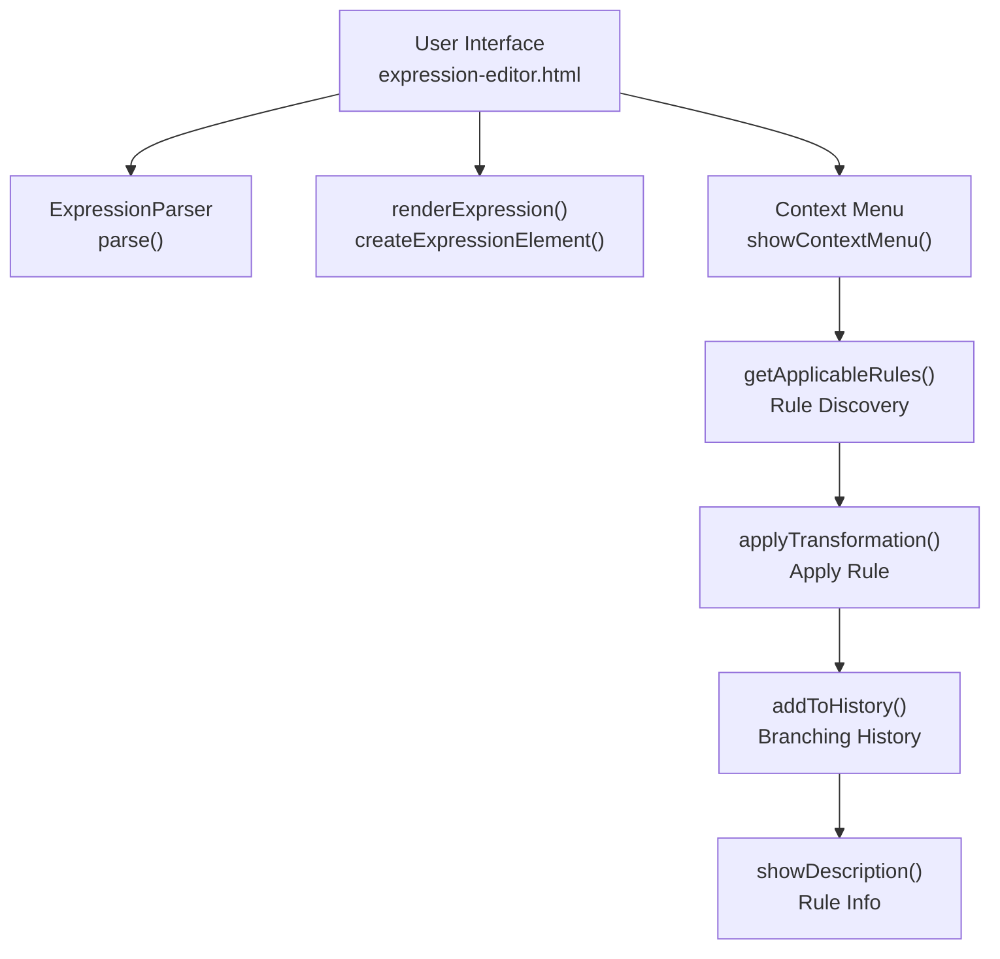
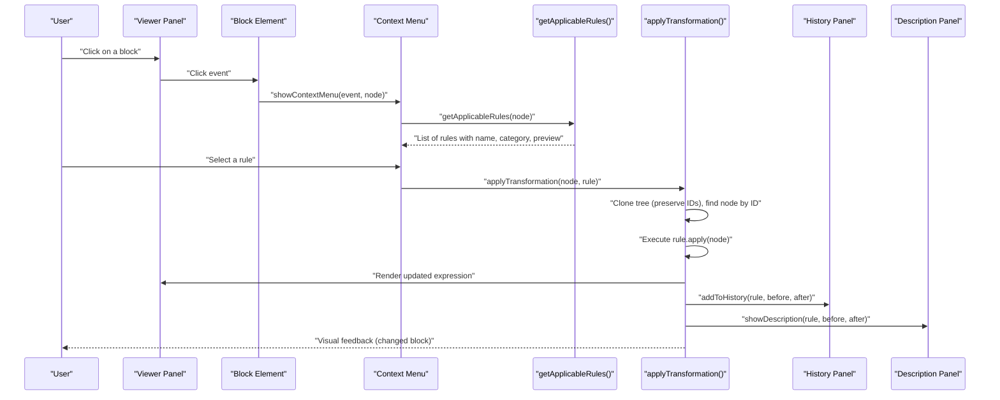
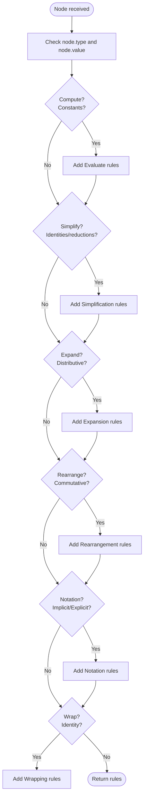
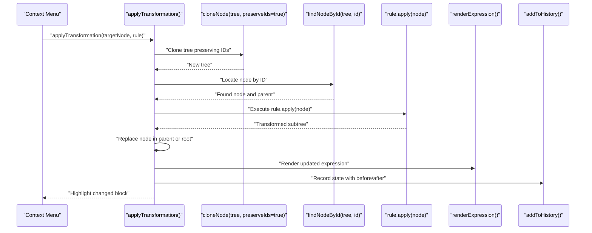
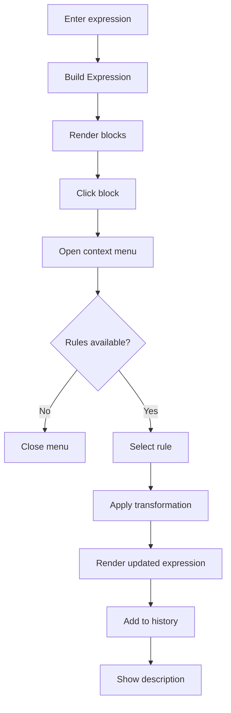
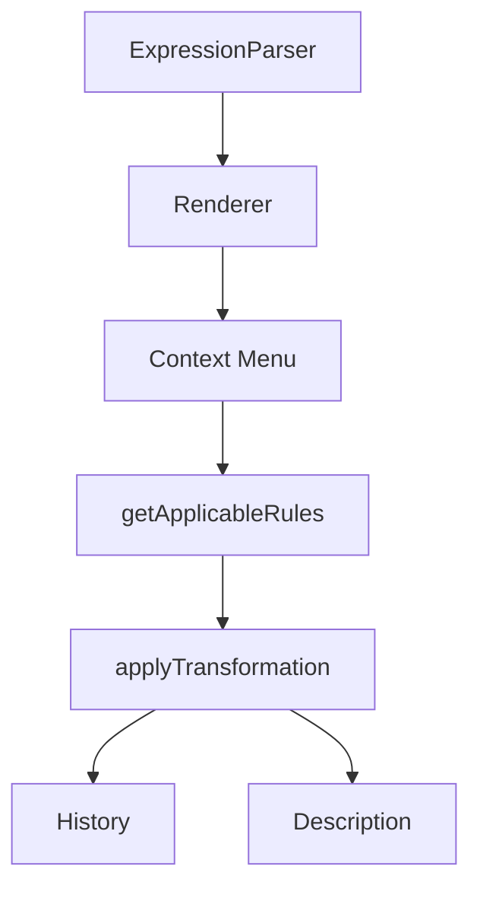

# Transformation System

<cite>
**Referenced Files in This Document**
- [expression-editor.html](file://expression-editor.html)
- [README-EXPRESSION-EDITOR.md](file://README-EXPRESSION-EDITOR.md)
- [IMPLEMENTATION-SUMMARY.md](file://IMPLEMENTATION-SUMMARY.md)
- [TEST-CASES.md](file://TEST-CASES.md)
</cite>

## Table of Contents
1. [Introduction](#introduction)
2. [Project Structure](#project-structure)
3. [Core Components](#core-components)
4. [Architecture Overview](#architecture-overview)
5. [Detailed Component Analysis](#detailed-component-analysis)
6. [Dependency Analysis](#dependency-analysis)
7. [Performance Considerations](#performance-considerations)
8. [Troubleshooting Guide](#troubleshooting-guide)
9. [Conclusion](#conclusion)
10. [Appendices](#appendices)

## Introduction
This document explains the Transformation System of the MathHelper application, focusing on how users apply algebraic transformations via the context menu. It covers rule categories (Wrapping, Computation, Simplification, Expansion, Rearrangement, and Notation), the implementation of getApplicableRules to determine valid transformations for a selected node, and how applyTransformation executes bidirectional rules (e.g., expand/factor, implicit/explicit). It also documents the user workflow, mathematical foundations of key rules, beginner-friendly explanations, troubleshooting, and performance considerations. Guidance for extending the system with new rules is included.

## Project Structure
The Transformation System is implemented in a single HTML file with embedded CSS and JavaScript. The relevant parts include:
- Expression parsing and rendering
- Context menu UI and event handling
- Rule categorization and applicability checks
- Transformation functions (forward and reverse)
- History recording and navigation
- Description panel for rule explanations

**Diagram sources**
- [expression-editor.html](file://expression-editor.html#L508-L736)
- [expression-editor.html](file://expression-editor.html#L739-L819)
- [expression-editor.html](file://expression-editor.html#L887-L1236)
- [expression-editor.html](file://expression-editor.html#L1501-L1561)
- [expression-editor.html](file://expression-editor.html#L1610-L1718)

**Section sources**
- [expression-editor.html](file://expression-editor.html#L508-L736)
- [expression-editor.html](file://expression-editor.html#L739-L819)
- [expression-editor.html](file://expression-editor.html#L887-L1236)
- [expression-editor.html](file://expression-editor.html#L1501-L1561)
- [expression-editor.html](file://expression-editor.html#L1610-L1718)

## Core Components
- ExpressionParser: Converts a string expression into an expression tree with operator precedence, unary minus, implicit multiplication detection, and parentheses grouping.
- Renderer: Recursively creates visual blocks for each node and attaches click handlers to open the context menu.
- Context Menu: Displays applicable rules grouped by category, with previews and direction indicators.
- Rule Discovery: getApplicableRules determines valid transformations based on node type/value and structure.
- Transformation Engine: applyTransformation clones the tree (preserving IDs for node lookup), applies the chosen rule, replaces the node, updates the UI, and records history.
- History and Description: addToHistory stores states with branching support; showDescription renders rule explanations and mathematical basis.

**Section sources**
- [expression-editor.html](file://expression-editor.html#L508-L736)
- [expression-editor.html](file://expression-editor.html#L739-L819)
- [expression-editor.html](file://expression-editor.html#L887-L1236)
- [expression-editor.html](file://expression-editor.html#L1501-L1561)
- [expression-editor.html](file://expression-editor.html#L1610-L1718)

## Architecture Overview
The Transformation System integrates parsing, rendering, and transformation logic into a cohesive workflow. The context menu is the primary user entry point for transformations, driven by getApplicableRules and executed by applyTransformation.

**Diagram sources**
- [expression-editor.html](file://expression-editor.html#L739-L819)
- [expression-editor.html](file://expression-editor.html#L887-L1236)
- [expression-editor.html](file://expression-editor.html#L1501-L1561)
- [expression-editor.html](file://expression-editor.html#L1610-L1718)

## Detailed Component Analysis

### Rule Categories and Examples
The system organizes transformations into categories for clarity. The categories present in the implementation include:
- Computation: Evaluate constants (addition, subtraction, multiplication, division)
- Simplification: Remove identities (multiplication by 1, division by 1), addition/subtraction of zero, double negation removal, parentheses removal, and factoring out common terms
- Expansion: Distributive property expansion (forward)
- Rearrangement: Commutative property for addition and multiplication
- Notation: Implicit vs explicit multiplication
- Wrapping: Identity transformations that wrap expressions (reverse operations)

Examples of rule entries (structured as name, category, preview, apply) are defined in getApplicableRules and used to populate the context menu. These entries are objects with id, name, category, preview, and apply fields.

**Section sources**
- [expression-editor.html](file://expression-editor.html#L887-L1236)
- [README-EXPRESSION-EDITOR.md](file://README-EXPRESSION-EDITOR.md#L26-L41)

### getApplicableRules: Determining Valid Transformations
getApplicableRules evaluates the selected node and returns applicable rules based on:
- Node type and value (operator, unary, group, variable, constant)
- Children structure (e.g., implicit multiplication flag)
- Arithmetic safety checks (e.g., avoiding division by zero)
- Structural conditions (e.g., canFactor for common factor extraction)

The function logs debug information and returns a prioritized list of rules grouped by category. It includes:
- Computation rules for constant arithmetic
- Simplification rules for identities and reductions
- Expansion rules for distributive expansion
- Rearrangement rules for commutative swaps
- Notation rules for implicit/explicit multiplication
- Wrapping rules for identity transformations

**Diagram sources**
- [expression-editor.html](file://expression-editor.html#L887-L1236)

**Section sources**
- [expression-editor.html](file://expression-editor.html#L887-L1236)

### applyTransformation: Executing Bidirectional Rules
applyTransformation performs the following steps:
- Clone the current expression tree with preserved IDs to locate the target node in the new tree
- Find the target node by ID using findNodeById
- Execute the rule’s apply function on the located node
- Replace the node in the parent or set as new root
- Re-render the expression and record the state in history
- Provide visual feedback by highlighting the changed block

**Diagram sources**
- [expression-editor.html](file://expression-editor.html#L1501-L1561)
- [expression-editor.html](file://expression-editor.html#L848-L884)

**Section sources**
- [expression-editor.html](file://expression-editor.html#L1501-L1561)
- [expression-editor.html](file://expression-editor.html#L848-L884)

### Bidirectional Rules: Expand/Factor and Implicit/Explicit
Bidirectional rules are supported by providing both forward and reverse transformations:
- Distributive property:
  - Forward: Expand a(b+c) to ab + ac
  - Reverse: Factor ab + ac to a(b+c)
- Implicit/Explicit multiplication:
  - Forward: Make 2a explicit as 2*a
  - Reverse: Make 2*a implicit as 2a

These are represented by distinct rules with direction indicators and previews. The system uses canFactor to detect when factoring is applicable and applies the reverse transformation accordingly.

**Section sources**
- [expression-editor.html](file://expression-editor.html#L1239-L1257)
- [expression-editor.html](file://expression-editor.html#L1259-L1361)
- [expression-editor.html](file://expression-editor.html#L1371-L1431)
- [README-EXPRESSION-EDITOR.md](file://README-EXPRESSION-EDITOR.md#L26-L41)

### User Workflow: Right-click to Transform
The user workflow is:
1. Build an expression to visualize it as nested blocks
2. Click on any block to open the context menu
3. Review available rules grouped by category with previews
4. Select a rule to apply it
5. Observe the updated expression and visual feedback
6. Navigate history to review or branch from earlier states

**Diagram sources**
- [expression-editor.html](file://expression-editor.html#L739-L819)
- [expression-editor.html](file://expression-editor.html#L1501-L1561)
- [expression-editor.html](file://expression-editor.html#L1610-L1718)

**Section sources**
- [expression-editor.html](file://expression-editor.html#L739-L819)
- [expression-editor.html](file://expression-editor.html#L1501-L1561)
- [expression-editor.html](file://expression-editor.html#L1610-L1718)

### Mathematical Foundations of Key Rules
- Distributive Property: a(b+c) = ab + ac and (a+b)c = ac + bc
- Commutative Property: a + b = b + a and a × b = b × a
- Identity Laws: a × 1 = a, a/1 = a, a + 0 = a, a − 0 = a
- Double Negation: −(−a) = a
- Parentheses Removal: (a) = a when safe

Descriptions for each rule include reasoning and mathematical basis, displayed in the Description Panel.

**Section sources**
- [expression-editor.html](file://expression-editor.html#L1610-L1718)
- [README-EXPRESSION-EDITOR.md](file://README-EXPRESSION-EDITOR.md#L26-L41)

### Beginner-Friendly Explanations
- Bidirectional transformations: Some rules can be applied forwards and backwards. The context menu shows direction indicators (→, ←, ↔) and previews to help users understand before/after states.
- Safe transformations: Rules are only shown when applicable. For example, division by one and multiplication by one are only offered when the denominator or multiplier is exactly one.
- Visual feedback: Changed blocks pulse to indicate the transformation took effect.

**Section sources**
- [expression-editor.html](file://expression-editor.html#L739-L819)
- [expression-editor.html](file://expression-editor.html#L1501-L1561)
- [IMPLEMENTATION-SUMMARY.md](file://IMPLEMENTATION-SUMMARY.md#L56-L107)

### Extending the System with New Rules
To add a new transformation rule:
1. Extend getApplicableRules to push a new rule object with id, name, category, preview, and apply function
2. Implement the apply function to return a transformed node tree
3. Optionally add a description entry in showDescription if the rule has a dedicated ID

The README provides a template for adding rules and describes how to implement transformation functions.

**Section sources**
- [README-EXPRESSION-EDITOR.md](file://README-EXPRESSION-EDITOR.md#L179-L209)
- [expression-editor.html](file://expression-editor.html#L887-L1236)
- [expression-editor.html](file://expression-editor.html#L1610-L1718)

## Dependency Analysis
The Transformation System depends on:
- ExpressionParser for AST construction
- Renderer for block creation and click handling
- Context Menu for rule presentation and selection
- History management for branching and navigation
- Description panel for rule explanations

**Diagram sources**
- [expression-editor.html](file://expression-editor.html#L508-L736)
- [expression-editor.html](file://expression-editor.html#L739-L819)
- [expression-editor.html](file://expression-editor.html#L887-L1236)
- [expression-editor.html](file://expression-editor.html#L1501-L1561)
- [expression-editor.html](file://expression-editor.html#L1610-L1718)

**Section sources**
- [expression-editor.html](file://expression-editor.html#L508-L736)
- [expression-editor.html](file://expression-editor.html#L739-L819)
- [expression-editor.html](file://expression-editor.html#L887-L1236)
- [expression-editor.html](file://expression-editor.html#L1501-L1561)
- [expression-editor.html](file://expression-editor.html#L1610-L1718)

## Performance Considerations
- Deep cloning: Trees are deep-cloned for each state to ensure consistency and enable branching. This is efficient for typical expression sizes but should be considered for very large expressions.
- Event delegation: Click handlers are attached to blocks via delegation, improving performance for dynamic content.
- History limits: While the implementation notes a practical limit, the code currently appends states without trimming. Consider limiting history length for memory safety.
- Rendering: Rendering is smooth for moderately sized expressions; deep nesting and long histories are handled without noticeable lag in tests.

**Section sources**
- [IMPLEMENTATION-SUMMARY.md](file://IMPLEMENTATION-SUMMARY.md#L242-L248)
- [IMPLEMENTATION-SUMMARY.md](file://IMPLEMENTATION-SUMMARY.md#L261-L269)
- [TEST-CASES.md](file://TEST-CASES.md#L177-L193)

## Troubleshooting Guide
Common issues and resolutions:
- No rules available: If a block has no applicable rules (e.g., a simple variable), the context menu will not appear. Try selecting a different block (e.g., an operator or group).
- Transformation not applying: Ensure the target node is correctly identified. The system preserves IDs during cloning for node lookup; if IDs change unexpectedly, verify cloneNode behavior.
- Division by zero: Rules that divide by one are only offered when the denominator is exactly one. Avoid attempting to divide by zero manually.
- History navigation: Clicking a previous state reverts the expression. From there, you can apply different transformations to create branches.

Validation and error handling:
- Parser throws descriptive errors for invalid syntax (e.g., unmatched parentheses, consecutive operators).
- Build button validates input and clears error styling after a delay.

**Section sources**
- [expression-editor.html](file://expression-editor.html#L739-L819)
- [expression-editor.html](file://expression-editor.html#L1501-L1561)
- [expression-editor.html](file://expression-editor.html#L1721-L1756)
- [TEST-CASES.md](file://TEST-CASES.md#L126-L150)

## Conclusion
The Transformation System provides a robust, beginner-friendly way to explore algebraic manipulations through a visual context menu. getApplicableRules ensures only safe and relevant transformations are presented, while applyTransformation executes bidirectional rules reliably. The system’s architecture supports extension with new rules and maintains a branching history for exploration. With careful attention to performance and user feedback, it serves as a strong foundation for learning and experimenting with algebraic transformations.

## Appendices

### Rule Structure Reference
Rules are objects with the following fields:
- id: Unique identifier for the rule
- name: Human-readable rule name with direction indicators
- category: Category string (e.g., "Computation", "Simplification", "Expansion", "Rearrangement", "Notation", "Wrapping")
- preview: Before/after preview string
- apply: Function that takes a node and returns a transformed node

Examples of rule entries are defined in getApplicableRules and used to populate the context menu.

**Section sources**
- [expression-editor.html](file://expression-editor.html#L887-L1236)

### Mathematical Properties Overview
- Commutative Property: a + b ↔ b + a, a × b ↔ b × a
- Associative Property: (a + b) + c ↔ a + (b + c)
- Distributive Property: a × (b + c) ↔ a × b + a × c
- Identity Laws: a × 1 ↔ a, a/1 ↔ a, a + 0 ↔ a, a − 0 ↔ a
- Double Negation: −(−a) ↔ a
- Parentheses Removal: (a) ↔ a (when safe)
- Implicit/Explicit Multiplication: 2a ↔ 2 × a, ab ↔ a × b

**Section sources**
- [README-EXPRESSION-EDITOR.md](file://README-EXPRESSION-EDITOR.md#L26-L41)