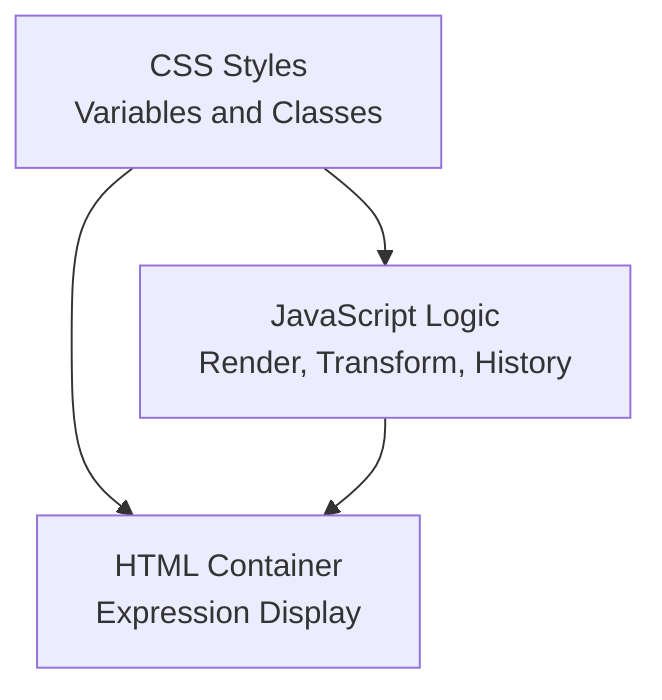
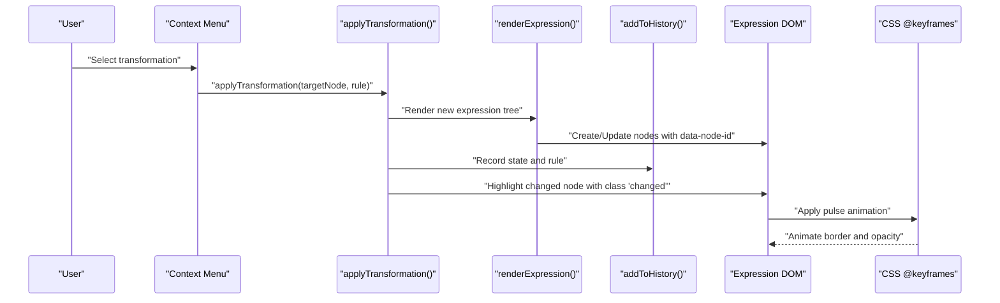
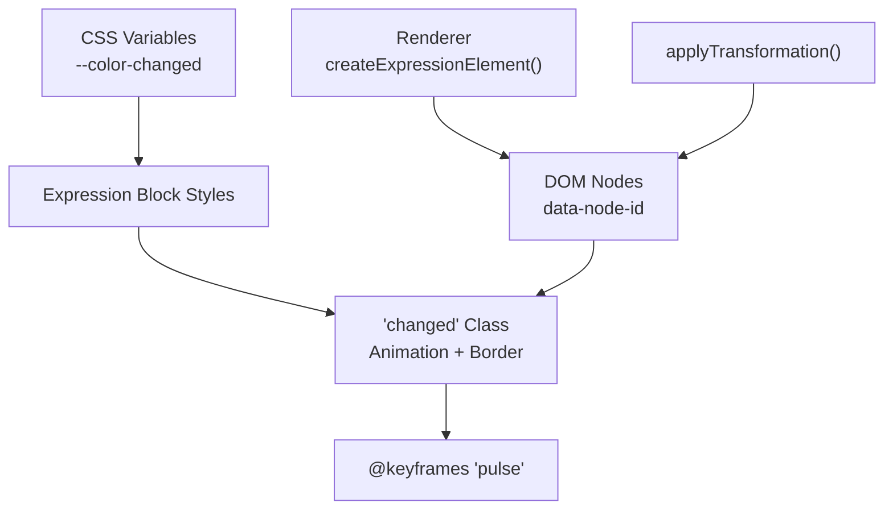

# Visual Feedback

<cite>
**Referenced Files in This Document**
- [expression-editor.html](file://expression-editor.html)
- [README-EXPRESSION-EDITOR.md](file://README-EXPRESSION-EDITOR.md)
</cite>

## Table of Contents
1. [Introduction](#introduction)
2. [Project Structure](#project-structure)
3. [Core Components](#core-components)
4. [Architecture Overview](#architecture-overview)
5. [Detailed Component Analysis](#detailed-component-analysis)
6. [Dependency Analysis](#dependency-analysis)
7. [Performance Considerations](#performance-considerations)
8. [Troubleshooting Guide](#troubleshooting-guide)
9. [Conclusion](#conclusion)

## Introduction
This document explains the Visual Feedback feature of the MathHelper application, focusing on how the system provides immediate, animated feedback when transformations are applied. It details the implementation of the “changed” state in expression blocks, the pulse animation defined in CSS @keyframes, and how the system temporarily applies the “changed” class to affected nodes after a transformation. It also covers the integration between JavaScript state updates and CSS animations, the role of visual feedback in helping users understand algebraic manipulations, customization options via CSS variables, and best practices for smooth, responsive feedback during rapid successive transformations.

## Project Structure
The Visual Feedback feature is implemented entirely within a single HTML file with embedded CSS and JavaScript. The relevant parts include:
- CSS variables and styles for expression blocks and the “changed” state
- CSS @keyframes defining the pulse animation
- JavaScript that renders the expression tree, applies transformations, and toggles the “changed” class on the affected node

**Diagram sources**
- [expression-editor.html](file://expression-editor.html#L180-L241)
- [expression-editor.html](file://expression-editor.html#L1461-L1497)

**Section sources**
- [expression-editor.html](file://expression-editor.html#L1-L241)
- [README-EXPRESSION-EDITOR.md](file://README-EXPRESSION-EDITOR.md#L1-L20)

## Core Components
- CSS variables for theme and customization
  - Defines a dedicated variable for the “changed” color used in visual feedback.
- Expression block styling
  - Base styles for expression blocks, hover effects, and category-specific borders.
- “Changed” state and pulse animation
  - The “changed” class triggers a two-second pulse animation and switches the border color to the configured “changed” color.
- JavaScript rendering and transformation pipeline
  - Renders the expression tree into DOM nodes with data attributes.
  - Applies transformations and records history.
  - Highlights the modified node with a temporary “changed” class.

Key implementation references:
- CSS variables and “changed” class: [expression-editor.html](file://expression-editor.html#L180-L241)
- Pulse animation definition: [expression-editor.html](file://expression-editor.html#L231-L234)
- Rendering and block creation: [expression-editor.html](file://expression-editor.html#L669-L736)
- Applying transformations and adding to history: [expression-editor.html](file://expression-editor.html#L1461-L1497)
- Highlighting the changed block: [expression-editor.html](file://expression-editor.html#L1488-L1496)

**Section sources**
- [expression-editor.html](file://expression-editor.html#L180-L241)
- [expression-editor.html](file://expression-editor.html#L669-L736)
- [expression-editor.html](file://expression-editor.html#L1461-L1497)

## Architecture Overview
The Visual Feedback loop connects user actions to visual changes through a deterministic sequence: the user selects a transformation, the system applies it, re-renders the expression, and highlights the modified node with a pulse animation.

**Diagram sources**
- [expression-editor.html](file://expression-editor.html#L739-L784)
- [expression-editor.html](file://expression-editor.html#L1461-L1497)
- [expression-editor.html](file://expression-editor.html#L1499-L1522)
- [expression-editor.html](file://expression-editor.html#L226-L234)

## Detailed Component Analysis

### CSS Variables and Customization
- Purpose: Centralize theme and feedback colors for easy customization.
- Key variable:
  - --color-changed: Controls the border color during the “changed” animation.
- How to customize:
  - Override the variable in :root to change the highlight color globally.
  - Combine with animation duration or timing adjustments in the animation declaration if desired.

References:
- Variable definition: [expression-editor.html](file://expression-editor.html#L26-L26)
- Usage in “changed” class: [expression-editor.html](file://expression-editor.html#L226-L229)

**Section sources**
- [expression-editor.html](file://expression-editor.html#L26-L26)
- [expression-editor.html](file://expression-editor.html#L226-L229)

### Expression Block Styling and Category Borders
- Purpose: Provide immediate visual cues about node types.
- Behavior:
  - Different categories (operators, variables, constants, groups) receive distinct border colors.
  - Hover effects enhance interactivity.
- Interaction with feedback:
  - The “changed” class overrides the category border color to draw attention to the modified node.

References:
- Base block styles and hover: [expression-editor.html](file://expression-editor.html#L185-L202)
- Category-specific borders: [expression-editor.html](file://expression-editor.html#L204-L224)
- “changed” class and pulse: [expression-editor.html](file://expression-editor.html#L226-L234)

**Section sources**
- [expression-editor.html](file://expression-editor.html#L185-L234)

### Pulse Animation and the “changed” State
- Definition: A two-second @keyframes animation that pulses opacity to draw attention.
- Trigger:
  - The system adds the “changed” class to the affected node after rendering.
  - The class sets the border color to the configured “changed” color and starts the animation.
- Duration:
  - The animation runs for 2 seconds; the system removes the class after the animation completes to reset the node’s appearance.

References:
- Animation definition: [expression-editor.html](file://expression-editor.html#L231-L234)
- Class application and removal: [expression-editor.html](file://expression-editor.html#L1488-L1496)

**Section sources**
- [expression-editor.html](file://expression-editor.html#L231-L234)
- [expression-editor.html](file://expression-editor.html#L1488-L1496)

### JavaScript Rendering and Node Identification
- Rendering:
  - The renderer creates DOM nodes for each expression tree node and assigns a unique dataset attribute (data-node-id) to enable precise targeting.
- Node identification:
  - During transformations, the system locates the target node by its id and replaces it with the transformed subtree.
- Feedback integration:
  - After re-rendering, the system queries the DOM by data-node-id and applies the “changed” class to the corresponding block.

References:
- Rendering and block creation: [expression-editor.html](file://expression-editor.html#L669-L736)
- Node selection and replacement: [expression-editor.html](file://expression-editor.html#L1461-L1480)
- Highlighting logic: [expression-editor.html](file://expression-editor.html#L1488-L1496)

**Section sources**
- [expression-editor.html](file://expression-editor.html#L669-L736)
- [expression-editor.html](file://expression-editor.html#L1461-L1496)

### Transformation Pipeline and History Recording
- Purpose: Maintain a branching history of states and update the UI after each transformation.
- Highlights:
  - After applying a transformation, the system re-renders the expression and records the state with rule metadata.
  - The “changed” class is applied to the transformed node to visually mark it.
- Impact on feedback:
  - The delayed application of the “changed” class ensures the DOM reflects the new state before highlighting begins, preventing missed highlights.

References:
- Applying transformation and recording history: [expression-editor.html](file://expression-editor.html#L1461-L1497)
- History rendering and current state indicator: [expression-editor.html](file://expression-editor.html#L1499-L1522)

**Section sources**
- [expression-editor.html](file://expression-editor.html#L1461-L1497)
- [expression-editor.html](file://expression-editor.html#L1499-L1522)

### Visual Feedback in Learning and Orientation
- Role in comprehension:
  - The pulse animation and color change help users quickly locate the transformed part of a complex expression tree.
- Role in orientation:
  - In branching histories, the “changed” feedback reinforces which node was targeted, aiding navigation and understanding of transformation paths.

References:
- Feature overview mentioning real-time feedback: [README-EXPRESSION-EDITOR.md](file://README-EXPRESSION-EDITOR.md#L1-L20)

**Section sources**
- [README-EXPRESSION-EDITOR.md](file://README-EXPRESSION-EDITOR.md#L1-L20)

## Dependency Analysis
The Visual Feedback feature depends on:
- CSS variables and styles for consistent theming and animation behavior
- JavaScript rendering and transformation logic for DOM updates and node targeting
- History management to ensure the UI reflects the latest state before highlighting

**Diagram sources**
- [expression-editor.html](file://expression-editor.html#L26-L26)
- [expression-editor.html](file://expression-editor.html#L185-L234)
- [expression-editor.html](file://expression-editor.html#L669-L736)
- [expression-editor.html](file://expression-editor.html#L1461-L1497)
- [expression-editor.html](file://expression-editor.html#L231-L234)

**Section sources**
- [expression-editor.html](file://expression-editor.html#L26-L26)
- [expression-editor.html](file://expression-editor.html#L185-L234)
- [expression-editor.html](file://expression-editor.html#L669-L736)
- [expression-editor.html](file://expression-editor.html#L1461-L1497)
- [expression-editor.html](file://expression-editor.html#L231-L234)

## Performance Considerations
- Re-rendering cost:
  - The system performs a full re-render after each transformation. While simple and reliable, frequent successive transformations can cause layout thrashing if not managed carefully.
- Animation timing:
  - The “changed” class is applied with a small delay to ensure the DOM reflects the new state. This reduces race conditions but still requires careful sequencing when applying multiple transformations rapidly.
- Recommendations:
  - Batch rapid transformations when possible to minimize repeated re-renders.
  - Prefer targeted updates (e.g., updating only the affected subtree) if the DOM model allows it.
  - Keep animation durations reasonable to avoid blocking user interactions.

[No sources needed since this section provides general guidance]

## Troubleshooting Guide
- The “changed” animation does not trigger:
  - Verify that the target node exists in the DOM after re-rendering and that its data-node-id matches the transformed node id.
  - Confirm that the “changed” class is added and removed after the animation duration.
  - References:
    - Highlighting logic: [expression-editor.html](file://expression-editor.html#L1488-L1496)
- Animation appears too short or too long:
  - Adjust the animation duration in the @keyframes rule and ensure the removal timeout matches the duration.
  - References:
    - Animation definition: [expression-editor.html](file://expression-editor.html#L231-L234)
- Feedback color does not match expectations:
  - Override the CSS variable --color-changed to set a custom highlight color.
  - References:
    - Variable definition: [expression-editor.html](file://expression-editor.html#L26-L26)
- Rapid successive transformations cause flicker or missed highlights:
  - Ensure the highlight is applied after re-rendering and consider debouncing or batching transformations to reduce layout churn.
  - References:
    - Transformation and highlight sequence: [expression-editor.html](file://expression-editor.html#L1461-L1497)

**Section sources**
- [expression-editor.html](file://expression-editor.html#L1488-L1496)
- [expression-editor.html](file://expression-editor.html#L231-L234)
- [expression-editor.html](file://expression-editor.html#L26-L26)
- [expression-editor.html](file://expression-editor.html#L1461-L1497)

## Conclusion
The Visual Feedback feature in MathHelper combines CSS-driven pulse animations with targeted JavaScript highlighting to make transformations immediately visible and understandable. By leveraging a dedicated “changed” class, a configurable color variable, and a predictable animation duration, the system clearly communicates which parts of an expression were modified. Proper sequencing of re-rendering and highlighting ensures reliable feedback, while customization options allow teams to align the visuals with their branding and accessibility needs.

[No sources needed since this section summarizes without analyzing specific files]