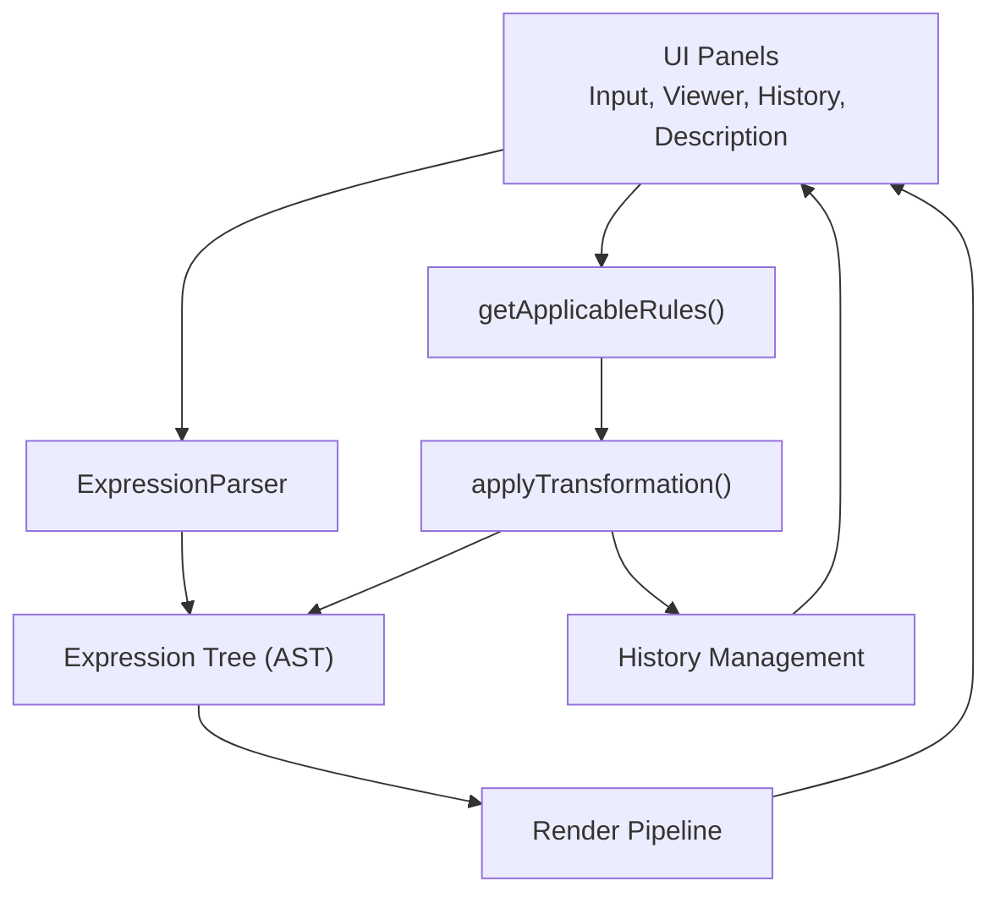
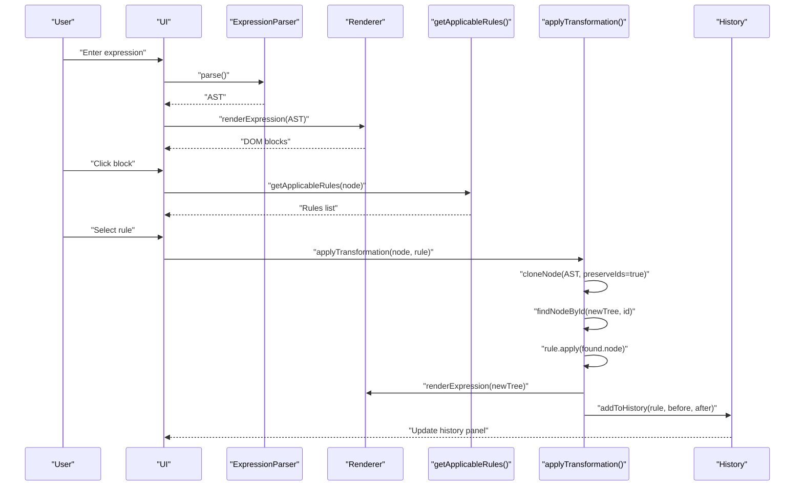
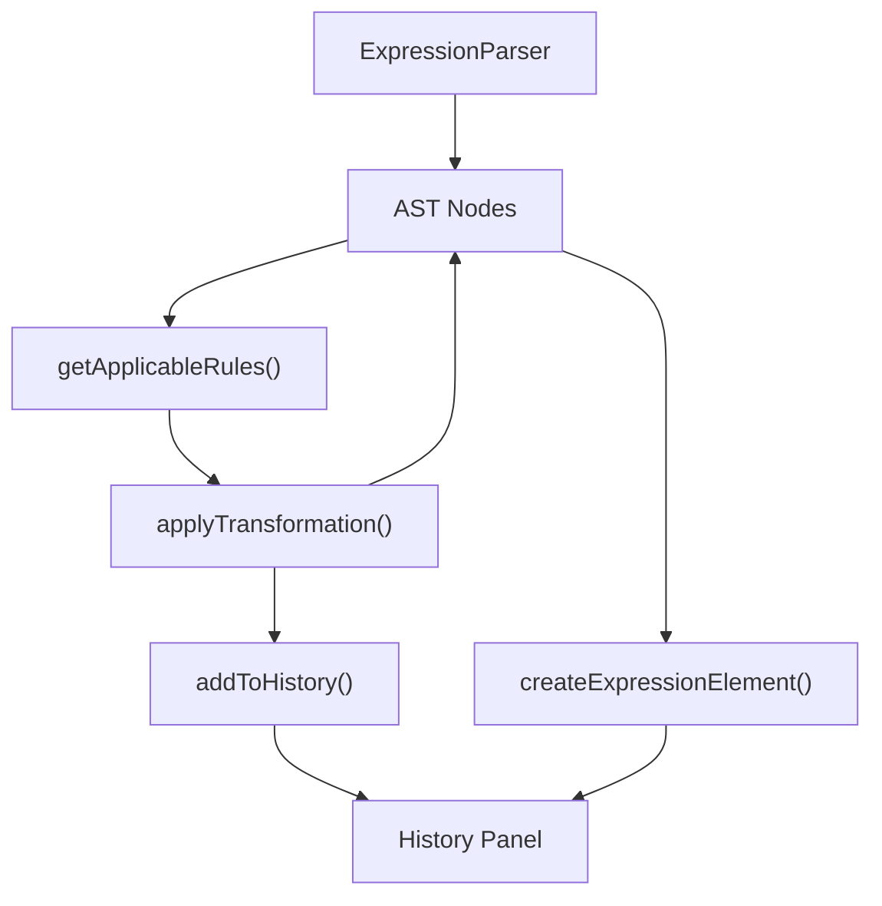

# Development and Extension

<cite>
**Referenced Files in This Document**
- [expression-editor.html](file://expression-editor.html)
- [README-EXPRESSION-EDITOR.md](file://README-EXPRESSION-EDITOR.md)
- [IMPLEMENTATION-SUMMARY.md](file://IMPLEMENTATION-SUMMARY.md)
- [BUG-FIX-LOG.md](file://BUG-FIX-LOG.md)
- [TEST-CASES.md](file://TEST-CASES.md)
</cite>

## Table of Contents
1. [Introduction](#introduction)
2. [Project Structure](#project-structure)
3. [Core Components](#core-components)
4. [Architecture Overview](#architecture-overview)
5. [Detailed Component Analysis](#detailed-component-analysis)
6. [Dependency Analysis](#dependency-analysis)
7. [Performance Considerations](#performance-considerations)
8. [Troubleshooting Guide](#troubleshooting-guide)
9. [Conclusion](#conclusion)
10. [Appendices](#appendices)

## Introduction
This section empowers developers to extend and modify the MathHelper application safely and effectively. It explains how to add new transformation rules by following the established patterns, how to extend the parser to support new operators, how to customize the UI using CSS variables, and how to add new quick-insert buttons or enhance the context menu. It also references the BUG-FIX-LOG.md to illustrate common pitfalls and lessons learned, and provides best practices for testing, immutability, and compatibility with the history system.

## Project Structure
The application is a single-file HTML document that embeds CSS and JavaScript. Key areas for extension are:
- CSS variables for theming and animations
- ExpressionParser for grammar and precedence
- getApplicableRules for rule detection and context menu population
- applyTransformation for applying rules and updating state
- Rendering pipeline for visual blocks
- History management for branching and navigation

**Diagram sources**
- [expression-editor.html](file://expression-editor.html#L508-L736)
- [expression-editor.html](file://expression-editor.html#L887-L1169)
- [expression-editor.html](file://expression-editor.html#L1434-L1494)

**Section sources**
- [expression-editor.html](file://expression-editor.html#L1-L120)
- [README-EXPRESSION-EDITOR.md](file://README-EXPRESSION-EDITOR.md#L136-L170)

## Core Components
- CSS variables define colors, spacing, and animations for the entire UI. They are used to theme blocks, menus, and transitions consistently.
- ExpressionParser converts input strings into an AST with operator precedence and implicit multiplication support.
- Rendering transforms the AST into nested, interactive blocks with hover and click behaviors.
- getApplicableRules enumerates available transformations for a selected node and organizes them by category.
- applyTransformation executes a chosen rule immutably, updates the AST, and records a history state.
- History management stores immutable snapshots and supports branching.

**Section sources**
- [expression-editor.html](file://expression-editor.html#L1-L120)
- [expression-editor.html](file://expression-editor.html#L508-L736)
- [expression-editor.html](file://expression-editor.html#L887-L1169)
- [expression-editor.html](file://expression-editor.html#L1434-L1494)
- [IMPLEMENTATION-SUMMARY.md](file://IMPLEMENTATION-SUMMARY.md#L116-L169)

## Architecture Overview
The system follows a pure client-side architecture with a clear separation of concerns:
- Parsing: recursive descent with precedence
- Rendering: recursive DOM generation
- Interaction: context menu driven by rule detection
- State: immutable AST clones with history indexing and branching

**Diagram sources**
- [expression-editor.html](file://expression-editor.html#L508-L736)
- [expression-editor.html](file://expression-editor.html#L887-L1169)
- [expression-editor.html](file://expression-editor.html#L1434-L1494)

## Detailed Component Analysis

### Extending Transformation Rules
Follow these steps to add a new transformation rule:
1. Extend getApplicableRules() to detect applicability for a given node. Add a new condition and push a rule object with:
   - id: unique string
   - name: human-readable label
   - category: grouping label (e.g., "Simplification", "Expansion", "Rearrangement", "Notation", "Wrapping", "Computation")
   - preview: short before/after example
   - apply: a function that returns a transformed subtree
2. Implement the transformation function. It must:
   - Clone subtrees using cloneNode(node, preserveIds=false) for new nodes
   - Return a new AST node with fresh ids
   - Preserve implicit flags and structure as needed
3. Optionally add a description entry in the description mapping for detailed explanations.

Best practices:
- Always preserve immutability: never mutate the original AST. Clone and replace nodes.
- Use preserveIds=true only when cloning for transformation to locate the target node; for history storage, generate new ids.
- Add null checks for node.children before accessing indices.
- Keep previews concise and mathematically accurate.

Common pitfalls to avoid:
- Silent failures: ensure error logging when node lookup fails.
- Breaking AST structure: verify children arrays and types match expectations.
- Memory leaks: avoid storing references to DOM nodes or global state; rely on immutable trees.

**Section sources**
- [expression-editor.html](file://expression-editor.html#L887-L1169)
- [expression-editor.html](file://expression-editor.html#L1192-L1433)
- [expression-editor.html](file://expression-editor.html#L1434-L1494)
- [BUG-FIX-LOG.md](file://BUG-FIX-LOG.md#L1-L122)
- [BUG-FIX-LOG.md](file://BUG-FIX-LOG.md#L123-L253)

### Extending the Parser to Support New Operators
To add a new operator:
1. Decide precedence level. The current precedence order is:
   - Parentheses (highest)
   - Unary operators
   - Multiplication/Division
   - Addition/Subtraction (lowest)
2. Update ExpressionParser.parseExpression(), parseAdditive(), parseMultiplicative(), and parseUnary() to handle the operator at the correct level.
3. Add parsing logic for implicit multiplication and precedence-aware lookahead.
4. Add color scheme in CSS for the new operator type.
5. Update createExpressionElement() to render the operator block with appropriate styling and nested children.
6. Add rule detection in getApplicableRules() for transformations involving the operator.
7. Implement transformation functions and descriptions.

Validation tips:
- Test with complex expressions and nested parentheses.
- Ensure associativity and precedence are correct.
- Add error handling for malformed expressions.

**Section sources**
- [expression-editor.html](file://expression-editor.html#L508-L736)
- [expression-editor.html](file://expression-editor.html#L1-L120)
- [expression-editor.html](file://expression-editor.html#L887-L1169)
- [README-EXPRESSION-EDITOR.md](file://README-EXPRESSION-EDITOR.md#L112-L135)

### Customizing the UI with CSS Variables
The application uses CSS variables for:
- Backgrounds, cards, borders, and accents
- Expression block colors by type (operators, variables, constants, groups)
- Spacing and radii
- Animations (pulse) and hover effects

To customize:
- Modify :root variables to change theme colors and spacing.
- Add new variables for additional operator types or UI elements.
- Keep consistent naming conventions for block colors and transitions.

Effects to note:
- Hover effects increase border thickness and add glow.
- Change animation applies a pulse class to the changed block for 2 seconds.
- Menus and panels use consistent border radii and shadows.

**Section sources**
- [expression-editor.html](file://expression-editor.html#L1-L120)

### Adding New Quick-Insert Buttons
The quick-insert toolbar demonstrates the pattern:
- Add a new button with an onclick handler that calls insertText(text).
- insertText updates the input selection and caret position.

To add a new quick-insert button:
1. Add a button element in the toolbar with an onclick handler.
2. Ensure the handler calls insertText with the desired symbol.
3. Optionally add tooltips or accessibility labels.

**Section sources**
- [expression-editor.html](file://expression-editor.html#L420-L479)
- [expression-editor.html](file://expression-editor.html#L496-L505)

### Enhancing the Context Menu
The context menu:
- Is positioned near the clicked block and adjusted to stay within viewport.
- Is populated by getApplicableRules() and grouped by category.
- Closes when clicking outside.

To enhance:
- Add new categories or refine rule categorization in getApplicableRules().
- Improve positioning logic if needed for mobile or edge cases.
- Consider adding keyboard navigation or ARIA attributes for accessibility.

**Section sources**
- [expression-editor.html](file://expression-editor.html#L739-L819)
- [expression-editor.html](file://expression-editor.html#L887-L1169)

### Lessons from BUG-FIX-LOG.md
Key takeaways for safe extensions:
- ID Management: When cloning trees for transformations, preserve node IDs to locate the target node; for history, generate new IDs to avoid cross-contamination.
- Silent Failures: Always log errors and surface meaningful messages to users.
- Null Safety: Check node.children existence before accessing indices.
- Symmetry Testing: Ensure rules work for both left and right operands when applicable.
- User Feedback: Trust user insights; they often identify fundamental assumptions.

**Section sources**
- [BUG-FIX-LOG.md](file://BUG-FIX-LOG.md#L1-L122)
- [BUG-FIX-LOG.md](file://BUG-FIX-LOG.md#L123-L253)
- [BUG-FIX-LOG.md](file://BUG-FIX-LOG.md#L254-L378)

## Dependency Analysis
The core dependencies and relationships:
- Parser depends on tokenizer helpers (peek/consume/isDigit/isLetter) and generates AST nodes.
- Renderer depends on AST node types and CSS classes.
- getApplicableRules depends on AST node shape and transformation functions.
- applyTransformation depends on cloneNode, findNodeById, and history management.
- History depends on immutable AST snapshots.

**Diagram sources**
- [expression-editor.html](file://expression-editor.html#L508-L736)
- [expression-editor.html](file://expression-editor.html#L887-L1169)
- [expression-editor.html](file://expression-editor.html#L1434-L1494)

**Section sources**
- [expression-editor.html](file://expression-editor.html#L508-L736)
- [expression-editor.html](file://expression-editor.html#L887-L1169)
- [expression-editor.html](file://expression-editor.html#L1434-L1494)

## Performance Considerations
- Deep cloning ensures immutability and prevents reference issues, enabling branching history.
- Rendering is efficient for typical expressions; avoid excessive re-renders by updating only the changed subtree when possible.
- History grows with each transformation; consider limiting history length if needed.
- Event delegation reduces overhead for dynamic block interactions.

[No sources needed since this section provides general guidance]

## Troubleshooting Guide
Common issues and resolutions:
- Transformations not applying: Verify that cloneNode preserves IDs when locating the target node; ensure findNodeById returns the node and that applyTransformation replaces it correctly.
- Only one rule appears: Add null checks for node.children and ensure symmetric rule detection for both sides of operators.
- Context menu mispositioning: Confirm viewport bounds and adjust position calculations.
- Visual feedback not showing: Ensure the changed block receives the "changed" class and that the timeout removes it after animation completes.

Testing checklist:
- Parse simple and complex expressions, including implicit multiplication and parentheses.
- Apply all applicable rules and verify previews and descriptions.
- Navigate history and confirm branching behavior.
- Exercise edge cases: empty input, unmatched parentheses, invalid operator sequences.

**Section sources**
- [BUG-FIX-LOG.md](file://BUG-FIX-LOG.md#L1-L122)
- [BUG-FIX-LOG.md](file://BUG-FIX-LOG.md#L123-L253)
- [TEST-CASES.md](file://TEST-CASES.md#L1-L245)

## Conclusion
By following the established patterns—immutable transformations, preserved IDs for targeted updates, robust rule detection, and CSS-driven theming—you can confidently extend the MathHelper application. Use the BUG-FIX-LOG.md as a guide to avoid common pitfalls and ensure compatibility with the history system. The provided testing and troubleshooting references will help maintain quality as you add new operators, rules, and UI enhancements.

[No sources needed since this section summarizes without analyzing specific files]

## Appendices

### Best Practices Checklist
- Always clone subtrees for transformations; never mutate the original AST.
- Preserve IDs only when cloning for transformation; generate new IDs for history.
- Add null checks before accessing node.children.
- Keep rule categories consistent and previews clear.
- Test symmetry and edge cases thoroughly.
- Maintain CSS variables for consistent theming and animations.

**Section sources**
- [expression-editor.html](file://expression-editor.html#L848-L864)
- [expression-editor.html](file://expression-editor.html#L1434-L1494)
- [IMPLEMENTATION-SUMMARY.md](file://IMPLEMENTATION-SUMMARY.md#L250-L275)