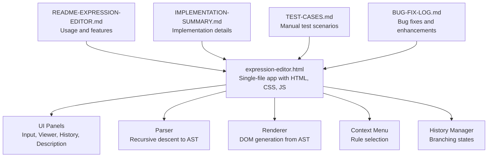
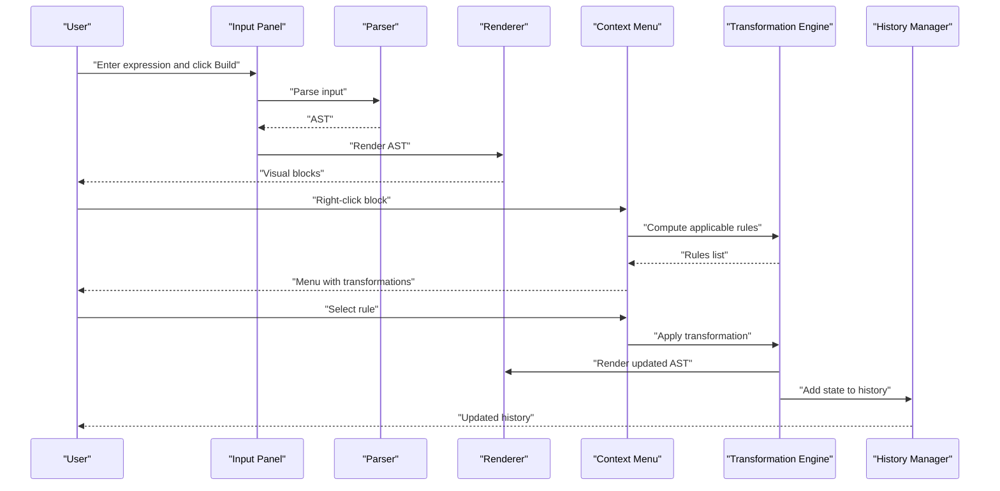
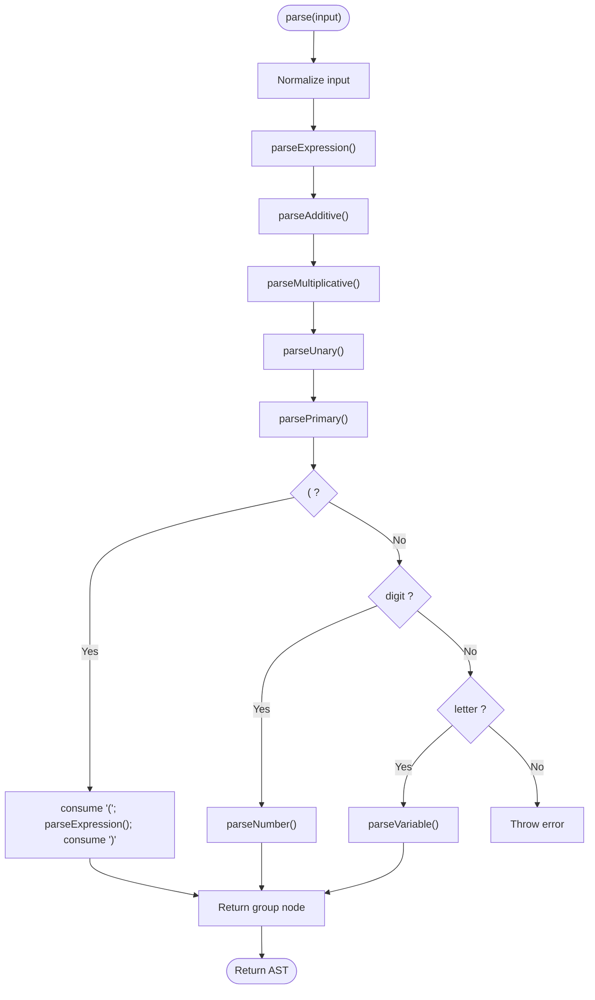
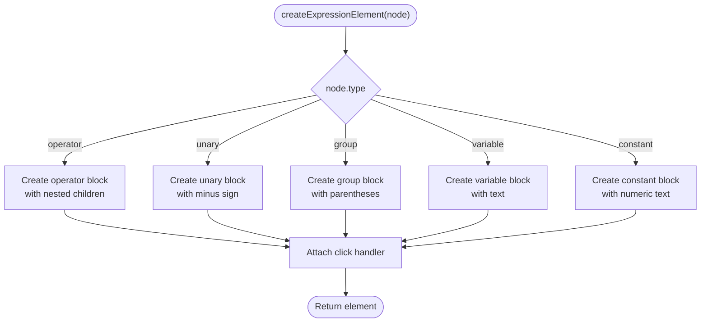
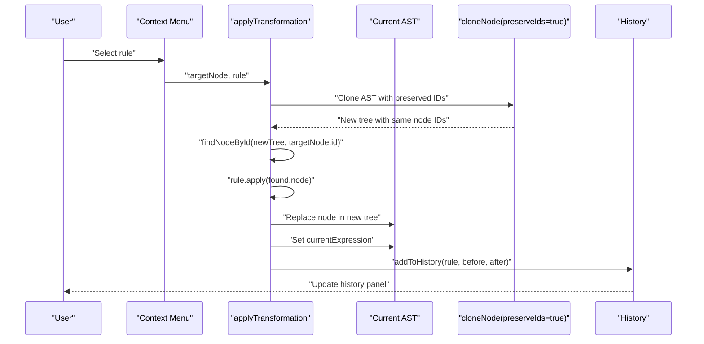
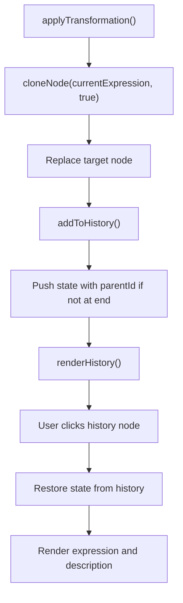
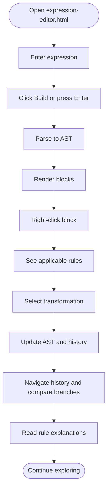
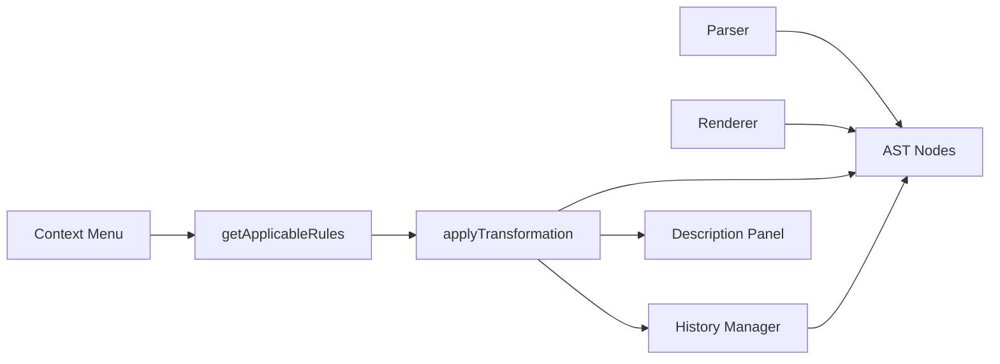

# Project Overview

<cite>
**Referenced Files in This Document**
- [expression-editor.html](file://expression-editor.html)
- [README-EXPRESSION-EDITOR.md](file://README-EXPRESSION-EDITOR.md)
- [IMPLEMENTATION-SUMMARY.md](file://IMPLEMENTATION-SUMMARY.md)
- [TEST-CASES.md](file://TEST-CASES.md)
- [BUG-FIX-LOG.md](file://BUG-FIX-LOG.md)
</cite>

## Table of Contents
1. [Introduction](#introduction)
2. [Project Structure](#project-structure)
3. [Core Components](#core-components)
4. [Architecture Overview](#architecture-overview)
5. [Detailed Component Analysis](#detailed-component-analysis)
6. [Dependency Analysis](#dependency-analysis)
7. [Performance Considerations](#performance-considerations)
8. [Troubleshooting Guide](#troubleshooting-guide)
9. [Conclusion](#conclusion)

## Introduction
MathHelper is a web-based mathematical expression editor that enables users to visually manipulate algebraic expressions through interactive transformations. The application presents expressions as nested, color-coded blocks and lets users apply bidirectional transformation rules by right-clicking any block. It maintains a branching history of states, allowing users to explore multiple transformation paths and revisit prior steps. The project emphasizes learning and exploration of algebraic manipulation by providing immediate visual feedback, rule explanations, and a single-file vanilla JavaScript implementation with no external dependencies.

Key goals:
- Parse and represent expressions as Abstract Syntax Trees (AST)
- Render ASTs as interactive, visual blocks
- Offer transformation rules with clear previews and explanations
- Support branching history navigation for exploring alternatives
- Provide a responsive, accessible UI with real-time feedback

## Project Structure
The entire application is implemented in a single HTML file with embedded CSS and JavaScript. Supporting documentation is provided in Markdown files that describe usage, implementation details, test cases, and bug fixes.

**Diagram sources**
- [expression-editor.html](file://expression-editor.html#L418-L1721)
- [README-EXPRESSION-EDITOR.md](file://README-EXPRESSION-EDITOR.md#L1-L258)
- [IMPLEMENTATION-SUMMARY.md](file://IMPLEMENTATION-SUMMARY.md#L1-L396)
- [TEST-CASES.md](file://TEST-CASES.md#L1-L245)
- [BUG-FIX-LOG.md](file://BUG-FIX-LOG.md#L1-L378)

**Section sources**
- [expression-editor.html](file://expression-editor.html#L418-L1721)
- [README-EXPRESSION-EDITOR.md](file://README-EXPRESSION-EDITOR.md#L1-L258)

## Core Components
- Expression Parser: Converts a string expression into an AST using recursive descent, respecting operator precedence and implicit multiplication. See [ExpressionParser.parse](file://expression-editor.html#L508-L666).
- AST Node Model: Nodes carry type, value, children, and flags (e.g., implicit multiplication). See [Node shape](file://IMPLEMENTATION-SUMMARY.md#L147-L169).
- Renderer: Recursively generates DOM elements from the AST, assigning block styles and interactivity. See [renderExpression](file://expression-editor.html#L669-L736) and [createExpressionElement](file://expression-editor.html#L738-L760).
- Context Menu: Computes applicable transformation rules for a selected node and applies them immutably. See [getApplicableRules](file://expression-editor.html#L887-L1169) and [applyTransformation](file://expression-editor.html#L1434-L1469).
- History Manager: Stores immutable snapshots of the expression tree with branching support and navigable timeline. See [addToHistory](file://expression-editor.html#L1472-L1494) and [renderHistory](file://expression-editor.html#L1496-L1541).
- Description Panel: Auto-generates rule explanations with before/after expressions and mathematical basis. See [showDescription](file://expression-editor.html#L1543-L1651).
- UI Controls: Input panel, quick insert toolbar, build/clear buttons, and responsive layout. See [UI markup and events](file://expression-editor.html#L418-L506) and [event handlers](file://expression-editor.html#L1653-L1718).

**Section sources**
- [expression-editor.html](file://expression-editor.html#L508-L1721)
- [IMPLEMENTATION-SUMMARY.md](file://IMPLEMENTATION-SUMMARY.md#L116-L169)

## Architecture Overview
The application follows a single-file architecture with clear separation of concerns:
- Parser produces an immutable AST from user input
- Renderer displays the AST as interactive blocks
- Context menu computes and applies transformations without mutating the original tree
- History stores deep clones of the AST to enable branching navigation
- Description panel provides contextual explanations

**Diagram sources**
- [expression-editor.html](file://expression-editor.html#L508-L1721)

## Detailed Component Analysis

### Expression Parser and AST
- Parses expressions with operator precedence (multiplication/division before addition/subtraction), unary minus, implicit multiplication, parentheses, and error handling.
- Produces nodes with unique IDs, types, values, and children arrays.
- Throws descriptive errors for invalid syntax.

**Diagram sources**
- [expression-editor.html](file://expression-editor.html#L508-L666)

**Section sources**
- [expression-editor.html](file://expression-editor.html#L508-L666)
- [IMPLEMENTATION-SUMMARY.md](file://IMPLEMENTATION-SUMMARY.md#L138-L147)

### Visual Block Rendering
- Recursively creates DOM elements representing operators, variables, constants, unary minus, and grouping.
- Applies color-coded borders by node type and adds hover/interaction effects.
- Attaches click handlers to open the context menu.

**Diagram sources**
- [expression-editor.html](file://expression-editor.html#L669-L760)

**Section sources**
- [expression-editor.html](file://expression-editor.html#L669-L760)

### Transformation Rules and Immutability
- getApplicableRules determines valid transformations based on node type, children, and values.
- applyTransformation clones the current AST with preserved IDs to locate the target node, applies the rule immutably, replaces the node, and updates the UI and history.
- Immutability ensures that each state is independent and branching is supported.

**Diagram sources**
- [expression-editor.html](file://expression-editor.html#L848-L864)
- [expression-editor.html](file://expression-editor.html#L866-L884)
- [expression-editor.html](file://expression-editor.html#L1434-L1469)
- [expression-editor.html](file://expression-editor.html#L1472-L1494)

**Section sources**
- [expression-editor.html](file://expression-editor.html#L887-L1169)
- [expression-editor.html](file://expression-editor.html#L1434-L1469)
- [BUG-FIX-LOG.md](file://BUG-FIX-LOG.md#L34-L71)

### Branching History Navigation
- addToHistory stores deep clones of the AST with optional parentId for branching.
- renderHistory lists states with visual indicators for current and branch nodes.
- Clicking a history node restores that state immutably and updates the description.

**Diagram sources**
- [expression-editor.html](file://expression-editor.html#L1472-L1541)
- [expression-editor.html](file://expression-editor.html#L1543-L1651)

**Section sources**
- [expression-editor.html](file://expression-editor.html#L1472-L1541)

### User Experience: From Input to Exploration
- Input: Enter an expression in the text field or use the quick insert toolbar; press Enter to build.
- Visualization: The expression appears as nested blocks with color-coded types.
- Interaction: Right-click any block to reveal applicable transformations; select to apply.
- Learning: The description panel explains the rule’s reasoning, before/after, and mathematical basis.
- Exploration: Navigate history to revisit previous states; apply different transformations to create branches and compare paths.

**Diagram sources**
- [expression-editor.html](file://expression-editor.html#L1653-L1718)
- [README-EXPRESSION-EDITOR.md](file://README-EXPRESSION-EDITOR.md#L43-L111)

**Section sources**
- [README-EXPRESSION-EDITOR.md](file://README-EXPRESSION-EDITOR.md#L43-L111)
- [TEST-CASES.md](file://TEST-CASES.md#L196-L205)

## Dependency Analysis
- Internal dependencies:
  - Parser depends on utility helpers (generateId, insertText) and global state (currentExpression, historyStates).
  - Renderer depends on AST structure and CSS classes for styling.
  - Context menu depends on getApplicableRules and applyTransformation.
  - History manager depends on deep cloning and expressionToString.
- External dependencies: None. The application is self-contained in a single HTML file.

**Diagram sources**
- [expression-editor.html](file://expression-editor.html#L508-L1721)

**Section sources**
- [expression-editor.html](file://expression-editor.html#L508-L1721)

## Performance Considerations
- Deep cloning is used for each state to ensure immutability and branching correctness.
- The implementation notes indicate that the application is efficient for typical expressions and histories, with no lag observed for moderate-sized inputs and histories.
- Suggestions for future enhancements include debounced input parsing and local storage persistence.

[No sources needed since this section provides general guidance]

## Troubleshooting Guide
Common issues and resolutions:
- Transformations not applying: The original implementation failed to preserve node IDs during cloning, causing the target node lookup to fail silently. The fix introduced a preserveIds option and updated applyTransformation to use preserved IDs. See [Bug Fix #1](file://BUG-FIX-LOG.md#L34-L71).
- Only “Swap Operands” available: Rule detection was missing null checks and did not support left-hand distributive cases. The fix added robust null safety and expanded distributive coverage. See [Bug Fix #2](file://BUG-FIX-LOG.md#L128-L248).
- Enhanced rule set: Additional wrapping, simplification, computation, and evaluation rules were added to provide a richer bidirectional transformation system. See [Enhancement #1](file://BUG-FIX-LOG.md#L254-L378).

Validation and testing:
- Manual test cases cover parsing, transformations, history navigation, branching, visual feedback, and edge cases. See [TEST-CASES.md](file://TEST-CASES.md#L1-L245).

**Section sources**
- [BUG-FIX-LOG.md](file://BUG-FIX-LOG.md#L34-L71)
- [BUG-FIX-LOG.md](file://BUG-FIX-LOG.md#L128-L248)
- [BUG-FIX-LOG.md](file://BUG-FIX-LOG.md#L254-L378)
- [TEST-CASES.md](file://TEST-CASES.md#L1-L245)

## Conclusion
MathHelper delivers a focused, educational tool for exploring algebraic manipulations through visual, interactive transformations. Its single-file, vanilla JavaScript architecture keeps it simple, portable, and easy to extend. The combination of a robust parser, immutable AST updates, branching history, and clear rule explanations supports both learning and experimentation. The documented test cases and bug fixes demonstrate a reliable foundation for ongoing enhancements.

[No sources needed since this section summarizes without analyzing specific files]