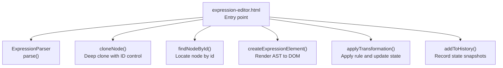
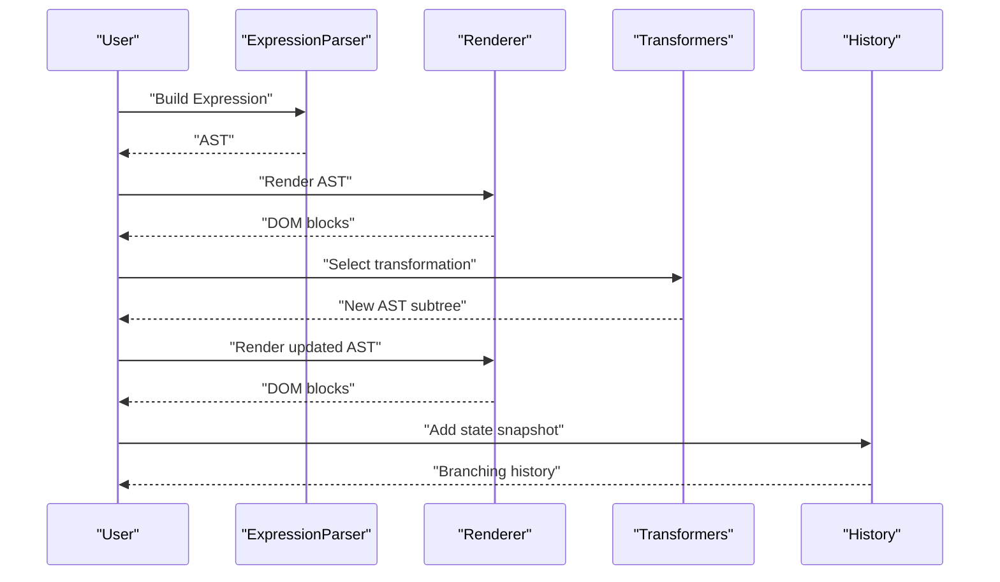
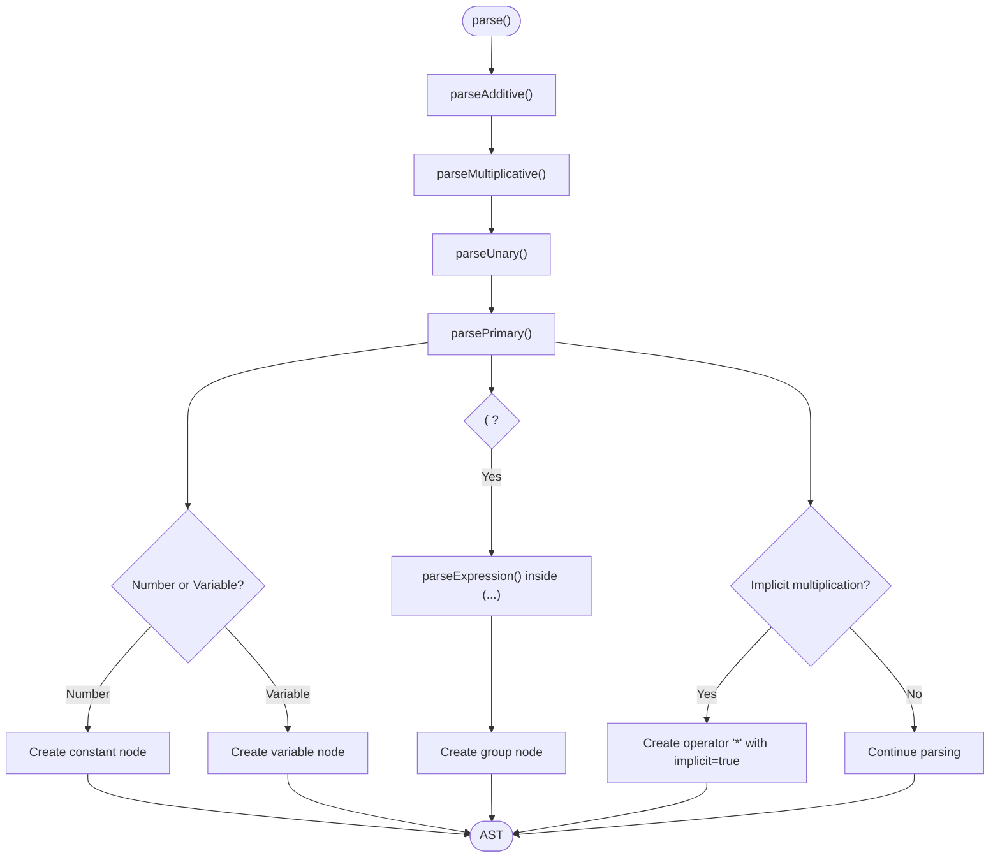
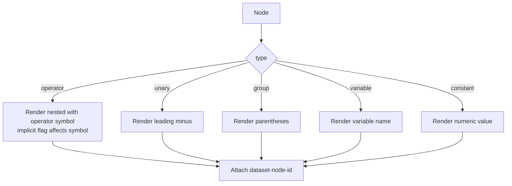
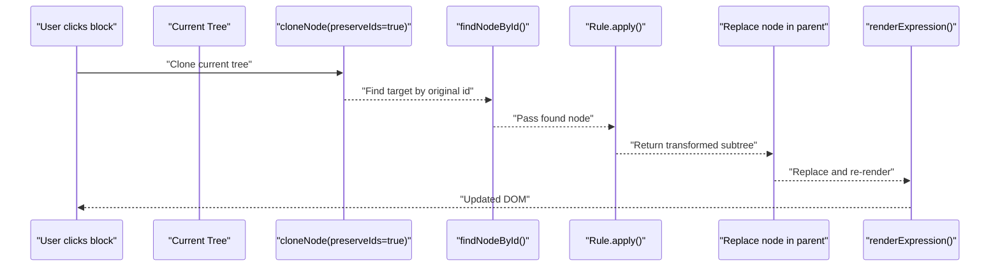
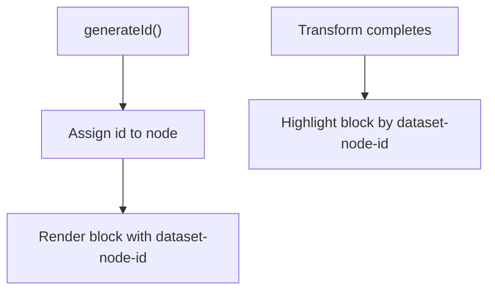
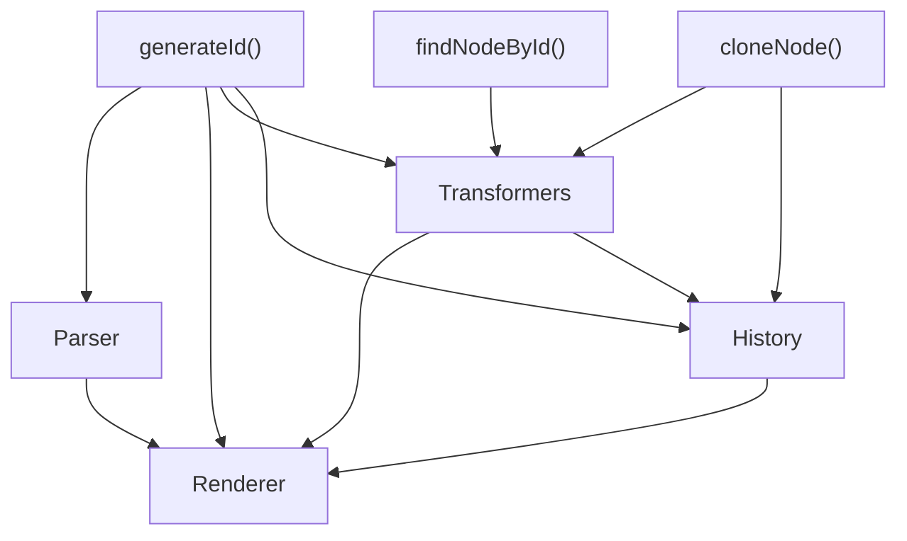

# AST Representation

<cite>
**Referenced Files in This Document**
- [expression-editor.html](file://expression-editor.html)
- [README-EXPRESSION-EDITOR.md](file://README-EXPRESSION-EDITOR.md)
- [BUG-FIX-LOG.md](file://BUG-FIX-LOG.md)
</cite>

## Table of Contents
1. [Introduction](#introduction)
2. [Project Structure](#project-structure)
3. [Core Components](#core-components)
4. [Architecture Overview](#architecture-overview)
5. [Detailed Component Analysis](#detailed-component-analysis)
6. [Dependency Analysis](#dependency-analysis)
7. [Performance Considerations](#performance-considerations)
8. [Troubleshooting Guide](#troubleshooting-guide)
9. [Conclusion](#conclusion)

## Introduction
This document explains the Abstract Syntax Tree (AST) used by the MathHelper application to represent and manipulate mathematical expressions. The AST is a hierarchical data structure that preserves operator precedence and nesting, enabling precise transformations and visual rendering. It includes node metadata such as unique identifiers, type classification, value, children arrays, and flags like implicit multiplication. The document also covers how deep cloning maintains immutability across transformations, how unique IDs synchronize with the DOM, and how visualization relies on node metadata.

## Project Structure
The MathHelper application is implemented as a single HTML file with embedded CSS and JavaScript. The AST-related logic resides in the script section of the page, including:
- A recursive descent parser that builds the AST from a string expression
- A renderer that converts the AST into visual blocks
- Transformation functions that operate on the AST
- A history system that records states using deep clones

**Diagram sources**
- [expression-editor.html](file://expression-editor.html#L484-L1711)

**Section sources**
- [expression-editor.html](file://expression-editor.html#L484-L1711)

## Core Components
- AST Node Schema
  - id: Unique identifier for DOM synchronization and tree operations
  - type: One of operator, unary, variable, constant, group
  - value: Operator symbol or numeric/string value
  - children: Array of child nodes (may be empty for leaves)
  - implicit: Boolean flag indicating implicit multiplication
- Parser: Builds the AST respecting operator precedence and grouping
- Renderer: Produces visual blocks with color-coded borders and nested children
- Transformers: Apply algebraic rules by returning new AST subtrees
- History: Stores immutable snapshots of the expression tree

**Section sources**
- [README-EXPRESSION-EDITOR.md](file://README-EXPRESSION-EDITOR.md#L145-L170)
- [expression-editor.html](file://expression-editor.html#L484-L1711)

## Architecture Overview
The AST drives the entire application:
- Parsing transforms a string into a typed, hierarchical AST
- Rendering maps each node to a styled DOM element
- Transformations produce new ASTs while preserving node identities for DOM updates
- History stores deep clones of the AST to enable branching and navigation

**Diagram sources**
- [expression-editor.html](file://expression-editor.html#L484-L1711)

## Detailed Component Analysis

### AST Node Schema and Types
- id: Generated by a monotonic counter and prefixed for uniqueness
- type: operator, unary, variable, constant, group
- value: operator symbol (+, -, *, /), numeric value, variable name, or group marker
- children: Ordered array of child nodes; empty for leaves
- implicit: Present on operator nodes representing implicit multiplication

The schema supports:
- Hierarchical representation of arithmetic expressions
- Preservation of operator precedence and grouping
- Metadata for visualization and transformation eligibility

**Section sources**
- [README-EXPRESSION-EDITOR.md](file://README-EXPRESSION-EDITOR.md#L145-L170)
- [expression-editor.html](file://expression-editor.html#L484-L1711)

### Parser and Precedence
The parser constructs the AST by enforcing operator precedence:
- parseMultiplicative handles * and /
- parseAdditive handles + and -
- parseUnary handles unary minus
- parsePrimary handles grouping ( ) and implicit multiplication
- Numbers and variables become leaf nodes

Precedence ensures that multiplication/division bind tighter than addition/subtraction, and unary minus binds tightly to its operand. Grouping with parentheses overrides precedence.

Concrete example from the codebase:
- Input: "2*(a+b)"
- The parser recognizes implicit multiplication between "2" and "(a+b)" and creates an operator node with implicit flag set
- The group node wraps the "(a+b)" subexpression

**Diagram sources**
- [expression-editor.html](file://expression-editor.html#L508-L666)

**Section sources**
- [expression-editor.html](file://expression-editor.html#L508-L666)

### Rendering and Visualization Metadata
The renderer maps AST nodes to DOM elements:
- operator nodes render nested children with operator symbols; implicit multiplication displays a centered dot
- unary nodes render a leading minus sign
- group nodes render parentheses around the child
- variable and constant nodes render their values
- Each block receives a dataset attribute with the node id for DOM targeting

Color coding is derived from node type and value:
- Blue borders for addition/subtraction operators
- Purple borders for multiplication/division operators
- Green borders for variables
- Orange borders for constants
- Gray borders for groups

**Diagram sources**
- [expression-editor.html](file://expression-editor.html#L669-L736)

**Section sources**
- [expression-editor.html](file://expression-editor.html#L669-L736)
- [README-EXPRESSION-EDITOR.md](file://README-EXPRESSION-EDITOR.md#L81-L111)

### Deep Cloning and Immutability
Transformations operate on a deep clone of the current AST to maintain immutability:
- cloneNode() creates a new tree with either preserved IDs or newly generated IDs
- When applying a transformation, the tree is cloned with preserveIds=true so the target node can be located by its original id
- After replacement, the new tree becomes the current expression and is re-rendered

Unique node ids are essential for:
- DOM synchronization: blocks are identified by dataset attributes
- Finding the target node in the cloned tree
- Highlighting changed nodes post-transformation

**Diagram sources**
- [expression-editor.html](file://expression-editor.html#L848-L904)
- [expression-editor.html](file://expression-editor.html#L1424-L1459)

**Section sources**
- [expression-editor.html](file://expression-editor.html#L848-L904)
- [expression-editor.html](file://expression-editor.html#L1424-L1459)
- [BUG-FIX-LOG.md](file://BUG-FIX-LOG.md#L1-L74)

### generateId() and DOM Synchronization
- generateId() produces a unique monotonic id for each node
- Each rendered block stores its node id in dataset-node-id for quick selection
- After a transformation, the changed block is highlighted by selecting the element with the new node id

**Diagram sources**
- [expression-editor.html](file://expression-editor.html#L484-L506)
- [expression-editor.html](file://expression-editor.html#L1451-L1459)

**Section sources**
- [expression-editor.html](file://expression-editor.html#L484-L506)
- [expression-editor.html](file://expression-editor.html#L1451-L1459)

### Transformation Eligibility and Metadata
Rules are determined by inspecting node metadata:
- implicit flag marks implicit multiplication
- type/value guide applicability (e.g., commutative swaps for + and *)
- children presence and types determine whether rules like distributive expansion/factoring can apply
- Specialized checks handle constant evaluation and identity rules

Examples of eligibility checks:
- Implicit multiplication can be made explicit or implicit depending on children types
- Distributive expansion applies when a multiplication has an addition/subtraction as a child
- Parentheses removal applies when the grouped child is not an operator

**Section sources**
- [expression-editor.html](file://expression-editor.html#L886-L1159)

### Concrete Example: '2*(a+b)'
The expression "2*(a+b)" is parsed into a tree where:
- The outer operator is multiplication with implicit=true
- The left child is a constant node with value 2
- The right child is a group node wrapping an addition operator
- The addition operator has children a (variable) and b (variable)

This structure preserves precedence and grouping, enabling transformations like expanding the distribution or making multiplication implicit/explicit.

**Section sources**
- [expression-editor.html](file://expression-editor.html#L508-L666)
- [README-EXPRESSION-EDITOR.md](file://README-EXPRESSION-EDITOR.md#L43-L70)

## Dependency Analysis
Key dependencies among AST-related components:
- Parser depends on generateId() to create nodes
- Renderer depends on node type/value to style and nest blocks
- Transformers depend on cloneNode() to build new trees and on findNodeById() to locate targets
- History depends on cloneNode() to record immutable states
- DOM synchronization depends on dataset-node-id and highlight logic

**Diagram sources**
- [expression-editor.html](file://expression-editor.html#L484-L1711)

**Section sources**
- [expression-editor.html](file://expression-editor.html#L484-L1711)

## Performance Considerations
- Tree traversal
  - Rendering and rule discovery traverse the tree; complexity is O(n) in the number of nodes
  - findNodeById() performs a linear search per targeted node; for large trees, consider caching ids to nodes
- Memory usage
  - Each state snapshot is a deep clone; memory grows with the number of states
  - The design notes indicate limiting history to prevent memory issues
- Practical tips
  - Prefer event delegation for block click handlers
  - Avoid frequent re-parsing on minor edits; debounce input if needed
  - Consider lazy evaluation of rule lists to reduce overhead

**Section sources**
- [README-EXPRESSION-EDITOR.md](file://README-EXPRESSION-EDITOR.md#L224-L230)

## Troubleshooting Guide
- Transformations not applying
  - Symptom: Context menu closes but the expression does not change
  - Cause: Node ID mismatch when cloning without preserving IDs
  - Fix: Use cloneNode(tree, true) to preserve IDs; then findNodeById() succeeds
- Silent failure
  - Symptom: No error message when a node is not found
  - Fix: Add logging and guard clauses to detect missing nodes early
- DOM desynchronization
  - Symptom: Highlighted block does not correspond to the transformed node
  - Fix: Ensure the transformed node’s id is used to select the DOM element

**Section sources**
- [BUG-FIX-LOG.md](file://BUG-FIX-LOG.md#L1-L74)
- [expression-editor.html](file://expression-editor.html#L1424-L1459)

## Conclusion
The MathHelper AST provides a robust, hierarchical representation of mathematical expressions with strong support for operator precedence, grouping, and implicit multiplication. Its design emphasizes immutability through deep cloning, deterministic node identification via generateId(), and seamless DOM synchronization. The renderer and transformation pipeline leverage node metadata to deliver rich visual feedback and precise rule application. With careful attention to traversal costs and history management, the system remains responsive and extensible.