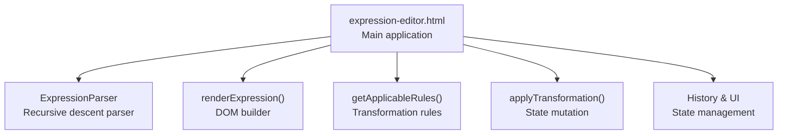
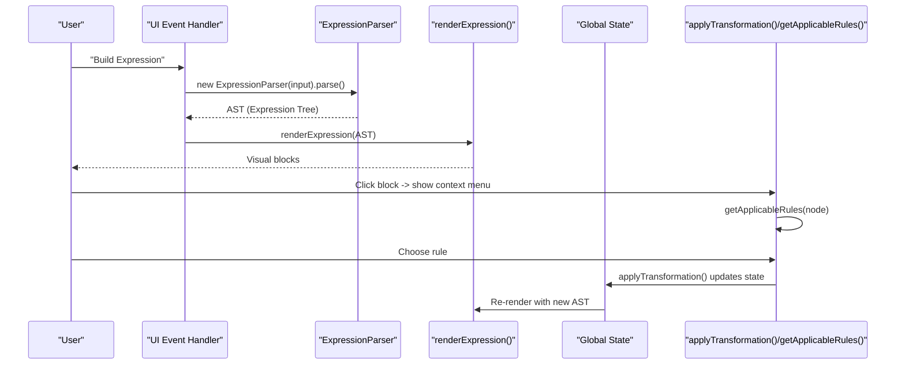
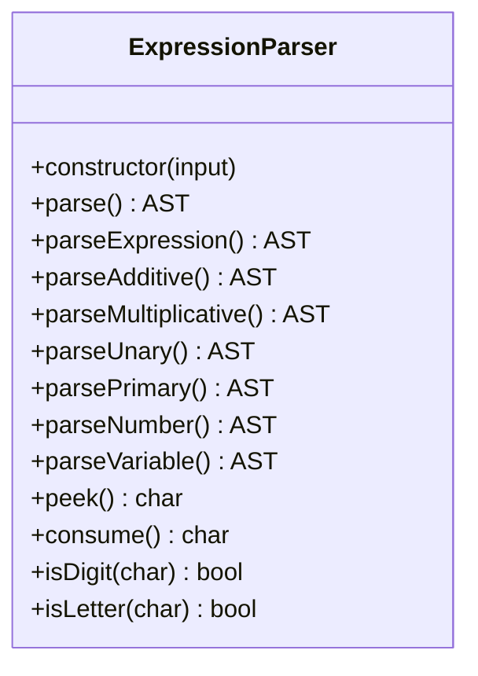
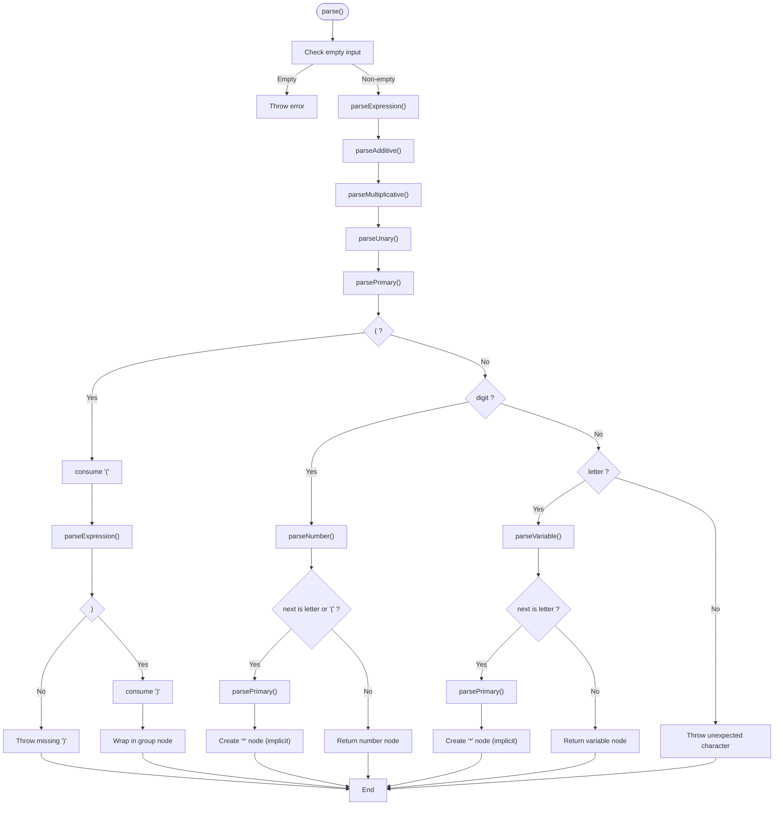
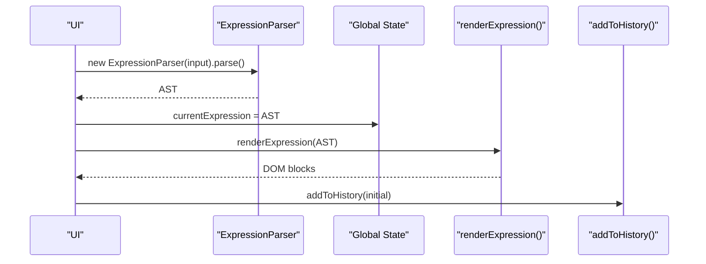
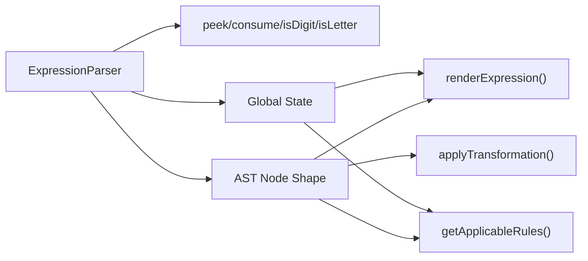

# Expression Parsing

<cite>
**Referenced Files in This Document**
- [expression-editor.html](file://expression-editor.html)
- [README-EXPRESSION-EDITOR.md](file://README-EXPRESSION-EDITOR.md)
- [IMPLEMENTATION-SUMMARY.md](file://IMPLEMENTATION-SUMMARY.md)
- [TEST-CASES.md](file://TEST-CASES.md)
</cite>

## Table of Contents
1. [Introduction](#introduction)
2. [Project Structure](#project-structure)
3. [Core Components](#core-components)
4. [Architecture Overview](#architecture-overview)
5. [Detailed Component Analysis](#detailed-component-analysis)
6. [Dependency Analysis](#dependency-analysis)
7. [Performance Considerations](#performance-considerations)
8. [Troubleshooting Guide](#troubleshooting-guide)
9. [Conclusion](#conclusion)
10. [Appendices](#appendices)

## Introduction
This document explains the ExpressionParser class in the MathHelper application. It focuses on how the parser converts string input into an Abstract Syntax Tree (AST) using recursive descent parsing. The parser follows operator precedence (multiplicative before additive), supports unary operators, recognizes implicit multiplication (e.g., 2a, ab), and enforces strict error handling for invalid syntax such as unmatched parentheses or consecutive operators. The document also describes how the resulting AST integrates with the global state and feeds into the rendering system, and provides guidance for extending the parser with new operators or syntax.

## Project Structure
The entire application is implemented in a single HTML file with embedded CSS and JavaScript. The ExpressionParser class resides in the script section of the page and is paired with a rendering engine and a transformation system.

**Diagram sources**
- [expression-editor.html](file://expression-editor.html#L484-L1721)

**Section sources**
- [expression-editor.html](file://expression-editor.html#L484-L1721)

## Core Components
- ExpressionParser: Converts a string into an AST using recursive descent. It defines grammar levels for additive, multiplicative, unary, and primary expressions, and includes helper methods for lookahead and classification.
- Rendering engine: Translates AST nodes into visual blocks for the UI.
- Transformation system: Computes applicable rules based on node types and values, applies them, and updates the global state and history.

Key responsibilities:
- Parse string input into a structured AST respecting operator precedence and implicit multiplication.
- Provide robust error handling for malformed expressions.
- Integrate with global state to drive UI updates and history.

**Section sources**
- [expression-editor.html](file://expression-editor.html#L507-L736)
- [expression-editor.html](file://expression-editor.html#L825-L900)
- [expression-editor.html](file://expression-editor.html#L1433-L1494)

## Architecture Overview
The parser participates in a larger architecture where user input triggers parsing, which produces an AST consumed by the renderer. The renderer creates interactive blocks; users trigger transformations that mutate the AST and update the history.

**Diagram sources**
- [expression-editor.html](file://expression-editor.html#L1654-L1689)
- [expression-editor.html](file://expression-editor.html#L507-L736)
- [expression-editor.html](file://expression-editor.html#L825-L900)
- [expression-editor.html](file://expression-editor.html#L1433-L1494)

## Detailed Component Analysis

### ExpressionParser Class
The ExpressionParser implements a classic recursive descent parser with grammar levels:
- parseExpression(): Entry point delegating to parseAdditive().
- parseAdditive(): Handles addition and subtraction with left recursion and equal precedence.
- parseMultiplicative(): Handles multiplication and division with left recursion and equal precedence.
- parseUnary(): Handles unary minus by consuming '-' and recursing into parseUnary().
- parsePrimary(): Handles grouping with parentheses, numbers, variables, and implicit multiplication.

Support for implicit multiplication:
- When a number is followed by a variable or opening parenthesis, or when two variables are adjacent, the parser inserts a multiplication node with an implicit flag.

Error handling:
- Throws descriptive errors for unexpected characters, missing closing parentheses, and empty expressions.
- Validates that the entire input is consumed after parsing.

Integration with global state:
- The parser runs within the UI event handler that sets the global currentExpression and initializes history.

**Diagram sources**
- [expression-editor.html](file://expression-editor.html#L507-L736)

**Section sources**
- [expression-editor.html](file://expression-editor.html#L507-L736)

### Parsing Order and Precedence
The parser follows operator precedence:
1. Parentheses (highest): Grouping via parsePrimary().
2. Unary minus: parseUnary().
3. Multiplication and division: parseMultiplicative().
4. Addition and subtraction: parseAdditive().

This ordering ensures that multiplicative operations bind tighter than additive ones, and unary minus binds tightly to its operand.

**Diagram sources**
- [expression-editor.html](file://expression-editor.html#L507-L736)

**Section sources**
- [expression-editor.html](file://expression-editor.html#L507-L736)

### Implicit Multiplication
The parser detects implicit multiplication in two cases:
- A numeric literal immediately followed by a variable or opening parenthesis.
- Two variables adjacent to each other.

In both cases, it constructs a multiplication operator node with an implicit flag set. The rendering layer distinguishes implicit multiplication visually.

Examples from the codebase:
- Input '2*(a+3)' parses to a subtraction node at the root with a grouped addition as the right child, and a multiplication node as the left child. The implicit multiplication detection does not apply here because the 2 is followed by a parenthesis, which is handled by grouping.
- Input '2a' parses to a multiplication node with implicit flag set, representing 2 · a.

**Section sources**
- [expression-editor.html](file://expression-editor.html#L591-L625)
- [README-EXPRESSION-EDITOR.md](file://README-EXPRESSION-EDITOR.md#L112-L139)
- [TEST-CASES.md](file://TEST-CASES.md#L32-L41)

### Helper Methods
- peek(): Returns the current character without advancing the position.
- consume(): Returns and advances past the current character.
- isDigit(char): Checks if a character is a digit.
- isLetter(char): Checks if a character is a letter.

These methods enable lookahead and classification during parsing, keeping the parser simple and readable.

**Section sources**
- [expression-editor.html](file://expression-editor.html#L651-L666)

### Error Handling
The parser enforces strict syntax rules:
- Empty input throws an error.
- Unexpected characters at any position cause an error.
- Missing closing parenthesis throws an error.
- Consecutive operators (e.g., ++) or leading operators (e.g., *a) are rejected.

The UI catches parser errors and displays user-friendly messages.

**Section sources**
- [expression-editor.html](file://expression-editor.html#L514-L521)
- [expression-editor.html](file://expression-editor.html#L576-L589)
- [expression-editor.html](file://expression-editor.html#L624-L625)
- [TEST-CASES.md](file://TEST-CASES.md#L128-L145)

### Integration with Global State and Rendering
- The UI event handler constructs an ExpressionParser with the user’s input, invokes parse(), and stores the resulting AST in global state.
- The renderer traverses the AST to produce DOM elements and attaches click handlers to open the context menu.
- Transformations mutate the AST and update the global state, which triggers re-rendering and history recording.

**Diagram sources**
- [expression-editor.html](file://expression-editor.html#L1654-L1689)
- [expression-editor.html](file://expression-editor.html#L825-L900)
- [expression-editor.html](file://expression-editor.html#L1471-L1494)

**Section sources**
- [expression-editor.html](file://expression-editor.html#L1654-L1689)
- [expression-editor.html](file://expression-editor.html#L825-L900)
- [expression-editor.html](file://expression-editor.html#L1471-L1494)

### Extending the Parser
To add new operators or syntax:
- Update the parser to recognize the operator symbol and integrate it at the appropriate precedence level.
- Extend the rendering function to visualize the new operator type.
- Add color classes and styles in the CSS for the new operator type.
- Implement transformation rules in getApplicableRules() and their application functions.

Guidance from the documentation:
- Add parsing logic in the appropriate precedence level.
- Add color scheme in CSS.
- Implement rendering in createExpressionElement().

**Section sources**
- [README-EXPRESSION-EDITOR.md](file://README-EXPRESSION-EDITOR.md#L197-L217)

## Dependency Analysis
The ExpressionParser depends on:
- Internal helper methods (peek, consume, isDigit, isLetter).
- AST node shape used by the renderer and transformation system.
- Global state for storing the current expression and history.

**Diagram sources**
- [expression-editor.html](file://expression-editor.html#L507-L736)
- [expression-editor.html](file://expression-editor.html#L825-L900)
- [expression-editor.html](file://expression-editor.html#L1433-L1494)

**Section sources**
- [expression-editor.html](file://expression-editor.html#L507-L736)
- [expression-editor.html](file://expression-editor.html#L825-L900)
- [expression-editor.html](file://expression-editor.html#L1433-L1494)

## Performance Considerations
- The parser is a lightweight recursive descent implementation suitable for typical expression lengths.
- Rendering performance scales with AST size; deep nesting is supported.
- History cloning preserves state consistency but increases memory usage; the implementation notes indicate deep cloning for each state.

[No sources needed since this section provides general guidance]

## Troubleshooting Guide
Common issues and resolutions:
- Empty input: The parser throws an error; ensure the input field is not blank before parsing.
- Unmatched parentheses: The parser throws an error when a closing parenthesis is missing; verify balanced grouping.
- Consecutive operators: The parser rejects sequences like ++ or */; correct the expression to avoid adjacent operators.
- Leading operators: Expressions starting with an operator (e.g., *a) are invalid; place a number or variable first.
- Unexpected characters: The parser throws an error for unrecognized symbols; check the input for typos.

UI feedback:
- Errors are displayed in the error message area and the input field is highlighted temporarily.

**Section sources**
- [expression-editor.html](file://expression-editor.html#L514-L521)
- [expression-editor.html](file://expression-editor.html#L576-L589)
- [expression-editor.html](file://expression-editor.html#L624-L625)
- [expression-editor.html](file://expression-editor.html#L1682-L1689)
- [TEST-CASES.md](file://TEST-CASES.md#L128-L145)

## Conclusion
The ExpressionParser provides a clean, recursive descent implementation that respects operator precedence, supports unary operators, and recognizes implicit multiplication. Its error handling ensures robustness against malformed input, and its integration with global state and the rendering system enables a responsive, interactive experience. The documented extension points make it straightforward to add new operators and transformation rules.

[No sources needed since this section summarizes without analyzing specific files]

## Appendices

### Grammar Levels and Precedence
- parseExpression() -> parseAdditive()
- parseAdditive(): Left-recursive addition/subtraction
- parseMultiplicative(): Left-recursive multiplication/division
- parseUnary(): Unary minus
- parsePrimary(): Parentheses, numbers, variables, implicit multiplication

**Section sources**
- [expression-editor.html](file://expression-editor.html#L523-L573)

### Example: Input '2*(a+3)'
- The parser recognizes the leading number and the following parenthesis as a grouping construct.
- The grouped addition is parsed as a subtree, then the outer multiplication is formed.
- The resulting AST reflects the intended precedence and grouping.

**Section sources**
- [expression-editor.html](file://expression-editor.html#L576-L589)
- [TEST-CASES.md](file://TEST-CASES.md#L37-L41)