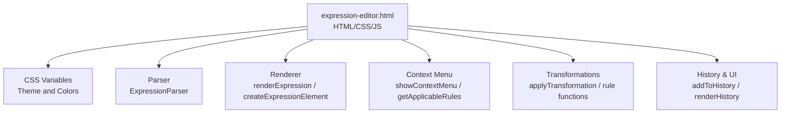
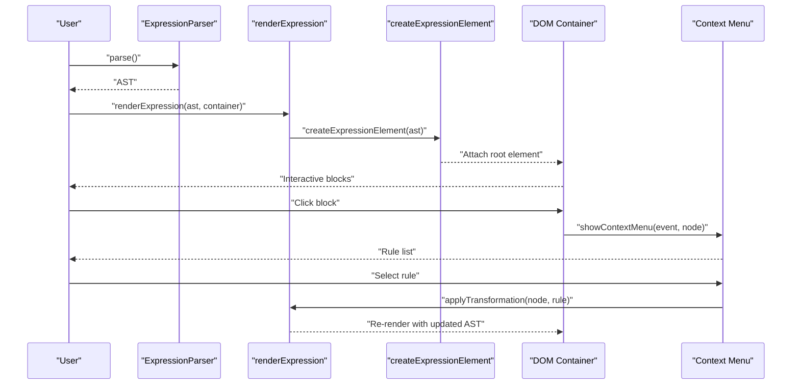
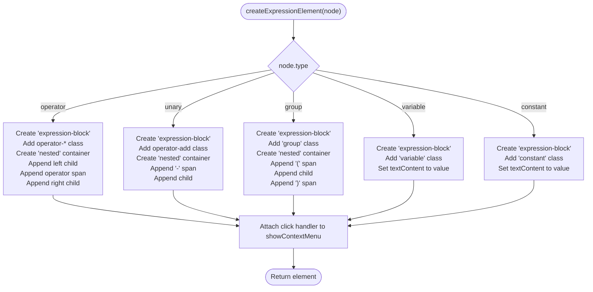
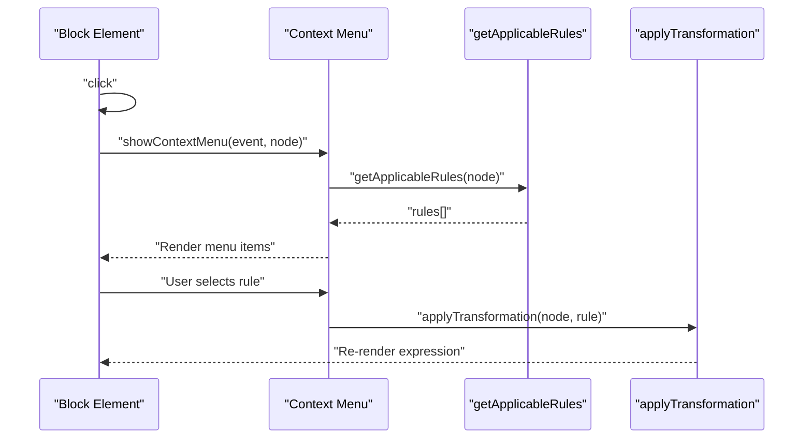
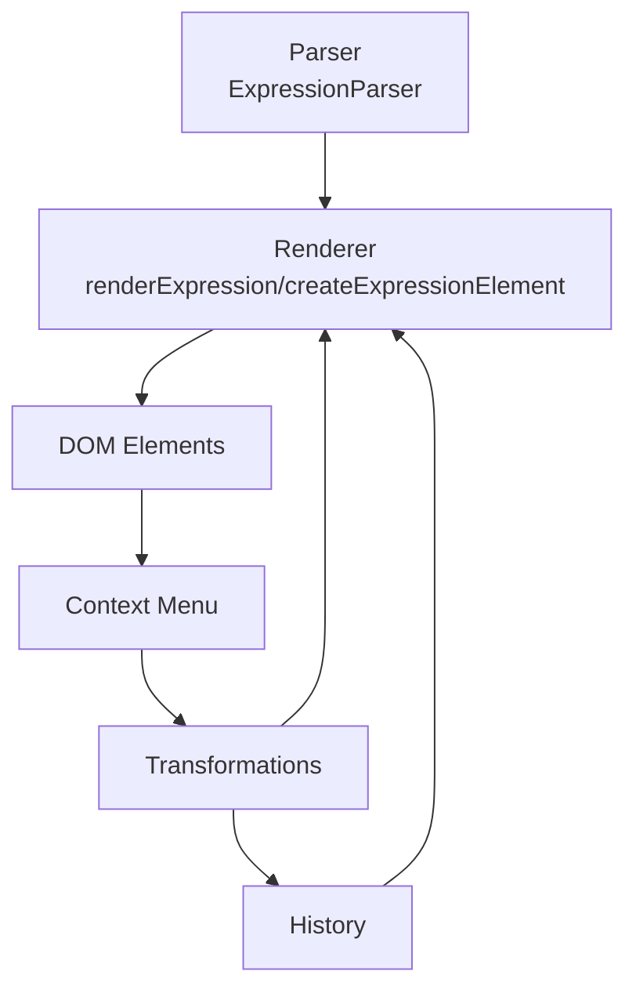

# Rendering Engine

<cite>
**Referenced Files in This Document**
- [expression-editor.html](file://expression-editor.html)
- [README-EXPRESSION-EDITOR.md](file://README-EXPRESSION-EDITOR.md)
- [IMPLEMENTATION-SUMMARY.md](file://IMPLEMENTATION-SUMMARY.md)
- [TEST-CASES.md](file://TEST-CASES.md)
</cite>

## Table of Contents
1. [Introduction](#introduction)
2. [Project Structure](#project-structure)
3. [Core Components](#core-components)
4. [Architecture Overview](#architecture-overview)
5. [Detailed Component Analysis](#detailed-component-analysis)
6. [Dependency Analysis](#dependency-analysis)
7. [Performance Considerations](#performance-considerations)
8. [Troubleshooting Guide](#troubleshooting-guide)
9. [Conclusion](#conclusion)
10. [Appendices](#appendices)

## Introduction
This document explains the rendering system that converts an expression’s Abstract Syntax Tree (AST) into interactive, color-coded DOM blocks. It focuses on the renderExpression and createExpressionElement functions, how AST nodes are mapped to DOM elements, nested containers, inline operators, event handling for block clicks, visual feedback (hover, change animations), CSS variable theming, implicit multiplication handling, responsive design, and accessibility considerations.

## Project Structure
The application is a single-file HTML document containing:
- Embedded CSS for theming, layout, and visual feedback
- An embedded JavaScript module implementing the parser, renderer, context menu, transformations, and state/history management

**Diagram sources**
- [expression-editor.html](file://expression-editor.html#L1-L120)
- [expression-editor.html](file://expression-editor.html#L484-L1749)

**Section sources**
- [expression-editor.html](file://expression-editor.html#L1-L120)
- [expression-editor.html](file://expression-editor.html#L484-L1749)

## Core Components
- renderExpression(node, container): Clears the container and mounts the root DOM element produced by createExpressionElement.
- createExpressionElement(node): Recursively creates DOM elements for each AST node, applies type-specific classes, and attaches click handlers to open the context menu.
- Context menu: Dynamically populated with applicable transformation rules based on node type and structure.
- Visual feedback: Hover effects, change pulse animation, and CSS variables for theming.

Key responsibilities:
- Map AST node types to DOM classes and content
- Render nested containers for operators and groups
- Display implicit multiplication with a distinct symbol
- Provide interactive context menu on block click
- Animate changed blocks after transformations

**Section sources**
- [expression-editor.html](file://expression-editor.html#L668-L736)
- [expression-editor.html](file://expression-editor.html#L739-L823)
- [expression-editor.html](file://expression-editor.html#L825-L846)

## Architecture Overview
The rendering pipeline connects the parser, renderer, and UI:

**Diagram sources**
- [expression-editor.html](file://expression-editor.html#L668-L736)
- [expression-editor.html](file://expression-editor.html#L739-L823)
- [expression-editor.html](file://expression-editor.html#L1500-L1536)

## Detailed Component Analysis

### Rendering Pipeline: renderExpression and createExpressionElement
- renderExpression clears the container and appends the root element returned by createExpressionElement.
- createExpressionElement:
  - Adds a base class for all blocks and stores the node id on the element dataset for later targeting.
  - Applies type-specific classes (operator-add, operator-mul, variable, constant, group).
  - For operators, constructs a nested container with children and an inline operator span.
  - For unary minus, renders a leading minus sign and the child.
  - For groups, renders parentheses around the child.
  - For variables and constants, renders their textual value.
  - Attaches a click handler to open the context menu.

**Diagram sources**
- [expression-editor.html](file://expression-editor.html#L668-L736)

**Section sources**
- [expression-editor.html](file://expression-editor.html#L668-L736)

### AST Node Types and Visual Mapping
- operator: Blue border for addition/subtraction; purple border for multiplication/division. Inline operator appears in bold; implicit multiplication uses a distinct symbol.
- unary: Blue border with a leading minus sign.
- group: Gray border with parentheses around the child.
- variable: Green border with the variable name.
- constant: Orange border with the numeric value.

These styles are driven by CSS classes and variables.

**Section sources**
- [expression-editor.html](file://expression-editor.html#L180-L240)
- [expression-editor.html](file://expression-editor.html#L668-L736)
- [README-EXPRESSION-EDITOR.md](file://README-EXPRESSION-EDITOR.md#L80-L111)

### Nested Containers and Inline Operators
- Operators and groups use a nested container to arrange children and inline operators.
- The operator span is bold and includes either the explicit operator symbol or an implicit multiplication symbol when indicated by the node’s implicit flag.

**Section sources**
- [expression-editor.html](file://expression-editor.html#L680-L722)
- [expression-editor.html](file://expression-editor.html#L688-L694)

### Implicit Multiplication Handling
- The parser recognizes implicit multiplication (e.g., 2a, ab) and marks the operator node with an implicit flag.
- The renderer displays a distinct symbol for implicit multiplication and preserves the implicit flag during transformations.

Examples from the codebase:
- Parser detects implicit multiplication and sets the implicit flag on the operator node.
- Renderer reads the implicit flag to decide which symbol to display.

**Section sources**
- [expression-editor.html](file://expression-editor.html#L591-L625)
- [expression-editor.html](file://expression-editor.html#L688-L694)

### Event Handling: Block Clicks and Context Menu
- Each block element has a click handler that stops propagation and opens the context menu near the click position.
- The context menu is populated dynamically with applicable rules based on the clicked node.
- Clicking outside the menu hides it.

**Diagram sources**
- [expression-editor.html](file://expression-editor.html#L730-L736)
- [expression-editor.html](file://expression-editor.html#L739-L823)
- [expression-editor.html](file://expression-editor.html#L886-L1236)
- [expression-editor.html](file://expression-editor.html#L1500-L1536)

**Section sources**
- [expression-editor.html](file://expression-editor.html#L730-L736)
- [expression-editor.html](file://expression-editor.html#L739-L823)
- [expression-editor.html](file://expression-editor.html#L1500-L1536)

### Visual Feedback: Hover Effects and Change Animations
- Hover effects: Increased border thickness, subtle shadow, and slight lift.
- Change animation: A pulse animation highlights the changed block for a short duration after transformations.
- CSS variables define theme colors and radii, enabling consistent theming across the UI.

**Section sources**
- [expression-editor.html](file://expression-editor.html#L180-L240)
- [expression-editor.html](file://expression-editor.html#L226-L235)
- [expression-editor.html](file://expression-editor.html#L1528-L1536)

### Theming with CSS Variables
- CSS variables define the base theme, accents, and expression block colors.
- These variables are used for backgrounds, borders, text, and expression block colors.

**Section sources**
- [expression-editor.html](file://expression-editor.html#L1-L40)

### Integration Between Node Data and Visual Representation
- The renderer reads node metadata (type, value, implicit flag, children) to construct the DOM.
- The dataset attribute stores the node id, enabling targeted animations and history updates.

**Section sources**
- [expression-editor.html](file://expression-editor.html#L676-L679)
- [expression-editor.html](file://expression-editor.html#L1528-L1536)

### Responsive Design Considerations
- The layout uses a grid for the main panels and switches to a single column on smaller screens.
- The context menu adjusts its position to stay within the viewport and avoids going off-screen.

**Section sources**
- [expression-editor.html](file://expression-editor.html#L136-L170)
- [expression-editor.html](file://expression-editor.html#L800-L814)
- [README-EXPRESSION-EDITOR.md](file://README-EXPRESSION-EDITOR.md#L217-L223)

### Accessibility Features
- Focus indicators: Inputs and buttons show focus styles.
- Keyboard support: Enter key triggers expression building.
- ARIA-like semantics: Context menu items are structured for screen readers.
- Note: The implementation provides basic keyboard navigation and ARIA labels; full screen reader support and keyboard shortcuts are noted as partial.

**Section sources**
- [expression-editor.html](file://expression-editor.html#L1733-L1745)
- [IMPLEMENTATION-SUMMARY.md](file://IMPLEMENTATION-SUMMARY.md#L231-L237)
- [README-EXPRESSION-EDITOR.md](file://README-EXPRESSION-EDITOR.md#L231-L237)

## Dependency Analysis
The rendering system depends on:
- Parser for AST construction
- Renderer for DOM generation
- Context menu for rule selection
- Transformation engine for updating the AST and triggering re-render
- History system for state management and navigation

**Diagram sources**
- [expression-editor.html](file://expression-editor.html#L508-L667)
- [expression-editor.html](file://expression-editor.html#L668-L736)
- [expression-editor.html](file://expression-editor.html#L739-L823)
- [expression-editor.html](file://expression-editor.html#L1500-L1536)
- [expression-editor.html](file://expression-editor.html#L1539-L1599)

**Section sources**
- [expression-editor.html](file://expression-editor.html#L508-L667)
- [expression-editor.html](file://expression-editor.html#L668-L736)
- [expression-editor.html](file://expression-editor.html#L739-L823)
- [expression-editor.html](file://expression-editor.html#L1500-L1536)
- [expression-editor.html](file://expression-editor.html#L1539-L1599)

## Performance Considerations
- Deep cloning is used for each state to ensure immutability and branching correctness.
- Re-rendering replaces the entire container content, which is efficient for moderate-sized expressions.
- Event delegation is used for block click handlers to minimize listener overhead.
- The implementation notes potential future enhancements like debounced input parsing and limits on history size.

**Section sources**
- [expression-editor.html](file://expression-editor.html#L848-L864)
- [expression-editor.html](file://expression-editor.html#L1500-L1536)
- [IMPLEMENTATION-SUMMARY.md](file://IMPLEMENTATION-SUMMARY.md#L224-L230)

## Troubleshooting Guide
Common issues and resolutions:
- Context menu does not appear:
  - Ensure the clicked element is a block and that getApplicableRules returns applicable rules for the node.
  - Verify click handler is attached and not blocked by event propagation.
- Transformation does not update the expression:
  - Confirm that the node id is preserved during cloning for transformation lookups.
  - Check that the transformed node replaces the correct parent or root.
- Visual feedback not visible:
  - Verify the changed class is added and removed after the timeout.
  - Ensure CSS variables are defined and the pulse animation is present.

Evidence from the codebase:
- Context menu positioning and visibility logic
- Transformation application and changed block highlighting
- ID preservation during cloning for accurate node replacement

**Section sources**
- [expression-editor.html](file://expression-editor.html#L739-L823)
- [expression-editor.html](file://expression-editor.html#L1500-L1536)
- [expression-editor.html](file://expression-editor.html#L848-L864)
- [IMPLEMENTATION-SUMMARY.md](file://IMPLEMENTATION-SUMMARY.md#L344-L371)

## Conclusion
The rendering engine cleanly maps AST nodes to interactive, color-coded DOM blocks with nested containers and inline operators. It integrates tightly with the context menu and transformation system, providing immediate visual feedback and robust state management. The use of CSS variables ensures consistent theming, while responsive design and basic accessibility features improve usability across devices.

## Appendices

### Examples from the Codebase
- Operator rendering with implicit multiplication symbol
- Unary minus rendering with leading minus
- Group rendering with parentheses
- Variable and constant rendering with type-specific borders
- Context menu population based on node type and structure
- Transformation application and change animation

**Section sources**
- [expression-editor.html](file://expression-editor.html#L668-L736)
- [expression-editor.html](file://expression-editor.html#L739-L823)
- [expression-editor.html](file://expression-editor.html#L1500-L1536)
- [TEST-CASES.md](file://TEST-CASES.md#L32-L41)
- [TEST-CASES.md](file://TEST-CASES.md#L74-L90)