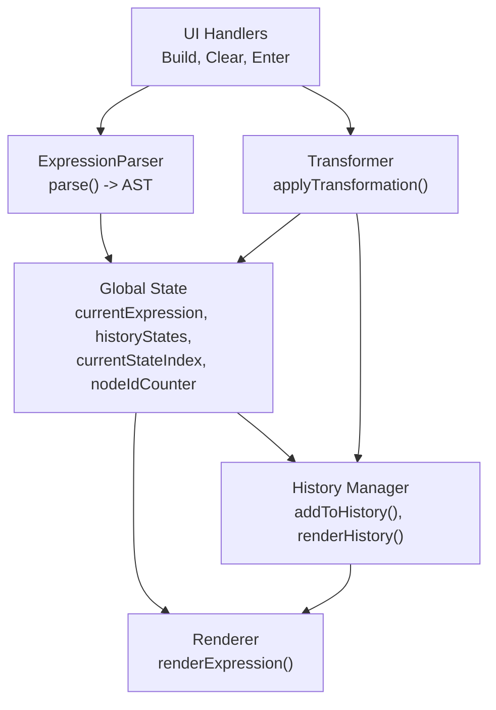
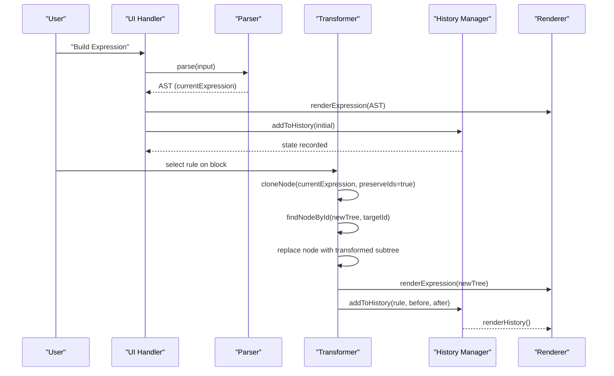
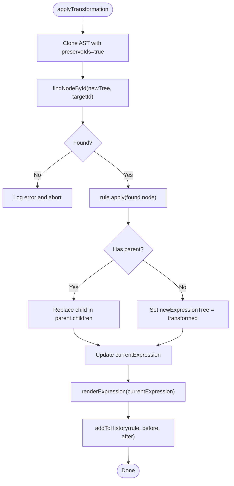
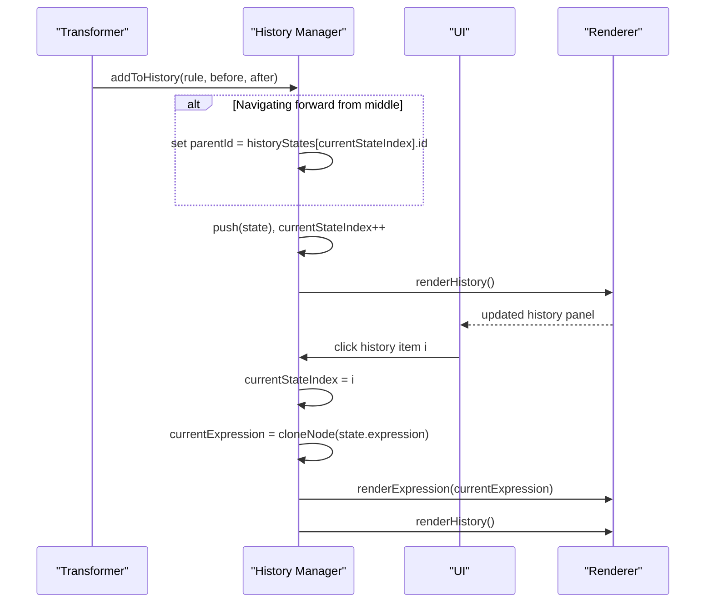
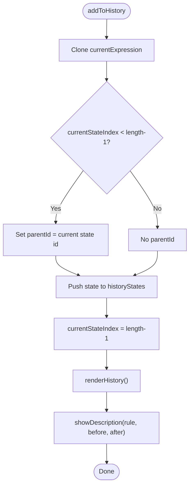
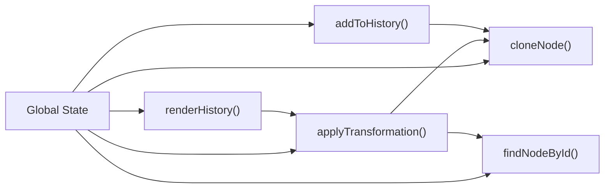

# State Management

<cite>
**Referenced Files in This Document**
- [expression-editor.html](file://expression-editor.html)
- [README-EXPRESSION-EDITOR.md](file://README-EXPRESSION-EDITOR.md)
- [IMPLEMENTATION-SUMMARY.md](file://IMPLEMENTATION-SUMMARY.md)
- [TEST-CASES.md](file://TEST-CASES.md)
- [BUG-FIX-LOG.md](file://BUG-FIX-LOG.md)
</cite>

## Table of Contents
1. [Introduction](#introduction)
2. [Project Structure](#project-structure)
3. [Core Components](#core-components)
4. [Architecture Overview](#architecture-overview)
5. [Detailed Component Analysis](#detailed-component-analysis)
6. [Dependency Analysis](#dependency-analysis)
7. [Performance Considerations](#performance-considerations)
8. [Troubleshooting Guide](#troubleshooting-guide)
9. [Conclusion](#conclusion)

## Introduction
This document explains the state management system in the MathHelper application (Logical Expression Editor). It focuses on the global state variables, immutable transformations, branching history, and how state changes trigger re-rendering of the expression viewer and history panel. It also covers performance considerations such as deep cloning and the 100-state limit strategy.

## Project Structure
The state management is implemented in a single HTML file with embedded JavaScript and CSS. The relevant parts include:
- Global state variables declared at the top of the script
- Parser that constructs AST nodes
- Rendering engine that displays the AST as nested blocks
- Transformation engine that applies rules immutably
- History manager that records states and supports branching
- UI event handlers that orchestrate state changes

**Diagram sources**
- [expression-editor.html](file://expression-editor.html#L485-L505)
- [expression-editor.html](file://expression-editor.html#L508-L666)
- [expression-editor.html](file://expression-editor.html#L669-L736)
- [expression-editor.html](file://expression-editor.html#L1462-L1522)
- [expression-editor.html](file://expression-editor.html#L1524-L1569)
- [expression-editor.html](file://expression-editor.html#L1682-L1717)

**Section sources**
- [expression-editor.html](file://expression-editor.html#L485-L505)
- [expression-editor.html](file://expression-editor.html#L508-L666)
- [expression-editor.html](file://expression-editor.html#L669-L736)
- [expression-editor.html](file://expression-editor.html#L1462-L1522)
- [expression-editor.html](file://expression-editor.html#L1524-L1569)
- [expression-editor.html](file://expression-editor.html#L1682-L1717)

## Core Components
- Global state variables:
  - currentExpression: The current AST root node
  - historyStates: Array of history entries
  - currentStateIndex: Index of the current state in historyStates
  - nodeIdCounter: Counter used to generate unique IDs for nodes
- Immutable transformations:
  - cloneNode creates a deep clone of the AST
  - applyTransformation preserves IDs when locating the target node, then replaces it with a new AST instance
- Branching history:
  - addToHistory sets parentId when moving forward from a non-latest state
- Re-rendering:
  - applyTransformation triggers renderExpression and addToHistory
  - renderHistory updates the history panel and highlights the current state

**Section sources**
- [expression-editor.html](file://expression-editor.html#L485-L505)
- [expression-editor.html](file://expression-editor.html#L848-L864)
- [expression-editor.html](file://expression-editor.html#L1462-L1522)
- [expression-editor.html](file://expression-editor.html#L1524-L1569)

## Architecture Overview
The state lifecycle:
- Build expression: Parser produces an AST; initial history entry is recorded
- Transform: A new AST is created by cloning and replacing a node; currentExpression is updated; a history entry is added
- Navigate: Clicking a history item loads a specific state; currentExpression is replaced with a clone of that state

**Diagram sources**
- [expression-editor.html](file://expression-editor.html#L1682-L1717)
- [expression-editor.html](file://expression-editor.html#L508-L666)
- [expression-editor.html](file://expression-editor.html#L848-L864)
- [expression-editor.html](file://expression-editor.html#L866-L884)
- [expression-editor.html](file://expression-editor.html#L1462-L1522)
- [expression-editor.html](file://expression-editor.html#L1524-L1569)

## Detailed Component Analysis

### Global State Variables
- currentExpression: Root node of the current AST
- historyStates: List of history entries, each containing a snapshot of the expression tree, rule metadata, timestamps, and optional parentId
- currentStateIndex: Index of the current state; negative when uninitialized
- nodeIdCounter: Generator for unique IDs; used by generateId()

Immutability is achieved by cloning the AST before mutation and replacing the root reference.

**Section sources**
- [expression-editor.html](file://expression-editor.html#L485-L505)
- [expression-editor.html](file://expression-editor.html#L1500-L1522)

### AST Construction and Rendering
- ExpressionParser parses a string into an AST with operator, unary, variable, constant, and group nodes
- renderExpression recursively builds DOM elements from the AST and attaches click handlers to show context menus
- expressionToString converts an AST back to a human-readable string for history and descriptions

**Section sources**
- [expression-editor.html](file://expression-editor.html#L508-L666)
- [expression-editor.html](file://expression-editor.html#L669-L736)
- [expression-editor.html](file://expression-editor.html#L826-L846)

### Immutable Transformations and Node Replacement
- cloneNode performs a deep clone; when preserveIds is true, it preserves node IDs to locate the target node in the new tree
- applyTransformation:
  - Clones the current AST with preserved IDs
  - Locates the target node by ID
  - Applies the rule’s transformation function to produce a new subtree
  - Replaces the node in the cloned tree (or replaces the root if the target is the root)
  - Updates currentExpression and triggers re-rendering and history recording
  - Adds a visual “changed” highlight to the transformed node

**Diagram sources**
- [expression-editor.html](file://expression-editor.html#L848-L864)
- [expression-editor.html](file://expression-editor.html#L866-L884)
- [expression-editor.html](file://expression-editor.html#L1462-L1522)

**Section sources**
- [expression-editor.html](file://expression-editor.html#L848-L864)
- [expression-editor.html](file://expression-editor.html#L866-L884)
- [expression-editor.html](file://expression-editor.html#L1462-L1522)

### Branching History Mechanism
- addToHistory:
  - Creates a new state entry by deep-cloning the current AST
  - If currentStateIndex is not at the end of historyStates, it sets parentId to the current state’s id, enabling branching
  - Appends the state and advances currentStateIndex
  - Calls renderHistory and showDescription
- renderHistory:
  - Renders all states with step numbers
  - Marks the current state and adds branch class when parentId exists
  - Clicking a state clones that state’s expression into currentExpression and re-renders

**Diagram sources**
- [expression-editor.html](file://expression-editor.html#L1500-L1522)
- [expression-editor.html](file://expression-editor.html#L1524-L1569)

**Section sources**
- [expression-editor.html](file://expression-editor.html#L1500-L1522)
- [expression-editor.html](file://expression-editor.html#L1524-L1569)

### addToHistory Function
- Purpose: Persist a snapshot of the expression after a transformation, including rule metadata and timestamp
- Behavior:
  - Deep clone currentExpression to ensure immutability
  - If navigating forward from a non-latest state, set parentId to the current state’s id
  - Append to historyStates and increment currentStateIndex
  - Trigger renderHistory and showDescription

**Diagram sources**
- [expression-editor.html](file://expression-editor.html#L1500-L1522)

**Section sources**
- [expression-editor.html](file://expression-editor.html#L1500-L1522)

### State Evolution During User Interactions
- Building an expression:
  - Parser constructs AST and initializes history with an initial state
- Applying transformations:
  - A new AST is produced by cloning and replacing a node
  - The new state is appended to history with rule metadata
- Navigating history:
  - Clicking a state clones that state’s expression into currentExpression
  - The viewer and history panel update accordingly

Examples from the test cases demonstrate:
- Linear history navigation and branching
- Context menu availability and rule applicability
- Visual feedback and description updates

**Section sources**
- [expression-editor.html](file://expression-editor.html#L1682-L1717)
- [TEST-CASES.md](file://TEST-CASES.md#L104-L125)
- [TEST-CASES.md](file://TEST-CASES.md#L126-L171)

## Dependency Analysis
- State variables are global and shared across modules
- cloneNode depends on generateId for ID generation
- applyTransformation depends on findNodeById to locate the target node in the cloned tree
- addToHistory depends on cloneNode for immutability and on renderHistory for UI updates
- renderHistory depends on expressionToString for displaying expressions

**Diagram sources**
- [expression-editor.html](file://expression-editor.html#L485-L505)
- [expression-editor.html](file://expression-editor.html#L848-L864)
- [expression-editor.html](file://expression-editor.html#L866-L884)
- [expression-editor.html](file://expression-editor.html#L1462-L1522)
- [expression-editor.html](file://expression-editor.html#L1524-L1569)

**Section sources**
- [expression-editor.html](file://expression-editor.html#L485-L505)
- [expression-editor.html](file://expression-editor.html#L848-L864)
- [expression-editor.html](file://expression-editor.html#L866-L884)
- [expression-editor.html](file://expression-editor.html#L1462-L1522)
- [expression-editor.html](file://expression-editor.html#L1524-L1569)

## Performance Considerations
- Deep cloning overhead:
  - Each state snapshot is a deep clone of the entire AST
  - This ensures immutability and enables branching history
- 100-state limit:
  - The design documentation mentions a 100-state limit to prevent memory issues
  - While the implementation does not enforce this limit in code, the documentation recommends it
- Recommendations:
  - Consider trimming history beyond a configurable limit (e.g., 100 states) to cap memory growth
  - Optimize cloneNode by avoiding unnecessary cloning when the state is not changing
  - Debounce or throttle frequent transformations to reduce render churn

**Section sources**
- [README-EXPRESSION-EDITOR.md](file://README-EXPRESSION-EDITOR.md#L224-L230)
- [IMPLEMENTATION-SUMMARY.md](file://IMPLEMENTATION-SUMMARY.md#L228-L233)

## Troubleshooting Guide
- Transformations not applying:
  - Root cause: cloneNode generated new IDs for all nodes, breaking node lookup by ID
  - Fix: Modified cloneNode to accept preserveIds and updated applyTransformation to use preserved IDs
  - Impact: All transformations now work; improved error logging
- Only swap transformation available:
  - Root cause: Missing null checks and incomplete distributive property support
  - Fix: Added null safety and left-hand distributive detection; implemented left-side transformation
  - Impact: All rules properly detected and offered

**Section sources**
- [BUG-FIX-LOG.md](file://BUG-FIX-LOG.md#L1-L127)
- [BUG-FIX-LOG.md](file://BUG-FIX-LOG.md#L128-L248)

## Conclusion
The MathHelper state management system maintains a pure, immutable model by cloning the AST for each state change. The global state variables coordinate the current expression, history, and navigation index. The branching history mechanism uses parentId to support non-linear navigation. addToHistory ensures immutability by deep-cloning snapshots and records rule metadata for UI updates. While the implementation does not enforce a strict 100-state limit, the design documentation recommends it to prevent memory issues. The fixes documented in the bug log demonstrate how careful ID preservation and robust rule detection are essential for correctness and user experience.