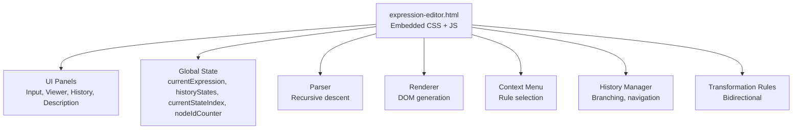
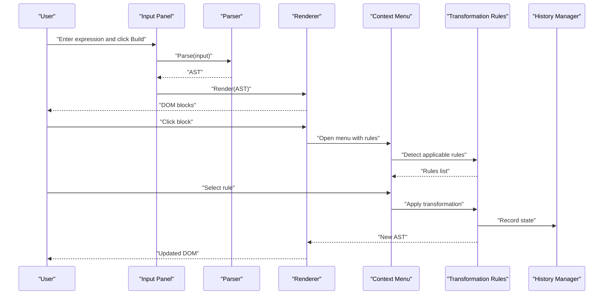
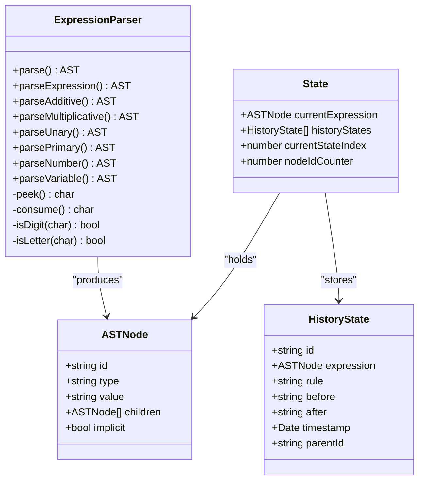
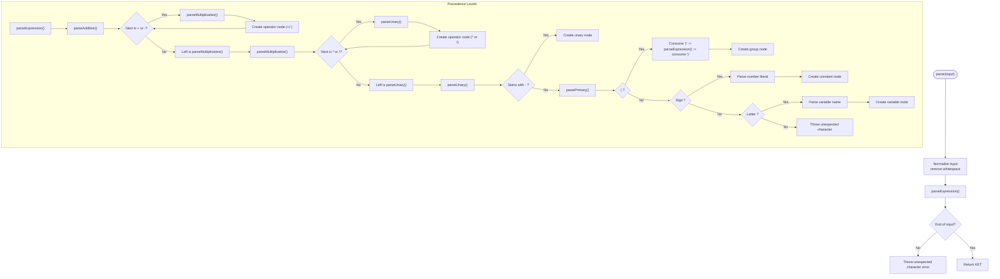
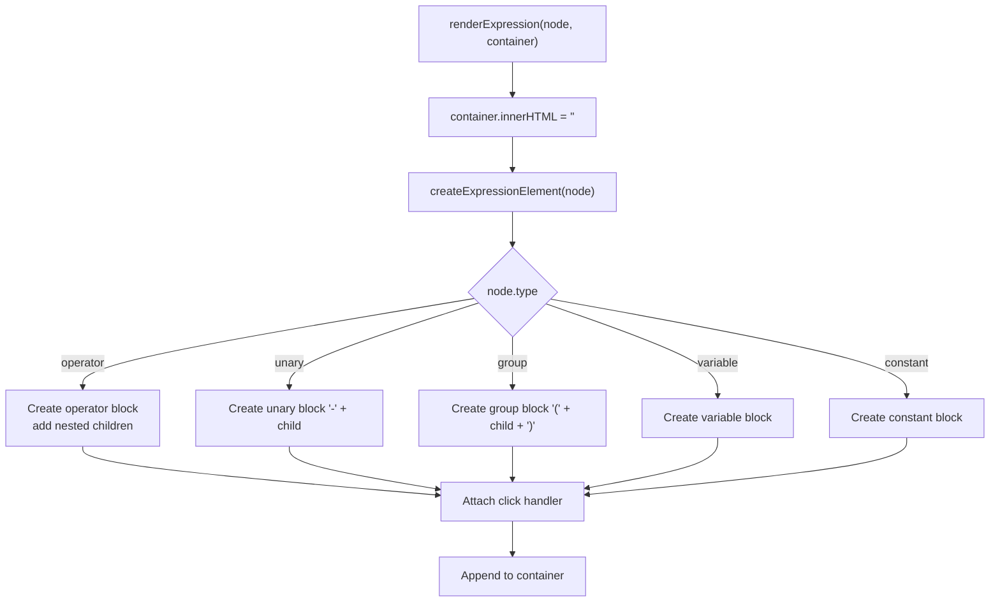
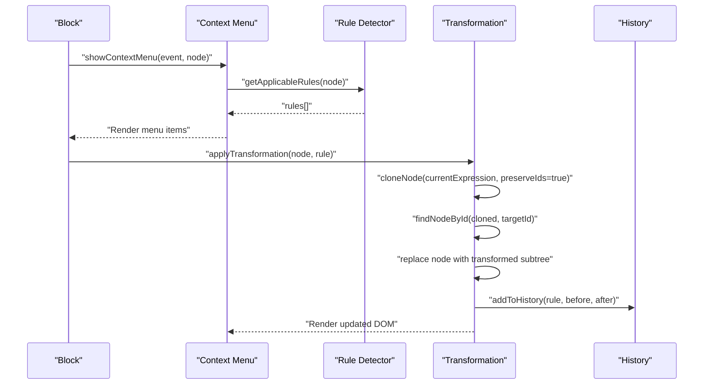
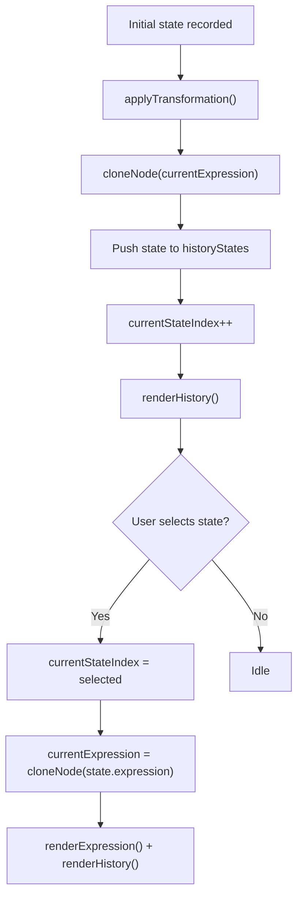
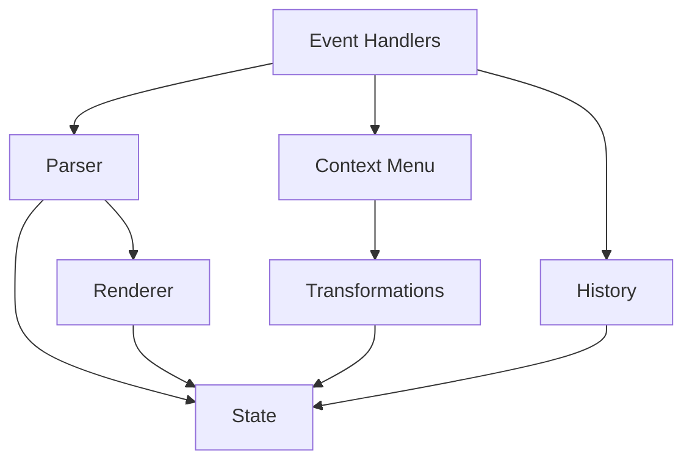
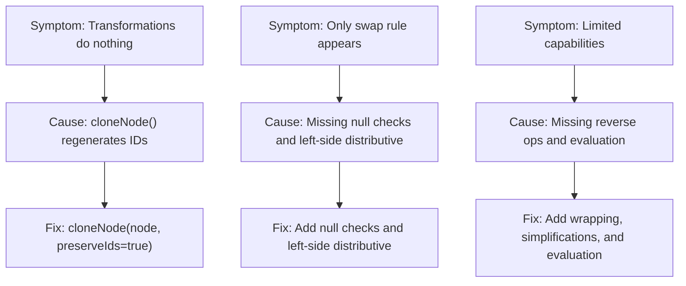

# Technical Architecture

<cite>
**Referenced Files in This Document**
- [expression-editor.html](file://expression-editor.html)
- [README-EXPRESSION-EDITOR.md](file://README-EXPRESSION-EDITOR.md)
- [IMPLEMENTATION-SUMMARY.md](file://IMPLEMENTATION-SUMMARY.md)
- [TEST-CASES.md](file://TEST-CASES.md)
- [BUG-FIX-LOG.md](file://BUG-FIX-LOG.md)
</cite>

## Table of Contents
1. [Introduction](#introduction)
2. [Project Structure](#project-structure)
3. [Core Components](#core-components)
4. [Architecture Overview](#architecture-overview)
5. [Detailed Component Analysis](#detailed-component-analysis)
6. [Dependency Analysis](#dependency-analysis)
7. [Performance Considerations](#performance-considerations)
8. [Troubleshooting Guide](#troubleshooting-guide)
9. [Conclusion](#conclusion)
10. [Appendices](#appendices)

## Introduction
This document describes the technical architecture of the MathHelper application, focusing on the single-file frontend implementation embedded in a single HTML file. The application is a pure vanilla JavaScript solution with no external dependencies, emphasizing self-containment, simplicity, and immediate distribution via a single HTML file. The architecture centers on an Abstract Syntax Tree (AST) to represent expressions, immutable state management through deep cloning, event-driven interactions via DOM events, and a functional organization of code by responsibility.

## Project Structure
The entire application resides in a single HTML file with embedded CSS and JavaScript. Supporting documentation is provided in separate Markdown files that describe features, implementation details, test cases, and bug fixes.

**Diagram sources**
- [expression-editor.html](file://expression-editor.html#L484-L1721)

**Section sources**
- [expression-editor.html](file://expression-editor.html#L484-L1721)
- [README-EXPRESSION-EDITOR.md](file://README-EXPRESSION-EDITOR.md#L136-L170)

## Core Components
- Global state: Manages the current expression tree, history, current index, and node ID counter.
- Parser: Converts textual expressions into an AST using recursive descent with operator precedence and implicit multiplication detection.
- Renderer: Recursively generates DOM nodes from the AST and attaches click handlers for context menu invocation.
- Context menu: Dynamically computes applicable transformation rules for a selected node and applies them.
- History manager: Records states with branching support and enables navigation.
- Transformation rules: A comprehensive set of bidirectional rules covering expansion/factoring, commutativity, notation, identity/simplification, and arithmetic evaluation.

**Section sources**
- [expression-editor.html](file://expression-editor.html#L484-L505)
- [expression-editor.html](file://expression-editor.html#L508-L666)
- [expression-editor.html](file://expression-editor.html#L669-L736)
- [expression-editor.html](file://expression-editor.html#L739-L819)
- [expression-editor.html](file://expression-editor.html#L825-L864)
- [expression-editor.html](file://expression-editor.html#L866-L884)
- [expression-editor.html](file://expression-editor.html#L887-L1169)
- [expression-editor.html](file://expression-editor.html#L1192-L1469)
- [expression-editor.html](file://expression-editor.html#L1471-L1541)
- [expression-editor.html](file://expression-editor.html#L1543-L1651)
- [expression-editor.html](file://expression-editor.html#L1653-L1718)

## Architecture Overview
The system follows a functional, event-driven architecture:
- User input flows from the text field to the parser, which constructs an AST.
- The renderer converts the AST into DOM nodes and attaches click listeners.
- Clicking a block opens a context menu populated by rule detection logic.
- Applying a transformation clones the AST, locates the target node, replaces it, updates state, re-renders, and records history.
- History navigation replays states by cloning from stored snapshots.

**Diagram sources**
- [expression-editor.html](file://expression-editor.html#L1653-L1718)
- [expression-editor.html](file://expression-editor.html#L508-L666)
- [expression-editor.html](file://expression-editor.html#L669-L736)
- [expression-editor.html](file://expression-editor.html#L739-L819)
- [expression-editor.html](file://expression-editor.html#L887-L1169)
- [expression-editor.html](file://expression-editor.html#L1471-L1541)

## Detailed Component Analysis

### Abstract Syntax Tree (AST) and Immutable State
- AST nodes represent operators, unary minus, variables, constants, and grouping. Each node carries metadata such as implicit multiplication flags and unique IDs.
- Immutability is enforced by deep-cloning the AST for each state and transformation. A preservation flag ensures the target node can be located in the cloned tree when applying transformations.
- The global state holds the current expression tree, a history array, and the current index. Node IDs are globally unique and generated incrementally.

**Diagram sources**
- [expression-editor.html](file://expression-editor.html#L508-L666)
- [expression-editor.html](file://expression-editor.html#L848-L864)
- [expression-editor.html](file://expression-editor.html#L1471-L1494)

**Section sources**
- [expression-editor.html](file://expression-editor.html#L484-L505)
- [expression-editor.html](file://expression-editor.html#L508-L666)
- [expression-editor.html](file://expression-editor.html#L848-L864)
- [README-EXPRESSION-EDITOR.md](file://README-EXPRESSION-EDITOR.md#L136-L170)

### Parser: Recursive Descent with Precedence
- Handles operator precedence: parentheses, unary minus, multiplication/division, addition/subtraction.
- Supports implicit multiplication detection (e.g., 2a, ab) and explicit multiplication.
- Throws clear errors for invalid syntax and validates balanced parentheses.
- Produces an AST suitable for rendering and transformation.

**Diagram sources**
- [expression-editor.html](file://expression-editor.html#L508-L666)

**Section sources**
- [expression-editor.html](file://expression-editor.html#L508-L666)
- [README-EXPRESSION-EDITOR.md](file://README-EXPRESSION-EDITOR.md#L112-L135)

### Renderer: DOM Generation from AST
- Recursively creates DOM elements for each AST node.
- Applies CSS classes based on node type and implicit multiplication.
- Attaches click handlers to open the context menu.
- Uses dataset attributes to associate DOM elements with node IDs for later targeting.

**Diagram sources**
- [expression-editor.html](file://expression-editor.html#L669-L736)

**Section sources**
- [expression-editor.html](file://expression-editor.html#L669-L736)

### Context Menu: Rule Detection and Application
- Computes applicable rules based on node type and structure.
- Groups rules by category and displays previews.
- Positions the menu near the clicked block, ensuring it stays within viewport.
- Applies transformations by locating the target node in a preserved-ID clone and replacing it.

**Diagram sources**
- [expression-editor.html](file://expression-editor.html#L739-L819)
- [expression-editor.html](file://expression-editor.html#L887-L1169)
- [expression-editor.html](file://expression-editor.html#L1434-L1469)
- [expression-editor.html](file://expression-editor.html#L1471-L1494)

**Section sources**
- [expression-editor.html](file://expression-editor.html#L739-L819)
- [expression-editor.html](file://expression-editor.html#L887-L1169)
- [expression-editor.html](file://expression-editor.html#L1434-L1469)
- [expression-editor.html](file://expression-editor.html#L1471-L1494)

### History Management: Branching and Navigation
- Stores full AST snapshots with timestamps and rule metadata.
- Supports branching by linking child states to parents.
- Renders a scrollable timeline with current-state highlighting and branch indicators.
- Allows reverting to any state by cloning the stored snapshot.

**Diagram sources**
- [expression-editor.html](file://expression-editor.html#L1471-L1541)

**Section sources**
- [expression-editor.html](file://expression-editor.html#L1471-L1541)

### Global State Variables and Responsibilities
- currentExpression: The active AST representing the current expression.
- historyStates: Array of historical states with full AST snapshots.
- currentStateIndex: Index of the currently displayed state.
- nodeIdCounter: Generator for unique node IDs across the app lifecycle.

These variables coordinate application behavior: parsing produces the AST, rendering consumes it, transformations mutate it, and history stores and navigates through it.

**Section sources**
- [expression-editor.html](file://expression-editor.html#L484-L505)

## Dependency Analysis
- Internal dependencies:
  - Parser depends on utility functions for insertion and ID generation.
  - Renderer depends on AST node shape and dataset attributes.
  - Context menu depends on rule detection and transformation functions.
  - History manager depends on cloning and string conversion utilities.
  - Event handlers depend on DOM elements and state arrays.
- No external libraries or frameworks are used; all functionality is self-contained.

**Diagram sources**
- [expression-editor.html](file://expression-editor.html#L508-L666)
- [expression-editor.html](file://expression-editor.html#L669-L736)
- [expression-editor.html](file://expression-editor.html#L739-L819)
- [expression-editor.html](file://expression-editor.html#L887-L1169)
- [expression-editor.html](file://expression-editor.html#L1192-L1469)
- [expression-editor.html](file://expression-editor.html#L1471-L1541)
- [expression-editor.html](file://expression-editor.html#L1653-L1718)

**Section sources**
- [expression-editor.html](file://expression-editor.html#L508-L666)
- [expression-editor.html](file://expression-editor.html#L669-L736)
- [expression-editor.html](file://expression-editor.html#L739-L819)
- [expression-editor.html](file://expression-editor.html#L887-L1169)
- [expression-editor.html](file://expression-editor.html#L1192-L1469)
- [expression-editor.html](file://expression-editor.html#L1471-L1541)
- [expression-editor.html](file://expression-editor.html#L1653-L1718)

## Performance Considerations
- Efficient DOM updates:
  - Rendering uses recursive DOM creation and minimal reflows by appending a single root element per block.
  - Event delegation is used for block click handlers to reduce listener overhead.
- Animation smoothness:
  - Change animations rely on CSS transitions and a short timeout to toggle a “changed” class, keeping updates lightweight.
- Memory and cloning:
  - Deep cloning is performed for each state and transformation to ensure immutability. While safe, it increases memory usage; the implementation notes indicate a practical limit on history states.
- Input responsiveness:
  - Debouncing input parsing is noted as a future enhancement in the implementation summary.

**Section sources**
- [IMPLEMENTATION-SUMMARY.md](file://IMPLEMENTATION-SUMMARY.md#L224-L230)
- [expression-editor.html](file://expression-editor.html#L669-L736)
- [expression-editor.html](file://expression-editor.html#L1434-L1469)

## Troubleshooting Guide
Common issues and resolutions:
- Transformations not applying:
  - Root cause: Node ID mismatch during cloning. Resolution: Preserve IDs when cloning for transformation to locate the target node in the cloned tree.
- Only swap transformation available:
  - Root cause: Missing null checks and incomplete distributive property support. Resolution: Added null safety and symmetric distributive detection for both sides of multiplication.
- Reverse operations and computation:
  - Enhancement: Added wrapping transformations, identity simplifications, and arithmetic evaluation to expand capabilities.

**Diagram sources**
- [BUG-FIX-LOG.md](file://BUG-FIX-LOG.md#L1-L127)
- [BUG-FIX-LOG.md](file://BUG-FIX-LOG.md#L128-L253)
- [BUG-FIX-LOG.md](file://BUG-FIX-LOG.md#L254-L378)

**Section sources**
- [BUG-FIX-LOG.md](file://BUG-FIX-LOG.md#L1-L127)
- [BUG-FIX-LOG.md](file://BUG-FIX-LOG.md#L128-L253)
- [BUG-FIX-LOG.md](file://BUG-FIX-LOG.md#L254-L378)

## Conclusion
The MathHelper application demonstrates a compact, self-contained architecture that prioritizes clarity and ease of distribution. Its use of an AST, immutable state via deep cloning, event-driven interactions, and functional rule organization yields a robust system for exploring algebraic transformations. While the single-file approach simplifies deployment and comprehension, it introduces challenges for scalability and maintainability at larger scales. The documented trade-offs and performance considerations provide a clear mental model for how the system operates and where future enhancements could be focused.

## Appendices

### High-Level Data Flow (Text)
- Input: User enters an expression in the text field.
- Parse: The parser converts the string into an AST with operator precedence and implicit multiplication handling.
- Render: The renderer generates DOM blocks from the AST and attaches click handlers.
- Interact: Clicking a block opens the context menu with applicable rules.
- Transform: The selected rule is applied by cloning the AST, locating the target node, replacing it, updating state, re-rendering, and recording history.
- Navigate: Users can select previous states in the history panel to revert or branch.

**Section sources**
- [expression-editor.html](file://expression-editor.html#L1653-L1718)
- [expression-editor.html](file://expression-editor.html#L508-L666)
- [expression-editor.html](file://expression-editor.html#L669-L736)
- [expression-editor.html](file://expression-editor.html#L739-L819)
- [expression-editor.html](file://expression-editor.html#L887-L1169)
- [expression-editor.html](file://expression-editor.html#L1434-L1469)
- [expression-editor.html](file://expression-editor.html#L1471-L1541)