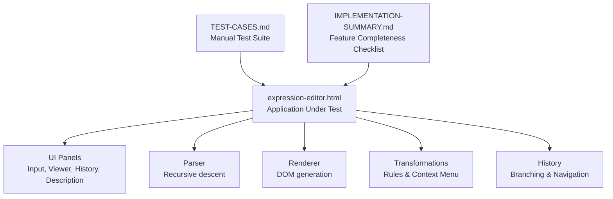
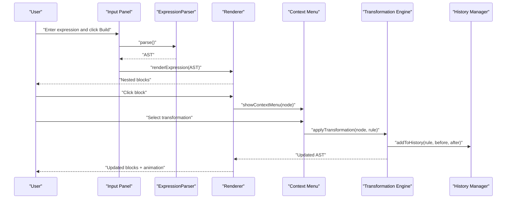
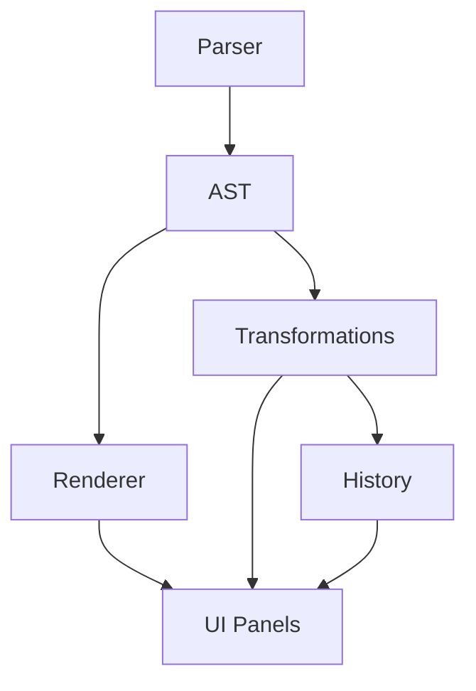

# Testing and Verification

<cite>
**Referenced Files in This Document**
- [TEST-CASES.md](file://TEST-CASES.md)
- [IMPLEMENTATION-SUMMARY.md](file://IMPLEMENTATION-SUMMARY.md)
- [expression-editor.html](file://expression-editor.html)
</cite>

## Table of Contents
1. [Introduction](#introduction)
2. [Project Structure](#project-structure)
3. [Core Components](#core-components)
4. [Architecture Overview](#architecture-overview)
5. [Detailed Component Analysis](#detailed-component-analysis)
6. [Dependency Analysis](#dependency-analysis)
7. [Performance Considerations](#performance-considerations)
8. [Troubleshooting Guide](#troubleshooting-guide)
9. [Conclusion](#conclusion)
10. [Appendices](#appendices)

## Introduction
This section documents the testing methodology and verification process for MathHelper’s Logical Expression Editor. It explains how the test cases in TEST-CASES.md validate parsing, transformation accuracy, and edge-case handling. It also describes how IMPLEMENTATION-SUMMARY.md serves as a feature completeness checklist and how to use it to verify correct behavior. Guidance is provided for manual testing procedures, including entering expressions, applying transformations, and verifying visual and structural correctness. Common failure modes are outlined with diagnostic steps using browser developer tools. Finally, it explains how to add new test cases when extending functionality, acknowledges the current limitations of manual testing, and suggests improvements.

## Project Structure
The testing and verification effort centers on three key artifacts:
- TEST-CASES.md: A comprehensive manual test suite covering parsing, transformations, history navigation, edge cases, visual checks, performance, and integration workflows.
- IMPLEMENTATION-SUMMARY.md: A feature completeness checklist aligned with the design specification, used to verify that implemented functionality matches intended behavior.
- expression-editor.html: The single-file application containing the parser, renderer, transformation engine, history management, and UI. This is the executable artifact under test.

**Diagram sources**
- [TEST-CASES.md](file://TEST-CASES.md#L1-L245)
- [IMPLEMENTATION-SUMMARY.md](file://IMPLEMENTATION-SUMMARY.md#L1-L396)
- [expression-editor.html](file://expression-editor.html#L484-L1721)

**Section sources**
- [TEST-CASES.md](file://TEST-CASES.md#L1-L245)
- [IMPLEMENTATION-SUMMARY.md](file://IMPLEMENTATION-SUMMARY.md#L1-L396)
- [expression-editor.html](file://expression-editor.html#L484-L1721)

## Core Components
- Parser: Validates expressions, enforces operator precedence, handles implicit multiplication, unary minus, parentheses, and produces an AST.
- Renderer: Converts the AST into nested, color-coded blocks with hover and click interactions.
- Transformation Engine: Computes applicable rules per node, applies bidirectional transformations, and updates the UI.
- History Manager: Stores immutable states, supports branching, and enables navigation with descriptions.
- UI Panels: Input, viewer, history, and description panels, plus a context menu positioned near the clicked block.

These components are exercised by the test cases and validated against the implementation summary.

**Section sources**
- [expression-editor.html](file://expression-editor.html#L508-L736)
- [expression-editor.html](file://expression-editor.html#L848-L1169)
- [expression-editor.html](file://expression-editor.html#L1433-L1541)
- [expression-editor.html](file://expression-editor.html#L1653-L1718)
- [IMPLEMENTATION-SUMMARY.md](file://IMPLEMENTATION-SUMMARY.md#L31-L113)

## Architecture Overview
The application is a single-file HTML/JavaScript implementation. The parser generates an AST, the renderer displays it, and the transformation engine computes and applies rules. History captures states and descriptions, and the UI integrates all parts.

**Diagram sources**
- [expression-editor.html](file://expression-editor.html#L508-L736)
- [expression-editor.html](file://expression-editor.html#L848-L1169)
- [expression-editor.html](file://expression-editor.html#L1433-L1541)
- [expression-editor.html](file://expression-editor.html#L1653-L1718)

## Detailed Component Analysis

### Test Case Coverage and Purpose
The manual test suite validates:
- Parsing correctness: precedence, parentheses, unary minus, implicit multiplication, complex expressions.
- Transformation accuracy: distributive property (forward and reverse), commutative property, notation transformations, simplifications.
- History navigation: linear history, branching, and description updates.
- Edge cases: invalid syntax, empty input, unmatched parentheses, invalid starts, and context menu behavior.
- Visual correctness: color coding, hover effects, change animations, responsive layout.
- Performance: large expressions, deep nesting, long histories.
- Integration: full workflow including branching and clearing.

Each test case specifies expected AST structure, visual appearance, and behavioral outcomes. These expectations directly map to the parser, renderer, and transformation logic.

**Section sources**
- [TEST-CASES.md](file://TEST-CASES.md#L1-L245)

### Using IMPLEMENTATION-SUMMARY.md as a Feature Completeness Checklist
IMPLEMENTATION-SUMMARY.md lists implemented features and design compliance. Use it to:
- Cross-check that all listed features are present and behaving as described.
- Verify color coding, context menu positioning, bidirectional rules, branching history, and description auto-generation.
- Confirm that the data structures and architecture align with the stated design (AST, deep cloning, event delegation).
- Track testing status and known limitations to prioritize manual verification.

This checklist ensures comprehensive coverage during manual testing and regression checks.

**Section sources**
- [IMPLEMENTATION-SUMMARY.md](file://IMPLEMENTATION-SUMMARY.md#L31-L113)
- [IMPLEMENTATION-SUMMARY.md](file://IMPLEMENTATION-SUMMARY.md#L114-L180)
- [IMPLEMENTATION-SUMMARY.md](file://IMPLEMENTATION-SUMMARY.md#L213-L233)
- [IMPLEMENTATION-SUMMARY.md](file://IMPLEMENTATION-SUMMARY.md#L322-L343)

### Manual Testing Procedures
- Enter test expressions: Use the input field and “Build Expression” button. Alternatively, press Enter to build.
- Apply transformations: Click a block to open the context menu, select a rule, and confirm the change and history update.
- Verify visual correctness: Check color coding, hover effects, and change animation.
- Navigate history: Click any step to revert to that state; verify branching and description updates.
- Clear and reset: Use the “Clear” button to reset all state.
- Quick insert: Use toolbar buttons to add operators and operands quickly.

Follow the manual testing checklist in TEST-CASES.md to systematically verify each requirement.

**Section sources**
- [TEST-CASES.md](file://TEST-CASES.md#L206-L245)
- [expression-editor.html](file://expression-editor.html#L1653-L1718)

### Example Test Case Workflows
- Basic parsing: Validate that simple addition and multiplication produce expected ASTs and visuals.
- Precedence and parentheses: Confirm that multiplication precedes addition and that grouped additions render correctly.
- Unary minus and implicit multiplication: Verify unary minus and implicit multiplication notation.
- Complex expression: Ensure multi-level trees render with correct nesting.
- Transformation workflows: Expand/factor using distributive property, swap operands with commutative property, toggle notation, and remove double negatives or parentheses.
- History navigation: Apply a sequence of transformations, jump to intermediate steps, and create alternative branches.
- Edge cases: Trigger invalid syntax and verify error messages and no rendering.
- Visual checks: Confirm color coding, hover effects, change animation, and responsive layout.

**Section sources**
- [TEST-CASES.md](file://TEST-CASES.md#L1-L205)
- [expression-editor.html](file://expression-editor.html#L508-L736)
- [expression-editor.html](file://expression-editor.html#L848-L1169)
- [expression-editor.html](file://expression-editor.html#L1433-L1541)

### Common Failure Modes and Diagnostics
- Transformations not applying:
  - Symptom: Selecting a rule does nothing.
  - Likely cause: Target node not found after cloning.
  - Fix: Ensure cloning preserves IDs for transformation targets.
  - Diagnostic steps: Inspect console logs in getApplicableRules and applyTransformation; verify cloneNode behavior and findNodeById logic.
- Incorrect AST structure:
  - Symptom: Wrong precedence or missing grouping.
  - Fix: Review parser precedence and grouping logic.
  - Diagnostic steps: Inspect parseExpression, parseAdditive, parseMultiplicative, and parseUnary.
- Rendering errors:
  - Symptom: Blocks not updating or wrong colors.
  - Fix: Verify createExpressionElement and class assignments.
  - Diagnostic steps: Inspect renderer and CSS class mappings.
- History navigation issues:
  - Symptom: Steps not updating or branching not preserved.
  - Fix: Ensure addToHistory writes parentId and renderHistory reflects current index.
  - Diagnostic steps: Inspect history state structure and renderHistory logic.
- Context menu positioning:
  - Symptom: Menu off-screen or not closing.
  - Fix: Adjust positioning and ensure click-outside handler.
  - Diagnostic steps: Inspect showContextMenu and click handlers.

**Section sources**
- [expression-editor.html](file://expression-editor.html#L848-L1169)
- [expression-editor.html](file://expression-editor.html#L1433-L1541)
- [expression-editor.html](file://expression-editor.html#L1653-L1718)
- [IMPLEMENTATION-SUMMARY.md](file://IMPLEMENTATION-SUMMARY.md#L344-L371)

### Adding New Test Cases
When extending functionality:
- Add a new test case in TEST-CASES.md under the appropriate section (Parsing, Transformations, History, Edge Cases, Visual, Performance, Integration).
- Define inputs, expected AST/structure, and visual outcomes.
- Include steps to reproduce and verification criteria.
- Update the manual testing checklist if new UI or behavior is introduced.
- Reference the implementation summary to ensure the feature is covered by the design.

**Section sources**
- [TEST-CASES.md](file://TEST-CASES.md#L206-L245)
- [IMPLEMENTATION-SUMMARY.md](file://IMPLEMENTATION-SUMMARY.md#L160-L180)

## Dependency Analysis
The application’s internal dependencies are:
- Parser depends on tokenizer-like lookahead and recursive descent logic.
- Renderer depends on AST structure and CSS classes.
- Transformation engine depends on AST traversal and cloning.
- History manager depends on deep cloning and state indexing.
- UI depends on event delegation and DOM manipulation.

**Diagram sources**
- [expression-editor.html](file://expression-editor.html#L508-L736)
- [expression-editor.html](file://expression-editor.html#L848-L1169)
- [expression-editor.html](file://expression-editor.html#L1433-L1541)
- [expression-editor.html](file://expression-editor.html#L1653-L1718)

**Section sources**
- [expression-editor.html](file://expression-editor.html#L508-L736)
- [expression-editor.html](file://expression-editor.html#L848-L1169)
- [expression-editor.html](file://expression-editor.html#L1433-L1541)
- [expression-editor.html](file://expression-editor.html#L1653-L1718)

## Performance Considerations
- Large expressions: The implementation claims smooth rendering for expressions up to a certain token count and no lag with many history states.
- Deep nesting: Parentheses removal and step-by-step unwrapping should remain responsive.
- Long histories: Branching and scrolling should remain fast.

Guidance:
- Use representative test cases from TEST-CASES.md to validate responsiveness under load.
- Monitor rendering and navigation performance during branching scenarios.

**Section sources**
- [IMPLEMENTATION-SUMMARY.md](file://IMPLEMENTATION-SUMMARY.md#L242-L248)
- [TEST-CASES.md](file://TEST-CASES.md#L177-L193)

## Troubleshooting Guide
- Parser errors:
  - Symptoms: Error messages for empty input, unmatched parentheses, unexpected characters.
  - Actions: Validate error handling paths and ensure messages are displayed.
- Transformation failures:
  - Symptoms: No change after selecting a rule.
  - Actions: Confirm cloneNode preserves IDs for transformation targets and findNodeById locates the node.
- History issues:
  - Symptoms: Steps not updating or branching not preserved.
  - Actions: Verify addToHistory writes parentId and renderHistory reflects current index.
- Visual regressions:
  - Symptoms: Wrong colors, hover effects, or animations.
  - Actions: Inspect CSS classes and animation timing.

Use browser developer tools to inspect:
- Console logs for getApplicableRules and applyTransformation.
- DOM structure to verify block rendering and class assignments.
- History state arrays and current index to validate navigation.

**Section sources**
- [expression-editor.html](file://expression-editor.html#L1653-L1718)
- [expression-editor.html](file://expression-editor.html#L848-L1169)
- [expression-editor.html](file://expression-editor.html#L1433-L1541)
- [IMPLEMENTATION-SUMMARY.md](file://IMPLEMENTATION-SUMMARY.md#L344-L371)

## Conclusion
The manual testing methodology leverages TEST-CASES.md to validate parsing, transformations, history, edge cases, visuals, and performance. IMPLEMENTATION-SUMMARY.md acts as a feature completeness checklist to ensure alignment with design specifications. The single-file architecture in expression-editor.html provides a cohesive surface for manual verification. While the current approach is manual, it is practical and effective for this prototype. Suggestions for improvement include adding automated unit tests for parser and transformation logic, snapshot tests for rendering, and integration tests for history navigation.

## Appendices

### How IMPLEMENTATION-SUMMARY.md Serves as a Feature Completeness Checklist
- Lists implemented features and design compliance.
- Provides data structure and architecture summaries.
- Tracks testing status and known limitations.
- Guides verification by cross-referencing with test cases.

**Section sources**
- [IMPLEMENTATION-SUMMARY.md](file://IMPLEMENTATION-SUMMARY.md#L160-L180)
- [IMPLEMENTATION-SUMMARY.md](file://IMPLEMENTATION-SUMMARY.md#L322-L343)

### Suggested Improvements to Testing
- Automated unit tests for:
  - Parser: Tokenization, precedence, implicit multiplication, error conditions.
  - Transformations: Rule applicability, AST mutations, safety checks.
  - Rendering: DOM structure, class assignments, animations.
- Snapshot tests for visual rendering across expressions.
- Integration tests for branching history and navigation.
- Accessibility tests for keyboard navigation and screen reader support.
- Performance benchmarks for large expressions and deep histories.

[No sources needed since this section provides general guidance]