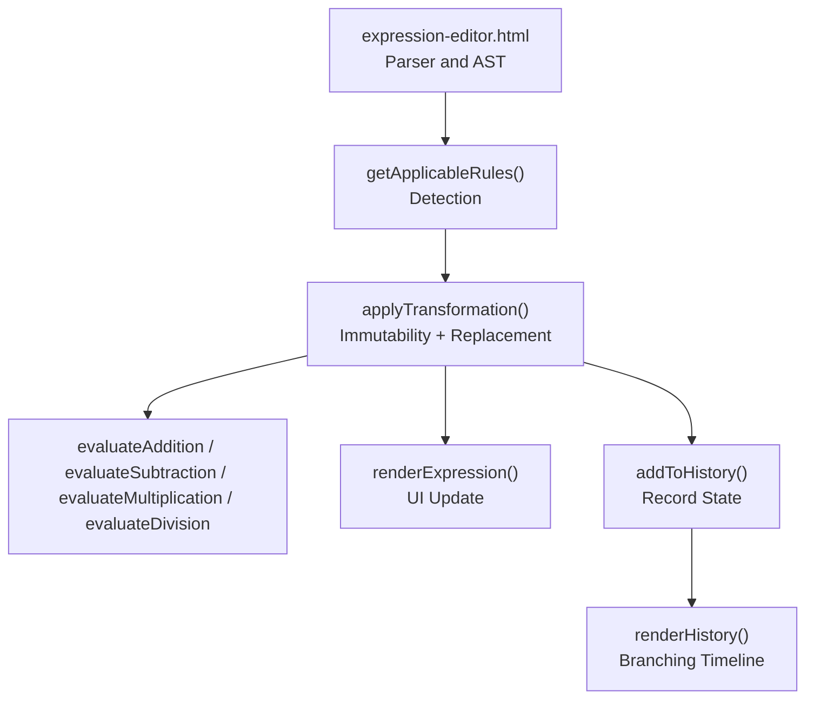
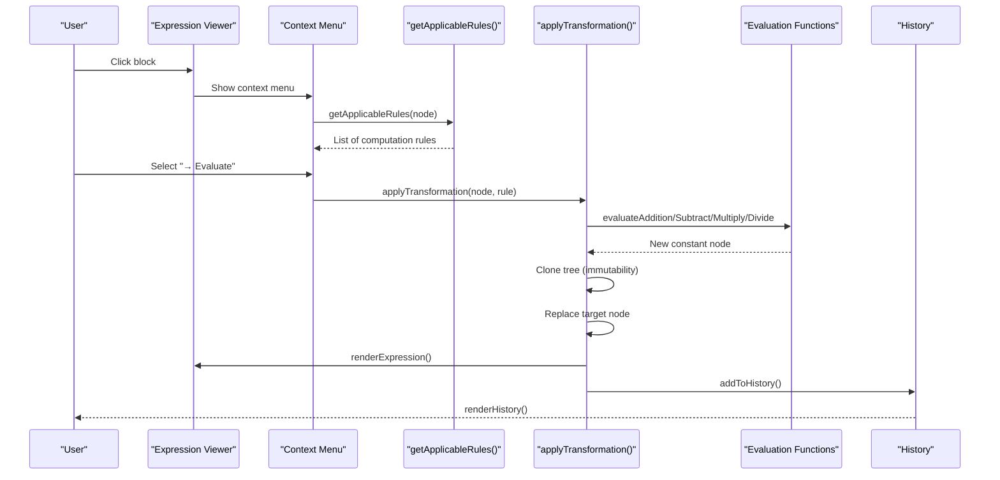
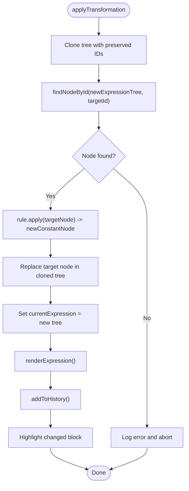
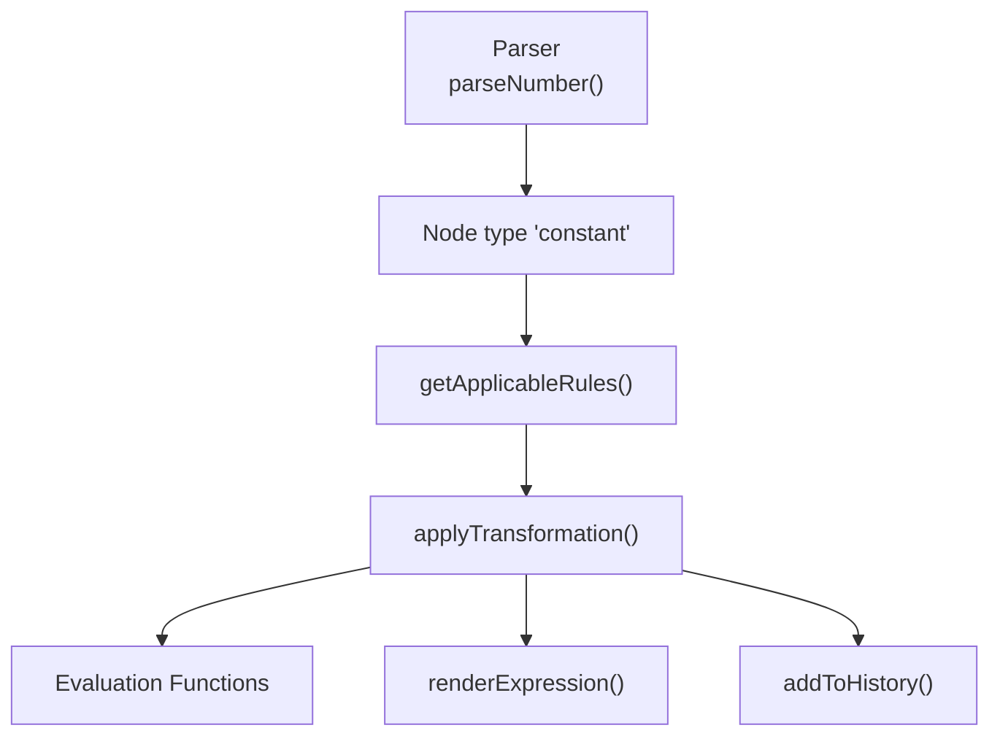

# Computation Rules

<cite>
**Referenced Files in This Document**
- [expression-editor.html](file://expression-editor.html)
- [README-EXPRESSION-EDITOR.md](file://README-EXPRESSION-EDITOR.md)
- [IMPLEMENTATION-SUMMARY.md](file://IMPLEMENTATION-SUMMARY.md)
- [TEST-CASES.md](file://TEST-CASES.md)
</cite>

## Table of Contents
1. [Introduction](#introduction)
2. [Project Structure](#project-structure)
3. [Core Components](#core-components)
4. [Architecture Overview](#architecture-overview)
5. [Detailed Component Analysis](#detailed-component-analysis)
6. [Dependency Analysis](#dependency-analysis)
7. [Performance Considerations](#performance-considerations)
8. [Troubleshooting Guide](#troubleshooting-guide)
9. [Conclusion](#conclusion)
10. [Appendices](#appendices)

## Introduction
This document explains the Computation transformation rules that evaluate constant expressions such as “2 + 3” → “5” or “6 / 2” → “3”. It focuses on how the system detects nodes whose children are constants, applies arithmetic evaluation, and maintains immutability by cloning the expression tree. It also documents the getApplicableRules() detection logic and the applyTransformation() function that performs the calculation, along with visual feedback and history recording. Edge cases such as division by zero and floating-point precision are addressed, and references are provided to the parsing logic around line 633 and the transformation system.

## Project Structure
The entire application is implemented in a single HTML file with embedded CSS and JavaScript. The relevant parts for computation rules are:
- Parser and AST construction (line 508)
- Rendering and block visualization (line 669)
- Context menu and rule selection (line 739)
- getApplicableRules() detection logic (line 887)
- Evaluation functions (line 1466)
- applyTransformation() execution (line 1501)
- History management and visual feedback (line 1539)

**Diagram sources**
- [expression-editor.html](file://expression-editor.html#L508-L1788)

**Section sources**
- [expression-editor.html](file://expression-editor.html#L508-L1788)

## Core Components
- Constant detection: Nodes with type “operator” and value “+”, “-”, “*”, or “/” are checked for children of type “constant”.
- Arithmetic evaluation: Four dedicated functions compute results for addition, subtraction, multiplication, and division.
- Immutability: The expression tree is deep-cloned before mutation; node replacement preserves IDs for targeted updates.
- Visual feedback: Transformed blocks receive a “changed” class with a pulsing animation.
- History: Each transformation is recorded with before/after expressions and rule metadata, enabling branching.

**Section sources**
- [expression-editor.html](file://expression-editor.html#L887-L1788)

## Architecture Overview
The computation pipeline integrates parsing, rule detection, transformation application, rendering, and history recording.

**Diagram sources**
- [expression-editor.html](file://expression-editor.html#L739-L1788)

## Detailed Component Analysis

### getApplicableRules() — Detecting Computable Nodes
The function scans a node and returns applicable computation rules when both children are constants. It categorizes them under “Computation” and provides previews for immediate feedback.

Key detection logic:
- Multiplication: operator “*” with both children of type “constant”
- Division: operator “/” with both children of type “constant”
- Addition/Subtraction: operator “+” or “-” with both children of type “constant”

Preview strings are constructed from child values to show the before/after computation.

Immutability note: The function itself does not mutate the tree; it only inspects node properties.

**Section sources**
- [expression-editor.html](file://expression-editor.html#L887-L1192)

### applyTransformation() — Performing the Calculation
This function ensures immutability and correct replacement:
- Deep clone the current expression tree with preserved IDs so the target node can be located by ID.
- Find the target node in the cloned tree using a traversal helper.
- Invoke the rule’s apply function to produce a new constant node.
- Replace the target node in the cloned tree (handling root node replacement).
- Update the current expression, re-render the viewer, and record the transformation in history.
- Trigger visual feedback by adding a “changed” class to the transformed block.

**Diagram sources**
- [expression-editor.html](file://expression-editor.html#L1501-L1561)

**Section sources**
- [expression-editor.html](file://expression-editor.html#L1501-L1561)

### Evaluation Functions — Arithmetic Computation
Each operation returns a new “constant” node with the computed value:
- evaluateAddition: returns a constant node with value equal to left + right
- evaluateSubtraction: returns a constant node with value equal to left - right
- evaluateMultiplication: returns a constant node with value equal to left * right
- evaluateDivision: returns a constant node with value equal to left / right

These functions are invoked by rules detected in getApplicableRules().

**Section sources**
- [expression-editor.html](file://expression-editor.html#L1466-L1498)

### Visual Feedback — Highlighting Computed Blocks
After applying a transformation, the system adds a “changed” class to the transformed block element and removes it after a short delay. This creates a pulsing animation to draw attention to the updated portion of the expression.

**Section sources**
- [expression-editor.html](file://expression-editor.html#L1528-L1535)

### History Recording — Branching Timeline
Each transformation is recorded with:
- Rule name and preview
- Before and after expressions
- Timestamp and optional parent ID for branching
- A clone of the expression tree at that state

The history panel displays a chronological list, with current state highlighted and branches indented.

**Section sources**
- [expression-editor.html](file://expression-editor.html#L1539-L1608)

### Nested Expressions — Handling Complex Structures
Computation rules operate on any operator node whose children are constants, regardless of nesting depth. The recursive nature of the renderer and the deep cloning ensure that replacing a constant-computable subtree does not affect other parts of the tree.

**Section sources**
- [expression-editor.html](file://expression-editor.html#L669-L736)
- [expression-editor.html](file://expression-editor.html#L848-L864)

### Edge Cases — Division by Zero and Floating-Point Precision
- Division by zero: The current implementation evaluates division by cloning and replacing the node without explicit checks. If a constant child has value 0, the evaluation will compute a division by zero. The system does not currently guard against this; downstream rendering and console output may reflect Infinity or NaN depending on browser behavior. Recommendation: add a guard in getApplicableRules() to suppress the “→ Evaluate” rule when a division-by-zero scenario is detected, or add a runtime check in evaluateDivision() to throw or return an error state.
- Floating-point precision: Arithmetic operations may introduce floating-point rounding differences. Recommendation: consider formatting output to a fixed number of decimal places or using a library for exact rational arithmetic if exactness is required.

**Section sources**
- [expression-editor.html](file://expression-editor.html#L915-L926)
- [expression-editor.html](file://expression-editor.html#L1134-L1144)
- [expression-editor.html](file://expression-editor.html#L1492-L1498)

### Parsing Logic Around Line 633 — Constant Creation
The parser constructs constant nodes by scanning numeric tokens and assigning a float value. This is the source of “constant” nodes that computation rules target.

**Section sources**
- [expression-editor.html](file://expression-editor.html#L627-L637)

## Dependency Analysis
Computation rules depend on:
- Parser constants: constants are parsed and stored as nodes with type “constant” and numeric value.
- Renderer: the visual representation depends on node types and values.
- Rule detection: getApplicableRules() inspects node types and children.
- Transformation engine: applyTransformation() orchestrates cloning, replacement, rendering, and history.

**Diagram sources**
- [expression-editor.html](file://expression-editor.html#L627-L637)
- [expression-editor.html](file://expression-editor.html#L887-L1192)
- [expression-editor.html](file://expression-editor.html#L1501-L1561)

**Section sources**
- [expression-editor.html](file://expression-editor.html#L627-L637)
- [expression-editor.html](file://expression-editor.html#L887-L1192)
- [expression-editor.html](file://expression-editor.html#L1501-L1561)

## Performance Considerations
- Deep cloning: The system clones the entire tree for each transformation to maintain immutability. While straightforward, deep cloning can be expensive for very large expressions. Consider optimizing by cloning only affected subtrees if needed.
- Rendering: Re-rendering the entire expression after each transformation is simple and reliable. For performance-critical scenarios, consider selective DOM updates.
- History growth: There is no explicit limit on history states. For long sessions, consider pruning older states to control memory usage.

[No sources needed since this section provides general guidance]

## Troubleshooting Guide
- Rule does not appear: Ensure both children of the operator node are constants. getApplicableRules() only exposes “→ Evaluate” when both children are of type “constant”.
- Transformation does not apply: Confirm the target node exists in the cloned tree by ID. The fix for preserving IDs during cloning is essential for correct replacement.
- Visual feedback not visible: Check that the transformed node element exists and that the “changed” class is toggled after rendering.
- History not updating: Verify addToHistory() is called after applyTransformation() and that renderHistory() is invoked afterward.

**Section sources**
- [expression-editor.html](file://expression-editor.html#L887-L1192)
- [expression-editor.html](file://expression-editor.html#L1501-L1561)
- [expression-editor.html](file://expression-editor.html#L1539-L1608)

## Conclusion
The Computation rules provide a robust mechanism to evaluate constant arithmetic within nested expressions. The system detects computable nodes, computes results immutably, and provides clear visual feedback and branching history. To improve safety, consider adding guards against division by zero and addressing floating-point precision concerns.

[No sources needed since this section summarizes without analyzing specific files]

## Appendices

### References to Documentation and Tests
- Implementation summary and design compliance: [README-EXPRESSION-EDITOR.md](file://README-EXPRESSION-EDITOR.md), [IMPLEMENTATION-SUMMARY.md](file://IMPLEMENTATION-SUMMARY.md)
- Test coverage for transformations and edge cases: [TEST-CASES.md](file://TEST-CASES.md)

**Section sources**
- [README-EXPRESSION-EDITOR.md](file://README-EXPRESSION-EDITOR.md#L1-L258)
- [IMPLEMENTATION-SUMMARY.md](file://IMPLEMENTATION-SUMMARY.md#L1-L396)
- [TEST-CASES.md](file://TEST-CASES.md#L1-L245)