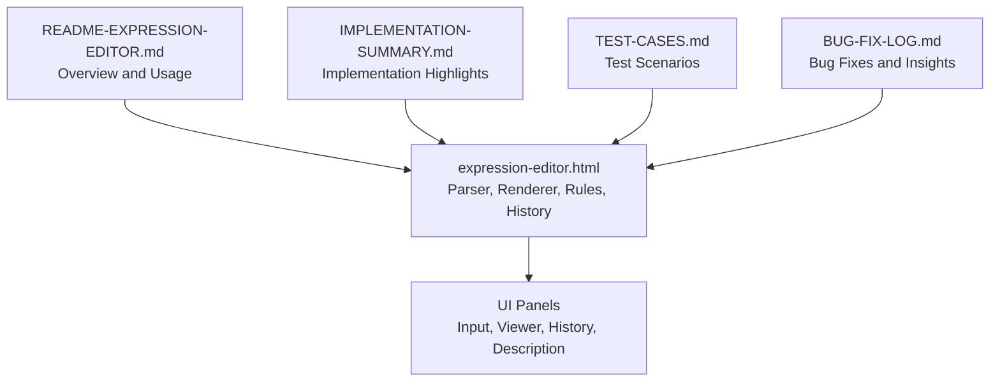
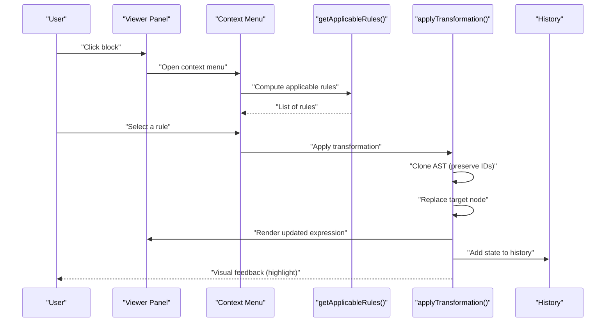
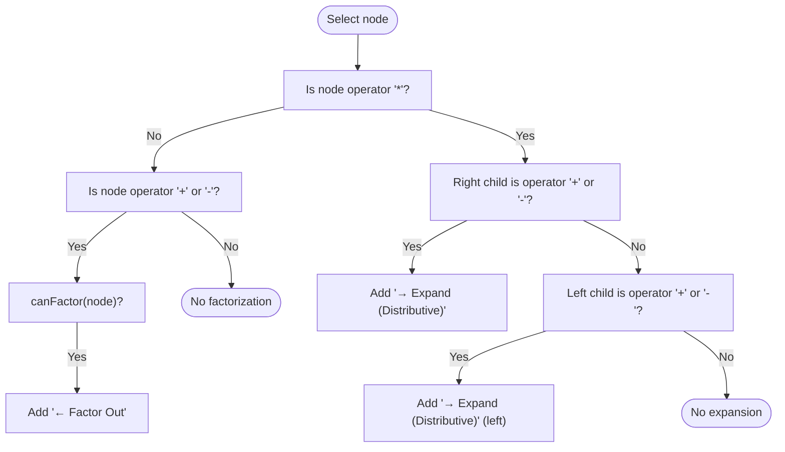
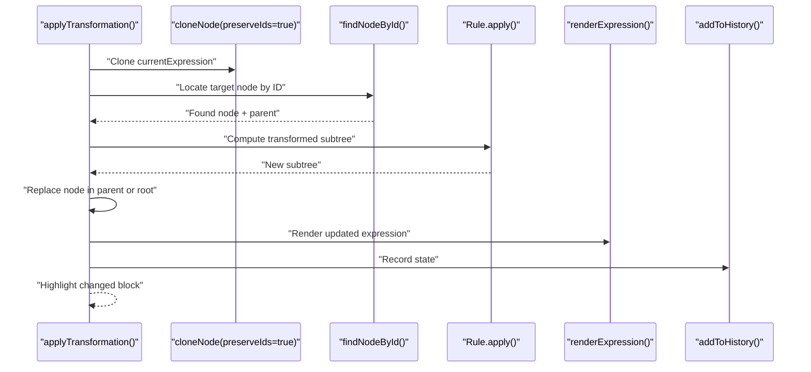
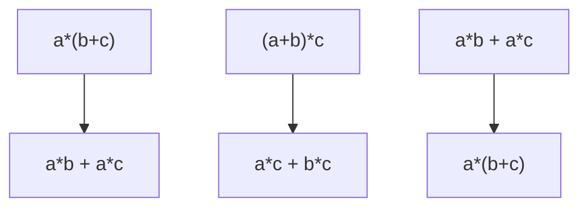
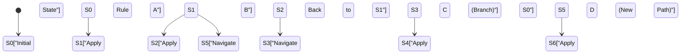
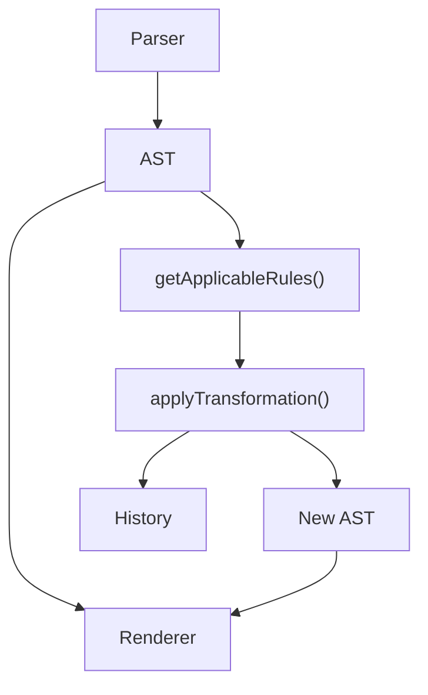

# Expansion Rules

<cite>
**Referenced Files in This Document**
- [expression-editor.html](file://expression-editor.html)
- [README-EXPRESSION-EDITOR.md](file://README-EXPRESSION-EDITOR.md)
- [IMPLEMENTATION-SUMMARY.md](file://IMPLEMENTATION-SUMMARY.md)
- [TEST-CASES.md](file://TEST-CASES.md)
- [BUG-FIX-LOG.md](file://BUG-FIX-LOG.md)
</cite>

## Table of Contents
1. [Introduction](#introduction)
2. [Project Structure](#project-structure)
3. [Core Components](#core-components)
4. [Architecture Overview](#architecture-overview)
5. [Detailed Component Analysis](#detailed-component-analysis)
6. [Dependency Analysis](#dependency-analysis)
7. [Performance Considerations](#performance-considerations)
8. [Troubleshooting Guide](#troubleshooting-guide)
9. [Conclusion](#conclusion)
10. [Appendices](#appendices)

## Introduction
This document explains the Expansion transformation rules with a focus on the distributive property (a * (b + c) ↔ a * b + a * c). It covers how the system identifies factorable expressions and applies expansion in both directions, the implementation of getApplicableRules() that detects multiplication over addition/subtraction patterns, and the applyTransformation() function that restructures the AST while preserving mathematical equivalence. It also describes the visual feedback mechanism that highlights transformed blocks and how the history system maintains branching paths. Finally, it addresses common misconceptions about when expansion is mathematically valid and references relevant code locations in expression-editor.html around line 741 and the rule definition sections that handle distributive transformations.

## Project Structure
The project is a single-file web application that implements a visual expression editor with transformation rules, history, and descriptions. The core logic resides in expression-editor.html, with supporting documentation in README-EXPRESSION-EDITOR.md, IMPLEMENTATION-SUMMARY.md, TEST-CASES.md, and BUG-FIX-LOG.md.

**Diagram sources**
- [expression-editor.html](file://expression-editor.html#L1-L120)
- [README-EXPRESSION-EDITOR.md](file://README-EXPRESSION-EDITOR.md#L1-L120)
- [IMPLEMENTATION-SUMMARY.md](file://IMPLEMENTATION-SUMMARY.md#L1-L120)
- [TEST-CASES.md](file://TEST-CASES.md#L1-L60)
- [BUG-FIX-LOG.md](file://BUG-FIX-LOG.md#L1-L60)

**Section sources**
- [expression-editor.html](file://expression-editor.html#L1-L120)
- [README-EXPRESSION-EDITOR.md](file://README-EXPRESSION-EDITOR.md#L1-L120)

## Core Components
- getApplicableRules(): Detects applicable transformation rules for a selected expression block, including distributive expansion and factorization.
- applyTransformation(): Applies a selected rule to the AST, replacing the target node with its transformed form, updating the viewer, and recording history.
- Visual Feedback: Highlights the changed block with a pulse animation.
- History System: Maintains a chronological list of states with branching support.

Key implementation references:
- getApplicableRules() around line 741 and rule definitions around lines 1018–1083.
- applyTransformation() around lines 1462–1497.
- Visual feedback around lines 1489–1496.
- History management around lines 1500–1569.

**Section sources**
- [expression-editor.html](file://expression-editor.html#L738-L800)
- [expression-editor.html](file://expression-editor.html#L1018-L1083)
- [expression-editor.html](file://expression-editor.html#L1462-L1497)
- [expression-editor.html](file://expression-editor.html#L1500-L1569)

## Architecture Overview
The system parses a string expression into an AST, renders it as nested blocks, and exposes contextual transformations. The getApplicableRules() function inspects the selected node and its children to determine valid transformations. applyTransformation() clones the current AST (preserving IDs for node lookup), replaces the target node, re-renders the viewer, and appends a history entry. The history panel displays all states and supports branching.

**Diagram sources**
- [expression-editor.html](file://expression-editor.html#L738-L800)
- [expression-editor.html](file://expression-editor.html#L1018-L1083)
- [expression-editor.html](file://expression-editor.html#L1462-L1497)
- [expression-editor.html](file://expression-editor.html#L1500-L1569)

## Detailed Component Analysis

### getApplicableRules() — Detection of Distributive Patterns
The function determines whether expansion or factorization is applicable based on the selected node’s structure and children. It adds rules for:
- Forward expansion: a*(b+c) → a*b + a*c (right child is addition/subtraction)
- Forward expansion: (a+b)*c → a*c + b*c (left child is addition/subtraction)
- Reverse factorization: a*b + a*c → a*(b+c) when both children are multiplications sharing a common factor

Detection logic:
- Multiplication node with a child whose type is operator and value is '+' or '-' triggers expansion rules.
- Addition/Subtraction node is eligible for factorization if both children are multiplications with a shared factor.

Important safeguards:
- Null checks for node.children before accessing children[0] or children[1].
- Symmetric detection for both sides of multiplication.

References:
- getApplicableRules() invocation around line 741.
- Expansion rules around lines 1056–1083.
- Factorization detection around lines 1040–1052 and canFactor() around lines 1199–1218.

**Diagram sources**
- [expression-editor.html](file://expression-editor.html#L1056-L1083)
- [expression-editor.html](file://expression-editor.html#L1040-L1052)
- [expression-editor.html](file://expression-editor.html#L1199-L1218)

**Section sources**
- [expression-editor.html](file://expression-editor.html#L738-L800)
- [expression-editor.html](file://expression-editor.html#L1018-L1083)
- [expression-editor.html](file://expression-editor.html#L1199-L1218)

### applyTransformation() — AST Restructuring and Equivalence Preservation
applyTransformation() performs the following steps:
- Clone the current AST with preserved IDs to locate the target node by its original ID.
- Invoke the rule’s apply function on the found node to compute the transformed subtree.
- Replace the target node in the parent or set as new root if the target was the root.
- Update currentExpression, re-render the viewer, and record the transformation in history.
- Highlight the changed block with a short animation.

Equivalence preservation:
- All transformations are pure structural rewrites that maintain mathematical equivalence (e.g., distributive expansion/factorization, commutative swaps, implicit/explicit multiplication).

References:
- applyTransformation() around lines 1462–1497.
- cloneNode() with preserveIds around lines 848–859.
- findNodeById() around lines 860–896.

**Diagram sources**
- [expression-editor.html](file://expression-editor.html#L848-L896)
- [expression-editor.html](file://expression-editor.html#L1462-L1497)

**Section sources**
- [expression-editor.html](file://expression-editor.html#L848-L896)
- [expression-editor.html](file://expression-editor.html#L1462-L1497)

### Bidirectional Rule Implementation
The system implements bidirectional distributive transformations:
- Forward expansion: a*(b+c) → a*b + a*c and (a+b)*c → a*c + b*c
- Reverse factorization: a*b + a*c → a*(b+c)

These are exposed in the context menu with direction indicators and previews. The reverse rule uses canFactor() to detect shared factors among multiplication children.

References:
- Forward rules around lines 1056–1083.
- Reverse rule around lines 1040–1052 and applyDistributiveReverse() around lines 1279–1299.
- canFactor() around lines 1199–1218.

**Diagram sources**
- [expression-editor.html](file://expression-editor.html#L1056-L1083)
- [expression-editor.html](file://expression-editor.html#L1279-L1299)
- [expression-editor.html](file://expression-editor.html#L1199-L1218)

**Section sources**
- [expression-editor.html](file://expression-editor.html#L1056-L1083)
- [expression-editor.html](file://expression-editor.html#L1199-L1218)
- [expression-editor.html](file://expression-editor.html#L1279-L1299)

### Visual Feedback Mechanism
After applying a transformation, the system highlights the changed block:
- Adds a “changed” class to the block element corresponding to the transformed node ID.
- Removes the class after a short delay to animate the highlight.

References:
- Highlight logic around lines 1489–1496.

**Section sources**
- [expression-editor.html](file://expression-editor.html#L1489-L1496)

### History System and Branching Paths
The history system maintains a list of states with:
- Expression tree snapshot (cloned)
- Rule name and preview
- Before/after expressions
- Timestamp and optional parent ID for branching

Branching occurs when navigating back in history and applying a different transformation from a prior state. The history panel shows:
- Current state with a special indicator
- Branch indentation for non-linear paths
- Click to jump to any state

References:
- addToHistory() around lines 1500–1519.
- renderHistory() around lines 1524–1569.

**Diagram sources**
- [expression-editor.html](file://expression-editor.html#L1500-L1569)

**Section sources**
- [expression-editor.html](file://expression-editor.html#L1500-L1569)

### Common Misconceptions About Expansion Validity
- Expansion applies only when multiplication is distributed over addition or subtraction. It does not apply to general sums or products without the distributive structure.
- The system checks both sides of multiplication for expansion eligibility to ensure symmetry and completeness.
- Factorization is only offered when both children of an addition/subtraction are multiplications sharing a common factor.

References:
- getApplicableRules() detection around lines 1056–1083 and 1040–1052.
- canFactor() around lines 1199–1218.

**Section sources**
- [expression-editor.html](file://expression-editor.html#L1056-L1083)
- [expression-editor.html](file://expression-editor.html#L1199-L1218)

## Dependency Analysis
The transformation pipeline depends on:
- Parser and renderer for AST construction and visualization.
- Rule detection functions to determine applicability.
- Transformation functions to rewrite the AST.
- History management to persist states and enable branching.

**Diagram sources**
- [expression-editor.html](file://expression-editor.html#L508-L666)
- [expression-editor.html](file://expression-editor.html#L668-L736)
- [expression-editor.html](file://expression-editor.html#L1018-L1083)
- [expression-editor.html](file://expression-editor.html#L1462-L1497)
- [expression-editor.html](file://expression-editor.html#L1500-L1569)

**Section sources**
- [expression-editor.html](file://expression-editor.html#L508-L666)
- [expression-editor.html](file://expression-editor.html#L668-L736)
- [expression-editor.html](file://expression-editor.html#L1018-L1083)
- [expression-editor.html](file://expression-editor.html#L1462-L1497)
- [expression-editor.html](file://expression-editor.html#L1500-L1569)

## Performance Considerations
- Deep cloning is used for safety and immutability, which ensures correctness but can be costly for very large expressions. The implementation remains efficient for typical educational expressions.
- Rendering is optimized through recursive DOM generation and event delegation.
- History snapshots include full AST clones; consider limiting history length for very large sessions.

[No sources needed since this section provides general guidance]

## Troubleshooting Guide
Common issues and resolutions:
- Transformation not applying: Ensure the target node is correctly located by ID. The system preserves IDs during cloning for transformation to succeed.
- Missing expansion rule: Verify that the multiplication node has a child whose type is operator with value '+' or '-'. The detection logic checks both left and right children.
- Factorization not offered: canFactor() requires both children to be multiplications sharing a common factor.

References:
- applyTransformation() and cloneNode() with preserveIds around lines 848–896 and 1462–1497.
- getApplicableRules() around lines 1056–1083 and 1040–1052.
- canFactor() around lines 1199–1218.
- Bug fix insights around lines 137–252.

**Section sources**
- [expression-editor.html](file://expression-editor.html#L848-L896)
- [expression-editor.html](file://expression-editor.html#L1462-L1497)
- [expression-editor.html](file://expression-editor.html#L1056-L1083)
- [expression-editor.html](file://expression-editor.html#L1199-L1218)
- [BUG-FIX-LOG.md](file://BUG-FIX-LOG.md#L137-L252)

## Conclusion
The Expansion transformation rules implement the distributive property bidirectionally with robust detection logic, safe AST rewriting, and clear visual feedback. The history system supports branching, enabling exploration of multiple derivation paths. The design ensures mathematical equivalence is preserved while remaining intuitive for learners.

[No sources needed since this section summarizes without analyzing specific files]

## Appendices

### References to Rule Definitions and Examples
- getApplicableRules() around line 741 and rule definitions around lines 1018–1083.
- applyTransformation() around lines 1462–1497.
- Visual feedback around lines 1489–1496.
- History management around lines 1500–1569.
- Test cases for distributive expansion and factorization around lines 42–58 in TEST-CASES.md.
- Overview of bidirectional rules in README-EXPRESSION-EDITOR.md around lines 26–41.

**Section sources**
- [expression-editor.html](file://expression-editor.html#L738-L800)
- [expression-editor.html](file://expression-editor.html#L1018-L1083)
- [expression-editor.html](file://expression-editor.html#L1462-L1497)
- [expression-editor.html](file://expression-editor.html#L1500-L1569)
- [TEST-CASES.md](file://TEST-CASES.md#L42-L58)
- [README-EXPRESSION-EDITOR.md](file://README-EXPRESSION-EDITOR.md#L26-L41)