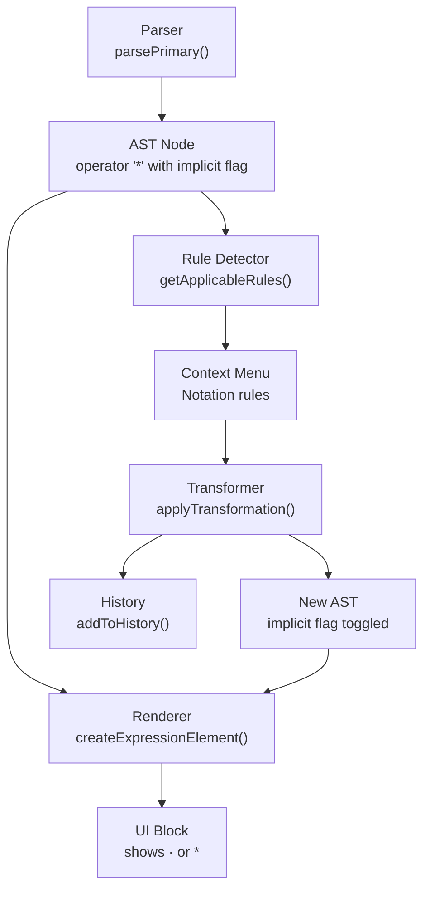
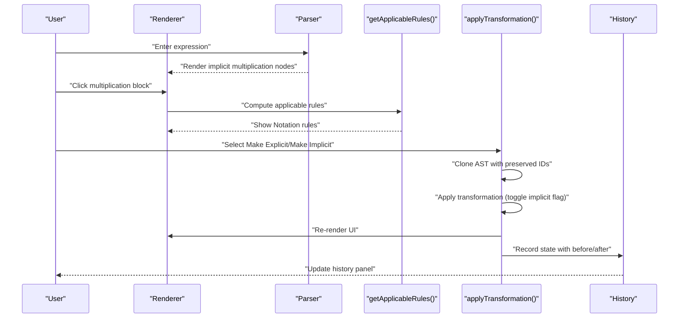
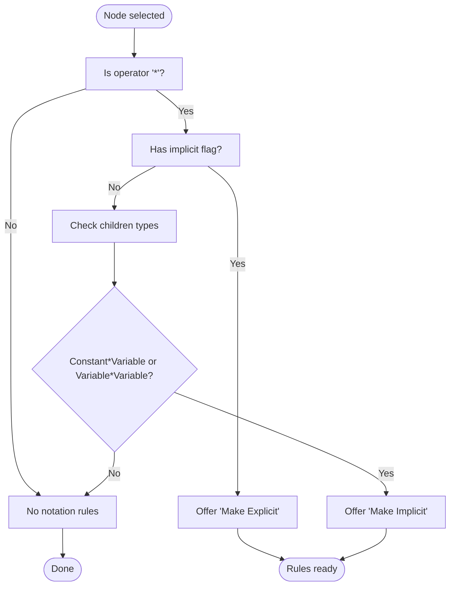
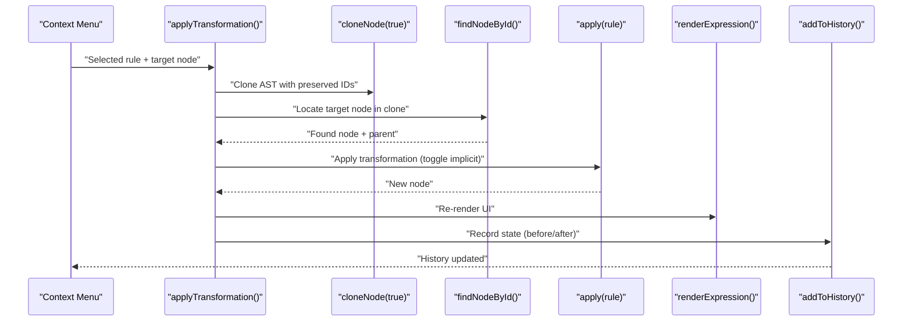
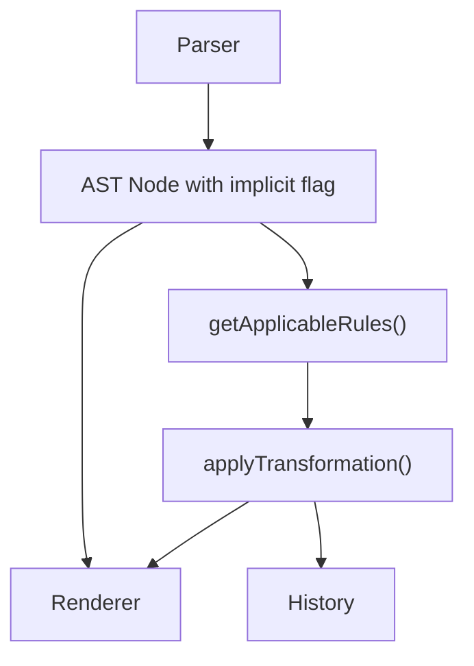

# Notation Rules

<cite>
**Referenced Files in This Document**
- [expression-editor.html](file://expression-editor.html)
- [README-EXPRESSION-EDITOR.md](file://README-EXPRESSION-EDITOR.md)
- [IMPLEMENTATION-SUMMARY.md](file://IMPLEMENTATION-SUMMARY.md)
- [TEST-CASES.md](file://TEST-CASES.md)
</cite>

## Table of Contents
1. [Introduction](#introduction)
2. [Project Structure](#project-structure)
3. [Core Components](#core-components)
4. [Architecture Overview](#architecture-overview)
5. [Detailed Component Analysis](#detailed-component-analysis)
6. [Dependency Analysis](#dependency-analysis)
7. [Performance Considerations](#performance-considerations)
8. [Troubleshooting Guide](#troubleshooting-guide)
9. [Conclusion](#conclusion)
10. [Appendices](#appendices)

## Introduction
This document explains the Notation transformation rules that convert between implicit and explicit multiplication in the expression editor. It covers how the system detects implicit multiplication nodes, how getApplicableRules() surfaces bidirectional notation conversions, and how applyTransformation() modifies the AST and visual representation. It also describes the visual feedback mechanism and how the history system preserves formatting changes. Finally, it addresses common misconceptions about mathematical equivalence versus notation preferences.

## Project Structure
The entire application is implemented in a single HTML file with embedded CSS and JavaScript. The key areas relevant to notation rules are:
- Parser that recognizes implicit multiplication and attaches an implicit flag to multiplication nodes
- Rendering engine that displays the multiplication symbol differently depending on the implicit flag
- Rule detection that offers “Make Implicit” and “Make Explicit” transformations
- Transformation application that toggles the implicit flag and updates the UI and history

**Diagram sources**
- [expression-editor.html](file://expression-editor.html#L590-L625)
- [expression-editor.html](file://expression-editor.html#L669-L736)
- [expression-editor.html](file://expression-editor.html#L887-L1197)
- [expression-editor.html](file://expression-editor.html#L1461-L1497)
- [expression-editor.html](file://expression-editor.html#L1499-L1569)

**Section sources**
- [expression-editor.html](file://expression-editor.html#L590-L625)
- [expression-editor.html](file://expression-editor.html#L669-L736)
- [expression-editor.html](file://expression-editor.html#L887-L1197)
- [expression-editor.html](file://expression-editor.html#L1461-L1497)
- [expression-editor.html](file://expression-editor.html#L1499-L1569)

## Core Components
- Parser implicit multiplication detection: The parser marks multiplication nodes as implicit when it detects patterns like numeric prefix followed by a variable or opening parenthesis, or when two variables are adjacent. See [expression-editor.html](file://expression-editor.html#L590-L625).
- Renderer implicit multiplication display: The renderer shows a middle dot (·) for implicit multiplication and the asterisk (*) for explicit multiplication. See [expression-editor.html](file://expression-editor.html#L669-L736).
- Rule detector: getApplicableRules() adds “Make Explicit” when a multiplication node is implicit, and “Make Implicit” when the multiplication node can safely be made implicit (constant times variable or variable times variable). See [expression-editor.html](file://expression-editor.html#L1111-L1142).
- Transformer: applyTransformation() clones the AST with preserved IDs, applies the chosen rule, replaces the node in the tree, re-renders the UI, and records the change in history. See [expression-editor.html](file://expression-editor.html#L1461-L1497).
- History: addToHistory() stores the state with the rule applied, before/after expressions, and branching support. See [expression-editor.html](file://expression-editor.html#L1499-L1569).

**Section sources**
- [expression-editor.html](file://expression-editor.html#L590-L625)
- [expression-editor.html](file://expression-editor.html#L669-L736)
- [expression-editor.html](file://expression-editor.html#L887-L1197)
- [expression-editor.html](file://expression-editor.html#L1461-L1497)
- [expression-editor.html](file://expression-editor.html#L1499-L1569)

## Architecture Overview
The notation transformation pipeline connects parsing, rendering, rule detection, transformation application, and history recording.

**Diagram sources**
- [expression-editor.html](file://expression-editor.html#L590-L625)
- [expression-editor.html](file://expression-editor.html#L669-L736)
- [expression-editor.html](file://expression-editor.html#L887-L1197)
- [expression-editor.html](file://expression-editor.html#L1461-L1497)
- [expression-editor.html](file://expression-editor.html#L1499-L1569)

## Detailed Component Analysis

### Implicit Multiplication Detection in the Parser
- Pattern recognition:
  - Numeric prefix followed by variable or opening parenthesis produces an implicit multiplication node with the implicit flag set.
  - Adjacent variables produce an implicit multiplication node with the implicit flag set.
- The parser sets the implicit flag on the operator node so downstream logic can distinguish implicit from explicit multiplication.

Key locations:
- Implicit multiplication detection around numeric prefix and variable/parenthesis adjacency: [expression-editor.html](file://expression-editor.html#L590-L625)

**Section sources**
- [expression-editor.html](file://expression-editor.html#L590-L625)

### Visual Representation of Implicit vs Explicit Multiplication
- The renderer checks the implicit flag and displays either a middle dot (·) for implicit multiplication or the asterisk (*) for explicit multiplication.
- This visual cue helps users understand whether multiplication is implicit or explicit.

Key locations:
- Renderer logic for operator blocks and implicit flag: [expression-editor.html](file://expression-editor.html#L669-L736)

**Section sources**
- [expression-editor.html](file://expression-editor.html#L669-L736)

### getApplicableRules(): Detecting Notation Patterns
- The rule detector scans the selected node and adds notation rules based on:
  - If the node is an implicit multiplication, offer “Make Explicit”.
  - If the node is explicit multiplication, offer “Make Implicit” only when the children are compatible (constant times variable or variable times variable).
- The detector logs debug information and categorizes rules under “Notation”.

Key locations:
- Notation rule detection: [expression-editor.html](file://expression-editor.html#L1111-L1142)

**Diagram sources**
- [expression-editor.html](file://expression-editor.html#L1111-L1142)

**Section sources**
- [expression-editor.html](file://expression-editor.html#L1111-L1142)

### applyTransformation(): Modifying AST and Visual Feedback
- Cloning with preserved IDs ensures the target node can be located in the cloned tree.
- The transformer applies the chosen rule (toggle implicit flag), replaces the node in the parent, re-renders the UI, and records the change in history.
- Visual feedback highlights the changed block with a pulsing animation.

Key locations:
- Transformation application and history recording: [expression-editor.html](file://expression-editor.html#L1461-L1497)
- History management: [expression-editor.html](file://expression-editor.html#L1499-L1569)

**Diagram sources**
- [expression-editor.html](file://expression-editor.html#L1461-L1497)
- [expression-editor.html](file://expression-editor.html#L1499-L1569)

**Section sources**
- [expression-editor.html](file://expression-editor.html#L1461-L1497)
- [expression-editor.html](file://expression-editor.html#L1499-L1569)

### Visual Feedback Mechanism
- After applying a transformation, the changed block receives a temporary “changed” class that triggers a pulse animation.
- The animation lasts approximately two seconds and uses a distinct color to draw attention.

Key locations:
- Visual feedback after transformation: [expression-editor.html](file://expression-editor.html#L1461-L1497)

**Section sources**
- [expression-editor.html](file://expression-editor.html#L1461-L1497)

### History System and Formatting Preservation
- Each transformation state is stored with a full clone of the AST, the rule applied, and before/after expressions.
- The history supports branching: when navigating back and applying a different transformation, a new branch is created and both paths remain accessible.
- The history panel shows each step’s expression preview and rule label.

Key locations:
- History recording and branching: [expression-editor.html](file://expression-editor.html#L1499-L1569)

**Section sources**
- [expression-editor.html](file://expression-editor.html#L1499-L1569)

### Examples from the Codebase
- Implicit multiplication detection around numeric prefix and variable/parenthesis adjacency: [expression-editor.html](file://expression-editor.html#L590-L625)
- Implicit multiplication detection between variables: [expression-editor.html](file://expression-editor.html#L609-L618)
- Notation rule definitions for “Make Explicit” and “Make Implicit”: [expression-editor.html](file://expression-editor.html#L1111-L1142)
- Transformation functions that toggle the implicit flag: [expression-editor.html](file://expression-editor.html#L1312-L1322)

**Section sources**
- [expression-editor.html](file://expression-editor.html#L590-L625)
- [expression-editor.html](file://expression-editor.html#L609-L618)
- [expression-editor.html](file://expression-editor.html#L1111-L1142)
- [expression-editor.html](file://expression-editor.html#L1312-L1322)

### Conceptual Overview
- Mathematical equivalence: Changing notation does not alter the mathematical meaning of an expression.
- Notation preference: Users may prefer implicit multiplication (2a) for brevity or explicit multiplication (2 * a) for clarity.
- Bidirectional conversion: The system supports toggling between implicit and explicit multiplication at any eligible node.

[No sources needed since this section doesn't analyze specific files]

## Dependency Analysis
- Parser depends on the lexer-like lookahead to detect implicit multiplication patterns and attach the implicit flag.
- Renderer depends on the implicit flag to decide which symbol to display.
- Rule detector depends on the AST structure and implicit flag to propose transformations.
- Transformer depends on cloneNode() with preserved IDs to locate and replace the target node.
- History depends on expressionToString() to capture textual before/after snapshots.

**Diagram sources**
- [expression-editor.html](file://expression-editor.html#L590-L625)
- [expression-editor.html](file://expression-editor.html#L669-L736)
- [expression-editor.html](file://expression-editor.html#L887-L1197)
- [expression-editor.html](file://expression-editor.html#L1461-L1497)
- [expression-editor.html](file://expression-editor.html#L1499-L1569)

**Section sources**
- [expression-editor.html](file://expression-editor.html#L590-L625)
- [expression-editor.html](file://expression-editor.html#L669-L736)
- [expression-editor.html](file://expression-editor.html#L887-L1197)
- [expression-editor.html](file://expression-editor.html#L1461-L1497)
- [expression-editor.html](file://expression-editor.html#L1499-L1569)

## Performance Considerations
- Deep cloning is used for each transformation to ensure state consistency. While this is straightforward and reliable, it can be memory-intensive for very large expressions or deep histories. The implementation summary notes that the application is designed for moderate-sized expressions and histories.
- Rendering is efficient due to recursive DOM generation and event delegation.

[No sources needed since this section provides general guidance]

## Troubleshooting Guide
- Symptom: “Make Implicit” or “Make Explicit” not appearing.
  - Ensure the multiplication node is eligible: explicit multiplication must have children of types (constant, variable) or (variable, variable). See [expression-editor.html](file://expression-editor.html#L1111-L1142).
- Symptom: Transformation does not update the UI.
  - Confirm that cloneNode() preserves IDs during transformation so the target node can be found. See [expression-editor.html](file://expression-editor.html#L1461-L1497).
- Symptom: Visual feedback not visible.
  - The changed block is highlighted with a class and removed after a delay. Verify the class is applied and the timeout is executed. See [expression-editor.html](file://expression-editor.html#L1461-L1497).
- Symptom: History does not branch.
  - When navigating back and applying a different transformation, a new branch should be created. Verify the branching logic and that the current state index is updated. See [expression-editor.html](file://expression-editor.html#L1499-L1569).

**Section sources**
- [expression-editor.html](file://expression-editor.html#L1111-L1142)
- [expression-editor.html](file://expression-editor.html#L1461-L1497)
- [expression-editor.html](file://expression-editor.html#L1499-L1569)

## Conclusion
The notation transformation system provides a robust, bidirectional way to switch between implicit and explicit multiplication. It leverages the parser’s implicit flag, the renderer’s visual distinction, and a carefully designed rule detection and transformation pipeline. The history system preserves formatting changes and supports branching, enabling users to explore different notations while maintaining a clear record of transformations.

[No sources needed since this section summarizes without analyzing specific files]

## Appendices

### References to Documentation and Specifications
- Supported operations and notation simplifications are documented in the project’s README. See [README-EXPRESSION-EDITOR.md](file://README-EXPRESSION-EDITOR.md#L26-L41).
- Implementation details and data structures, including the implicit flag on operator nodes, are described in the implementation summary. See [IMPLEMENTATION-SUMMARY.md](file://IMPLEMENTATION-SUMMARY.md#L116-L136).
- Test cases demonstrate expected behavior for notation transformations. See [TEST-CASES.md](file://TEST-CASES.md#L74-L93).

**Section sources**
- [README-EXPRESSION-EDITOR.md](file://README-EXPRESSION-EDITOR.md#L26-L41)
- [IMPLEMENTATION-SUMMARY.md](file://IMPLEMENTATION-SUMMARY.md#L116-L136)
- [TEST-CASES.md](file://TEST-CASES.md#L74-L93)