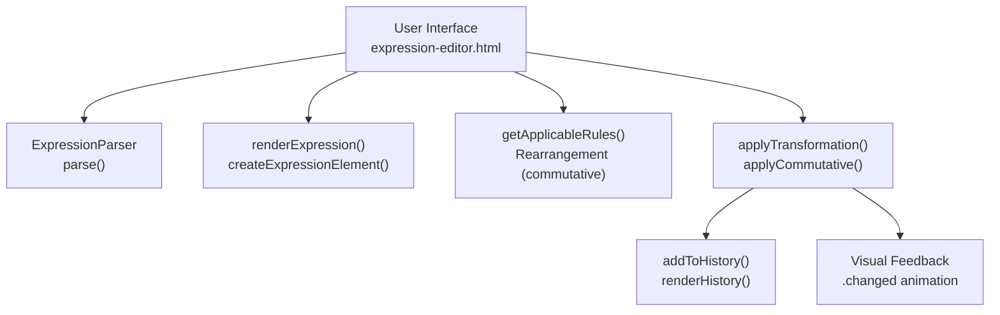
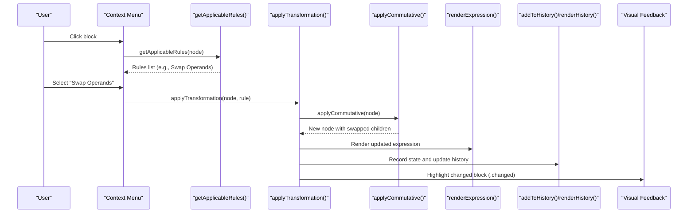
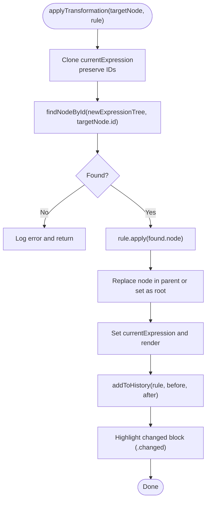
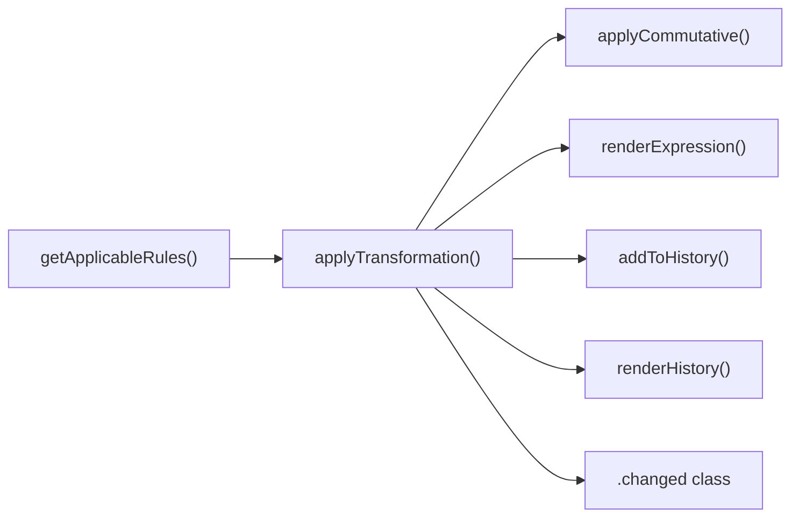

# Rearrangement Rules

<cite>
**Referenced Files in This Document**
- [expression-editor.html](file://expression-editor.html)
- [README-EXPRESSION-EDITOR.md](file://README-EXPRESSION-EDITOR.md)
</cite>

## Table of Contents
1. [Introduction](#introduction)
2. [Project Structure](#project-structure)
3. [Core Components](#core-components)
4. [Architecture Overview](#architecture-overview)
5. [Detailed Component Analysis](#detailed-component-analysis)
6. [Dependency Analysis](#dependency-analysis)
7. [Performance Considerations](#performance-considerations)
8. [Troubleshooting Guide](#troubleshooting-guide)
9. [Conclusion](#conclusion)

## Introduction
This document explains the Rearrangement transformation rules that enable swapping operands in commutative operations. It focuses on how the system identifies eligible nodes for addition and multiplication, how the bidirectional swap is implemented, and how the UI provides immediate visual feedback and maintains a branching history of transformations. It also answers why subtraction and division do not support direct rearrangement and references the relevant sections in the expression editor where these rules are defined and applied.

## Project Structure
The entire application is implemented in a single HTML file with embedded CSS and JavaScript. The Rearrangement rules are part of the transformation pipeline invoked from the context menu when a user clicks on an expression block.

**Diagram sources**
- [expression-editor.html](file://expression-editor.html#L484-L1749)

**Section sources**
- [expression-editor.html](file://expression-editor.html#L484-L1749)

## Core Components
- getApplicableRules(): Detects eligible nodes for transformation and returns a prioritized list of rules. The Rearrangement category includes Swap Operands for addition and multiplication.
- applyTransformation(): Applies a selected rule to the clicked node, replaces it in the tree, re-renders the expression, records history, and triggers visual feedback.
- applyCommutative(): Implements the bidirectional swap by reversing the order of children for commutative operators.
- addToHistory()/renderHistory(): Maintains a branching timeline of states and highlights the current state.
- Visual feedback: The changed block is temporarily highlighted with a pulse animation.

**Section sources**
- [expression-editor.html](file://expression-editor.html#L886-L1150)
- [expression-editor.html](file://expression-editor.html#L1461-L1522)
- [expression-editor.html](file://expression-editor.html#L1302-L1310)
- [expression-editor.html](file://expression-editor.html#L1500-L1568)
- [expression-editor.html](file://expression-editor.html#L226-L235)

## Architecture Overview
The Rearrangement rules are integrated into the context menu flow. When a user clicks a block, the system computes applicable rules, displays them in the context menu, and applies the chosen rule via applyTransformation(). The applyCommutative function performs the actual swap of children.

**Diagram sources**
- [expression-editor.html](file://expression-editor.html#L738-L806)
- [expression-editor.html](file://expression-editor.html#L886-L1150)
- [expression-editor.html](file://expression-editor.html#L1461-L1522)
- [expression-editor.html](file://expression-editor.html#L1302-L1310)
- [expression-editor.html](file://expression-editor.html#L1500-L1568)
- [expression-editor.html](file://expression-editor.html#L226-L235)

## Detailed Component Analysis

### getApplicableRules() and Rearrangement Detection
- Purpose: Determine which transformation rules are applicable to a given node, including commutative rearrangements.
- Detection logic:
  - Addition (+): Eligible if the node is an operator with value '+'.
  - Multiplication (*): Eligible if the node is an operator with value '*'.
- Availability: Both rules are placed in the Rearrangement category and presented as "Swap Operands".
- Bidirectionality: The same rule function is used for both directions because swapping a+b to b+a and back is identical at the structural level.

Implementation references:
- Commutative addition rule registration: [expression-editor.html](file://expression-editor.html#L1099-L1109)
- Commutative multiplication rule registration: [expression-editor.html](file://expression-editor.html#L1087-L1097)
- getApplicableRules() function definition: [expression-editor.html](file://expression-editor.html#L886-L1150)

**Section sources**
- [expression-editor.html](file://expression-editor.html#L886-L1150)
- [expression-editor.html](file://expression-editor.html#L1087-L1109)

### applyTransformation() and applyCommutative()
- applyTransformation():
  - Clones the current expression tree to preserve IDs for locating the target node.
  - Invokes the rule’s apply function on the located node.
  - Replaces the node in the parent or sets as new root.
  - Updates the current expression, re-renders the view, and records history.
  - Triggers visual feedback by adding a temporary class to the changed block.
- applyCommutative():
  - Returns a new operator node with the same type/value and flags, but with children reversed.

Implementation references:
- applyTransformation(): [expression-editor.html](file://expression-editor.html#L1461-L1497)
- applyCommutative(): [expression-editor.html](file://expression-editor.html#L1302-L1310)

**Diagram sources**
- [expression-editor.html](file://expression-editor.html#L1461-L1497)
- [expression-editor.html](file://expression-editor.html#L1302-L1310)

**Section sources**
- [expression-editor.html](file://expression-editor.html#L1461-L1497)
- [expression-editor.html](file://expression-editor.html#L1302-L1310)

### Visual Feedback Mechanism
- When a transformation completes, the system adds a class to the DOM element representing the transformed node to trigger a pulse animation.
- The class is removed after a timeout to revert the visual state.

Implementation references:
- Visual feedback trigger: [expression-editor.html](file://expression-editor.html#L1489-L1496)
- CSS animation class: [expression-editor.html](file://expression-editor.html#L226-L235)

**Section sources**
- [expression-editor.html](file://expression-editor.html#L1489-L1496)
- [expression-editor.html](file://expression-editor.html#L226-L235)

### History System and Branching
- addToHistory() records each transformation with before/after expressions, rule metadata, and timestamp. If the current index is not at the end, a new branch is created by setting parentId to the current state.
- renderHistory() displays the timeline, marks the current state, and allows navigating to previous states.

Implementation references:
- addToHistory(): [expression-editor.html](file://expression-editor.html#L1500-L1519)
- renderHistory(): [expression-editor.html](file://expression-editor.html#L1524-L1568)

**Section sources**
- [expression-editor.html](file://expression-editor.html#L1500-L1519)
- [expression-editor.html](file://expression-editor.html#L1524-L1568)

### Why Subtraction and Division Do Not Support Direct Rearrangement
- Mathematical basis:
  - Addition and multiplication are commutative: a + b = b + a and a × b = b × a.
  - Subtraction and division are not commutative: a − b ≠ b − a and a ÷ b ≠ b ÷ a.
- System behavior:
  - The Rearrangement rules in getApplicableRules() only register for '+' and '*' operators.
  - There is no equivalent commutative rule for '-' or '/' operators.
- Practical implication:
  - Attempting to reorder operands in subtraction or division would change the mathematical meaning and thus is intentionally not offered as a direct rearrangement rule.

Evidence in code:
- Commutative addition rule: [expression-editor.html](file://expression-editor.html#L1099-L1109)
- Commutative multiplication rule: [expression-editor.html](file://expression-editor.html#L1087-L1097)
- No commutative rule for '-' or '/': [expression-editor.html](file://expression-editor.html#L886-L1150)

**Section sources**
- [expression-editor.html](file://expression-editor.html#L1087-L1109)
- [expression-editor.html](file://expression-editor.html#L886-L1150)

### Context-Aware Availability and Examples
- Availability depends on the node type and value:
  - Addition: '+' operator eligible for rearrangement.
  - Multiplication: '*' operator eligible for rearrangement.
- Examples from the codebase:
  - Commutative addition rule: [expression-editor.html](file://expression-editor.html#L1099-L1109)
  - Commutative multiplication rule: [expression-editor.html](file://expression-editor.html#L1087-L1097)
  - Context menu integration: [expression-editor.html](file://expression-editor.html#L738-L806)

**Section sources**
- [expression-editor.html](file://expression-editor.html#L738-L806)
- [expression-editor.html](file://expression-editor.html#L1087-L1109)

## Dependency Analysis
- getApplicableRules() depends on node type/value and children structure to decide eligibility.
- applyTransformation() depends on:
  - cloneNode/findNodeById to locate and replace the target node.
  - rule.apply to compute the transformed subtree.
  - renderExpression() to update the UI.
  - addToHistory() to record the state.
- applyCommutative() depends on cloning children to produce a structurally equivalent but reordered node.

**Diagram sources**
- [expression-editor.html](file://expression-editor.html#L886-L1150)
- [expression-editor.html](file://expression-editor.html#L1461-L1522)
- [expression-editor.html](file://expression-editor.html#L1302-L1310)
- [expression-editor.html](file://expression-editor.html#L1500-L1568)
- [expression-editor.html](file://expression-editor.html#L226-L235)

**Section sources**
- [expression-editor.html](file://expression-editor.html#L886-L1150)
- [expression-editor.html](file://expression-editor.html#L1461-L1522)
- [expression-editor.html](file://expression-editor.html#L1302-L1310)
- [expression-editor.html](file://expression-editor.html#L1500-L1568)
- [expression-editor.html](file://expression-editor.html#L226-L235)

## Performance Considerations
- Tree cloning: The system clones the entire expression tree for each transformation to ensure state isolation. This guarantees correctness but can be expensive for very large trees.
- Rendering: Re-rendering occurs after each transformation, which is efficient for typical educational expressions but should be considered for very deep or wide trees.
- History depth: The implementation notes indicate a practical limit to prevent memory issues; ensure transformations are reasonable in scale.

[No sources needed since this section provides general guidance]

## Troubleshooting Guide
- Rule does not appear in context menu:
  - Verify the node is an addition or multiplication operator with two children.
  - Confirm getApplicableRules() is invoked for the clicked node.
  - References: [expression-editor.html](file://expression-editor.html#L738-L806), [expression-editor.html](file://expression-editor.html#L886-L1150)
- Transformation does not take effect:
  - Check that applyTransformation() locates the node by ID and replaces it in the parent.
  - Ensure renderExpression() is called afterward.
  - References: [expression-editor.html](file://expression-editor.html#L1461-L1497)
- Visual feedback not visible:
  - Confirm the changed block element exists and the .changed class is toggled.
  - References: [expression-editor.html](file://expression-editor.html#L1489-L1496), [expression-editor.html](file://expression-editor.html#L226-L235)
- History not recorded:
  - Verify addToHistory() is called with rule, before, and after expressions.
  - References: [expression-editor.html](file://expression-editor.html#L1500-L1519)

**Section sources**
- [expression-editor.html](file://expression-editor.html#L738-L806)
- [expression-editor.html](file://expression-editor.html#L886-L1150)
- [expression-editor.html](file://expression-editor.html#L1461-L1497)
- [expression-editor.html](file://expression-editor.html#L1489-L1496)
- [expression-editor.html](file://expression-editor.html#L1500-L1519)
- [expression-editor.html](file://expression-editor.html#L226-L235)

## Conclusion
The Rearrangement rules leverage the commutative property to offer bidirectional operand swapping for addition and multiplication. The system detects eligible nodes, applies the transformation safely by cloning and replacing nodes, provides immediate visual feedback, and preserves a branching history of states. Subtraction and division are intentionally excluded from direct rearrangement because they are not commutative, ensuring mathematical equivalence is preserved.

[No sources needed since this section summarizes without analyzing specific files]