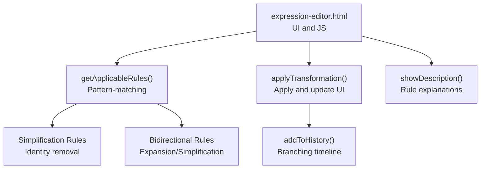
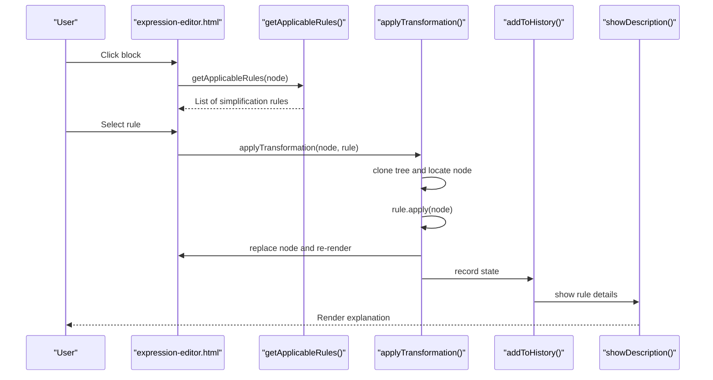
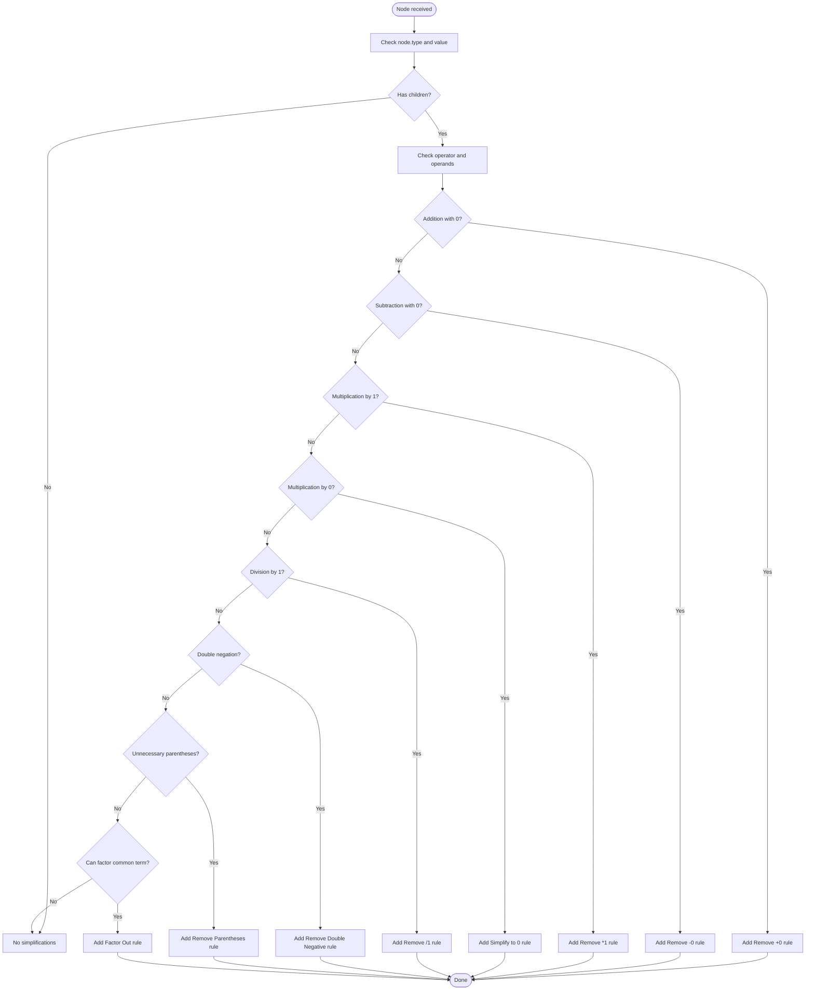
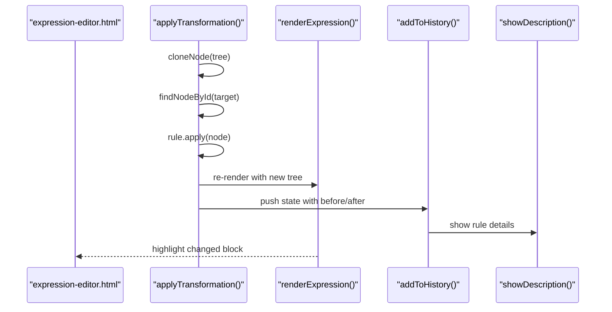
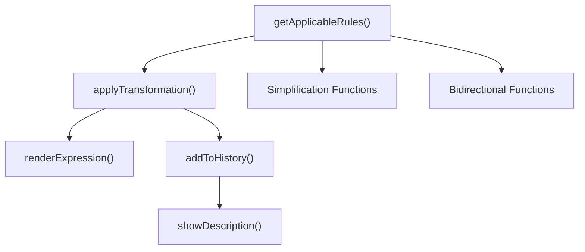

# Simplification Rules

<cite>
**Referenced Files in This Document**
- [expression-editor.html](file://expression-editor.html)
- [README-EXPRESSION-EDITOR.md](file://README-EXPRESSION-EDITOR.md)
- [BUG-FIX-LOG.md](file://BUG-FIX-LOG.md)
</cite>

## Table of Contents
1. [Introduction](#introduction)
2. [Project Structure](#project-structure)
3. [Core Components](#core-components)
4. [Architecture Overview](#architecture-overview)
5. [Detailed Component Analysis](#detailed-component-analysis)
6. [Dependency Analysis](#dependency-analysis)
7. [Performance Considerations](#performance-considerations)
8. [Troubleshooting Guide](#troubleshooting-guide)
9. [Conclusion](#conclusion)
10. [Appendices](#appendices)

## Introduction
This document explains the Simplification transformation rules that remove identities and redundant operations in the expression editor. It covers how the pattern-matching approach in getApplicableRules() detects simplifiable nodes based on operator type and operand values, how bidirectional transformations preserve semantics while enabling both simplification and expansion, and how visual feedback loops confirm changes. It also answers common user questions about why certain simplifications do not appear on specific nodes.

## Project Structure
The simplification logic is implemented in a single HTML file with embedded JavaScript. The key areas are:
- Rule detection and generation in getApplicableRules()
- Transformation functions for simplification and bidirectional operations
- UI integration for context menu, visual feedback, and history

**Diagram sources**
- [expression-editor.html](file://expression-editor.html#L886-L1085)
- [expression-editor.html](file://expression-editor.html#L1462-L1522)
- [expression-editor.html](file://expression-editor.html#L1571-L1679)

**Section sources**
- [expression-editor.html](file://expression-editor.html#L886-L1085)
- [expression-editor.html](file://expression-editor.html#L1462-L1522)
- [expression-editor.html](file://expression-editor.html#L1571-L1679)

## Core Components
- Pattern-matching engine: getApplicableRules() inspects node type, operator value, and children to decide which simplification rules apply.
- Simplification transformations: Functions remove identities (e.g., adding zero, multiplying by one, dividing by one), eliminate redundancy (e.g., double negation, unnecessary parentheses), and evaluate constant arithmetic when possible.
- Bidirectional transformations: Expansion (distributive) and factor-out enable moving between expanded and factored forms, preserving semantics.
- Visual feedback: The changed block pulses, and the history panel records each transformation with before/after expressions.

**Section sources**
- [expression-editor.html](file://expression-editor.html#L886-L1085)
- [expression-editor.html](file://expression-editor.html#L1390-L1589)
- [expression-editor.html](file://expression-editor.html#L1462-L1522)
- [README-EXPRESSION-EDITOR.md](file://README-EXPRESSION-EDITOR.md#L26-L41)

## Architecture Overview
The simplification pipeline:
1. User clicks a block to open the context menu.
2. getApplicableRules() evaluates the node and returns applicable simplification rules.
3. User selects a rule; applyTransformation() clones the tree, locates the target node, applies the transformation, replaces the node, re-renders the UI, and logs to history.
4. showDescription() displays the rule’s reasoning and mathematical basis.

**Diagram sources**
- [expression-editor.html](file://expression-editor.html#L739-L809)
- [expression-editor.html](file://expression-editor.html#L886-L1085)
- [expression-editor.html](file://expression-editor.html#L1462-L1522)
- [expression-editor.html](file://expression-editor.html#L1571-L1679)

## Detailed Component Analysis

### Pattern-Matching Approach in getApplicableRules()
The function systematically checks node characteristics and children to match simplification patterns:
- Operator type and value: Ensures the node is an operator (+, −, *, /) and inspects the operator symbol.
- Children presence and types: Validates that children exist and are constants or other operators as required.
- Operand values: Checks for identity values (0, 1) and special unary patterns (double negation).
- Nested expressions: Supports complex operands (sub-expressions) rather than only simple variables/constants.

Key simplification detections:
- Remove addition of zero: Detects a + 0 or 0 + a and removes the zero.
- Remove subtraction of zero: Detects a − 0 and removes the zero.
- Remove multiplication by one: Detects a * 1 or 1 * a and removes the one.
- Simplify multiplication by zero: Detects a * 0 and replaces with 0.
- Remove division by one: Detects a / 1 and removes the one.
- Remove double negation: Detects −(−a) and replaces with a.
- Remove unnecessary parentheses: Detects (a) where a is not an operator and removes parentheses.
- Factor out common term: Detects a*b + a*c and offers ← Factor Out.

**Diagram sources**
- [expression-editor.html](file://expression-editor.html#L886-L1085)

**Section sources**
- [expression-editor.html](file://expression-editor.html#L886-L1085)

### Simplification Transformations
The simplification functions operate on cloned subtrees and return a new node that replaces the original:
- removeMultiplicationByOne(): Removes the 1 from a * 1 or 1 * a.
- simplifyMultiplicationByZero(): Replaces a * 0 with 0.
- removeDivisionByOne(): Removes the 1 from a / 1.
- removeAdditionOfZero(): Removes 0 from a + 0 or 0 + a.
- removeSubtractionOfZero(): Removes 0 from a − 0.
- removeDoubleNegation(): Removes −(−a) to yield a.
- removeParentheses(): Removes parentheses around non-operator expressions (a) → a.
- applyDistributiveReverse(): Factors out a common term from a*b + a*c to a*(b + c).

These functions preserve semantics by replacing only the matched substructure with an equivalent simpler form.

**Section sources**
- [expression-editor.html](file://expression-editor.html#L1390-L1589)

### Bidirectional Transformations
The system supports bidirectional transformations:
- Forward expansion: a*(b + c) → a*b + a*c and (a + b)*c → a*c + b*c.
- Reverse factor-out: a*b + a*c → a*(b + c).
- Wrapping transformations (reverse operations) for completeness:
  - addParentheses(): Adds parentheses around an expression.
  - addDoubleNegation(): Wraps an expression with −(−a).
  - multiplyByOne(): Inserts 1 as a multiplier.
  - divideByOne(): Inserts 1 as denominator.
  - addZero(): Inserts 0 as an addend.

These bidirectional rules ensure that simplification and expansion are reversible, maintaining equivalence while allowing users to explore different forms.

**Section sources**
- [expression-editor.html](file://expression-editor.html#L1328-L1391)
- [expression-editor.html](file://expression-editor.html#L1056-L1083)
- [expression-editor.html](file://expression-editor.html#L1571-L1679)

### Visual Feedback Loop
When a transformation is applied:
- The changed block receives a temporary highlight class to visually indicate the change.
- The expression viewer is re-rendered with the updated tree.
- The history panel appends a new state with before/after expressions and rule metadata.
- The description panel shows the rule’s reasoning and mathematical basis.

**Diagram sources**
- [expression-editor.html](file://expression-editor.html#L1462-L1522)
- [expression-editor.html](file://expression-editor.html#L1571-L1679)

**Section sources**
- [expression-editor.html](file://expression-editor.html#L1462-L1522)
- [expression-editor.html](file://expression-editor.html#L1571-L1679)

### Why Certain Simplifications Do Not Appear on Specific Nodes
Common reasons include:
- Missing children: The rule checks for node.children before accessing children[0] or children[1]. If absent, the rule is not offered.
- Wrong operator type/value: Only operators with specific values (e.g., +, −, *, /) trigger certain rules.
- Operand types: Rules require constant operands with specific values (e.g., 0 or 1) or specific unary patterns (double negation).
- Parentheses safety: Unnecessary parentheses are removed only when the child is not an operator.
- Factor-out conditions: applyDistributiveReverse() requires a shared factor among terms.

The bug-fix log confirms that prior issues were caused by missing null checks and incomplete distributive support, which have since been addressed.

**Section sources**
- [expression-editor.html](file://expression-editor.html#L886-L1085)
- [BUG-FIX-LOG.md](file://BUG-FIX-LOG.md#L137-L252)

## Dependency Analysis
Simplification relies on:
- getApplicableRules() to detect applicable rules based on node shape and values.
- applyTransformation() to safely clone and mutate the tree, then re-render and log history.
- Rendering and history utilities to present changes and explanations.

**Diagram sources**
- [expression-editor.html](file://expression-editor.html#L886-L1085)
- [expression-editor.html](file://expression-editor.html#L1462-L1522)
- [expression-editor.html](file://expression-editor.html#L1571-L1679)

**Section sources**
- [expression-editor.html](file://expression-editor.html#L886-L1085)
- [expression-editor.html](file://expression-editor.html#L1462-L1522)
- [expression-editor.html](file://expression-editor.html#L1571-L1679)

## Performance Considerations
- Tree cloning: Each transformation clones the tree to preserve previous states, enabling branching history. This ensures correctness but increases memory usage proportional to the number of states.
- Rendering: Re-rendering occurs only after applying a transformation, minimizing unnecessary redraws.
- History limits: The implementation notes a practical limit on states to prevent excessive memory consumption.

**Section sources**
- [README-EXPRESSION-EDITOR.md](file://README-EXPRESSION-EDITOR.md#L224-L230)

## Troubleshooting Guide
- Rule does not appear:
  - Verify the node has children and the operator/value matches the rule’s condition.
  - Confirm the operand types/values are correct (e.g., constant 0 or 1).
  - For parentheses removal, ensure the child is not an operator.
  - For factor-out, ensure a common factor exists among terms.
- Double negation not offered:
  - Ensure the node is unary and its child is also unary.
- Expansion not offered:
  - Check both sides for addition/subtraction when multiplying by an expression.

The bug-fix log documents how missing null checks and incomplete distributive support were corrected, improving reliability.

**Section sources**
- [expression-editor.html](file://expression-editor.html#L886-L1085)
- [BUG-FIX-LOG.md](file://BUG-FIX-LOG.md#L137-L252)

## Conclusion
The simplification system uses a robust pattern-matching approach to detect identities and redundancies, offering precise rules that preserve semantics. Bidirectional transformations enable users to move seamlessly between expanded and simplified forms, while visual feedback and history provide clarity and traceability. The implementation’s careful handling of node shapes, operand types, and values ensures reliable rule detection and application.

## Appendices

### Simplification Rules Overview
- Identity removal:
  - a + 0 → a
  - 0 + a → a
  - a − 0 → a
  - a * 1 → a
  - 1 * a → a
  - a / 1 → a
  - −(−a) → a
  - (a) → a (when a is not an operator)
- Constant arithmetic:
  - Evaluate constant additions, subtractions, multiplications, and divisions when both operands are constants.
- Factor-out:
  - a*b + a*c → a*(b + c)

**Section sources**
- [README-EXPRESSION-EDITOR.md](file://README-EXPRESSION-EDITOR.md#L26-L41)
- [expression-editor.html](file://expression-editor.html#L886-L1085)
- [expression-editor.html](file://expression-editor.html#L1390-L1589)