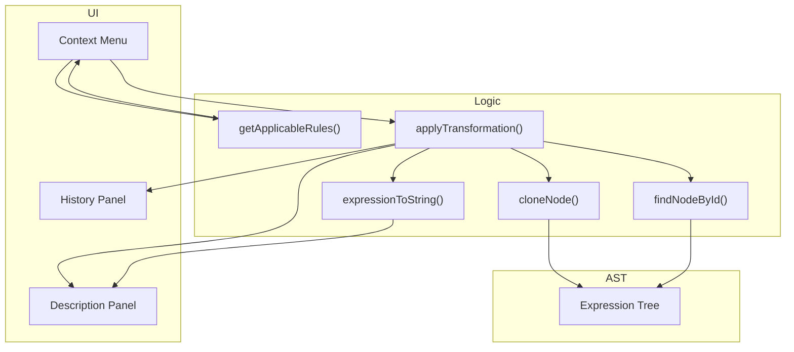
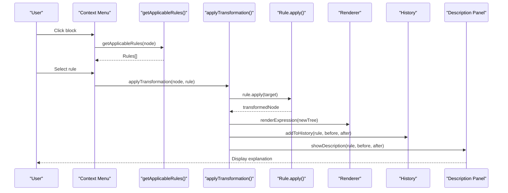
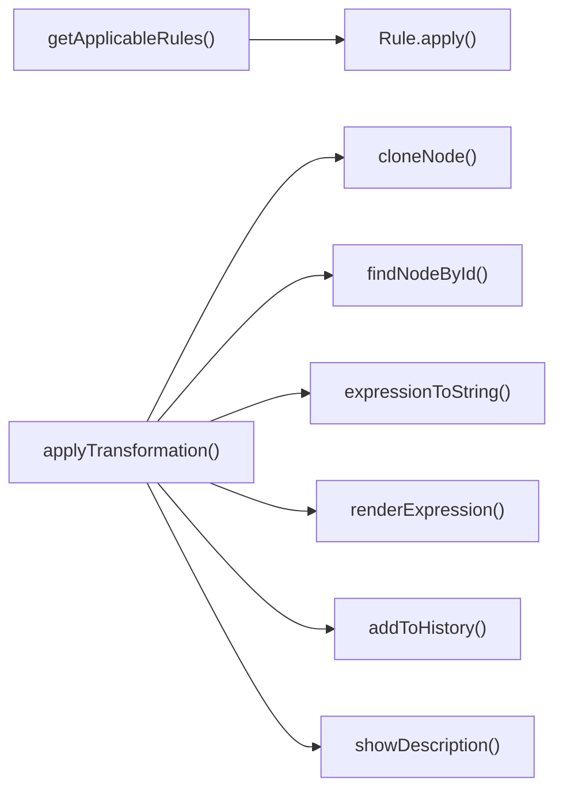

# Transformation Rules

<cite>
**Referenced Files in This Document**
- [expression-editor.html](file://expression-editor.html)
- [README-EXPRESSION-EDITOR.md](file://README-EXPRESSION-EDITOR.md)
- [IMPLEMENTATION-SUMMARY.md](file://IMPLEMENTATION-SUMMARY.md)
- [TEST-CASES.md](file://TEST-CASES.md)
</cite>

## Table of Contents
1. [Introduction](#introduction)
2. [Project Structure](#project-structure)
3. [Core Components](#core-components)
4. [Architecture Overview](#architecture-overview)
5. [Detailed Component Analysis](#detailed-component-analysis)
6. [Dependency Analysis](#dependency-analysis)
7. [Performance Considerations](#performance-considerations)
8. [Troubleshooting Guide](#troubleshooting-guide)
9. [Conclusion](#conclusion)

## Introduction
This section documents the transformation rule system that powers the Expression Editor. Rules are implemented as pure functions that take an AST node and return a new transformed node, preserving immutability. The system categorizes rules into Wrapping, Computation, Simplification, Expansion, Rearrangement, and Notation. Rules are context-aware: they appear only when applicable to the selected node. The context menu displays categorized rules with previews and direction indicators. After applying a rule, the system records a history state, updates the visual tree, and provides a description panel with mathematical basis and before/after expressions. Some transformations are bidirectional, enabling both expansion and factoring, or making multiplication explicit and implicit.

## Project Structure
The transformation rule system is implemented in a single HTML file with embedded CSS and JavaScript. The relevant parts include:
- Parser and renderer for expression trees
- Context menu and rule selection
- Rule applicability detection and transformation application
- History management and description panel

**Diagram sources**
- [expression-editor.html](file://expression-editor.html#L886-L1169)
- [expression-editor.html](file://expression-editor.html#L1433-L1469)
- [expression-editor.html](file://expression-editor.html#L848-L864)
- [expression-editor.html](file://expression-editor.html#L866-L884)
- [expression-editor.html](file://expression-editor.html#L825-L846)

**Section sources**
- [expression-editor.html](file://expression-editor.html#L886-L1169)
- [expression-editor.html](file://expression-editor.html#L1433-L1469)
- [expression-editor.html](file://expression-editor.html#L825-L846)
- [expression-editor.html](file://expression-editor.html#L848-L864)
- [expression-editor.html](file://expression-editor.html#L866-L884)

## Core Components
- getApplicableRules(node): Enumerates applicable rules for a given node, grouped by category, and returns an array of rule descriptors with name, category, preview, and apply function.
- applyTransformation(targetNode, rule): Applies a rule to the selected node, preserves immutability by cloning the tree, replaces the node in the cloned tree, updates the current expression, renders the new tree, adds a history entry, and highlights the changed block.
- Rule functions: Each rule is implemented as a pure function that returns a new AST node. Examples include addParentheses, applyDistributiveForward, applyCommutative, makeMultiplicationImplicit/makeMultiplicationExplicit, removeDoubleNegation, removeParentheses, and evaluation helpers.

Key behaviors:
- Immutability: Trees are deep-cloned before mutation. For targeted replacement, cloneNode supports preserving IDs to locate the target node in the cloned tree.
- Context awareness: getApplicableRules checks node type, value, and children to decide which rules are valid.
- Bidirectionality: Many rules appear with direction indicators (→, ←, ↔) and often have reverse counterparts (e.g., distributive expansion and factoring).

**Section sources**
- [expression-editor.html](file://expression-editor.html#L886-L1169)
- [expression-editor.html](file://expression-editor.html#L1433-L1469)
- [IMPLEMENTATION-SUMMARY.md](file://IMPLEMENTATION-SUMMARY.md#L56-L113)

## Architecture Overview
The transformation pipeline:
1. User clicks a block to open the context menu.
2. getApplicableRules(node) computes applicable rules and displays them in categories.
3. User selects a rule; applyTransformation(targetNode, rule) executes:
   - Clone the current tree with preserved IDs to locate the target node.
   - Call rule.apply(found.node) to produce a new subtree.
   - Replace the target node in the cloned tree.
   - Update currentExpression, re-render, record history, and show description.

**Diagram sources**
- [expression-editor.html](file://expression-editor.html#L738-L800)
- [expression-editor.html](file://expression-editor.html#L886-L1169)
- [expression-editor.html](file://expression-editor.html#L1433-L1469)
- [expression-editor.html](file://expression-editor.html#L1471-L1494)
- [expression-editor.html](file://expression-editor.html#L1542-L1651)

## Detailed Component Analysis

### Rule Categories and Behavior

#### Wrapping
- Purpose: Add structure-preserving wrappers to an expression.
- Examples:
  - Add Parentheses: wraps a subtree in parentheses.
  - Add Double Negative: inserts a unary minus around another unary minus.
  - Multiply by One: inserts 1 as a multiplier.
  - Divide by One: inserts 1 as denominator.
  - Add Zero: inserts 0 as an addend.
- Mathematical basis:
  - Identity transformations: a = (a), a = --a, a = 1×a, a = a/1, a = a+0.
- Before/After examples:
  - a → (a)
  - a → --a
  - a → 1×a
  - a → a/1
  - a → a+0
- Context awareness:
  - Parentheses and double negation are generally available unless the node is already a group or unary.
  - Multiply by one, divide by one, and add zero are always available.

**Section sources**
- [expression-editor.html](file://expression-editor.html#L902-L941)
- [expression-editor.html](file://expression-editor.html#L1306-L1363)
- [IMPLEMENTATION-SUMMARY.md](file://IMPLEMENTATION-SUMMARY.md#L56-L82)

#### Computation
- Purpose: Evaluate arithmetic when both operands are constants.
- Examples:
  - Addition: a + b → numeric result.
  - Subtraction: a - b → numeric result.
  - Multiplication: a × b → numeric result.
  - Division: a ÷ b → numeric result.
- Mathematical basis:
  - Arithmetic evaluation of constants.
- Before/After examples:
  - 2 + 3 → 5
  - 7 - 4 → 3
  - 6 × 8 → 48
  - 15 ÷ 3 → 5
- Context awareness:
  - Only appears when both children are constants.

**Section sources**
- [expression-editor.html](file://expression-editor.html#L978-L987)
- [expression-editor.html](file://expression-editor.html#L1055-L1076)
- [expression-editor.html](file://expression-editor.html#L1079-L1112)
- [expression-editor.html](file://expression-editor.html#L1401-L1431)
- [IMPLEMENTATION-SUMMARY.md](file://IMPLEMENTATION-SUMMARY.md#L56-L82)

#### Simplification
- Purpose: Remove redundant structure or constants.
- Examples:
  - Remove Multiplication by One: a×1 → a or 1×a → a.
  - Simplify Multiplication by Zero: a×0 → 0.
  - Remove Division by One: a/1 → a.
  - Remove Addition of Zero: a+0 → a or 0+a → a.
  - Remove Subtraction of Zero: a-0 → a.
  - Remove Double Negation: --a → a.
  - Remove Parentheses: (a) → a (safe removal).
- Mathematical basis:
  - Identity and absorption laws.
- Before/After examples:
  - a×1 → a
  - a×0 → 0
  - a/1 → a
  - a+0 → a
  - a-0 → a
  - --a → a
  - (a) → a
- Context awareness:
  - Depends on child values (constants equal to 0 or 1) or node type (unary, group).

**Section sources**
- [expression-editor.html](file://expression-editor.html#L953-L977)
- [expression-editor.html](file://expression-editor.html#L1055-L1076)
- [expression-editor.html](file://expression-editor.html#L1079-L1112)
- [expression-editor.html](file://expression-editor.html#L1139-L1165)
- [expression-editor.html](file://expression-editor.html#L1367-L1397)
- [expression-editor.html](file://expression-editor.html#L1296-L1302)
- [IMPLEMENTATION-SUMMARY.md](file://IMPLEMENTATION-SUMMARY.md#L56-L82)

#### Expansion
- Purpose: Apply the distributive property to expand products over sums.
- Examples:
  - a×(b+c) → a×b + a×c
  - (a+b)×c → a×c + b×c
- Mathematical basis:
  - a(b+c) = ab + ac and (a+b)c = ac + bc.
- Before/After examples:
  - a×(b+c) → a×b + a×c
  - (a+b)×c → a×c + b×c
- Context awareness:
  - Only appears when the relevant child is an addition or subtraction operator.

**Section sources**
- [expression-editor.html](file://expression-editor.html#L989-L1013)
- [expression-editor.html](file://expression-editor.html#L1193-L1249)
- [expression-editor.html](file://expression-editor.html#L1251-L1272)
- [IMPLEMENTATION-SUMMARY.md](file://IMPLEMENTATION-SUMMARY.md#L56-L82)

#### Rearrangement
- Purpose: Reorder operands using commutative properties.
- Examples:
  - Swap Operands (Addition): a+b → b+a
  - Swap Operands (Multiplication): a×b → b×a
- Mathematical basis:
  - a+b = b+a and a×b = b×a.
- Before/After examples:
  - a+b → b+a
  - a×b → b×a
- Context awareness:
  - Addition swap is available for addition nodes.
  - Multiplication swap is available for multiplication nodes.

**Section sources**
- [expression-editor.html](file://expression-editor.html#L1114-L1124)
- [expression-editor.html](file://expression-editor.html#L1044-L1053)
- [expression-editor.html](file://expression-editor.html#L1274-L1282)
- [IMPLEMENTATION-SUMMARY.md](file://IMPLEMENTATION-SUMMARY.md#L56-L82)

#### Notation
- Purpose: Switch between implicit and explicit multiplication.
- Examples:
  - Make Implicit: a×b → ab
  - Make Explicit: ab → a×b
- Mathematical basis:
  - a×b = ab in standard notation.
- Before/After examples:
  - a×b → ab
  - ab → a×b
- Context awareness:
  - Make Implicit appears when the node is explicit multiplication and the operands are suitable (e.g., constant×variable or variable×variable).
  - Make Explicit appears when the node is implicit multiplication.

**Section sources**
- [expression-editor.html](file://expression-editor.html#L1015-L1042)
- [expression-editor.html](file://expression-editor.html#L1284-L1294)
- [IMPLEMENTATION-SUMMARY.md](file://IMPLEMENTATION-SUMMARY.md#L56-L82)

### Rule Selection and Context Menu
- The context menu is positioned near the clicked block and lists only applicable rules, grouped by category with separators.
- Each menu item shows:
  - Title: rule name
  - Preview: a short before/after example
  - Category: helps users understand the transformation type
- Clicking a rule triggers applyTransformation, which updates the tree and history.

**Section sources**
- [expression-editor.html](file://expression-editor.html#L738-L800)
- [expression-editor.html](file://expression-editor.html#L886-L1169)

### Bidirectionality and Rule Descriptions
- Many rules are bidirectional and appear with direction indicators:
  - → Expand (Distributive) and ← Factor Out
  - ← Make Implicit and → Make Explicit
  - ← Add Parentheses and → Remove Parentheses (conceptually)
- The description panel shows:
  - Rule name
  - Reasoning (why the rule applies)
  - Before and After expressions
  - Mathematical basis formula
- The history panel shows each transformation with a timestamp and rule label, enabling branching exploration.

**Section sources**
- [README-EXPRESSION-EDITOR.md](file://README-EXPRESSION-EDITOR.md#L26-L41)
- [expression-editor.html](file://expression-editor.html#L1542-L1651)
- [expression-editor.html](file://expression-editor.html#L1471-L1494)

### Immutable Transformations and Node Replacement
- Immutability is preserved by deep-cloning the expression tree before mutation.
- For targeted replacement, cloneNode supports preserving IDs so the target node can be located in the cloned tree.
- After applying a rule, the system replaces the target node in the cloned tree, assigns the new tree to currentExpression, re-renders, and highlights the changed block.

**Section sources**
- [expression-editor.html](file://expression-editor.html#L848-L864)
- [expression-editor.html](file://expression-editor.html#L1433-L1469)
- [IMPLEMENTATION-SUMMARY.md](file://IMPLEMENTATION-SUMMARY.md#L344-L370)

## Dependency Analysis
The transformation system depends on:
- Parser and renderer: expressionToString and createExpressionElement drive the visual representation.
- Helper functions: cloneNode, findNodeById, expressionToString underpin immutability and tree manipulation.
- Rule registry: getApplicableRules enumerates rules; applyTransformation executes them.

**Diagram sources**
- [expression-editor.html](file://expression-editor.html#L886-L1169)
- [expression-editor.html](file://expression-editor.html#L1433-L1469)
- [expression-editor.html](file://expression-editor.html#L825-L846)
- [expression-editor.html](file://expression-editor.html#L848-L864)
- [expression-editor.html](file://expression-editor.html#L866-L884)

**Section sources**
- [expression-editor.html](file://expression-editor.html#L825-L846)
- [expression-editor.html](file://expression-editor.html#L848-L864)
- [expression-editor.html](file://expression-editor.html#L866-L884)
- [expression-editor.html](file://expression-editor.html#L886-L1169)
- [expression-editor.html](file://expression-editor.html#L1433-L1469)

## Performance Considerations
- Deep cloning ensures immutability and prevents reference corruption during history branching.
- Rendering is efficient for typical expression sizes; performance remains responsive even with moderately deep trees.
- History states are stored as full clones, which can increase memory usage for large histories. The implementation notes indicate a practical limit and deep cloning for consistency.

**Section sources**
- [IMPLEMENTATION-SUMMARY.md](file://IMPLEMENTATION-SUMMARY.md#L228-L233)
- [IMPLEMENTATION-SUMMARY.md](file://IMPLEMENTATION-SUMMARY.md#L242-L248)

## Troubleshooting Guide
Common issues and resolutions:
- Why does a rule not appear?
  - The rule is context-aware and only appears when conditions are met (e.g., multiplication by one requires a constant child equal to one; distributive expansion requires an addition/subtraction child).
- Why did a transformation not apply?
  - Ensure the node still exists in the cloned tree (IDs are preserved for targeted replacement). The implementation preserves IDs when cloning for transformation to locate the target node.
- How do I interpret direction indicators?
  - → indicates forward transformation (e.g., expand), ← indicates reverse (e.g., factor), ↔ indicates bidirectional equivalence.
- Visual feedback
  - Changed blocks pulse with a highlight animation after transformation. Hover effects and color coding help distinguish node types.

Practical references:
- Rule applicability and previews are defined in getApplicableRules.
- Transformation application and history recording are handled in applyTransformation and addToHistory.
- Description panel updates are managed in showDescription.

**Section sources**
- [expression-editor.html](file://expression-editor.html#L886-L1169)
- [expression-editor.html](file://expression-editor.html#L1433-L1469)
- [expression-editor.html](file://expression-editor.html#L1471-L1494)
- [expression-editor.html](file://expression-editor.html#L1542-L1651)
- [TEST-CASES.md](file://TEST-CASES.md#L42-L103)

## Conclusion
The transformation rule system provides a robust, context-aware mechanism for manipulating expression trees. Rules are implemented as pure functions, ensuring immutability and predictable behavior. Categories clearly separate concerns: Wrapping adds structure-preserving wrappers, Computation evaluates constants, Simplification removes redundancy, Expansion applies distributive law, Rearrangement swaps operands using commutativity, and Notation toggles implicit/explicit multiplication. The UI integrates seamlessly with the logic, offering immediate visual feedback, detailed descriptions, and branching history. This design serves both as a learning tool and a practical editor for exploring algebraic transformations.