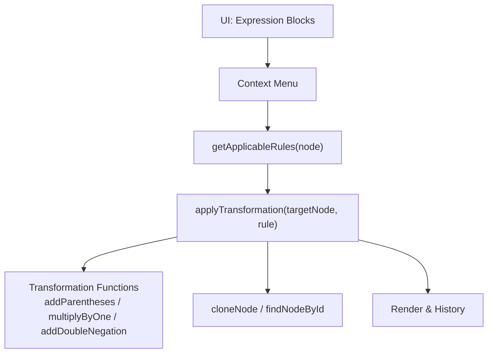
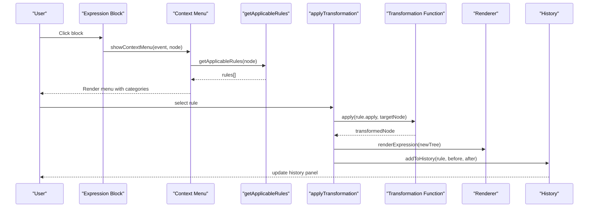
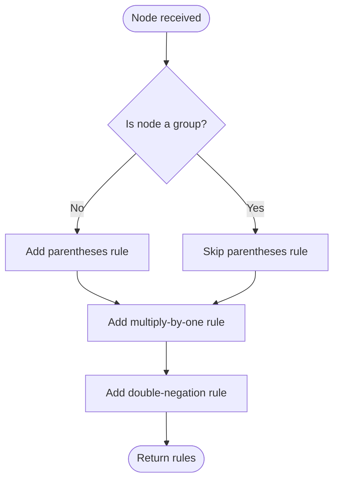
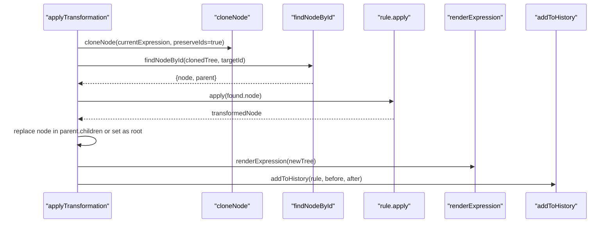
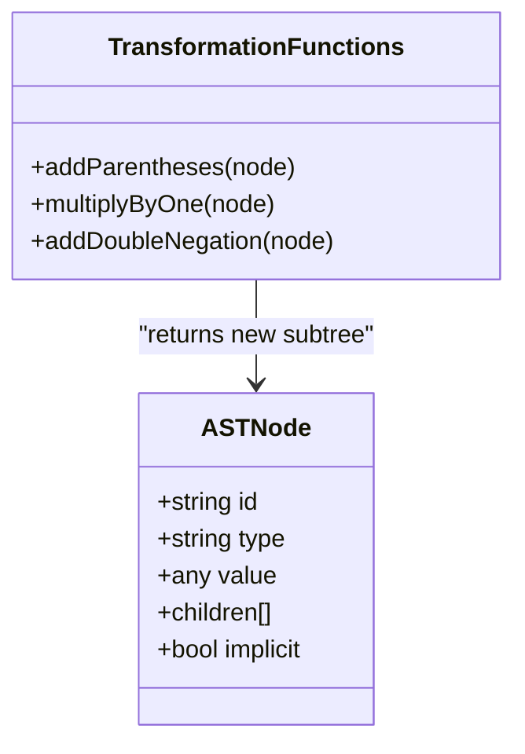
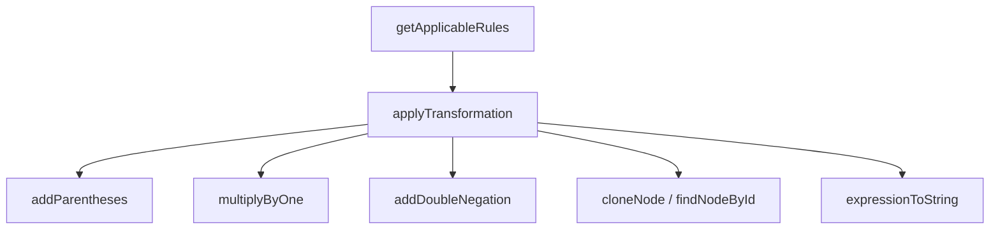

# Wrapping Rules

<cite>
**Referenced Files in This Document**
- [expression-editor.html](file://expression-editor.html)
- [README-EXPRESSION-EDITOR.md](file://README-EXPRESSION-EDITOR.md)
</cite>

## Table of Contents
1. [Introduction](#introduction)
2. [Project Structure](#project-structure)
3. [Core Components](#core-components)
4. [Architecture Overview](#architecture-overview)
5. [Detailed Component Analysis](#detailed-component-analysis)
6. [Dependency Analysis](#dependency-analysis)
7. [Performance Considerations](#performance-considerations)
8. [Troubleshooting Guide](#troubleshooting-guide)
9. [Conclusion](#conclusion)

## Introduction
This document explains the Wrapping transformation rules that add structural parentheses, multiply by one, and introduce double negation without altering mathematical value. It focuses on how these rules are determined by context (node type and position in the AST), how they are applied immutably via deep cloning, and how visual feedback communicates changes. It also clarifies when parentheses are necessary versus redundant and provides before/after examples such as “a + b” → “(a + b)”.

## Project Structure
The entire application is implemented in a single HTML file with embedded CSS and JavaScript. The relevant parts for wrapping rules include:
- The context menu that lists applicable rules for a selected node
- The rule selection and application pipeline
- The transformation functions that add parentheses, multiply by one, and add double negation
- Utilities for deep cloning, node lookup, and expression string conversion

**Diagram sources**
- [expression-editor.html](file://expression-editor.html#L739-L819)
- [expression-editor.html](file://expression-editor.html#L886-L1118)
- [expression-editor.html](file://expression-editor.html#L1382-L1418)
- [expression-editor.html](file://expression-editor.html#L848-L884)
- [expression-editor.html](file://expression-editor.html#L825-L846)

**Section sources**
- [expression-editor.html](file://expression-editor.html#L739-L819)
- [expression-editor.html](file://expression-editor.html#L886-L1118)
- [expression-editor.html](file://expression-editor.html#L1382-L1418)
- [expression-editor.html](file://expression-editor.html#L848-L884)
- [expression-editor.html](file://expression-editor.html#L825-L846)

## Core Components
- getApplicableRules(node): Determines which wrapping rules are applicable based on node type and structure. It checks whether a node can be wrapped in parentheses, multiplied by one, or given a double negation.
- applyTransformation(targetNode, rule): Applies a selected rule immutably by cloning the tree, locating the target node, replacing it with the transformed subtree, and updating the UI and history.
- Transformation functions:
  - addParentheses(node): Wraps the node in a group node.
  - multiplyByOne(node): Inserts a constant 1 as a multiplier (left or right).
  - addDoubleNegation(node): Adds a unary minus twice.
- Utilities:
  - cloneNode(node, preserveIds?): Deep clones a node tree, optionally preserving IDs for targeted replacement.
  - findNodeById(root, id): Locates a node by ID to replace it in the cloned tree.
  - expressionToString(node): Renders the expression as a human-readable string for previews and history.

These components work together to provide context-aware, bidirectional, and visually tracked transformations.

**Section sources**
- [expression-editor.html](file://expression-editor.html#L886-L1118)
- [expression-editor.html](file://expression-editor.html#L1382-L1418)
- [expression-editor.html](file://expression-editor.html#L1253-L1313)
- [expression-editor.html](file://expression-editor.html#L848-L884)
- [expression-editor.html](file://expression-editor.html#L825-L846)

## Architecture Overview
The wrapping rules are part of a broader rule engine that evaluates applicability based on the AST node’s type and children. When a user clicks a block, the context menu is populated by getApplicableRules, which returns a list of candidate transformations. The user selects one, and applyTransformation executes the chosen rule immutably, then renders the updated expression and records the change in history.

**Diagram sources**
- [expression-editor.html](file://expression-editor.html#L739-L819)
- [expression-editor.html](file://expression-editor.html#L886-L1118)
- [expression-editor.html](file://expression-editor.html#L1382-L1418)
- [expression-editor.html](file://expression-editor.html#L1421-L1490)

## Detailed Component Analysis

### getApplicableRules and Context Awareness
The function evaluates the node’s type and children to decide which wrapping rules are available:
- Parentheses wrapping: Available for any node that is not already a group. The rule adds parentheses around the node.
- Multiply by one: Available for any node; inserts a constant 1 as a multiplier either on the left or right side.
- Double negation: Available for any node; wraps it with two unary minus operators.

Applicability is purely structural and does not depend on arithmetic semantics—these are identity-preserving structural transformations.

**Diagram sources**
- [expression-editor.html](file://expression-editor.html#L1102-L1114)
- [expression-editor.html](file://expression-editor.html#L1253-L1276)
- [expression-editor.html](file://expression-editor.html#L1278-L1288)
- [expression-editor.html](file://expression-editor.html#L1264-L1276)

**Section sources**
- [expression-editor.html](file://expression-editor.html#L1102-L1114)
- [expression-editor.html](file://expression-editor.html#L1253-L1276)
- [expression-editor.html](file://expression-editor.html#L1278-L1288)
- [expression-editor.html](file://expression-editor.html#L1264-L1276)

### applyTransformation and Immutability
applyTransformation performs the following steps:
- Deep clone the current expression tree to preserve immutability.
- Locate the target node by ID in the cloned tree.
- Invoke the rule’s apply function to produce a transformed subtree.
- Replace the target node with the transformed subtree.
- Update the UI and history, and provide visual feedback.

Immutability is ensured by cloning the entire tree and replacing only the target node, leaving other parts unchanged.

**Diagram sources**
- [expression-editor.html](file://expression-editor.html#L1382-L1418)
- [expression-editor.html](file://expression-editor.html#L848-L884)
- [expression-editor.html](file://expression-editor.html#L825-L846)

**Section sources**
- [expression-editor.html](file://expression-editor.html#L1382-L1418)
- [expression-editor.html](file://expression-editor.html#L848-L884)
- [expression-editor.html](file://expression-editor.html#L825-L846)

### Transformation Functions: addParentheses, multiplyByOne, addDoubleNegation
- addParentheses(node): Wraps the node in a group node. This is mathematically equivalent because grouping does not change value.
- multiplyByOne(node): Creates a multiplication node with a constant 1 and the original node as the other operand. This is identity-preserving.
- addDoubleNegation(node): Wraps the node with two unary minus operators. Double negation cancels out, preserving value.

These functions return new subtrees that are structurally different but mathematically identical to the original.

**Diagram sources**
- [expression-editor.html](file://expression-editor.html#L1253-L1313)

**Section sources**
- [expression-editor.html](file://expression-editor.html#L1253-L1313)

### Before/After Examples and Mathematical Basis
- Parentheses wrapping: “a + b” → “(a + b)”  
  Mathematical basis: Grouping does not alter value; parentheses are necessary when precedence or readability requires emphasis.
- Multiply by one: “a” → “1 × a”  
  Mathematical basis: Multiplying by 1 preserves value (multiplicative identity).
- Double negation: “a” → “−(−a)”  
  Mathematical basis: Double negation cancels out; −(−a) = a.

These examples illustrate structural equivalence: the expression’s meaning remains unchanged, but its form is altered for clarity or to prepare for further transformations.

**Section sources**
- [expression-editor.html](file://expression-editor.html#L1253-L1313)
- [expression-editor.html](file://expression-editor.html#L1532-L1551)

### Visual Feedback and Interpretation
When a wrapping rule is applied:
- The rendered block corresponding to the transformed node receives a temporary highlight class to indicate the change.
- The history panel records the transformation with before and after expressions.
- The description panel shows the rule name, reasoning, and mathematical basis.

Users can interpret the visual feedback as confirmation that the structural change occurred without altering the expression’s value.

**Section sources**
- [expression-editor.html](file://expression-editor.html#L1406-L1418)
- [expression-editor.html](file://expression-editor.html#L1421-L1490)
- [expression-editor.html](file://expression-editor.html#L1492-L1600)

### Addressing Misconceptions About Parentheses
- Parentheses are necessary when they alter precedence or clarify ambiguous expressions.
- Parentheses are redundant when they enclose a single operand or when the expression’s natural precedence already ensures correct evaluation.
- The wrapping rule “Remove Parentheses” exists to eliminate unnecessary grouping, reinforcing that parentheses should be used intentionally.

**Section sources**
- [expression-editor.html](file://expression-editor.html#L1102-L1114)
- [README-EXPRESSION-EDITOR.md](file://README-EXPRESSION-EDITOR.md#L26-L41)

## Dependency Analysis
The wrapping rules depend on:
- getApplicableRules to enumerate available transformations
- applyTransformation to execute them immutably
- Transformation functions to construct new subtrees
- Utilities for cloning, node lookup, and string conversion

**Diagram sources**
- [expression-editor.html](file://expression-editor.html#L886-L1118)
- [expression-editor.html](file://expression-editor.html#L1382-L1418)
- [expression-editor.html](file://expression-editor.html#L1253-L1313)
- [expression-editor.html](file://expression-editor.html#L848-L884)
- [expression-editor.html](file://expression-editor.html#L825-L846)

**Section sources**
- [expression-editor.html](file://expression-editor.html#L886-L1118)
- [expression-editor.html](file://expression-editor.html#L1382-L1418)
- [expression-editor.html](file://expression-editor.html#L1253-L1313)
- [expression-editor.html](file://expression-editor.html#L848-L884)
- [expression-editor.html](file://expression-editor.html#L825-L846)

## Performance Considerations
- Cloning the entire tree for each transformation ensures correctness and isolation but can be expensive for very large expressions. The implementation balances safety with simplicity.
- Rendering and history updates occur after transformation, keeping the UI responsive.
- Consider limiting history depth or deferring heavy operations if performance becomes a concern.

[No sources needed since this section provides general guidance]

## Troubleshooting Guide
- No rules appear in the context menu:
  - Verify that the node type and children match the conditions for wrapping rules.
  - Check that getApplicableRules is invoked with the correct node.
- Transformation does not apply:
  - Confirm that applyTransformation locates the target node by ID and replaces it in the cloned tree.
  - Ensure the rule’s apply function returns a valid subtree.
- Visual feedback not visible:
  - Confirm that the transformed node’s DOM element exists and receives the highlight class.
  - Verify that the renderer updates the display after transformation.

**Section sources**
- [expression-editor.html](file://expression-editor.html#L739-L819)
- [expression-editor.html](file://expression-editor.html#L886-L1118)
- [expression-editor.html](file://expression-editor.html#L1382-L1418)
- [expression-editor.html](file://expression-editor.html#L848-L884)
- [expression-editor.html](file://expression-editor.html#L825-L846)

## Conclusion
The Wrapping transformation rules provide safe, identity-preserving structural changes to expressions. They are determined by context-aware logic in getApplicableRules and executed immutably by applyTransformation, ensuring correctness and enabling reversible history tracking. Parentheses, multiplication by one, and double negation are powerful tools for clarifying structure and preparing expressions for further transformations, with clear visual feedback and documented mathematical basis.